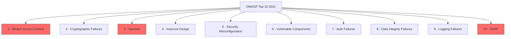
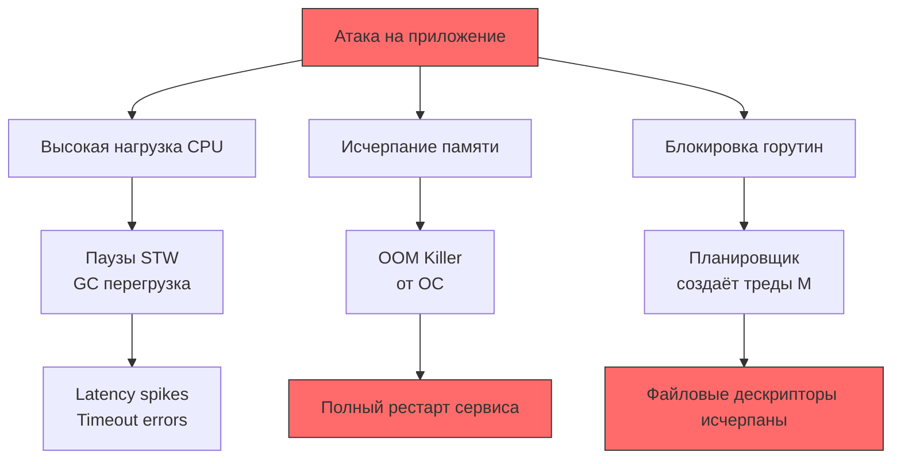
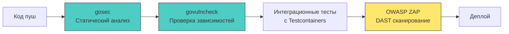

## Введение: OWASP Top 10 как компас, а не чек-лист

OWASP Top 10 — это не строгий стандарт безопасности, а консенсусное представление о наиболее критичных рисках для веб-приложений. Версия 2021 года сместила фокус с чисто технических уязвимостей на архитектурные и процессные ошибки. Для бэкенд-разработчика на Go это означает, что защита от большинства пунктов закладывается на уровне дизайна системы, работы с рантаймом и конфигурации сетевых примитивов.



В этой статье мы разберём каждый пункт через призму реализации на Go, обращая внимание на поведение рантайма, работу с памятью, системные вызовы и типичные ловушки, которые всплывают на хардовых собеседованиях.

---

### 1. Broken Access Control

Класс уязвимостей, когда приложение не проверяет права доступа к ресурсам. В Go это часто проявляется из-за небрежной работы с контекстом или отсутствия централизованного слоя авторизации.

> [!warning] Ловушка / Gotcha
> **IDOR через автоинкремент**
> Разработчики часто полагаются на скрытность идентификаторов: `GET /api/users/145`. Если нет проверки, что пользователь `auth.Subject` владеет ресурсом `145`, уязвимость готова. В Go это особенно коварно при использовании `chi` или `gorilla/mux`, где параметры маршрута автоматически парсятся и доступны по ключу.

**Решение в коде:**
```go
func (h *Handler) GetDocument(w http.ResponseWriter, r *http.Request) {
    ctx := r.Context()
    userID := auth.UserIDFromContext(ctx)
    if userID == 0 {
        http.Error(w, "unauthorized", http.StatusUnauthorized)
        return
    }
    
    docID, err := strconv.ParseInt(chi.URLParam(r, "id"), 10, 64)
    if err != nil {
        http.Error(w, "bad request", http.StatusBadRequest)
        return
    }
    
    // 🔒 Явная проверка владения до доступа к БД
    if err := h.authz.CheckOwnership(ctx, userID, "document", docID); err != nil {
        http.Error(w, "forbidden", http.StatusForbidden)
        return
    }
    
    doc, err := h.repo.GetByID(ctx, docID)
    // ...
}
```

### 2. Cryptographic Failures

Ранее известная как `Sensitive Data Exposure`. Ошибки здесь кроются не только в выборе алгоритма, но и в способе хранения ключей, ротации и обработке чувствительных данных в памяти.

**Mechanical Sympathy:** В Go строки иммутабельны. Если вы загрузите пароль в `string`, он останется в куче до следующей сборки мусора, а `GC` не гарантирует немедленное освобождение. Атакующий, сделавший дамп памяти процесса, может восстановить строку.

**Безопасная работа с чувствительными данными:**
```go
// ✅ Используйте []byte и явно затирайте память после использования
func processSecret(secret []byte) error {
    defer func() {
        for i := range secret {
            secret[i] = 0 // 🔒 Перезапись в куче перед выходом
        }
    }()
    // Работа с секретом...
    return nil
}
```
Для хеширования паролей используйте `golang.org/x/crypto/argon2` или `bcrypt`. Подробнее в [[1. Пароли и хранение хешей]] и [[2. bcrypt, argon2 и выбор алгоритма]].

### 3. Injection

SQL, OS Command, LDAP, XML инъекции. В Go риск снижается благодаря строгой типизации и `database/sql` с подготовленными выражениями, но не исчезает полностью.

> [!tip] Собеседование
> **Вопрос:** Защищает ли `database/sql` от всех видов SQL-инъекций?
> **Ответ:** Нет. Защита работает только при использовании плейсхолдеров (`$1`, `?`). Если вы собираете запрос через `fmt.Sprintf("SELECT * FROM users WHERE id = %s", userInput)` или используете динамические имена таблиц/колонок через конкатенацию, инъекция возможна. Для динамических идентификаторов используйте allowlist или санитайзеры вроде `pq.QuoteIdentifier`.

**Пример безопасного запроса:**
```go
// ✅ Параметризованный запрос. Драйвер передаёт данные отдельно от текста запроса.
// На уровне ОС это часто приводит к оптимизации плана выполнения и кэшированию.
query := "SELECT id, role FROM users WHERE email = $1 AND status = $2"
row := db.QueryRowContext(ctx, query, email, "active")
```

Динамические команды ОС требуют жёсткого контроля:
```go
// ❌ Опасно: пользовательский ввод попадает в оболочку
// exec.Command("sh", "-c", fmt.Sprintf("ping %s", userInput))

// ✅ Безопасно: аргументы передаются как отдельные элементы массива, без интерпретации оболочкой
cmd := exec.Command("ping", "-c", "1", sanitizedHost)
```

### 4. Insecure Design

Новая категория в OWASP 2021. Означает, что бизнес-логика или архитектура изначально содержат уязвимости, которые невозможно закрыть патчем. Например, отсутствие лимитов на количество попыток восстановления пароля или передача внутренних ID в публичный API без маскировки.

В Go это часто проявляется при проектировании `proto`-контрактов или структур запросов:
```go
// ❌ Уязвимый дизайн: передача внутренних флагов в публичный DTO
type PublicUserResponse struct {
    ID       int64  `json:"id"`
    Name     string `json:"name"`
    IsAdmin  bool   `json:"is_admin"` // 🔴 Утечка прав доступа
    RoleCode string `json:"role_code"` // 🔴 Внутренний контракт
}

// ✅ Безопасно: явное разделение слоёв
type PublicUserResponse struct {
    ID   int64  `json:"id"`
    Name string `json:"name"`
}
```

### 5. Security Misconfiguration

Наиболее частый вектор атак на высоконагруженные Go-сервисы. Сюда входят: открытые `pprof`/`expvar` эндпоинты, дефолтные CORS-настройки, отсутствие таймаутов на `http.Client` или `http.Server`, слабые TLS-конфиги.

**Механика и влияние на рантайм:**
Если не настроить `http.Server.ReadTimeout`, `net/http` будет бесконечно читать тело запроса. Атакующий может открыть тысячи соединений и отправить заголовок, но не тело. Каждый такой коннект создаёт горутину (`g`), которая блокируется в `syscall read`. Планировщик создаст новые треды (`m`), что приведёт к исчерпанию файловых дескрипторов (`ulimit -n`) и Out-of-Memory.

```go
srv := &http.Server{
    Addr:         ":8080",
    ReadTimeout:  15 * time.Second,  // 🔒 Защита от Slowloris
    WriteTimeout: 15 * time.Second,  // 🔒 Защита от медленных клиентов
    IdleTimeout:  60 * time.Second,  // 🔒 Очистка keep-alive соединений
    MaxHeaderBytes: 1 << 20,         // 🔒 Ограничение размера заголовков (1 МБ)
}
```
Подробнее о TLS в [[3. TLS и HTTPS под капотом]].

### 6. Vulnerable and Outdated Components

Go статически линкует зависимости, поэтому уязвимость в библиотеке становится частью вашего бинарника. В отличие от PHP или Java, где зависимости загружаются динамически или изолируются контейнером, в Go вы обязаны проверять `go.mod` и прокси-кэш.

Инструменты: `govulncheck`, `osv-scanner`, `dependabot`. Не игнорируйте `SECURITY.md` в репозиториях зависимостей.

### 7. Identification and Authentication Failures

Ошибки в реализации логина, сессий, JWT, восстановления паролей. В Go специфика кроется в работе с `context` и состоянием.

**Ловушка:** Сравнение токенов через `==` подвержено timing-атаке. Сравнение строк в Go идёт посимвольно и останавливается при первом несовпадении. Атакующий может измерить время ответа и подобрать токен символ за символом.

```go
// ❌ Уязвимо к timing-атаке
if reqToken != expectedToken { ... }

// ✅ Безопасно: постоянное время сравнения (CPU-уровень)
if subtle.ConstantTimeCompare([]byte(reqToken), []byte(expectedToken)) != 1 {
    // Утечка информации через время выполнения предотвращена
}
```
Подробнее про токены: [[3. JWT. Устройство и подводные камни]] и [[4. Access и refresh токены]].

### 8. Software and Data Integrity Failures

Уязвимости, связанные с обновлением ПО, CI/CD пайплайнами и десериализацией непроверенных данных. В Go это проявляется при использовании `encoding/json` или `gob` с пользовательским вводом без ограничений.

**JSON-бомбы и давление на GC:**
```go
// ❌ Опасно: декодирование без ограничения глубины и размера
var payload HugeStruct
if err := json.NewDecoder(r.Body).Decode(&payload); err != nil { ... }
// Атакующий отправляет вложенный объект 10^5 уровней. Рантайм рекурсивно аллоцирует
// память, вызывая паузы GC и потенциальный OOM.
```

```go
// ✅ Безопасно: ограничение глубины и размера
dec := json.NewDecoder(io.LimitReader(r.Body, 1<<20)) // 1 МБ максимум
dec.DisallowUnknownFields() // 🔒 Защита от overposting
if err := dec.Decode(&payload); err != nil { ... }
```

### 9. Security Logging and Monitoring Failures

Отсутствие логов или, наоборот, логирование чувствительных данных. В Go переход на `log/slog` (с 1.21) решает многие проблемы, но требует дисциплины.

```go
// ❌ Опасно: структурированный лог всё равно содержит сырой JWT
logger.Info("request processed", 
    "token", r.Header.Get("Authorization"), 
    "ip", r.RemoteAddr)

// ✅ Безопасно: маскирование и фильтрация
logger.Info("request processed",
    "token_preview", maskToken(r.Header.Get("Authorization")),
    "user_id", userID,
    "ip", r.RemoteAddr)
```
Подробнее в [[3. Логирование и аудит]].

### 10. Server-Side Request Forgery (SSRF)

Атакующий заставляет ваш сервер делать запрос к внутренним ресурсам (например, `http://169.254.169.254/latest/meta-data/` в AWS). В Go это часто происходит при реализации вебхуков, проксировании изображений или агрегации данных.

**Защита на уровне сетевых примитивов:**
```go
func isSafeURL(rawURL string) bool {
    u, err := url.Parse(rawURL)
    if err != nil { return false }
    
    // 🔒 Блокировка локальных и приватных диапазонов
    if ip := net.ParseIP(u.Hostname()); ip != nil {
        return !ip.IsLoopback() && !ip.IsPrivate() && !ip.IsLinkLocalUnicast()
    }
    // Разрешаем только http/https
    return u.Scheme == "http" || u.Scheme == "https"
}

// ✅ Клиент с отключенными редиректами и проверкой хоста
client := &http.Client{
    CheckRedirect: func(req *http.Request, via []*http.Request) error {
        return http.ErrUseLastResponse // 🔒 Блокируем SSRF через 302
    },
    Timeout: 10 * time.Second,
}
```
Подробнее: [[3. SSRF]].

---

## Mechanical Sympathy: Как уязвимости влияют на рантайм Go

Понимание того, как атаки воздействуют на уровень ОС и планировщик, помогает проектировать устойчивые системы.



1. **JSON-бомбы и ReDoS** → вызывают аллокацию миллионов мелких объектов. `GC` переходит в агрессивный режим, увеличивая `GOGC`, что приводит к паузам `Stop-The-World`. На уровне CPU кэш-линии постоянно вытесняются, пропускная способность падает.
2. **Медленные запросы (Slowloris)** → горутины блокируются в `syscall.Read`. Планировщик `runtime` видит, что `P` простаивает, и создаёт новые `M` (треды ОС). Лимит тредов `GOMAXPROCS` не спасает, так как треды создаются динамически. Результат: исчерпание `ulimit -n` (файловые дескрипторы) или `vm.max_map_count`.
3. **Memory Leaks в `pprof`** → если не ограничить `http.Server.MaxHeaderBytes` или не закрывать `r.Body`, буферы `bufio` остаются в куче. `GC` не может их собрать, так как ссылки живы в `net/http` внутренностях.

> [!tip] Собеседование
> **Вопрос:** Как защитить Go-сервис от утечки файловых дескрипторов при DDoS?
> **Ответ:** 
> 1. Жёсткие таймауты `http.Server.ReadTimeout`/`IdleTimeout`.
> 2. `io.LimitReader` на чтение тела запроса.
> 3. Настройка `net.ListenConfig.KeepAlive` для раннего закрытия битых соединений.
> 4. Использование `GOMEMLIMIT` (Go 1.19+) для ограничения памяти, чтобы `GC` работал агрессивнее, а не умирал от OOM.
> 5. Мониторинг `go_goroutines` и `go_sched_latencies` в Prometheus.

## Интеграция в процесс разработки

OWASP Top 10 должен быть встроен в CI/CD и код-ревью, а не проверяться перед релизом.



1. **Pre-commit / CI:** `gosec -exclude=G104 -fmt=sarif ./...` (подробнее в [[2. Static analysis]]).
2. **Dependency Scan:** `govulncheck ./...` проверяет `go.sum` против базы уязвимостей.
3. **DAST:** Автоматический запуск OWASP ZAP или `nuclei` на тестовом окружении.
4. **Code Review:** Чек-лист по OWASP Top 10 в шаблоне Pull Request.

## Итог

OWASP Top 10 для бэкенд-разработчика на Go — это не список абстрактных угроз, а конкретные рекомендации по конфигурации `net/http`, работе с `context`, управлению памятью и валидации данных. Понимание механики рантайма позволяет предотвращать уязвимости на этапе проектирования, а не латать их постфактум.