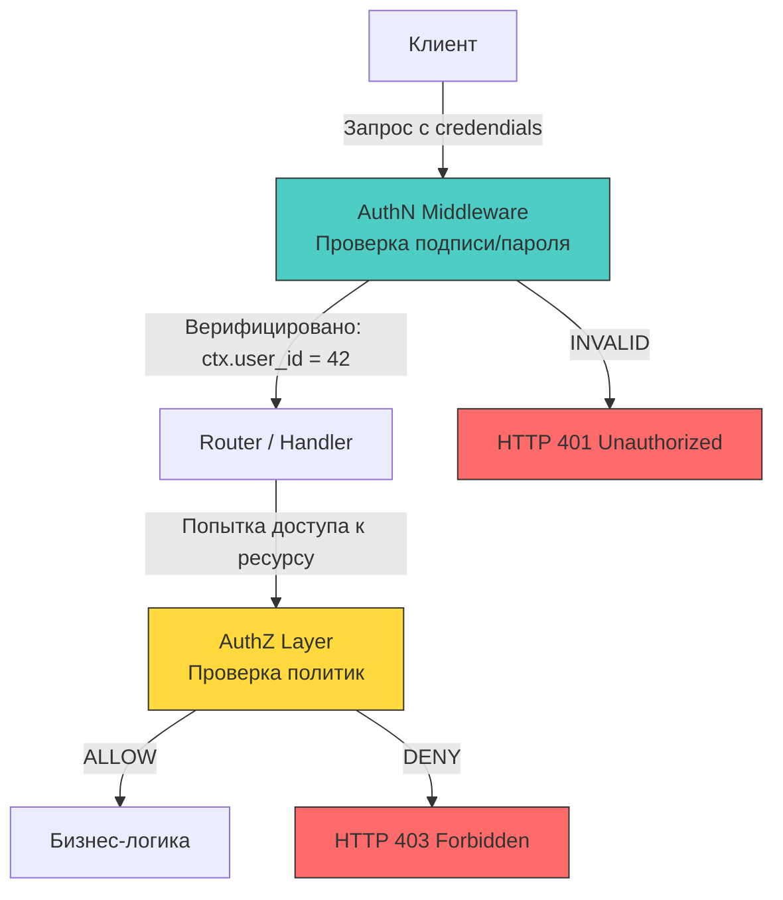

## Разделение ответственности: кто ты и что тебе можно

В промышленном бэкенде размытие границ между **аутентификацией** (Authentication, AuthN) и **авторизацией** (Authorization, AuthZ) — одна из самых частых архитектурных ошибок. Это не семантическая разница, а фундаментальное разделение точек отказа, стратегий кэширования и модели угроз.

**Аутентификация** отвечает на вопрос: *«Кто вы?»*. Это процесс верификации заявленной идентичности через учётные данные (пароль, токен, сертификат, биометрия). Результат — утверждение идентичности (например, `subject_id = "user-123"`).

**Авторизация** отвечает на вопрос: *«Что вам разрешено сделать?»*. Это процесс принятия решения о доступе к ресурсу или операции на основе утверждённой идентичности, контекста запроса и политик доступа. Результат — бинарный ответ `ALLOW` / `DENY` (или список разрешённых действий).

Смешивание этих этапов в одном блоке кода приводит к:
- Невозможности переиспользовать логику проверки прав для разных типов аутентификации (API-ключи, JWT, SSO).
- Сложностям в кэшировании (политики авторизации меняются редко, токены — часто).
- Нарушению принципа наименьших привилегий в рантайме.



## Аутентификация: Доказательство идентичности и цена валидации

Аутентификация всегда происходит **до** попадания запроса в бизнес-логику. В Go это реализуется как первый `Middleware` в цепочке `http.Handler` или `grpc.UnaryServerInterceptor`.

> [!info] Под капотом
> **Влияние на кэш и аллокации**
> Стандартный `context.Context` в Go реализован как односвязный список структур. Каждый вызов `context.WithValue` создаёт новую аллокацию в куче. В высоконагруженном сервисе (10k+ RPS) добавление трёх ключей в контекст (`user_id`, `roles`, `auth_method`) означает ~30 000 аллокаций в секунду. Это нагружает `GC`, вытесняет кэш-линии L1/L2 из-за разброса указателей в памяти и увеличивает latency.
> 
> **Оптимизация:** Агрегируйте данные аутентификации в одну структуру и передавайте её одним ключом. Это сокращает аллокации в три раза и улучшает локальность данных для CPU.

```go
// ✅ Агрегированная структура вместо россыпи WithValue
type AuthClaims struct {
    UserID    string
    Roles     []string
    ExpiredAt time.Time
}

type ctxKey struct{}

func WithAuthClaims(ctx context.Context, claims *AuthClaims) context.Context {
    return context.WithValue(ctx, ctxKey{}, claims)
}

func AuthClaimsFromContext(ctx context.Context) (*AuthClaims, bool) {
    claims, ok := ctx.Value(ctxKey{}).(*AuthClaims)
    return claims, ok
}
```

## Авторизация: Принятие решений на основе политик

Авторизация должна быть вынесена в отдельный слой или вызываться явно внутри хендлера **после** успешной аутентификации. Это позволяет применять разные модели (RBAC, ABAC, ReBAC) независимо от способа входа.

```go
// ❌ Антипаттерн: смешивание AuthN и AuthZ в одном мидлвари
func AuthMiddleware(next http.Handler) http.Handler {
    return http.HandlerFunc(func(w http.ResponseWriter, r *http.Request) {
        token := extractToken(r)
        if !isValidToken(token) {
            http.Error(w, "Unauthorized", http.StatusUnauthorized)
            return
        }
        
        // 🔴 Жёсткая привязка к конкретной операции
        userID := parseUserID(token)
        if !isAdmin(userID) {
            http.Error(w, "Forbidden", http.StatusForbidden)
            return
        }
        
        next.ServeHTTP(w, r)
    })
}
```

Идиоматичный подход в Go — использовать **декларативную проверку** на уровне бизнес-логики или внедрять отдельный `AuthZ` сервис/интерфейс:

```go
// ✅ Разделение: мидлварь только верифицирует, хендлер решает
func AuthNMiddleware(next http.Handler) http.Handler {
    return http.HandlerFunc(func(w http.ResponseWriter, r *http.Request) {
        token := strings.TrimPrefix(r.Header.Get("Authorization"), "Bearer ")
        
        claims, err := jwt.ParseAndValidate(token, signingKey)
        if err != nil {
            // 🔒 Не раскрываем причину: истёк, неверная подпись, формат
            logAuthError(r.Context(), err)
            http.Error(w, "unauthorized", http.StatusUnauthorized)
            return
        }
        
        ctx := context.WithValue(r.Context(), authKey, claims)
        next.ServeHTTP(w, r.WithContext(ctx))
    })
}

func (h *Handler) DeleteResource(w http.ResponseWriter, r *http.Request) {
    ctx := r.Context()
    claims := auth.AuthClaimsFromContext(ctx)
    
    resID := chi.URLParam(r, "id")
    
    // 🔒 Явная проверка авторизации перед действием
    if err := h.authz.Check(ctx, claims.UserID, "resource:delete", resID); err != nil {
        http.Error(w, "forbidden", http.StatusForbidden)
        return
    }
    
    if err := h.repo.Delete(ctx, resID); err != nil {
        http.Error(w, "internal error", http.StatusInternalServerError)
        return
    }
}
```

## Механика ошибок: 401 против 403 и влияние на клиента

Разделение статус-кодов — не бюрократия, а часть протокола и контракт с клиентом/балансировщиком.

| Код | Смысл | Когда возвращать в Go | Влияние на инфраструктуру |
|-----|-------|----------------------|--------------------------|
| `401 Unauthorized` | Идентичность не подтверждена | Токен отсутствует, истёк, неверная подпись, криптографическая проверка не прошла | WAF/LB может автоматически редиректить на страницу входа или сбрасывать сессию |
| `403 Forbidden` | Идентичность подтверждена, но прав нет | Успешный AuthN, но `authz.Check()` вернул `false` | Метрики разделяют `authn_errors` и `authz_denials` для алертинга. Клиент не должен повторять запрос без смены учётных данных |

> [!warning] Ловушка / Gotcha
> **Утечка информации через тайминги ошибок**
> Если ваш мидлварь тратит 50 мс на проверку подписи токена (синхронный `bcrypt` или `rsa.VerifyPKCS1v15`) и 0.1 мс на проверку формата, атакующий, перебирая токены, может по времени ответа определить, прошёл ли токен криптографическую стадию. Это не раскрывает пароль, но помогает отфильтровать «шум» при подборе.
> 
> **Решение:** Всегда используйте `crypto/subtle.ConstantTimeCompare` для сравнения хешей/токенов и избегайте ранних возвратов `return` в критических проверках. Формируйте ответ с постоянной задержкой или используйте асинхронную валидацию с буферизацией.

## Производительность: Ветвление, кэш и планировщик горутин

Авторизация часто требует обращения к внешним данным (кешированным ролям, БД, Policy Decision Point). Это создаёт скрытые накладные расходы:

1. **Branch Misprediction:** Если проверка прав разбросана по бизнес-коду (`if !user.CanDoX() { return }`), процессор не может предсказать переходы. В ветвящейся логике авторизации это увеличивает `CPU cycles` на 15-20% из-за сброса конвейера.
2. **Syscall Overhead:** Проверка прав через отдельный микросервис (OPA, Keycloak) добавляет сетевой `syscall` (`write`/`read` в сокет). В Go это блокирует `P` на время ответа, если не использовать `netpoll`-режим (что стандартный `net/http` делает автоматически, но создаёт дополнительную горутину).
3. **Memory Pressure:** Загрузка политик в память при каждом запросе вызывает `Escape Analysis` аллокации. Идиоматичное решение — предзагрузка политик в `sync.Map` или `RWMutex` с кэшированием на уровне слоя авторизации.

```go
// ✅ Пример локального кэша политик для снижения нагрузки на GC и сеть
type LocalAuthz struct {
    mu      sync.RWMutex
    policies map[string]PolicyCache // key: "user_id:resource:action"
}

func (a *LocalAuthz) Check(ctx context.Context, userID, action, resID string) error {
    key := fmt.Sprintf("%s:%s:%s", userID, resID, action)
    
    a.mu.RLock()
    policy, ok := a.policies[key]
    a.mu.RUnlock()
    
    if ok && policy.IsValid() {
        return policy.Allowed() // 🔥 Быстрый путь в кэш-линии L1
    }
    
    // 🔒 Fallback к внешнему источнику или рекурсивному вычислению
    return a.evaluateRemote(ctx, userID, action, resID)
}
```

> [!tip] Собеседование
> **Вопрос:** Почему проверка авторизации в начале цепочки мидлварей считается антипаттерном для сложных систем?
> **Ответ:** 
> 1. **Контекст запроса неполон:** На этапе раннего мидлваря ещё не распарсены параметры запроса, тело или специфичные заголовки, которые могут влиять на решение (например, `ABAC` с атрибутом суммы транзакции).
> 2. **Нарушение инкапсуляции:** Глобальный слой не знает контекста бизнес-домена. Авторизация становится или слишком грубой, или требует передачи сырых данных запроса, что усложняет код.
> 3. **Решение:** AuthN всегда в мидлваре (глобально). AuthZ — на уровне доменного сервиса или хендлера, где доступны все параметры и бизнес-контекст. Для высоконагруженных систем используется `OPA` или локальный движок политик с асинхронной синхронизацией.

## Итог

1. **Аутентификация** верифицирует идентичность. **Авторизация** принимает решение о доступе. Их нельзя смешивать в одной функции или мидлваре.
2. В Го передача данных аутентификации через `context.Context` создаёт аллокации в куче. Агрегация данных в одну структуру улучшает локальность кэша и снижает давление на `GC`.
3. Разделение статус-кодов `401` и `403` критично для корректной работы балансировщиков, WAF и систем мониторинга.
4. Проверка прав должна выполняться максимально близко к бизнес-операции, чтобы учесть полный контекст запроса и избежать грубых архитектурных решений.
5. Производительность авторизации напрямую зависит от предсказуемости ветвлений, использования `RWMutex` для кэширования политик и минимизации синхронных сетевых вызовов.

[[5. Принцип наименьших привилегий]]