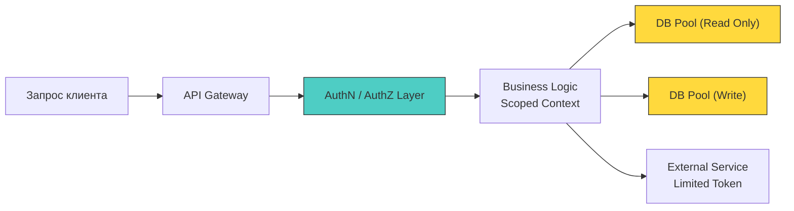
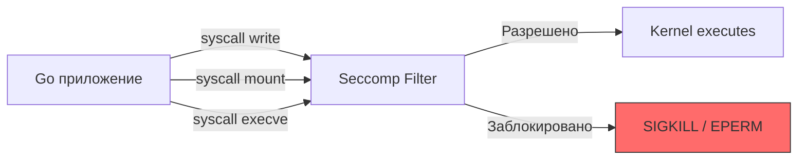

## Суть принципа: минимизация blast radius

Принцип наименьших привилегий (Principle of Least Privilege, PoLP) гласит: любой компонент системы (процесс, пользователь, токен, функция, горутина) должен обладать ровно теми правами, которые необходимы для выполнения его задачи, и только на время её выполнения.

В контексте высоконагруженного бэкенда это не просто административное правило «не давайте `root`», а архитектурная стратегия снижения **радиуса поражения (blast radius)**. Если атакующий эксплуатирует уязвимость в одном микросервисе или компоненте, PoLP ограничивает его возможность перемещаться по системе (Lateral Movement) и escalating privileges.



## Уровень ОС и процессов: Linux Capabilities и Syscalls

В Linux привилегии исторически были бинарными: `root` (UID 0) или обычный пользователь. Современный ядро использует **Capabilities** — битовые флаги, разбивающие монолитные права `root` на гранулярные права (например, `CAP_NET_BIND_SERVICE`, `CAP_SYS_PTRACE`, `CAP_DAC_OVERRIDE`).

Когда Go-приложение запускается, оно наследует capabilities родительского процесса. Управление ими происходит через системные вызовы `capget` и `capset`. Прямое управление из чистого Go ограничено (требует `cgo` или `unsafe` вызовов `libc`), поэтому в продакшене привилегии сбрасываются на уровне entrypoint или контейнера до старта `main()`.

> [!warning] Ловушка / Gotcha
> **`init()` выполняется до применения ограничений**
> Функции `init()` в Go запускаются рантаймом **до** выполнения `main()`. Если вы планируете сбросить права пользователя (`syscall.Setuid`) или применить Seccomp-фильтры в `main()`, весь код в `init()` уже выполнится с полными привилегиями процесса.
> **Решение:** Выносите чувствительную инициализацию (загрузку TLS-ключей, установку соединений с БД) в явные функции, вызываемые **после** снижения прав. Либо используйте внешние скрипты инициализации, которые настраивают окружение до запуска бинарника.

## Базы данных и пул соединений

Типичная архитектурная ошибка: единый пользователь БД с правами `OWNER` или `SUPERUSER` для всего приложения. Это полностью ломает PoLP на уровне данных.

В рантайме Go `database/sql` использует внутренний пул соединений (`sql.ConnPool`). Если вы создаёте пул от имени `admin`, все горутины наследуют этот контекст привилегий. Изменение прав пользователя в БД «на лету» не повлияет на уже открытые соединения в пуле, пока они не будут принудительно закрыты или не истечёт их время жизни.

```go
// ❌ Антипаттерн: единый пул с широкими правами
db, err := sql.Open("postgres", "host=localhost user=admin password=...")

// ✅ Архитектурно верно: разделение пулов по контексту доступа
type DBPool struct {
    ReadOnly  *sql.DB // Пользователь с GRANT SELECT
    Write     *sql.DB // Пользователь с GRANT INSERT, UPDATE, DELETE
    Admin     *sql.DB // Пользователь с DDL правами (миграции, backup)
}

func NewDBPool(dsnRead, dsnWrite, dsnAdmin string) (*DBPool, error) {
    r, err := sql.Open("postgres", dsnRead)
    if err != nil { return nil, err }
    r.SetConnMaxLifetime(10 * time.Minute) // 🔒 Периодическая ротация сессии
    
    w, err := sql.Open("postgres", dsnWrite)
    if err != nil { return nil, err }
    w.SetConnMaxLifetime(10 * time.Minute)
    
    return &DBPool{ReadOnly: r, Write: w}, nil
}
```

> [!info] Под капотом
> **Как пул соединений влияет на привилегии?**
> В рантайме `database/sql` поддерживает `idleConn` heap. Когда вы вызываете `db.Query`, пул выдаёт существующее соединение или создаёт новое через драйвер (синхронный `dial` syscall). Если соединение остаётся в пуле, оно сохраняет сессионные переменные БД, включая `current_role`. Длительные `idle` соединения могут «пережить» ротацию прав пользователя, создавая окно несоответствия политики безопасности. Используйте `db.SetConnMaxLifetime` для принудительного обновления сессий и сброса транзакционных состояний.

## Уровень кода и рантайма Go

PoLP в Go проявляется через дизайн интерфейсов, управление наследованием окружения и жизненный цикл горутин.

### 1. Сегрегация интерфейсов (Interface Segregation)
Не передавайте широкие интерфейсы туда, где нужна узкая функциональность. В Go интерфейсы неявные, что даёт мощную возможность компилятору проверять контракты на этапе сборки.

```go
// ❌ Широкий интерфейс
type Storage interface {
    Read(ctx context.Context, key string) ([]byte, error)
    Write(ctx context.Context, key string, data []byte) error
    Delete(ctx context.Context, key string) error
    ListKeys(ctx context.Context, prefix string) ([]string, error)
}

// ✅ Узкие контракты
type Reader interface {
    Read(ctx context.Context, key string) ([]byte, error)
}
type Writer interface {
    Write(ctx context.Context, key string, data []byte) error
}

// Передаём только то, что нужно хендлеру
func NewReadHandler(s Reader) *Handler { ... }
```
Передавая только `Reader` в обработчик, вы на уровне компилятора запрещаете запись. Если код скомпрометирован через SQL-инъекцию или десериализацию, атакующий не сможет вызвать `Write` или `Delete` через этот интерфейс.

### 2. `os/exec` и наследование окружения
`exec.Command` в Go по умолчанию наследует **все** переменные окружения и **все** открытые файловые дескрипторы (0, 1, 2 и другие) от родительского процесса. Это классическое нарушение PoLP.

```go
// ❌ Опасно: наследуется DB_PASSWORD, AWS_SECRET_KEY и FDs
cmd := exec.Command("external-tool", "--flag", value)

// ✅ Безопасно: явное минимальное окружение и закрытие наследуемых FD
cmd := exec.Command("external-tool", "--flag", value)
cmd.Env = []string{
    "PATH=/usr/local/bin:/usr/bin",
    "TZ=UTC",
    // Только явно разрешённые переменные
}
// Закрытие наследуемых файловых дескрипторов (если не нужны)
cmd.SysProcAttr = &syscall.SysProcAttr{
    // Pdeathsig гарантирует завершение дочернего процесса при смерти родителя
    Pdeathsig: syscall.SIGTERM, 
}
```

### 3. Контекст и время жизни привилегий
Горутина должна жить ровно столько, сколько нужно. Передача `context.Background()` в долгие задачи без привязки к жизненному циклу запроса нарушает принцип минимальных привилегий по времени.

```go
// ✅ Изоляция по времени и отмене
ctx, cancel := context.WithTimeout(context.Background(), 5*time.Second)
defer cancel()

// Горутина получит токен, но он автоматически станет невалидным через 5 секунд
// даже если основная обработка завершится успешно
go processBackgroundTask(ctx, payload)
```

## Механика безопасности: Seccomp и Namespace

В высокозащищённых системах (особенно в Kubernetes/контейнерах) PoLP дополняется **Seccomp** (Secure Computing Mode). Это фильтр в ядре Linux, который ограничивает набор допустимых системных вызовов для процесса.

Стандартный Go-рантайм использует сотни syscall (`epoll`, `mmap`, `madvise`, `futex`, `rt_sigaction`, `clone`). Если ваше приложение — простой HTTP-сервер, ему не нужен `mount`, `ptrace` или `socket` на создание новых сетевых интерфейсов.



Настройка Seccomp в Go сложна из-за рантайма (планировщик и GC требуют специфичных вызовов), поэтому обычно используется на уровне контейнера (`docker run --security-opt seccomp=default.json` или `securityContext.seccompProfile` в K8s). Однако, вы можете использовать `prctl` через `cgo` для применения фильтров до старта рантайма, если собираете статически с правильными флагами.

> [!tip] Собеседование
> **Вопрос:** Почему запуск Go-приложения от `root` в Docker-контейнере считается критической уязвимостью архитектуры, даже если контейнер изолирован?
> **Ответ:**
> 1. **Namespace escape:** Если в ядре найдётся уязвимость, процесс с `CAP_SYS_ADMIN` (или `root` в контейнере) имеет больше шансов вырваться из namespace (mount, network, pid) на хост.
> 2. **Device access:** `root` внутри контейнера может получить доступ к `/dev/mem`, `/dev/sda` или другим устройствам, проброшенным в контейнер, что ведёт к полному контролю над хостом.
> 3. **Runtime restrictions:** Многие современные security-контроллеры (AppArmor, SELinux, Seccomp) накладывают ограничения именно на непривилегированные процессы. `root` может обходить часть этих политик.
> 4. **Go-специфика:** Рантайм при старте выполняет `mmap` и `clone` для создания горутин. Если процесс работает под `root`, любая уязвимость в сторонней `cgo` библиотеке или некорректная работа с `unsafe` даёт атакующему немедленный контроль над всей файловой системой, видимой процессу.
> **Решение:** Использовать `USER 1000:1000` в Dockerfile, запускать с `--cap-drop ALL` и `--read-only` rootfs, пробрасывая только необходимые volume.

## Итог

1. Принцип наименьших привилегий — это стратегия минимизации blast radius на всех уровнях: ОС, БД, сеть, код.
2. В Linux используйте Capabilities вместо `root`, а в Go контролируйте `init()` и явно сбрасывайте права/наследование окружения до запуска бизнес-логики.
3. `database/sql` пул соединений сохраняет сессионные привилегии; используйте `SetConnMaxLifetime` и разделяйте пулы по ролям (read/write/admin).
4. На уровне кода применяйте Interface Segregation и строгое управление `context` для ограничения времени жизни привилегий.
5. `exec.Command` наследует всё окружение и FDs — явно задавайте `cmd.Env` и закрывайте ненужные дескрипторы через `SysProcAttr`.
6. Контейнеризация требует `USER nonroot`, `--cap-drop ALL` и Seccomp-профилей для эффективного внедрения PoLP в рантайме.

[[1. Пароли и хранение хешей]]