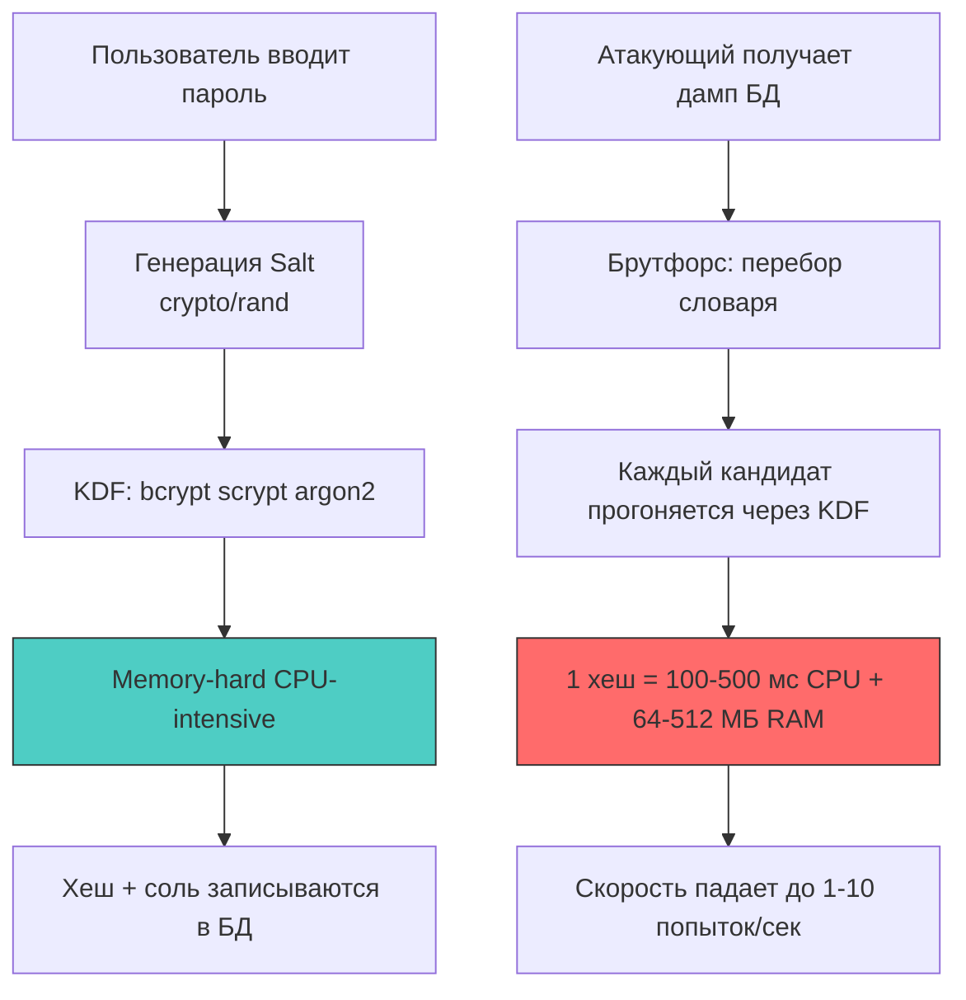
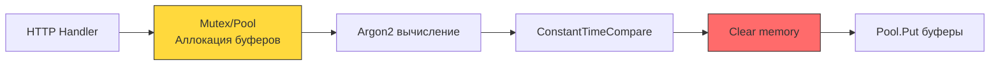

## Фундаментальная проблема: энтропия, радужные таблицы и цена вычисления

Пароли — это секрет с крайне низкой энтропией. Средний пользователь выбирает 8-12 символов из ограниченного набора, что даёт пространство поиска ~10^14 комбинаций. Современные GPU-кластеры способны перебирать миллиарды хешей в секунду. Хранение паролей в обратимом виде или использование быстрых криптографических хеш-функций (MD5, SHA-1, SHA-256) — это не «недостаточная защита», а архитектурный дефект.

Криптографические хеш-функции спроектированы для **максимальной скорости**. Их вычисление требует минимального количества тактов CPU, отлично векторизуется (SIMD инструкции AVX2/AVX-512) и не создаёт давления на кэш-память. Именно это делает их идеальными для цифровых подписей, но катастрофическими для паролей. Атакующий с фермой ASIC может вычислить $2^{30}$ SHA-256 за секунду, фактически отменив смысл хеширования.



## Эволюция механизмов защиты: от соли до памяти

### 1 - Соль (Salt)
Случайная последовательность байт, уникальная для каждого пароля. Добавляется к паролю перед хешированием. Уничтожает эффективность радужных таблиц (precomputed hash databases), заставляя атакующего вычислять хеш для каждого пользователя отдельно. Соль не является секретом, она хранится в открытом виде рядом с хешем.

### 2 - Фактор работы (Work Factor / Cost)
Количество итераций или логарифмическая сложность алгоритма. Позволяет «затормозить» вычисление хеша на легитимном сервере (например, до 100-300 мс), но делает массовый перебор экономически невыгодным. Фактор работы должен масштабироваться с ростом вычислительной мощности.

### 3 - Стойкость к памяти (Memory Hardness)
Ключевое свойство современных KDF (Key Derivation Functions). Алгоритм требует выделения большого блока памяти (например, 64 МБ) и выполняет случайные чтения/записи внутри него. Это ломает параллелизацию на GPU/ASIC, так как пропускная способность памяти (memory bandwidth) становится узким горлом, а не вычислительные ядра.

> [!info] Под капотом
> **Как Argon2 заполняет память на уровне CPU?**
> Алгоритм разбивает выделенный буфер на блоки по 1 КБ. На каждой итерации он вычисляет индекс следующего блока через псевдослучайную функцию, зависящую от предыдущих вычислений. Это создает **непредсказуемые переходы** (branch misprediction rate ~30-40%) и принудительно вытесняет кэш-линии L1/L2. Процессор вынужден постоянно обращаться к RAM через память контроллер, что ограничивает пропускную способность до ~20-30 ГБ/с на ядро, независимо от частоты. Для GPU это означает невозможность загрузить сотни тысяч потоков одновременно — память просто закончится.

## Реализация в Go: идиоматика и управление памятью

В Go пароли **никогда** не должны храниться в `string`. Строки в Go иммутабельны и аллоцируются в куче. После передачи в функцию хеширования ссылка на строку может остаться в стеке, регистрах или внутренних буферах `net/http`. Сборщик мусора не даёт гарантий по времени очистки, а `pprof heap dump` или `core dump` процесса могут раскрыть пароль в открытом виде.

Правильный подход: работа исключительно с `[]byte`, явное затирание памяти после использования и отключение оптимизаций компилятора для операций очистки.

```go
package auth

import (
	"crypto/rand"
	"crypto/subtle"
	"encoding/base64"
	"fmt"
	"runtime"

	"golang.org/x/crypto/argon2"
)

// HashPassword генерирует безопасный хеш и возвращает его в формате "время:память:потоки:соль:хеш"
func HashPassword(password []byte) (string, error) {
	salt := make([]byte, 16)
	if _, err := rand.Read(salt); err != nil {
		return "", fmt.Errorf("salt generation failed: %w", err)
	}

	// Argon2id: баланс между защитой от side-channel и GPU-атак
	// 64 МБ памяти, 4 потока, 3 итерации, 32 байта вывода
	hash := argon2.IDKey(password, salt, 3, 64*1024, 4, 32)

	// Кодируем бинарные данные в строку для хранения в БД
	encoded := base64.RawStdEncoding.EncodeToString(
		fmtAppend(nil, salt, hash), // custom append to avoid allocations
	)
	
	// 🔒 Затирание чувствительных данных перед возвратом
	clear(salt)
	clear(hash)
	runtime.KeepAlive(password) // Запрещаем оптимизатору удалить цикл очистки
	clear(password)

	return fmt.Sprintf("$argon2id$v=19$m=65536,t=3,p=4$%s", encoded), nil
}

// VerifyPassword сравнивает пароль с хешом в константном времени
func VerifyPassword(password []byte, hashStr string) (bool, error) {
	// Парсинг строки хеша (пропущен для краткости, используется стандартный формат)
	salt, expectedHash, err := decodeHash(hashStr)
	if err != nil {
		return false, err
	}

	// Вычисляем хеш с теми же параметрами
	gotHash := argon2.IDKey(password, salt, 3, 64*1024, 4, 32)

	// 🔒 Constant-time comparison. Прерывание при первом несовпадении запрещено.
	// Реализовано через XOR и аккумуляцию, что исключает timing-атаки на CPU.
	res := subtle.ConstantTimeCompare(expectedHash, gotHash)
	
	clear(gotHash)
	runtime.KeepAlive(password)
	clear(password)

	return res == 1, nil
}

func fmtAppend(b, s, h []byte) []byte {
	return append(append(b, s...), h...)
}
func decodeHash(hashStr string) ([]byte, []byte, error) {
	// Реализация парсинга формата $argon2id$...
	return nil, nil, fmt.Errorf("not implemented")
}
```

> [!warning] Ловушка / Gotcha
> **Компилятор оптимизирует `clear()` и циклы обнуления**
> В Go 1.21+ `clear(slice)` встраивается в код, но компилятор имеет право удалить цикл обнуления, если переменная больше не используется (Dead Store Elimination). В контексте безопасности это недопустимо.
> **Решение:** 
> 1. Использовать `runtime.KeepAlive(slice)` сразу после очистки.
> 2. Для критических данных использовать `golang.org/x/crypto/internal/subtle` или `mlock` через `syscall.Mlock()` (требует прав `CAP_IPC_LOCK` или настройки `sysctl vm.mlock_limit`).
> 3. В высокозащищённых системах отключать core dumps: `syscall.Madvise(ptr, len, syscall.MADV_DONTDUMP)`.

## Сравнение алгоритмов: почему `bcrypt` уступает `argon2`

| Параметр | bcrypt | scrypt | argon2id (Рекомендуется) |
|----------|--------|--------|--------------------------|
| **Память** | Фиксированная (4 КБ на блок) | Настраиваемая | Настраиваемая (рекомендуется 64+ МБ) |
| **Защита от GPU/ASIC** | Слабая (вычисляемо на GPU) | Средняя | Высокая (завязано на RAM bandwidth) |
| **Устойчивость к side-channel** | Высокая | Низкая (зависит от памяти) | Высокая (режим ID объединяет Data-Dependent и Data-Independent) |
| **Скорость в Go** | ~100-300 мс (CPU bound) | ~50-150 мс | ~80-200 мс |
| **Стандарт** | OpenBSD, устаревший | RFC 7914 | RFC 9106, современный стандарт |

> [!tip] Собеседование
> **Вопрос:** Почему нельзя использовать `SHA-256(password + salt)` для хранения паролей?
> **Ответ:** 
> 1. **Скорость:** SHA-256 вычисляется за ~100-200 нс на современном CPU. Атакующий с 8× RTX 4090 может перебирать ~10^10 комбинаций/сек.
> 2. **Параллелизация:** Алгоритм отлично векторизуется и работает на GPU/ASIC. Нет механизма, который бы замедлял вычисление.
> 3. **Отсутствие памяти:** Не требует выделения буферов, что позволяет запускать сотни тысяч потоков параллельно на одном устройстве.
> 4. **Решение:** Использовать KDF с настраиваемой сложностью (Argon2id, bcrypt, scrypt), где вычисление хеша занимает 100-500 мс и требует выделения памяти, ломающей параллелизацию.

## Инфраструктурные аспекты и масштабирование

Хеширование паролей — ресурсоёмкая операция. При нагрузке 1000 RPS на эндпоинт логина чистое время `argon2.IDKey` составит ~200 секунд CPU в секунду. Это требует горизонтального масштабирования или очередей, но аутентификация не может быть асинхронной.

**Оптимизации на уровне рантайма:**
1. **CPU Affinity:** Привязка горутин хеширования к конкретным ядрам через `runtime.LockOSThread()` уменьшает миграцию тредов и улучшает использование L3-кэша.
2. **Sync.Pool:** Переиспользование буферов для соли и выходных хешей снижает аллокации и давление на GC.
3. **GOMAXPROCS:** Не ограничивайте число тредов искусственно. Планировщик сам сбалансирует работу, но `GOMEMLIMIT` должен быть установлен, чтобы агрессивное хеширование не вызвало OOM.



## Итог

1. Пароли имеют низкую энтропию. Быстрые хеш-функции (SHA-2, MD5) непригодны для их хранения из-за возможности массового перебора на GPU/ASIC.
2. Безопасное хранение требует KDF с фактором работы и стойкостью к памяти (Argon2id).
3. В Go пароли должны обрабатываться как `[]byte`, а не `string`. После использования память обязана быть затёрта с использованием `runtime.KeepAlive()` для предотвращения оптимизаций компилятора.
4. Сравнение хешей строго через `crypto/subtle.ConstantTimeCompare` для исключения timing-атак на уровне CPU.
5. Высокая стоимость хеширования требует планирования ресурсов: `Sync.Pool` для буферов, настройка таймаутов и мониторинг CPU/памяти на уровне `pprof`.

[[2. bcrypt, argon2 и выбор алгоритма]]