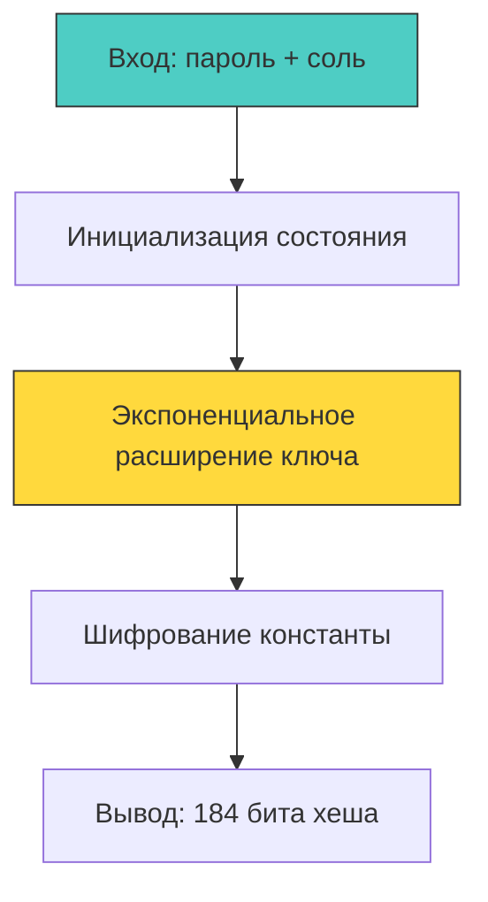
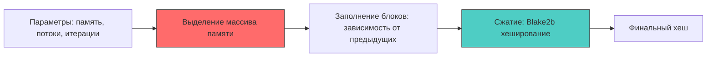

## Эволюция и выбор: почему нет серебряной пули

Выбор алгоритма хеширования паролей — это баланс между криптостойкостью, производительностью сервера и устойчивостью к специализированному железу. В современных реалиях стандартом де-факто считается **Argon2id**, но **bcrypt** продолжает массово использоваться в легаси-системах и специализированных стеках. Понимание их внутреннего устройства, влияния на кэш-линии CPU и поведение в рантайме Go необходимо для принятия архитектурных решений и тонкой настройки под нагрузку.



## bcrypt: Наследие Blowfish и экспоненциальная сложность

bcrypt разработан в 1999 году и базируется на алгоритме шифрования Blowfish, модифицированном в схему **Eksblowfish**. Главная особенность — инициализация ключа требует `2^cost` итераций, где `cost` экспоненциально увеличивает время вычисления.

*Механика:* Алгоритм использует таблицы подстановок размером 4 КБ. При каждом вычислении происходит заполнение состояния, которое последовательно шифруется константой. Это создаёт нагрузку на L1 кэш процессора из-за псевдослучайных обращений к памяти, но не требует выделения больших объёмов ОЗУ. В Go реализация находится в `golang.org/x/crypto/bcrypt` и работает на чистом Go, что упрощает кросс-компиляцию, но ограничивает использование аппаратных SIMD-инструкций по сравнению с C-библиотеками.

> [!info] Под капотом
> **Влияние параметра cost на рантайм**
> `cost=12` занимает ~250 мс на современном x86 ядре. `cost=13` ~500 мс. Увеличение на 1 удваивает время. При `cost > 16` аутентификация блокирует тред ОС на неприемлемое время. В Go это означает, что горутина будет удерживать `M` (системный тред), не отдавая его планировщику, так как вычисления не вызывают блокирующие `syscall`. Планировщик будет вынужден создавать новые треды, что может привести к `OOM` или троттлингу ядра.

## Argon2: Память, потоки и устойчивость к GPU

Argon2 победил в Password Hashing Competition 2015 года и закреплён в RFC 9106. Алгоритм спроектирован для блокировки аппаратного ускорения за счёт **настраиваемого объёма памяти**, **параллелизма** и **итераций**.

Существует три варианта:
- `Argon2d`: Зависит от данных. Быстрее, но теоретически уязвим к side-channel атакам через анализ доступа к памяти.
- `Argon2i`: Независим от данных. Устойчив к side-channel, но медленнее и слабее против GPU.
- `Argon2id`: Гибридный. Первые проходы используют независимый режим, остальные — зависимый. **Рекомендуется по умолчанию.**



*Механика:* Алгоритм выделяет буфер памяти, разбивает его на блоки. На каждом шаге вычисляется индекс следующего блока, читаются два блока, применяется функция сжатия и записывается результат. Это создаёт **memory-bound** вычисление: скорость упирается в пропускную способность RAM, а не в частоту CPU. Для GPU это означает невозможность загрузить тысячи потоков параллельно — видеопамять и шина станут узким местом.

## Механическое сочувствие: влияние на CPU, кэш и планировщик

Хеширование паролей — стресс-тест для рантайма Go. Вот что происходит при вызове `argon2.IDKey` или `bcrypt.GenerateFromPassword`:

1. **Escape Analysis & Heap Pressure:** Буферы для соли, состояния и выходного хеша уходят в кучу. При высоком RPS это генерирует тысячи короткоживущих объектов, провоцируя частые `Minor GC` паузы и вытеснение кэш-линий.
2. **CPU Cache Thrashing:** bcrypt активно использует S-box, который помещается в L1. Argon2 требует 64+ МБ, что гарантирует промахи кэша и постоянные обращения к RAM. На процессорах с высокой частотой это создаёт `memory stall`, снижая IPC.
3. **Scheduler Impact:** Вычисление блокирует `M`. Планировщик не может прервать его без `syscall`. Запуск тысяч горутин хеширования одновременно приведёт к созданию тысяч тредов ОС, перегрузке планировщика и деградации латентности всего сервиса.

```go
// ✅ Идиоматичная обёртка с ограничением параллелизма и переиспользованием буферов
type PasswordHasher struct {
	sem  chan struct{}
	pool *sync.Pool
}

func NewHasher(maxParallel int) *PasswordHasher {
	return &PasswordHasher{
		sem: make(chan struct{}, maxParallel),
		pool: &sync.Pool{
			New: func() any { return make([]byte, 64*1024) },
		},
	}
}

func (h *PasswordHasher) Hash(ctx context.Context, password []byte) (string, error) {
	select {
	case h.sem <- struct{}{}:
		defer func() { <-h.sem }()
	case <-ctx.Done():
		return "", ctx.Err()
	}

	salt := make([]byte, 16)
	if _, err := io.ReadFull(rand.Reader, salt); err != nil {
		return "", fmt.Errorf("salt gen: %w", err)
	}

	hash := argon2.IDKey(password, salt, 3, 64*1024, 4, 32)
	
	// Очистка и кодирование...
	return encoded, nil
}
```

> [!warning] Ловушка / Gotcha
> **Зависимость от параметров и алгоритмическая миграция**
> При обновлении `cost` или переходе на Argon2 старые хеши остаются в БД легитимными, но становятся «дешевле» для перебора. Жёсткая миграция через админку неприемлема.
> **Решение:** При успешной проверке `VerifyPassword` анализируйте префикс и параметры хеша. Если они устарели, пересчитывайте хеш на лету в новом алгоритме и обновляйте запись. Это называется «ленивая миграция при логине».

## Практический выбор и настройка под железо

| Критерий | bcrypt | argon2id |
|---|---|---|
| **Зрелость** | 25+ лет, проверен временем | ~9 лет, современный стандарт |
| **Аппаратная защита** | Умеренная, только CPU-bound | Высокая, Memory-hard + CPU-bound |
| **Параллелизм** | Ограничен 1 потоком | Настраиваемый, использует ядра |
| **Сложность внедрения** | Встроен, прост в конфигурации | Требует бенчмарков под сервер |
| **Рекомендация** | Legacy, low-load | New projects, compliance, high-sec |

**Подбор параметров для продакшена:**
1. Начните с `memory=64MB`, `iterations=3`, `parallelism=4`.
2. Запустите бенчмарк на продакшен-подобном железе. Цель: 150-300 мс на операцию.
3. Увеличивайте `memory`, пока не упрётесь в целевое время или не начнётся swapping.
4. Установите `GOMEMLIMIT` и ограничьте параллелизм хеширования, чтобы избежать троттлинга ОС.
5. Храните параметры хеширования в конфигурации, а не в коде. Они должны масштабироваться с ростом мощности серверов.

> [!tip] Собеседование
> **Вопрос:** Почему сравнение хешей через `==` в Go опасно, даже если алгоритм медленный?
> **Ответ:** Оператор `==` сравнивает байты последовательно и останавливается при первом несовпадении. Время ответа линейно зависит от позиции первого отличающегося байта. Атакующий, измеряя микросекундные задержки, может подобрать хеш байт за байтом, сократив сложность перебора с `O(2^n)` до `O(n*256)`. В Go используется `crypto/subtle.ConstantTimeCompare`, который выполняет XOR всех байт и аккумулирует результат, гарантируя постоянное время выполнения независимо от данных.

## Итог

1. **bcrypt** остаётся рабочим решением для легаси, но уступает современным требованиям из-за отсутствия устойчивости к памяти.
2. **argon2id** — индустриальный стандарт, блокирующий аппаратное ускорение за счёт memory-hard вычислений и гибридной защиты от side-channel атак.
3. В рантайме Go хеширование — тяжёлая CPU/RAM операция. Её необходимо ограничивать семафорами, переиспользовать буферы через `sync.Pool` и явно очищать память после использования.
4. Выбор алгоритма должен сопровождаться стратегией ленивой миграции: верификация по тегу, автоматический апгрейд при успешном логине и динамическая настройка параметров под целевое железо.
5. Параметры хеширования — это конфигурация, зависящая от аппаратных ресурсов и целевой задержки, а не статические константы.

[[3. JWT. Устройство и подводные камни]]