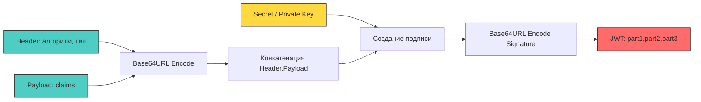

## Stateless-архитектура и цена независимости

JSON Web Token (JWT) — это компактный, URL-безопасный формат для безопасной передачи утверждений (claims) между сторонами. Его главное архитектурное преимущество — **отсутствие состояния (stateless)**. Серверу не нужно хранить сессию в памяти или БД: вся необходимая для авторизации информация встроена в сам токен и криптографически защищена от изменений.

Однако за независимость приходится платить: токены увеличивают размер заголовков запросов, создают нагрузку на парсинг и верификацию при каждом запросе, а их отзыв (revocation) требует дополнительных механизмов. Для бэкенда на Go это означает особое внимание к аллокациям, работе с памятью и криптографическим примитивам.



## Анатомия токена и сериализация

JWT состоит из трёх частей, разделённых точками: `Header`, `Payload`, `Signature`. Каждая часть кодируется алгоритмом **Base64URL** (RFC 4648, Section 5), который заменяет `+` на `-`, `/` на `_` и убирает заполнитель `=`. Это делает токен безопасным для передачи в заголовках и URL без дополнительного экранирования.

1 - **Header**: JSON-объект с метаданными. Содержит тип токена (`typ: JWT`) и алгоритм подписи (`alg: HS256`, `RS256`, `ES256`).
2 - **Payload**: JSON-объект с утверждениями. Стандартные поля: `sub` (subject), `exp` (expiration), `iat` (issued at), `jti` (JWT ID). Произвольные поля добавляются при необходимости.
3 - **Signature**: Вычисляется как `HMAC(Header.Payload, secret)` или `RSA-SHA256(Header.Payload, private_key)`. Гарантирует целостность и аутентичность.

> [!info] Под капотом
> **Влияние сериализации на рантайм Go**
> Каждый вызов `jwt.Parse()` или ручной валидации запускает цепочку: чтение байт из `net/http` буфера → декодирование Base64 → выделение новой памяти для результата → `json.Unmarshal` → аллокация мап и строк для claims. При 10 000 RPS это создаёт ~30 000 короткоживущих аллокаций в секунду, что провоцирует частые `Minor GC` и увеличивает латентность. Стандартный `encoding/base64` и `encoding/json` оптимизированы, но не избегают аллокаций полностью. Для высоконагруженных систем рекомендуется кэширование или использование специализированных парсеров с `[]byte` буферами.

## Криптография и подпись: от HMAC до ECDSA

Выбор алгоритма подписи определяет баланс между производительностью, размером токена и криптостойкостью.

| Алгоритм | Тип ключа | Скорость в Go | Размер подписи | Использование |
|---|---|---|---|---|
| **HS256** (HMAC-SHA256) | Симметричный | Очень высокая (~50-100 мкс) | 32 байта | Внутренние сервисы, монолиты |
| **RS256** (RSA-SHA256) | Асимметричный | Средняя (~200-400 мкс) | 256 байт | Публичные API, федеративная аутентификация |
| **ES256** (ECDSA-SHA256) | Асимметричный | Высокая (~50-150 мкс) | 64 байта | Мобильные клиенты, IoT, оптимизация трафика |

В Go для асимметричных операций используется пакет `crypto/rsa` и `crypto/ecdsa`. Эти пакеты реализованы на чистом Go с ассемблерными оптимизациями для `amd64` и `arm64`. Верификация RS256 требует операции `big.Int.ModExp`, которая активно использует кэш-линии L1 и регистры общего назначения. При высокой нагрузке может наблюдаться `CPU throttling` из-за конкуренции за арифметические вычислительные блоки.

```go
// ✅ Пример ручной верификации с обработкой ошибок и очисткой памяти
func verifyJWT(tokenStr string, secret []byte) (map[string]any, error) {
	parts := strings.Split(tokenStr, ".")
	if len(parts) != 3 {
		return nil, errors.New("invalid token format")
	}

	// Декодируем только Header для проверки алгоритма
	headerBytes, err := base64.RawURLEncoding.DecodeString(parts[0])
	if err != nil {
		return nil, fmt.Errorf("base64 decode header: %w", err)
	}

	var header struct {
		Alg string `json:"alg"`
		Typ string `json:"typ"`
	}
	if err := json.Unmarshal(headerBytes, &header); err != nil {
		return nil, fmt.Errorf("parse header json: %w", err)
	}

	if header.Alg != "HS256" {
		return nil, errors.New("unsupported algorithm")
	}

	// Формируем сообщение для проверки подписи
	message := []byte(parts[0] + "." + parts[1])
	sigBytes, err := base64.RawURLEncoding.DecodeString(parts[2])
	if err != nil {
		return nil, fmt.Errorf("base64 decode sig: %w", err)
	}

	// Вычисляем HMAC
	mac := hmac.New(sha256.New, secret)
	mac.Write(message)
	expectedSig := mac.Sum(nil)

	// 🔒 Constant-time comparison
	if subtle.ConstantTimeCompare(sigBytes, expectedSig) != 1 {
		clear(expectedSig)
		return nil, errors.New("invalid signature")
	}
	clear(expectedSig)

	// Парсим Payload
	payloadBytes, err := base64.RawURLEncoding.DecodeString(parts[1])
	if err != nil {
		return nil, fmt.Errorf("base64 decode payload: %w", err)
	}

	var claims map[string]any
	if err := json.Unmarshal(payloadBytes, &claims); err != nil {
		return nil, fmt.Errorf("parse payload json: %w", err)
	}

	return claims, nil
}
```

## Подводные камни (Gotchas) и архитектурные риски

1 - **Атака `alg: none`**. Если сервер слепо доверяет полю `alg` из заголовка, атакующий может передать токен с `"alg": "none"` и пустой подписью. Некоторые ранние реализации принимали такие токены как валидные. Всегда используйте строгий allowlist алгоритмов на стороне сервера.

2 - **Algorithm Confusion (Confused Deputy)**. Атакующий подставляет токен, подписанный RSA-приватным ключом, но меняет заголовок на `alg: HS256` и использует публичный RSA-ключ как секрет для HMAC. Сервер вычисляет HMAC с публичным ключом и совпадение подтверждается. Защита: используйте отдельные ключи для разных алгоритмов или строго привязывайте алгоритм к типу ключа.

3 - **Отсутствие встроенного отзыва**. JWT по дизайну живёт до `exp`. Если токен скомпрометирован или пользователь сменил пароль, старый токен останется валидным. Для отзыва используют:
   - **Short-lived Access Token + Refresh Token** (рекомендуется)
   - **Блок-лист (JTI)** в Redis с TTL, равным времени жизни токена
   - **Версионирование токенов** (хранение `token_version` в БД, проверка при каждом запросе)

4 - **Timing-атаки при сравнении подписи**. Оператор `==` в Go сравнивает байты слева направо и останавливается при первом несовпадении. Атакующий может подбирать подпись байт за байтом, измеряя микросекундные задержки ответа. Всегда используйте `crypto/subtle.ConstantTimeCompare`.

5 - **JSON-бомбы и oversized claims**. Большой payload увеличивает размер заголовка `Authorization`, что ведёт к фрагментации пакетов на уровне TCP и росту нагрузки на `net/http` парсер. Максимальный размер заголовка в Go по умолчанию ограничен, но атакующий может вызвать `Header size too large` или `Slowloris`. Устанавливайте `http.Server.MaxHeaderBytes` и валидируйте размер payload до парсинга.

> [!warning] Ловушка / Gotcha
> **Аллокация строк при парсинге JWT в middleware**
> Стандартный подход `claims := token.Claims.(jwt.MapClaims)["user_id"].(string)` создаёт новые строки при каждом запросе из-за конвертации `[]byte` в `string`. В высоконагруженном сервисе это генерирует гигабайты мусора в час.
> **Решение:** Извлекайте нужные поля в типизированную структуру с указателями или используйте `[]byte` для ключей, избегайте `interface{}` кастов в критических путях. Применяйте `sync.Pool` для буферов декодирования.

> [!tip] Собеседование
> **Вопрос:** Как реализовать отзыв токена в stateless-архитектуре без потери производительности?
> **Ответ:** 
> 1. Использовать короткоживущие Access Tokens (5-15 минут) и долгоживущие Refresh Tokens (хранятся в БД/хранилище с флагом `revoked`).
> 2. При выходе из системы или сбросе пароля записывать `jti` (JWT ID) в распределённый кэш (Redis) с TTL, равным времени жизни токена.
> 3. На уровне API Gateway или middleware проверять `jti` против блок-листа только если токен валиден по подписи и `exp`.
> 4. Альтернатива: версионирование токенов. Хранить `token_version` в профиле пользователя. При валидации сверять версию из токена с текущей в БД. Кэшировать `token_version` в Redis с коротким TTL для снижения нагрузки.

## Идиоматичная интеграция в Go-сервис

В продакшене рекомендуется использовать проверенную библиотеку `github.com/golang-jwt/jwt/v5` (официальный форк), которая покрывает большинство edge cases, но важно понимать, что она делает под капотом.

```go
type JWTVerifier struct {
	key     []byte
	claims  Claims
}

type Claims struct {
	UserID string `json:"sub"`
	Role   string `json:"role"`
	jwt.RegisteredClaims
}

func (v *JWTVerifier) Parse(tokenStr string) (*Claims, error) {
	token, err := jwt.ParseWithClaims(tokenStr, &Claims{}, func(t *jwt.Token) (any, error) {
		if _, ok := t.Method.(*jwt.SigningMethodHMAC); !ok {
			return nil, fmt.Errorf("unexpected signing method: %v", t.Header["alg"])
		}
		return v.key, nil
	})

	if err != nil {
		return nil, fmt.Errorf("invalid token: %w", err)
	}

	claims, ok := token.Claims.(*Claims)
	if !ok || !token.Valid {
		return nil, errors.New("invalid claims structure")
	}

	return claims, nil
}
```

## Сравнение подходов: JWT vs Session Cookies

| Критерий | JWT (Bearer Header) | Session (Cookie) |
|---|---|---|
| **Хранение состояния** | На клиенте (в себе) | На сервере (Redis/DB) |
| **Отзыв** | Сложно (блок-лист, версии) | Мгновенно (удаление сессии) |
| **Размер запроса** | Большой (заголовок ~200-500 байт) | Малый (кука ~32-64 байта) |
| **Масштабирование** | Естественное (stateless) | Требует шардирования/репликации хранилища |
| **Безопасность XSS/CSRF** | XSS критичен (localStorage) | CSRF критичен (cookie), но `HttpOnly` + `SameSite` защищают |
| **Мобильные клиенты** | Удобно (нет кук) | Требует эмуляции кук или WebView |

Для большинства современных микросервисных архитектур на Go оптимален гибрид: короткий JWT для аутентификации запросов + долгоживущий Refresh Token в `HttpOnly, Secure, SameSite=Strict` cookie для обновления сессий.

## Итог

1. JWT обеспечивает stateless-аутентификацию, но ценой увеличения размера запросов, нагрузки на парсинг и сложностей с отзывом.
2. Сериализация и парсинг токенов в Go создают значительное давление на GC и кэш-линии. Требуется контроль аллокаций и валидация размеров.
3. Криптографическая верификация должна использовать `crypto/subtle.ConstantTimeCompare` и строгий allowlist алгоритмов для защиты от `alg: none` и Algorithm Confusion.
4. Отзыв токенов реализуется через комбинацию короткоживущих Access Tokens, Refresh Tokens в защищённых куках и распределённых блок-листов или версионирования.
5. Выбор между JWT и сессиями зависит от архитектуры: микросервисы и мобильные клиенты выигрывают от JWT, высокозащищённые веб-приложения — от `HttpOnly` сессий.

[[4. Access и refresh токены]]