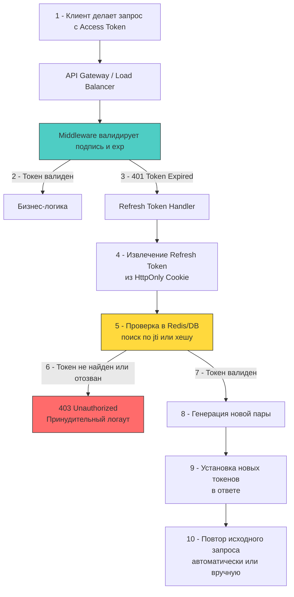

## Философия разделения: безопасность против удобства

Паттерн Access/Refresh токенов решает фундаментальное противоречие безопасной аутентификации: как дать пользователю долгий сеанс работы без повторного ввода пароля, но при этом минимизировать радиус поражения при краже токена?

**Access Token** — это кратковременный ключ к ресурсам. Живёт 5-15 минут. Передаётся в заголовке `Authorization: Bearer <token>`. Stateless, проверяется по подписи и `exp`. Если утечёт — окно атаки ограничено временем жизни.

**Refresh Token** — это долгосрочный идентификатор сессии. Живёт дни, недели или месяцы. Хранится исключительно на сервере (или в защищённых куках браузера). Используется только для получения новой пары токенов на специальном эндпоинте `/auth/refresh`.

Разделение привносит состояние в stateless-архитектуру, но даёт контролируемый механизм отзыва, ротации и аудита сессий.

## Архитектура потока и стратегия ротации



Ключевой механизм безопасности здесь — **ротация (Token Rotation)**. При каждом успешном обновлении сессии выдаётся новый Refresh Token, а старый немедленно инвалидируется. Если атакующий украдёт старый токен и попытается использовать его после того, как легитимный клиент уже обновил сессию, система обнаружит повторное использование и отзовет всю цепочку токенов семьи (family revocation).

## Под капотом: атрибуты куки и сетевой стек

Хранение Refresh токена в `localStorage` или `sessionStorage` — архитектурная ошибка. Любой XSS-скрипт, выполненный в контексте страницы, мгновенно получает доступ к хранилищу и крадёт сессию.

Единственный безопасный способ в вебе — `HttpOnly` cookie. Это не фича браузера, а механизм изоляции памяти на уровне ОС:

- `HttpOnly` запрещает доступ через `document.cookie`. Токен не попадает в пользовательский стек памяти, управляемый JS-движком. Даже при успешной XSS инъекции атакующий не сможет прочитать значение.
- `Secure` требует передачи только через TLS 1.2+. На уровне сетевого стека это гарантирует, что `Set-Cookie` заголовок не будет передан в открытом виде по HTTP. Браузер на уровне системных вызовов `write` к сокету проверяет состояние TLS-туннеля и блокирует передачу, если соединение не зашифровано.
- `SameSite=Strict` или `Lax` защищает от CSRF. Браузер проверяет `Origin`/`Referer` перед отправкой куки. При `Strict` кука не отправляется при переходах с внешних доменов, что ломает фишинговые формы.

```go
// ✅ Идиоматичная установка куки в Go
func setRefreshCookie(w http.ResponseWriter, token string, expires time.Time) {
	cookie := &http.Cookie{
		Name:     "refresh_token",
		Value:    token,
		Path:     "/auth",       // 🔒 Ограничение области видимости
		Expires:  expires,
		HttpOnly: true,          // 🔒 Защита от XSS
		Secure:   true,          // 🔒 Только HTTPS
		SameSite: http.SameSiteStrictMode, // 🔒 Защита от CSRF
		Domain:   ".example.com", // Опционально: для поддоменов
	}
	http.SetCookie(w, cookie)
}
```

## Идиоматичная реализация в Go

Реализация хендлера обновления требует учёта гонки состояний. Клиенты часто отправляют параллельные запросы (например, несколько фоновых fetch), и без синхронизации сервер выдаст несколько пар токенов, сломав состояние ротации.

```go
package auth

import (
	"context"
	"errors"
	"fmt"
	"net/http"
	"sync"
	"time"

	"golang.org/x/sync/singleflight"
)

type RefreshHandler struct {
	store     RefreshTokenStore // интерфейс к Redis/DB
	issuer    TokenIssuer
	sfg       singleflight.Group
	mu        sync.Mutex // для защиты конкретного jti на время обработки
}

func (h *RefreshHandler) ServeHTTP(w http.ResponseWriter, r *http.Request) {
	// 1 - Извлечение куки
	rtCookie, err := r.Cookie("refresh_token")
	if err != nil || rtCookie.Value == "" {
		http.Error(w, "missing refresh token", http.StatusUnauthorized)
		return
	}

	// 2 - Защита от параллельных запросов с одним токеном
	// singleflight гарантирует, что тяжелая операция выполнится только один раз
	// даже при 100 одновременных запросах от одного клиента
	key := fmt.Sprintf("rotate_%s", rtCookie.Value)
	result, err, _ := h.sfg.Do(key, func() (any, error) {
		return h.rotateToken(r.Context(), rtCookie.Value)
	})
	if err != nil {
		h.handleRotationError(w, err)
		return
	}

	tokens := result.(*TokenPair)
	
	// 3 - Установка новых куки и токена в ответ
	setRefreshCookie(w, tokens.Refresh, tokens.ExpiresAt)
	w.Header().Set("Authorization", "Bearer "+tokens.Access)
	w.WriteHeader(http.StatusOK)
}

func (h *RefreshHandler) rotateToken(ctx context.Context, oldToken string) (*TokenPair, error) {
	// Атомарная проверка и инвалидация в Redis
	// Используем Lua-скрипт или MULTI/EXEC для атомарности
	ok, err := h.store.InvalidateAndCheck(ctx, oldToken)
	if err != nil {
		return nil, fmt.Errorf("store check: %w", err)
	}
	if !ok {
		return nil, errors.New("token already used or expired")
	}

	// Генерация новой пары
	newPair, err := h.issuer.IssuePair(ctx, oldToken)
	if err != nil {
		return nil, fmt.Errorf("issue pair: %w", err)
	}

	// Сохранение нового токена (с TTL)
	if err := h.store.Save(ctx, newPair.Refresh, newPair.ExpiresAt); err != nil {
		// Rollback или логирование. В продакшене требуется компенсация.
		return nil, fmt.Errorf("save new token: %w", err)
	}

	return newPair, nil
}

func (h *RefreshHandler) handleRotationError(w http.ResponseWriter, err error) {
	// При подозрении на replay-атаку очищаем куку полностью
	clearRefreshCookie(w)
	http.Error(w, "session revoked", http.StatusUnauthorized)
}
```

> [!warning] Ловушка / Gotcha
> **Гонка ротации и "разорванные" сессии**
> Если мобильный клиент делает 5 параллельных запросов и получает `401` на Access Token, он одновременно отправит 5 запросов на `/refresh`. Без `singleflight` или блокировки по `jti` сервер валидирует первый токен, инвалидирует его в БД, выдаст новую пару. Оставшиеся 4 запроса получат `403 "token already used"`. Клиент сочтёт сессию невалидной и принудительно разлогинит пользователя.
> **Решение:** Сервер должен кэшировать результат ротации на 1-2 секунды или использовать `singleflight` с ключом по хешу старого токена, возвращая одну и ту же новую пару всем параллельным запросам в пределах короткого окна.

> [!tip] Собеседование
> **Вопрос:** Как защитить систему от утечки Refresh Token, если злоумышленник скопировал куку до ротации?
> **Ответ:**
> 1 - **Ротация с отслеживанием семьи:** При каждом обновлении генерировать новый `jti` и связывать его с предыдущим. Если старый `jti` используется после создания нового, вся цепочка отзывается.
> 2 - **Привязка к fingerprint:** Хранить на сервере хэш `User-Agent`, `IP` или публичного ключа клиента. При несоответствии — отказ в выдаче.
> 3 - **Короткий TTL + активное использование:** Ограничить время жизни неактивной сессии. Если пользователь не активен 30 дней, требовать повторный ввод пароля.
> 4 - **Клиентская реализация:** Гарантировать, что при `401` клиент отправляет только один запрос на `/refresh` и блокирует очередь до получения ответа.

## Механическое сочувствие: гонки, память и сетевые задержки

Ротация токенов — это точка синхронизации в распределённой системе. Каждое обновление требует:
- **Сетевого round-trip** к Redis/DB.
- **Атомарной операции** (`SETNX` или `EVAL`), которая блокирует шард на время выполнения.
- **Криптографических вычислений** для подписи нового Access Token.

При высокой нагрузке это создаёт «горячую» точку в кластере. `net/http` рантайм аллоцирует новые структуры `http.Cookie`, `url.Values` и JWT claims на каждый запрос. Это провоцирует `Minor GC` и повышает задержки на `P50/P99`.

**Оптимизации:**
1 - **Кэширование ротации:** После выдачи новой пары хранить её в локальной `sync.Map` или `Ristretto` на 1-2 секунды. Последующие запросы с тем же старым токеном получают ответ из кэша без обращения к БД.
2 - **Пул соединений и пайплайнинг:** Использовать `redis.Pool` с `Wait=true` и пакетировать команды проверки и сохранения в один `MULTI/EXEC` или Lua-скрипт. Это сокращает количество `syscall write/read` к сокету с двух до одного.
3 - **Отложенная очистка:** Вместо немедленного `DEL` из БД использовать `EXPIRE` с коротким TTL (например, время жизни Access Token + 5 секунд). Это снижает нагрузку на транзакционную подсистему и предотвращает race condition при асинхронной репликации Redis Sentinel/Cluster.

## Итог

1 - Разделение на Access и Refresh токены балансирует между удобством пользователя и безопасностью: короткое окно атаки + контролируемый отзыв.
2 - Хранить Refresh токен безопасно только в `HttpOnly, Secure, SameSite` куках. `localStorage` неприемлем для веб-клиентов.
3 - Ротация токенов требует строгой атомарности и защиты от параллельных запросов (`singleflight`, Lua-скрипты в Redis) во избежание разрыва сессий.
4 - На уровне рантайма ротация создаёт нагрузку на GC, сеть и БД. Кэширование результатов, пайплайнинг и пулы соединений обязательны для высоконагруженных систем.
5 - Защита от кражи строится на отслеживании цепочек токенов (family revocation), привязке к клиентскому окружению и автоматическом отзыве при обнаружении replay-атак.

[[5. OAuth 2.0 и OpenID Connect]]