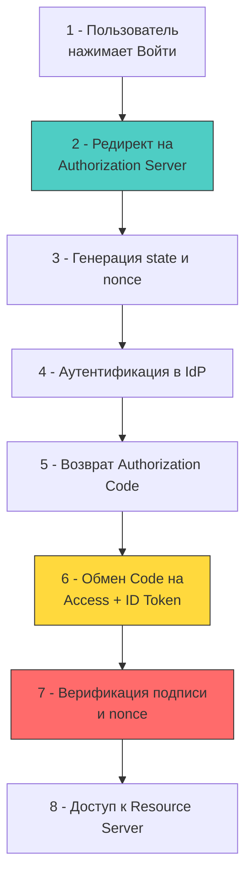

## Делегирование доступа и федеративная идентификация

OAuth 2.0 часто ошибочно называют протоколом аутентификации. Это фундаментальное заблуждение архитектуры. **OAuth 2.0 — это фреймворк для делегирования прав доступа (авторизации)**. Он позволяет ресурсному серверу выдать ограниченный доступ к данным, не раскрывая учётные данные пользователя. **OpenID Connect (OIDC)** — это слой идентификации, построенный поверх OAuth 2.0, который добавляет стандартизированный способ аутентификации и передачи утверждений об идентичности (ID Token).

Для Senior/Lead разработчика понимание различий между ними критично: неправильная интерпретация протокола ведёт к реализации кастомных «велосипедов», нарушению границ доверия и уязвимостям типа `confused deputy` или `token leakage`.



## Гранты: от Implicit к Authorization Code с PKCE

Исторически OAuth 2.0 поддерживал несколько типов выдачи токенов (Grant Types), но эволюция веб-безопасности оставила только два, пригодных для продакшена:

1 - **Authorization Code + PKCE (Proof Key for Code Exchange)**: Золотой стандарт для веб-приложений и SPA. Клиент получает временный `code`, который обменивает на токены через защищённый бэкенд-канал. PKCE добавляет криптографический `code_verifier` и `code_challenge`, защищая от атак перехвата кода.
2 - **Client Credentials**: Для серверного взаимодействия (M2M). Клиент аутентифицирует себя, а не пользователя. Использует `client_id` и `client_secret` (или mTLS/MTLS).

> [!warning] Ловушка / Gotcha
> **Implicit Grant и Resource Owner Password Credentials (ROPC) признаны устаревшими**
> Передача токена в URL-фрагменте (`#access_token=...`) делает его доступным в истории браузера, логах прокси и через `document.referrer`. ROPC требует ввода пароля напрямую в клиентское приложение, ломая модель доверия и отключая MFA. В современных кодобазах их использование — маркер архитектурной халатности.

## OIDC: Аутентификация поверх авторизации

OIDC вводит критически важный компонент: **ID Token**. Это JWT, который содержит криптографически подписанные утверждения об идентичности пользователя.

Ключевые отличия от стандартного OAuth:
- **`id_token` vs `access_token`**: ID Token предназначен для клиента (браузера/мобильного приложения) для установления сессии. Access Token предназначен для ресурсного сервера (вашего API) и не должен парситься клиентом.
- **`nonce`**: Случайное значение, генерируемое клиентом перед редиректом. Включается в ID Token. Защищает от replay-атак, когда атакующий повторно использует старый токен.
- **Discovery (`/.well-known/openid-configuration`)**: Стандартный эндпоинт, возвращающий JSON с URL-ами для авторизации, токенов, JWKS (набор публичных ключей) и поддерживаемыми алгоритмами.

## Реализация в Go: от `x/oauth2` до криптографической проверки

Стандартная библиотека `golang.org/x/oauth2` обеспечивает безопасный обмен токенов, управление состоянием и автоматический рефреш. Однако она **не выполняет криптографическую проверку ID Token**. Эту задачу необходимо реализовывать явно.

```go
package oidc

import (
	"context"
	"crypto/rand"
	"encoding/base64"
	"errors"
	"fmt"
	"net/http"
	"time"

	"golang.org/x/oauth2"
	"golang.org/x/oauth2/google"
	"github.com/golang-jwt/jwt/v5"
	"github.com/coreos/go-oidc/v3/oidc"
)

type IDTokenVerifier struct {
	verifier *oidc.IDTokenVerifier
	provider *oidc.Provider
}

func NewVerifier(ctx context.Context, issuerURL string, clientID string) (*IDTokenVerifier, error) {
	provider, err := oidc.NewProvider(ctx, issuerURL)
	if err != nil {
		return nil, fmt.Errorf("oidc provider init: %w", err)
	}

	// 🔒 Верификатор автоматически загружает JWKS, проверяет aud, exp, iss
	config := &oidc.Config{
		ClientID: clientID,
	}
	
	return &IDTokenVerifier{
		provider: provider,
		verifier: provider.Verifier(config),
	}, nil
}

// VerifyAndExtract валидирует ID Token и извлекает Claims
func (v *IDTokenVerifier) VerifyAndExtract(ctx context.Context, rawIDToken string, expectedNonce string) (*oidc.UserInfo, error) {
	// 1 - Криптографическая проверка подписи через JWKS (RSA/ECDSA)
	idToken, err := v.verifier.Verify(ctx, rawIDToken)
	if err != nil {
		return nil, fmt.Errorf("token verification failed: %w", err)
	}

	// 2 - Проверка nonce (защита от replay)
	var claims struct {
		Nonce string `json:"nonce"`
	}
	if err := idToken.Claims(&claims); err != nil {
		return nil, fmt.Errorf("parse nonce claim: %w", err)
	}

	if claims.Nonce != expectedNonce {
		return nil, errors.New("nonce mismatch: potential replay attack")
	}

	// 3 - Получение дополнительных claims (если требуется)
	userInfo, err := v.provider.UserInfo(ctx, oauth2.StaticTokenSource(&oauth2.Token{
		AccessToken: idToken.AccessToken, // ⚠️ В реальности берётся из Access Token flow
	}))
	if err != nil {
		return nil, fmt.Errorf("fetch userinfo: %w", err)
	}

	return userInfo, nil
}

// GenerateSecureState создаёт криптографически стойкое состояние
func GenerateSecureState() (string, error) {
	b := make([]byte, 32)
	if _, err := rand.Read(b); err != nil {
		return "", fmt.Errorf("rand read: %w", err)
	}
	return base64.URLEncoding.EncodeToString(b), nil
}
```

> [!info] Под капотом
> **Как `x/oauth2` управляет токенами и соединением**
> Библиотека обёртывает `http.Client` через `Transport`, который автоматически intercept-ит запросы. При `401 Unauthorized` или истечении `exp`, транспорт блокирует горутины, выполняет один запрос к `TokenURL` для обновления (используя `sync.Mutex` внутри), кеширует новый токен в памяти процесса и повторяет исходный запрос. Это предотвращает `thundering herd` при истечении токена у тысяч одновременных клиентов, но создаёт блокировку на время `syscall` к провайдеру. В высоконагруженных микросервисах рекомендуется использовать `singleflight` поверх `oauth2.TokenSource` для дедупликации запросов рефреша.

## Механическое сочувствие: сеть, TLS и GC

Взаимодействие с OIDC-провайдером — это серия сетевых вызовов, криптографических операций и парсинга данных. Каждый этап влияет на рантайм:

1 - **TLS Handshake Overhead**: Первый запрос к `/authorize` или `/token` требует полного TLS 1.3 рукопожатия. На уровне ОС это несколько `syscalls` (`connect`, `write`, `read`), обмен сертификатами, вычисление `ECDHE` ключей. При отсутствии `Keep-Alive` или пула соединений это добавляет ~15-30 мс латентности на каждый обмен.
2 - **JWKS Загрузка и Парсинг**: Публичные ключи загружаются по URL из discovery. Кэширование `JWKS` в памяти обязательно. Частые запросы к провайдеру вызывают `DNS resolution` и аллокацию `http.Request`/`Response` объектов, повышая `GC pressure`.
3 - **JWT Верификация и Аллокации**: `jwt.Parse` выделяет память для заголовка, payload и подписи. `json.Unmarshal` мапит поля в структуры. При 10к RPS это тысячи короткоживущих объектов. Для оптимизации используйте `gopkg.in/square/go-jose.v2` или кэшируйте распарсенные структуры в `sync.Pool`.
4 - **State/Nonce Хранение**: `state` и `nonce` должны храниться в сессии (куках или серверном кэше) до момента колбэка. Серверный кэш (Redis) с коротким TTL (~10 мин) предпочтительнее клиентских кук для защиты от CSRF и манипуляций.

## Подводные камни и ловушки (Gotchas)

1 - **`aud` (Audience) Mismatch**: ID Token должен содержать `aud` клиента. Если провайдер выдаёт токен с несколькими аудиториями или не совпадающим `client_id`, верификация должна падать. Игнорирование `aud` позволяет атакующему использовать токен, предназначенный для другого приложения.
2 - **Clock Skew (Рассинхронизация часов)**: `exp` проверяется относительно серверного времени. Если часы вашего сервера и провайдера расходятся более чем на 5 минут, валидные токены будут отвергнуты. Решение: использовать `oidc.Config{TimeNow: customTimeFunc}` с допуском или синхронизировать время через `ntpd`/`chronyd`.
3 - **Конфидициальность `access_token`**: Никогда не передавайте Access Token в URL-параметрах или логах. В Go `net/http` автоматически логирует запросы при настройке `httputil.DumpRequest`. Обязательно маскируйте заголовок `Authorization` в продакшен-логах.
4 - **PKCE `code_verifier` энтропия**: Спецификация требует 43-128 символов, сгенерированных через `crypto/rand`. Использование `math/rand` или коротких строк делает `code_challenge` предсказуемым и ломает защиту от перехвата кода.

> [!tip] Собеседование
> **Вопрос:** Почему нельзя использовать только `access_token` для аутентификации в OIDC, и что произойдёт, если провайдер изменит формат подписи?
> **Ответ:**
> 1 - Access Token — непрозрачный или форматно-независимый токен, предназначенный для ресурсного сервера. Он не гарантирует наличие полей `sub`, `iss`, `nonce` или `auth_time`. Клиент не должен его парсить.
> 2 - ID Token — строго стандартизирован JWT, содержащий криптографическую подпись и обязательные поля идентификации.
> 3 - Если провайдер сменит алгоритм (например, с `RS256` на `ES256`), клиентский код, захардкодивший `alg` в парсере, упадёт с ошибкой верификации. Правильное решение: загружать алгоритмы динамически через `/.well-known/openid-configuration` и `jwks_uri`, валидируя только разрешённый список (`RS256`, `ES256`) и игнорируя неподдерживаемые.

## Итог

1 - OAuth 2.0 делегирует доступ, OIDC добавляет стандартизированную аутентификацию. Их смешивание ведёт к архитектурным дефектам.
2 - `Authorization Code + PKCE` — единственный безопасный грант для клиентских приложений. `Implicit` и `ROPC` устарели и запрещены.
3 - Верификация ID Token в Go требует явной криптографической проверки подписи через JWKS, валидации `aud`, `iss`, `exp` и обязательной проверки `nonce`.
4 - Сетевые вызовы к провайдеру, TLS-рукопожатия и парсинг JWT создают накладные расходы на GC, CPU и сеть. Кэширование `JWKS`, `TokenSource` дедупликация и пулы соединений обязательны.
5 - Рассинхронизация часов, несоответствие `aud` и слабая энтропия `state/nonce` — типичные причины продакшен-инцидентов. Их необходимо покрывать мониторингом и автоматическими тестами.

[[6. RBAC, ABAC модели]]