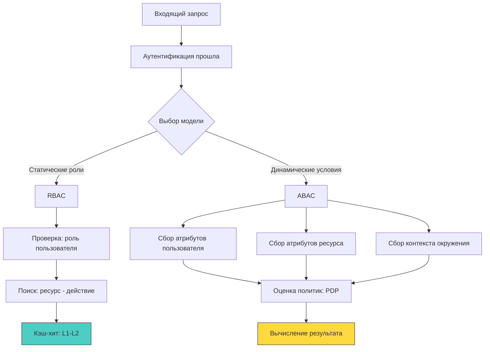

## Выбор модели контроля доступа: скорость против гибкости

Контроль доступа (Access Control) — это ядро политики безопасности бэкенда. В индустрии доминируют две модели: **RBAC** (Role-Based Access Control) и **ABAC** (Attribute-Based Access Control). Выбор между ними определяет не только архитектуру авторизации, но и профиль производительности сервиса: частоту обращений к кэшам, нагрузку на сборщик мусора, предсказуемость ветвлений в CPU и сложность инвалидации политик.



## RBAC: Матрица прав и кэш-локальность

RBAC оперирует предопределёнными ролями (`admin`, `editor`, `viewer`), которым назначены конкретные разрешения. Пользователь получает одну или несколько ролей, а система проверяет наличие `(ресурс:действие)` в маппинге роли.

Преимущество модели — детерминированность и высокая скорость проверки. В рантайме Go это легко реализуется через компактные структуры, которые эффективно укладываются в кэш-линии L1.

```go
package authz

import (
	"context"
	"errors"
	"sync"
)

// RBACChecker реализует проверку прав через предвычисленную матрицу
type RBACChecker struct {
	mu      sync.RWMutex
	// role -> resource -> action -> allowed
	// Используем вложенные мапы для O(1) поиска, но с ростом аллокаций
	policies map[string]map[string]map[string]bool
}

func NewRBACChecker() *RBACChecker {
	return &RBACChecker{
		policies: make(map[string]map[string]map[string]bool),
	}
}

// AddPolicy добавляет правило. Поточно-безопасно через RWMutex.
func (r *RBACChecker) AddPolicy(role, resource, action string) {
	r.mu.Lock()
	defer r.mu.Unlock()

	if r.policies[role] == nil {
		r.policies[role] = make(map[string]map[string]bool)
	}
	if r.policies[role][resource] == nil {
		r.policies[role][resource] = make(map[string]bool)
	}
	r.policies[role][resource][action] = true
}

// Check проверяет доступ. Читает без блокировки для высокой пропускной способности.
func (r *RBACChecker) Check(ctx context.Context, role, resource, action string) error {
	r.mu.RLock()
	// 🔒 Прямой доступ к внутренностям мапы. В Go 1.21+ hmap оптимизирован
	// для быстрого хеширования строк, но вложенные вызовы создают цепочку указателей.
	resMap, resOk := r.policies[role]
	if resOk {
		actMap, actOk := resMap[resource]
		if actOk && actMap[action] {
			r.mu.RUnlock()
			return nil
		}
	}
	r.mu.RUnlock()
	
	return errors.New("forbidden")
}
```

> [!info] Под капотом
> **Влияние вложенных мап на CPU и кэш**
> Структура `map[string]map[string]map[string]bool` в Go реализована как указатель на `hmap`. Каждый уровень вложенности — это новый `hmap`, расположенный в куче произвольным образом. При вызове `Check` процессор делает 3-4 разыменования указателей, что с высокой вероятностью приводит к промаху кэша (cache miss) и загрузке данных из RAM. Для высоконагруженных систем (50к+ RPS) это увеличивает латентность на 15-30 нс на каждый запрос.
> **Оптимизация:** Сериализовать тройку `(роль, ресурс, действие)` в один ключ или использовать отсортированный срез структур с бинарным поиском. Это упаковывает данные в смежные участки памяти, повышая hit-rate L1/L2 кэша.

## ABAC: Динамическая оценка и цена вычислений

ABAC принимает решение на основе атрибутов субъекта, ресурса, действия и окружения. Формула: `P(user_attrs, resource_attrs, action, env) -> bool`. Позволяет выражать сложные правила: *«Менеджер может редактировать документ, только если он создан менее 30 дней назад, принадлежит тому же департаменту и запрос пришёл из корпоративной сети в рабочее время»*.

Гибкость достигается ценой вычислительной сложности. Каждый запрос требует сбора атрибутов, загрузки политик и их интерпретации.

```go
package authz

import (
	"context"
	"fmt"
	"time"
)

// ABACPolicy определяет интерфейс для оценки прав
type ABACPolicy interface {
	Evaluate(ctx context.Context, req AccessRequest) (bool, error)
}

// AccessRequest содержит все динамические атрибуты
type AccessRequest struct {
	UserID       string
	UserRole     string
	UserDept     string
	ResourceID   string
	ResourceAge  time.Duration
	Action       string
	ClientIP     string
	RequestTime  time.Time
}

// SimpleABACPolicy пример оценщика политики без внешнего PDP
type SimpleABACPolicy struct{}

func (p *SimpleABACPolicy) Evaluate(ctx context.Context, req AccessRequest) (bool, error) {
	// 🔒 Сложная ветвящаяся логика
	if req.UserRole != "manager" {
		return false, nil
	}
	if req.UserDept != getOwnerDept(req.ResourceID) { // Скрытый сетевой вызов или кэш-хит
		return false, nil
	}
	if req.ResourceAge > 30*24*time.Hour {
		return false, nil
	}
	if !isOfficeHours(req.RequestTime) {
		return false, nil
	}
	
	return true, nil
}
```

В продакшене ABAC редко пишут вручную. Стандартом является **Policy Decision Point (PDP)**, например Open Policy Agent (OPA) с языком Rego, или Amazon Cedar. Интеграция происходит либо через встраиваемый движок (WASM или C-библиотека), либо через gRPC/HTTP вызов.

> [!warning] Ловушка / Gotcha
> **Латентность и syscall-оверхед при внешнем PDP**
> Если ABAC-оценка вынесена в отдельный микросервис (OPA sidecar или centralized PDP), каждый запрос авторизации превращается в сетевой вызов. В Go это означает:
> 1. Аллокация `http.Request`/`Response` или gRPC-фреймов.
> 2. Переключение контекста в `netpoll`, блокировка горутины в `syscall read/write`.
> 3. Планировщик может создать новый `M` (тред ОС), если текущий заблокирован.
> 4. Добавляется 2-10 мс сетевого round-trip. При 10к RPS это гарантированно упирается в лимит файловых дескрипторов или троттлинг CPU из-за переключений контекста.
> **Решение:** Локальный кэш политик с TTL, встраиваемый OPA (golang `opa/rego`), или гибридная модель (RBAC для частых проверок, ABAC только для критичных операций).

## Механическое сочувствие: ветвления, аллокации и GC

| Параметр | RBAC | ABAC |
|----------|------|------|
| **Аллокации на запрос** | Минимальные (поиск в мапе или срезе) | Высокие (сбор `map[string]any`, структуры атрибутов) |
| **Branch Prediction** | Высокий (предсказуемые проверки `role == X`) | Низкий (динамические условия, частые `false` пути) |
| **GC Давление** | Низкое (кэшированные политики живут долго) | Среднее/Высокое (создание/удаление атрибутов на каждый запрос) |
| **Конкурентность** | `sync.RWMutex` или `atomic` для перезагрузки политик | Зависит от движка. OPA использует lock-free структуры или внутренние пулы |

ABAC генерирует значительный «мусор» в куче из-за динамического сбора атрибутов. В рантайме Go это приводит к учащению `Minor GC` циклов. Во время `Stop-The-World` фазы все горутины приостанавливаются, что напрямую бьёт по `P99` латентности. Оптимизация требует переиспользования буферов через `sync.Pool` для структур запросов и предварительного вычисления статических атрибутов.

```go
// ✅ Оптимизация: пул запросов для снижения давления на GC
var reqPool = sync.Pool{
	New: func() any {
		return &AccessRequest{}
	},
}

func evaluateWithPool(ctx context.Context, policy ABACPolicy, rawData RawRequest) (bool, error) {
	req := reqPool.Get().(*AccessRequest)
	defer reqPool.Put(req) // 🔒 Возврат в пул обнуляет поля автоматически? Нет, требуется явная очистка!
	
	// ⚠️ sync.Pool НЕ очищает структуру при Put. Нужно явно сбрасывать поля.
	req.UserID = rawData.UserID
	req.UserRole = rawData.UserRole
	// ... заполнение остальных полей
	
	defer func() {
		*req = AccessRequest{} // 🔒 Явный сброс состояния перед возвратом в пул
	}()
	
	return policy.Evaluate(ctx, *req)
}
```

> [!tip] Собеседование
> **Вопрос:** Как обработать ситуацию, когда политики доступа обновляются «на лету» в распределённом кластере из 50 инстансов, и при этом нельзя допустить окна несоответствия (TOCTOU)?
> **Ответ:**
> 1 - **Версионирование политик:** Каждая загрузка политик получает монотонный `version_id` или хеш.
> 2 - **Атомарная замена:** В памяти используется структура с указателем. Новая версия собирается полностью, затем атомарно заменяется через `atomic.StorePointer`. Старая версия остаётся доступной для завершающих запросов и утилизируется `GC` только когда ссылки на неё исчезнут.
> 3 - **Кэш-инвалидация по событию:** Используется Pub/Sub (Redis/NATS) для рассылки события обновления. Инстансы применяют `graceful reload`: новые запросы идут по новой версии, старые завершаются по старой.
> 4 - **Идемпотентность проверок:** Проверка должна быть чистой функцией от состояния политик и атрибутов. Побочные эффекты (логирование, инкремент счётчиков) выносятся в асинхронные обработчики.

## Гибридные подходы и стандарты индустрии

Чистый ABAC избыточен для 90% операций. Современная архитектура использует каскадную модель:
1 - **Быстрый путь (RBAC/ReBAC):** Проверка ролей или отношений (например, `user.owner_id == resource.creator_id`) выполняется локально в Go-коде за <1 мкс.
2 - **Сложный путь (ABAC):** Если быстрый путь не дал однозначного результата, запрос делегируется локальному PDP или внешнему движку.
3 - **Кэширование результатов:** Для одинаковых комбинаций атрибутов результат политики кешируется на 1-5 секунд с использованием `hashicorp/golang-lru` или `dgraph/ristretto`. Это снижает нагрузку на вычислительный движок и сглаживает пики.

Стандарты `XACML` (устаревший, тяжелый) и `OAuth 2.0 Token Introspection` (для федеративного доступа) часто комбинируются с внутренними реализациями. В Go экосистеме доминирует OPA/Rego благодаря возможности компиляции политик в байткод и встраивания в бинарник без внешних зависимостей.

## Итог

1 - RBAC обеспечивает максимальную производительность за счёт предсказуемости, компактного хранения и высокой кэш-локальности. Идеален для 80-90% бизнес-сценариев.
2 - ABAC даёт бесконечную гибкость, но ценой динамических аллокаций, снижения предсказуемости ветвлений и потенциального роста латентности. Требует тщательной оптимизации памяти и кэширования.
3 - В рантайме Go вложенные мапы и динамические структуры создают промахи кэша и давление на `GC`. Использование `sync.Pool`, атомарных указателей для перезагрузки политик и локальных движков критично для высоконагруженных систем.
4 - Внешние PDP добавляют сетевой оверхед и `syscall` блокировки. Гибридная архитектура (локальный RBAC + fallback ABAC + кэш результатов) является индустриальным стандартом.
5 - Выбор модели должен диктоваться требованиями бизнеса, а не модой. Начинайте с RBAC, добавляйте ABAC только там, где статические роли физически не покрывают бизнес-правила.

[[7. Session based auth]]