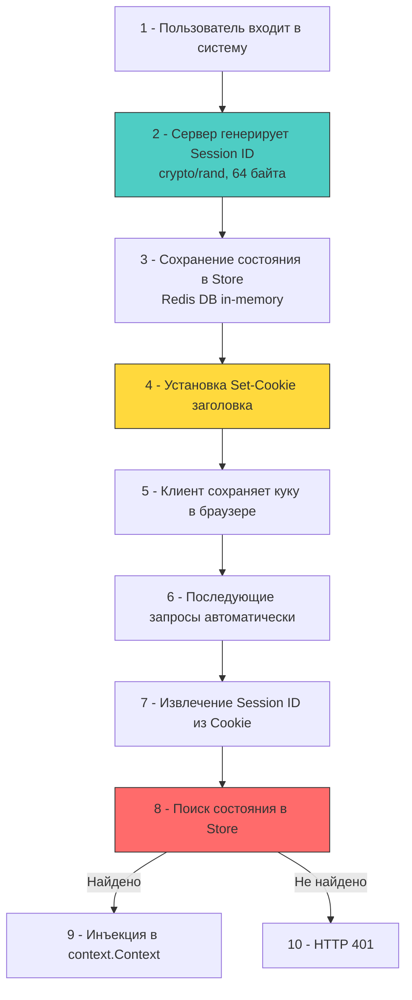

## Stateful-архитектура: контроль, отзыв и изоляция

В отличие от JWT, где состояние инкапсулировано в токене и хранится на клиенте, сессионная аутентификация сохраняет полный контекст пользователя на стороне сервера. Клиент получает лишь случайный идентификатор сессии (обычно 32-64 байта энтропии), который передаётся в каждом запросе через `Cookie` или `Authorization` заголовок.

Главное архитектурное преимущество — **немедленный отзыв и полный контроль**. Сервер может удалить сессию из хранилища в любой момент, и следующий запрос клиента мгновенно получит `401 Unauthorized`. Это критично для финансовых систем, административных панелей и сценариев с повышенными требованиями к безопасности.



## Транспортный механизм: анатомия куки и браузерный стек

`Cookie` — это не просто строка в заголовке. Это контракт между сервером и браузером, который жёстко контролируется на уровне сетевого стека ОС и движка рендеринга.

1 - `HttpOnly`: Запрещает доступ через `document.cookie` или `XMLHttpRequest`. Браузер изолирует значение в памяти, недоступной для JS-движка. Даже при успешной XSS-инъекции скрипт не сможет прочитать или модифицировать сессионный идентификатор.
2 - `Secure`: Гарантирует передачу только поверх TLS 1.2/1.3. Браузер проверяет состояние защищённого соединения на уровне системных вызовов `SSL_write`/`SSL_read`. При попытке отправки по HTTP кука просто не прикрепляется к запросу.
3 - `SameSite`: Управление CSRF. `Strict` блокирует отправку при любых кросс-доменных переходах. `Lax` разрешает только безопасные `GET`-запросы с навигацией. На уровне браузера это проверяется через сравнение `Site` текущего контекста и `Origin` запроса до отправки `syscall write` в сокет.
4 - `Domain` и `Path`: Ограничивают область видимости. Сервер должен явно указывать `Path=/` или `/api`, чтобы кука не передавалась статическим ресурсам или публичным эндпоинтам.

> [!warning] Ловушка / Gotcha
> **Размер куки и фрагментация пакетов**
> Заголовок `Cookie` ограничен ~4 КБ. Если вы начнёте хранить в сессии роли, права, настройки темы и кэшированные данные, размер вырастет, что приведёт к фрагментации на уровне TCP. Каждый дополнительный пакет добавляет задержку из-за ожидания подтверждения (`ACK`), увеличивая `P99` латентность на 10-20 мс.
> **Решение:** В куке хранить только `session_id`. Всё остальное выносить в серверное хранилище. Сессионный идентификатор должен быть строго случайным, без встроенных данных.

## Хранение состояния: от in-memory до распределённого кэша

Архитектура хранилища сессий напрямую влияет на масштабируемость и отказоустойчивость.

| Подход | Плюсы | Минусы | Влияние на рантайм |
|--------|-------|--------|-------------------|
| **In-memory (`map`/`sync.Map`)** | Нулевые сетевые задержки, максимальная скорость | Потеря при рестарте, невозможность горизонтального масштабирования | Высокое давление на GC при частой загрузке/выгрузке, промахи кэша при рандомном доступе |
| **Redis/Memcached** | Распределённость, TTL, атомарные операции | Сетевой round-trip, зависимость от внешнего сервиса | `syscall` блокировки в `netpoll`, аллокации сериализации/десериализации |
| **Реляционная БД** | Персистентность, транзакционность, аудит | Высокая задержка, блокировки строк, нагрузка на IOPS | Длительное удержание соединений в `database/sql` пуле, contention на уровне БД |

В продакшене стандартом является **распределённый кэш с TTL**. Сессия загружается при первом запросе, кешируется локально на короткое время (1-2 секунды), а основной источник остаётся внешним для согласованности между инстансами.

## Идиоматичная реализация в Go: middleware и store

В Го сессионная аутентификация реализуется через интерфейс хранилища и `net/http` middleware. Критично избегать глобального состояния и обеспечивать потокобезопасность.

```go
package session

import (
	"context"
	"crypto/rand"
	"encoding/base64"
	"errors"
	"fmt"
	"net/http"
	"sync"
	"time"
)

// SessionStore определяет контракт для работы с сессиями
type SessionStore interface {
	Get(ctx context.Context, id string) (*SessionData, error)
	Set(ctx context.Context, id string, data *SessionData, ttl time.Duration) error
	Delete(ctx context.Context, id string) error
}

type SessionData struct {
	UserID    int64
	Roles     []string
	CreatedAt time.Time
	LastUsed  time.Time
	// Дополнительные поля кастомизируются под проект
}

// ctxKey локальный тип для избежания коллизий в context.Context
type ctxKey struct{}

func NewMiddleware(store SessionStore, cookieName string) func(http.Handler) http.Handler {
	return func(next http.Handler) http.Handler {
		return http.HandlerFunc(func(w http.ResponseWriter, r *http.Request) {
			cookie, err := r.Cookie(cookieName)
			if err != nil || cookie.Value == "" {
				// Кука отсутствует -> неавторизован, но продолжаем цепочку
				// (мидлварь не обязан обрывать запрос, если путь публичный)
				next.ServeHTTP(w, r)
				return
			}

			session, err := store.Get(r.Context(), cookie.Value)
			if err != nil {
				if errors.Is(err, ErrSessionNotFound) {
					clearSessionCookie(w, cookieName)
					next.ServeHTTP(w, r)
					return
				}
				http.Error(w, "internal error", http.StatusInternalServerError)
				return
			}

			// Обновляем время последнего использования (лениво, в фоне или в sync)
			// Для избежания гонки используем атомарные хранилища или отдельный worker

			// Инжектируем сессию в контекст
			ctx := context.WithValue(r.Context(), ctxKey{}, session)
			next.ServeHTTP(w, r.WithContext(ctx))
		})
	}
}

func GenerateSessionID() (string, error) {
	b := make([]byte, 32)
	if _, err := rand.Read(b); err != nil {
		return "", fmt.Errorf("rand read: %w", err)
	}
	return base64.URLEncoding.EncodeToString(b), nil
}

func clearSessionCookie(w http.ResponseWriter, name string) {
	http.SetCookie(w, &http.Cookie{
		Name:     name,
		Value:    "",
		Path:     "/",
		Expires:  time.Unix(0, 0),
		HttpOnly: true,
		Secure:   true,
		SameSite: http.SameSiteStrictMode,
	})
}
```

## Под капотом: аллокации, гонки и сетевые вызовы

1 - **`context.WithValue` и цепочка указателей**: Каждый вызов создаёт новую аллокацию в куче. Структура `context.valueCtx` содержит указатель на родительский контекст и мапу ключей/значений. При 50к RPS это ~50к аллокаций/сек, что увеличивает нагрузку на `GC`. Оптимизация: передавать в контекст только указатель на сессию (`*SessionData`), а не значение.
2 - **Сетевые вызовы к Redis**: `GET` и `SET` в `go-redis` или `redigo` используют `net.Conn`. При блокирующем вызове горутина уходит в `syscall read`, планировщик `G-M-P` переключает её. Если пул соединений истощён, запросы встают в очередь, увеличивая латентность. Решение: `redis.Pool` с `MaxActive`, `Wait=true` и `ReadTimeout` < 50 мс.
3 - **Сериализация**: `encoding/json` или `gob` для сохранения `SessionData` в бинарный вид. `json.Marshal` аллоцирует буфер, парсит типы через рефлексию. В высоконагруженных системах используйте `msgpack` или кастомные `[]byte` энкодеры для снижения аллокаций и ускорения работы.

> [!warning] Ловушка / Gotcha
> **Session Fixation и параллельное обновление**
> Если после успешного логина не сгенерировать новый `session_id`, атакующий, заранее задавший куку, получит доступ к аутентифицированной сессии жертвы.
> **Решение:** Всегда вызывать `RegenerateID()` при смене привилегий (логин, смена роли, повышение прав). Удалять старую сессию из хранилища до установки новой.
> **Гонка обновлений:** Если два параллельных запроса пытаются обновить `LastUsed` или добавить данные в сессию, последний выигрывает. В Redis используйте `WATCH/MULTI/EXEC` или `EVAL` для атомарного обновления, либо проектируйте сессию как иммутабельную на чтение, а состояние писать через отдельные асинхронные потоки.

> [!tip] Собеседование
> **Вопрос:** Как обеспечить согласованность сессий в кластере из 20 инстансов без единой точки отказа?
> **Ответ:**
> 1 - Использовать распределённое хранилище с кластеризацией (Redis Cluster, KeyDB). Сессии шардируются по `session_id`, а не по серверу.
> 2 - Настроить `Read-Only Replicas` для верификации сессий, а запись (создание/удаление) направлять в `Master`.
> 3 - Реализовать локальный `sync.Map` кэш с коротким TTL (1-2 сек) для сглаживания всплесков и снижения нагрузки на Redis.
> 4 - При отключении узла кластера `Gossip` протокол перераспределит шарды. Клиенты получат `401` на момент ребалансировки, что допустимо при наличии механизма повторного логина.
> 5 - Мониторить `active_connections`, `evicted_keys` и `latency_percentile` в Prometheus для раннего обнаружения проблем.

## Итог

1 - Сессионная аутентификация обеспечивает мгновенный отзыв и полный контроль над состоянием, что критично для систем с высокими требованиями к безопасности.
2 - Куки передаются через `HttpOnly, Secure, SameSite` атрибуты, которые принудительно контролируются браузером и сетевым стеком ОС, изолируя токен от клиентского кода.
3 - Хранение состояния требует распределённого кэша (обычно Redis) с атомарными операциями, TTL и локальным буферизированием для снижения нагрузки на сеть и `GC`.
4 - В рантайме Го сессионные проверки создают аллокации в `context`, сетевые `syscall` к хранилищу и сериализационные издержки. Оптимизация требует пулов соединений, кастомных энкодеров и атомарных обновлений.
5 - Защита от фиксации и гонок строится на обязательной регенерации `session_id` при смене прав, использовании транзакций в хранилище и строгом разделении логики чтения и записи состояния.

[[1. Основы криптографии для backend]]