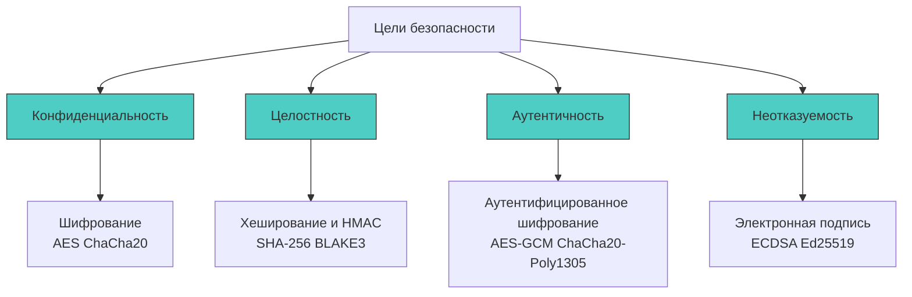

## Фундамент криптографии: гарантии, примитивы и влияние на железо

Криптография в промышленном бэкенде — это не абстрактная математика, а набор детерминированных алгоритмических гарантий: конфиденциальность, целостность, аутентичность и неотказуемость. Для разработчика на Go понимание криптографии означает знание не формул шифрования, а *свойств* алгоритмов, их поведения на уровне CPU, влияния на кэш-линии и взаимодействия с рантаймом при работе с чувствительными данными.

Пакет `crypto` в стандартной библиотеке Go спроектирован как набор интерфейсов и абстракций, где высокоуровневые примитивы делегируют выполнение оптимизированным ассемблерным реализациям под конкретную архитектуру (`amd64`, `arm64`). Это даёт производительность, близкую к нативным C-библиотекам, при сохранении безопасности памяти и предсказуемости аллокаций.



### Базовые криптографические примитивы и их свойства

Каждый примитив решает строго определённую задачу. Смешивание их назначений ведёт к архитектурным дефектам, которые невозможно исправить «поверх».

1 - **Симметричное шифрование**: Один ключ для шифрования и расшифровки. Высокая скорость, низкий оверхед. Подходит для шифрования данных в покое и защищённых каналов связи. В Go: `crypto/aes`, `golang.org/x/crypto/chacha20`.
2 - **Асимметричное шифрование**: Пара ключей (публичный/приватный). Шифрование публичным, расшифровка приватным. Низкая скорость, высокий оверхед. Используется для обмена сессионными ключами и подписи. В Go: `crypto/rsa`, `crypto/ecdsa`, `crypto/ed25519`.
3 - **Криптографические хеш-функции**: Детерминированное преобразование данных в фиксированный дайджест. Однонаправленность, устойчивость к коллизиям. Не предназначены для шифрования. В Go: `crypto/sha256`, `crypto/sha512`, `golang.org/x/crypto/blake2b`.
4 - **Коды аутентификации сообщений (MAC)**: Хеш с секретным ключом. Гарантирует, что данные не изменялись и созданы владельцем ключа. `HMAC-SHA256` остаётся стандартом для верификации токенов и вебхуков.

> [!info] Под капотом
> **Почему режимы шифрования критичны для безопасности?**
> Блочные шифры (например, AES) работают с фиксированными блоками (16 байт). Режимы работы определяют, как блоки связываются между собой.
> `ECB (Electronic Codebook)` шифрует каждый блок независимо. Одинаковые открытые блоки дают одинаковые шифротексты. Это ломает конфиденциальность визуально и математически. В рантайме Go этот режим **отсутствует** в `crypto/cipher` именно из-за фундаментальной небезопасности.
> `GCM (Galois/Counter Mode)` использует счётчик для генерации ключевого потока и добавляет аутентификационный тег. Это обеспечивает конфиденциальность + целостность в одном проходе. В Go `cipher.NewGCM` использует аппаратные инструкции `PCLMULQDQ` и `AESNI` для вычисления тега Галуа, что делает его в 5-10 раз быстрее программной реализации и защищает от padding oracle атак.

### Энтропия и генерация случайных данных

Любая криптосистема рушится, если ключи или инициализирующие векторы (IV/nonce) предсказуемы. В бэкенде это часто происходит из-за путаницы между `math/rand` и `crypto/rand`.

`math/rand` — псевдослучайный генератор с детерминированным состоянием. Оптимизирован для скорости, использует линейный конгруэнтный или PCG алгоритм. **Категорически непригоден** для криптографии.

`crypto/rand` — криптографически стойкий генератор (CSPRNG). В Linux он обращается к системному вызову `SYS_GETRANDOM` (или читает `/dev/urandom`), который собирает энтропию из прерываний устройств, таймеров, дискового IO и сетевых пакетов. Ядро смешивает их через хеш-функцию (обычно ChaCha20 или BLAKE2s) и выдаёт поток байт, статистически неотличимый от случайного.

```go
package crypto_ops

import (
	"crypto/rand"
	"fmt"
	"io"
)

// GenerateSecureBytes возвращает криптографически стойкие случайные байты
func GenerateSecureBytes(n int) ([]byte, error) {
	b := make([]byte, n)
	if _, err := io.ReadFull(rand.Reader, b); err != nil {
		// 🔒 В отличие от math/rand, crypto/rand может вернуть ошибку
		// если ядро ОС исчерпало пул энтропии (редко в современных ядрах 5.6+)
		return nil, fmt.Errorf("failed to generate secure random bytes: %w", err)
	}
	return b, nil
}

// GenerateNonce создаёт 12-байтовый nonce для AES-GCM
func GenerateNonce() ([12]byte, error) {
	var nonce [12]byte
	_, err := rand.Read(nonce[:])
	return nonce, err
}
```

> [!warning] Ловушка / Gotcha
> **Блокировка в `crypto/rand` при загрузке**
> На старых ядрах Linux (< 5.6) чтение `/dev/urandom` могло блокироваться до сбора начальной энтропии (`getrandom(2)` с флагом `0`). В рантайме Go при старте процесс может подвиснуть на 50-200 мс.
> **Решение:** В современных системах используйте `SYS_GETRANDOM` напрямую или убедитесь, что ядро обновлено. В контейнерах (Docker) без `--cap-add=SYS_ADMIN` пул энтропии инициализируется через `vDSO`, что исключает блокировки.

### Архитектура `crypto` в Go: от интерфейса к ассемблеру

Стандартная библиотека использует многоуровневую архитектуру для баланса между переносимостью и производительностью:

1 - **Интерфейсный слой** (`crypto/cipher`, `crypto/hmac`): Определяет контракты (`Block`, `Cipher`, `Hash`). Работает на чистом Go.
2 - **Референсная реализация**: Фоллбэк на чистом Go, если CPU не поддерживает специфичные инструкции.
3 - **Ассемблерные оптимизации** (`crypto/internal/...`): Файлы `.s` для `amd64`/`arm64`. Компилятор `gc` выбирает их автоматически во время сборки через `//go:build amd64`.

**Влияние на рантайм и железо:**
- **AES-NI / VAES**: Набор инструкций CPU, выполняющий раунды AES за 1 такт. Без них шифрование идёт через программные таблицы (S-box), что создаёт уязвимость к timing-атакам через кэш (cache-timing) и снижает производительность в 3-5 раз.
- **SHA Extensions**: Аппаратная реализация SHA-256. Ускоряет вычисление дайджестов и освобождает CPU для бизнес-логики.
- **Константное время**: `crypto/subtle` реализует операции без ветвлений, зависящих от данных. Компилятор `gc` с флагами оптимизации (`-l`, `-N`) может случайно инлайнить и ускорить код, нарушив постоянство времени. В продакшене это контролируется через `GOEXPERIMENT=strictfipsruntime` или явные ассемблерные вставки в стандартной библиотеке.

```go
package crypto_ops

import (
	"crypto/aes"
	"crypto/cipher"
	"fmt"
)

// EncryptAESGCM шифрует данные с аутентификацией.
// Возвращает шифротекст, содержащий nonce + ciphertext + auth tag.
func EncryptAESGCM(plaintext []byte, key []byte) ([]byte, error) {
	block, err := aes.NewCipher(key)
	if err != nil {
		return nil, fmt.Errorf("aes cipher init: %w", err)
	}

	// GCM требует 12-байтовый nonce. Используем криптографический рандом.
	nonce, err := GenerateNonce()
	if err != nil {
		return nil, fmt.Errorf("generate nonce: %w", err)
	}

	aesGCM, err := cipher.NewGCM(block)
	if err != nil {
		return nil, fmt.Errorf("gcm init: %w", err)
	}

	// Seal добавляет nonce в начало выходного слайса
	ciphertext := aesGCM.Seal(nonce[:], nonce[:], plaintext, nil)
	
	// 🔒 Затирание чувствительных данных в памяти после использования
	// Обратите внимание: key может быть использован повторно, поэтому не затираем его здесь,
	// но в реальной системе это делает вызывающий код через defer.
	return ciphertext, nil
}
```

### Управление памятью и сборщик мусора

Криптографические операции активно работают с буферами. В рантайме Go это создаёт специфичные паттерны аллокаций:

1 - **Escape Analysis**: Большие буферы (`> 32 КБ`) или передаваемые в `interface{}` (например, `cipher.Block`) убегают в кучу. Это увеличивает давление на `GC`.
2 - **Очистка памяти**: `GC` в Го не перезаписывает память перед освобождением. Чувствительные ключи и открытые тексты остаются в куче до следующей сборки. Для высокозащищённых систем требуется `runtime.KeepAlive()`, `clear()` или `mlock` через `syscall.Mlock`.
3 - **Синхронизация**: `cipher.NewGCM` и `aes.NewCipher` создают структуры, которые потокобезопасны для использования, но не для изменения. `sync.Pool` не применяется для шифров, так как они содержат внутреннее состояние (раундовые ключи), и их повторное использование сложнее, чем буферов.

> [!tip] Собеседование
> **Вопрос:** Почему `crypto/rand` медленнее `math/rand`, и когда можно использовать последний в бэкенде?
> **Ответ:** 
> 1 - `crypto/rand` обращается к ядру ОС (`getrandom`), собирает аппаратную энтропию и смешивает её. Это включает `syscall`, переключение контекста и криптографические примитивы смешивания. Скорость ~10-50 МБ/с.
> 2 - `math/rand` работает полностью в User Space, использует детерминированный алгоритм и занимает ~0.5-1 такт на число. Скорость >10 ГБ/с.
> 3 - В бэкенде `math/rand` допустим только для: генерации тестовых данных, равномерного распределения нагрузки (load balancing сессий), A/B тестирования, игровых механик без экономических последствий.
> 4 - **Запрещено**: генерация паролей, токенов, nonce, IV, ключей, session ID, любых значений, влияющих на безопасность.

### Итог

1 - Криптография в бэкенде строится на чётком разделении задач: шифрование для конфиденциальности, хеши для целостности, MAC/подписи для аутентификации.
2 - `crypto/rand` использует системную энтропию через `getrandom` syscall и обязан применяться для всех криптографических примитивов. `math/rand` — только для нефункциональных задач.
3 - Стандартная библиотека `crypto` в Go использует аппаратные инструкции (AES-NI, SHA extensions) через ассемблерные вставки, обеспечивая производительность при сохранении безопасности памяти.
4 - Режимы шифрования критичны: `AES-GCM` является стандартом благодаря аутентифицированному шифрованию и аппаратному ускорению. `ECB` архитектурно небезопасен и отсутствует в стандартной библиотеке.
5 - Управление чувствительными данными в куче требует явного затирания (`clear`), `runtime.KeepAlive` для защиты от оптимизаций компилятора и понимания модели работы `GC` при криптографических операциях.

[[2. Symmetric vs asymmetric шифрование]]