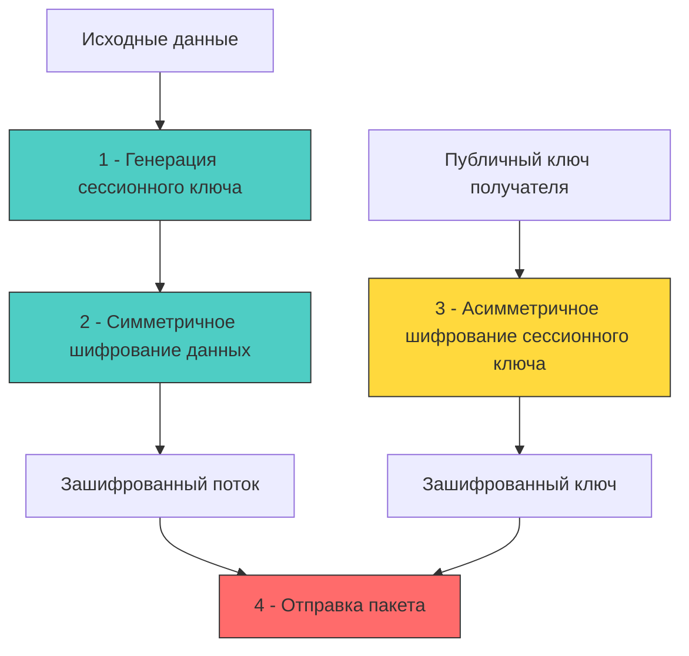

## Введение: Фундаментальный разрыв в производительности и доверии

Симметричное и асимметричное шифрование решают разные задачи в криптографической архитектуре. Смешивание их зон ответственности ведёт к критическим уязвимостям, падению производительности или невозможности масштабирования.

**Симметричное шифрование** использует один секретный ключ для операций шифрования и расшифровки. Его главное преимущество — скорость. Алгоритмы оптимизированы для поточной обработки данных и аппаратного ускорения.
**Асимметричное шифрование** использует пару математически связанных ключей: публичный (для шифрования/верификации) и приватный (для расшифровки/подписи). Решает проблему безопасной передачи ключей по незащищённому каналу, но ценой огромных вычислительных затрат.

В современных бэкенд-системах они не конкурируют, а дополняют друг друга в **гибридных криптосистемах**. Понимание того, как они работают на уровне CPU, аллокаций и сетевого стека, необходимо для проектирования защищённых и высоконагруженных сервисов.



## Симметричное шифрование: Прямые конвейеры и аппаратное ускорение

В бэкенде симметричные алгоритмы используются для шифрования данных в покое (диски, БД, логи) и в движении (зашифрованные payload, токены сессий). Стандартом де-факто является **AES** (Advanced Encryption Standard) в режимах **GCM** или **ChaCha20-Poly1305**.

*Архитектура алгоритма:* AES — блочный шифр с размером блока 16 байт. Данные разбиваются на блоки, каждый проходит через сеть подстановки и перестановки. Режим GCM добавляет режим счётчика (CTR) для шифрования и Galois Field умножение для аутентификации, что даёт `confidentiality + integrity` за один проход.

**Влияние на железо:**
1 - **AES-NI инструкции:** Современные x86_64 и ARMv8 процессоры включают набор инструкций, выполняющих раунды AES за 1-2 такта. Без них реализация идёт через программные таблицы подстановки (T-tables), что замедляет шифрование в 4-6 раз и создаёт уязвимость к cache-timing атакам (атакующий отслеживает доступ к кэш-линиям, чтобы восстановить ключ).
2 - **Кэш-локальность:** AES оперирует фиксированными блоками с предсказуемыми паттернами доступа к памяти. Это минимизирует cache miss, позволяет эффективно использовать конвейер процессора и SIMD-регистры (XMM, YMM).
3 - **Отсутствие ветвлений:** Современные реализации (особенно ChaCha20) используют арифметические операции без условий, что исключает branch misprediction и защищает от timing-атак на уровне CPU.

```go
package crypto_ops

import (
	"crypto/aes"
	"crypto/cipher"
	"crypto/rand"
	"errors"
	"fmt"
	"io"
)

// EncryptSymmetric шифрует данные с помощью AES-GCM.
// Возвращает: nonce + ciphertext + auth_tag (одним слайсом)
func EncryptSymmetric(plaintext, key []byte) ([]byte, error) {
	if len(key) != 32 {
		return nil, errors.New("aes-gcm requires 256-bit key")
	}

	block, err := aes.NewCipher(key)
	if err != nil {
		return nil, fmt.Errorf("cipher init: %w", err)
	}

	aesGCM, err := cipher.NewGCM(block)
	if err != nil {
		return nil, fmt.Errorf("gcm wrapper: %w", err)
	}

	nonce := make([]byte, aesGCM.NonceSize())
	if _, err := io.ReadFull(rand.Reader, nonce); err != nil {
		return nil, fmt.Errorf("nonce generation: %w", err)
	}

	// Seal автоматически добавляет nonce в начало результата
	// Это стандартная практика для компактной сериализации
	ciphertext := aesGCM.Seal(nonce, nonce, plaintext, nil)
	return ciphertext, nil
}

// DecryptSymmetric расшифровывает данные, проверяя аутентификационный тег
func DecryptSymmetric(ciphertext, key []byte) ([]byte, error) {
	block, err := aes.NewCipher(key)
	if err != nil {
		return nil, fmt.Errorf("cipher init: %w", err)
	}

	aesGCM, err := cipher.NewGCM(block)
	if err != nil {
		return nil, fmt.Errorf("gcm wrapper: %w", err)
	}

	nonceSize := aesGCM.NonceSize()
	if len(ciphertext) < nonceSize {
		return nil, errors.New("ciphertext too short")
	}

	nonce, ciphertextBody := ciphertext[:nonceSize], ciphertext[nonceSize:]
	
	// Open вернёт ошибку, если тег аутентификации не совпадает
	// Это защищает от подмены данных и replay-атак
	plaintext, err := aesGCM.Open(nil, nonce, ciphertextBody, nil)
	if err != nil {
		return nil, fmt.Errorf("authentication failed: %w", err)
	}

	return plaintext, nil
}
```

## Асимметричное шифрование: Тяжёлая математика и проблема распределения

Асимметричная криптография базируется на вычислительно сложных математических задачах: факторизации больших чисел (RSA) или дискретном логарифме на эллиптических кривых (ECC).

**RSA:** Операции включают возведение в степень по модулю огромных целых чисел (2048-4096 бит). В рантайме Go это реализуется через пакет `math/big`. Каждое умножение создаёт временные объекты `big.Int`, что генерирует давление на `GC`. Скорость шифрования ограничена сотнями килобайт в секунду на ядро.
**ECC (Elliptic Curve Cryptography):** Использует точку на эллиптической кривой. Для эквивалентной стойкости 256-битный ECC ключ заменяет 3072-битный RSA. Операции быстрее, требуют меньше памяти и полосы пропускания. В Go `crypto/elliptic` предоставляет оптимизированные ассемблерные реализации для P-256, P-384.

> [!info] Под капотом
> **Почему асимметричное шифрование такое медленное?**
> В отличие от линейных побитовых операций симметричных алгоритмов, RSA и ECC требуют операций с многобайтными числами. 
> 1 - **Аллокации:** `math/big` использует слайсы `uint32`/`uint64`. При каждом умножении создаётся новый буфер. В высоконагруженном сервисе это тысячи короткоживущих объектов в секунду.
> 2 - **Branch Divergence:** Алгоритмы модульного возведения в степень содержат ветвления, зависящие от битов экспоненты. Современные процессоры не могут их эффективно предсказывать, что приводит к сбросу конвейера.
> 3 - **Память:** Ключи и промежуточные результаты не помещаются в регистры общего назначения, постоянно выгружаясь в L2/L3 кэш или оперативную память.
> 4 - **Защита от side-channel:** Чтобы избежать timing-атак, реализация добавляет «шум» (RSA blinding) или использует константные алгоритмы (Montgomery ladder в ECC), что дополнительно замедляет выполнение.

```go
package crypto_ops

import (
	"crypto/rand"
	"crypto/rsa"
	"crypto/sha256"
	"fmt"
)

// EncryptAsymmetric шифрует небольшой блок данных публичным ключом RSA
// ⚠️ Максимальный размер данных ограничен длиной ключа минус хеш OAEP
func EncryptAsymmetric(plaintext []byte, pubKey *rsa.PublicKey) ([]byte, error) {
	// OAEP (Optimal Asymmetric Encryption Padding) защищает от атак на структуру
	// Используем SHA-256 для генерации маски и MGF1
	label := []byte("hybrid-encryption-example")
	ciphertext, err := rsa.EncryptOAEP(
		sha256.New(),
		rand.Reader,
		pubKey,
		plaintext,
		label,
	)
	if err != nil {
		return nil, fmt.Errorf("rsa encrypt: %w", err)
	}
	return ciphertext, nil
}

// DecryptAsymmetric расшифровывает данные приватным ключом с RSA blinding
func DecryptAsymmetric(ciphertext []byte, privKey *rsa.PrivateKey) ([]byte, error) {
	label := []byte("hybrid-encryption-example")
	// Под капотом выполняется RSA blinding для защиты от timing-атак
	plaintext, err := rsa.DecryptOAEP(
		sha256.New(),
		rand.Reader,
		privKey,
		ciphertext,
		label,
	)
	if err != nil {
		return nil, fmt.Errorf("rsa decrypt: %w", err)
	}
	return plaintext, nil
}
```

## Механическое сочувствие: Влияние на CPU, кэш и рантайм Go

Сравнение накладных расходов на уровне железа и ОС объясняет, почему индустрия перешла к гибридным схемам.

| Параметр | Симметричное (AES-GCM) | Асимметричное (RSA-2048) | Асимметричное (ECC P-256) |
|----------|------------------------|--------------------------|---------------------------|
| **Скорость** | 1-5 ГБ/с на ядро | 1-5 МБ/с | 10-50 МБ/с |
| **Размер ключа** | 32 байта | 256 байт | 32 байта |
| **Аллокации** | Минимальные (буферы фиксированы) | Высокие (`math/big` слайсы) | Средние (структуры кривых) |
| **Кэш-поведение** | Линейное, предсказуемое | Хаотичное, много промахов | Оптимизировано, константное время |
| **Syscall** | Отсутствует | Отсутствует (чистые вычисления) | Отсутствует |
| **GC Давление** | Низкое | Среднее/Высокое при частых вызовах | Низкое/Среднее |

В отличие от PHP (где криптография делегируется расширению `openssl` через FFI) или C# (где `System.Security.Cryptography` часто абстрагирует детали за `SafeHandle`), Go компилирует криптографические примитив статически в бинарник. Это даёт:
- Отсутствие зависимостей от системных библиотек (`libcrypto.so` версий)
- Полный контроль над жизненным циклом памяти
- Возможность использования `//go:build` для включения целевых ассемблерных оптимизаций под архитектуру сервера

Однако это требует от разработчика явного управления буферами. Забытый `clear()` после `rsa.DecryptOAEP` оставит расшифрованные данные и сессионные ключи в куче до следующей сборки мусора, что критично при дампах памяти или `pprof` снимках.

## Гибридные криптосистемы: Индустриальный стандарт

На практике разработчики никогда не выбирают «или-или». Протокол TLS, защищённые архивы, end-to-end мессенджеры и AWS KMS используют схему **конверта (envelope encryption)**:

1 - Клиент генерирует одноразовый симметричный ключ (Data Encryption Key, DEK) через `crypto/rand`.
2 - Данные шифруются быстро и безопасно с помощью AES-GCM или ChaCha20.
3 - DEK шифруется асимметричным алгоритмом (публичным ключом получателя или мастер-ключом KMS).
4 - Передаётся пакет: `[Зашифрованный DEK] + [Зашифрованные данные]`.

Это объединяет скорость симметричного шифрования и безопасное распределение ключей асимметричного.

```go
package hybrid

import (
	"crypto/rand"
	"crypto/rsa"
	"crypto/sha256"
	"fmt"
)

// EncryptEnvelope реализует гибридную схему шифрования
// Возвращает: зашифрованный DEK + зашифрованные данные
func EncryptEnvelope(plaintext []byte, pubKey *rsa.PublicKey) ([]byte, []byte, error) {
	// 1 - Генерация симметричного ключа (256 бит)
	dek := make([]byte, 32)
	if _, err := rand.Read(dek); err != nil {
		return nil, nil, fmt.Errorf("generate DEK: %w", err)
	}

	// 2 - Шифрование данных симметрично
	encryptedData, err := EncryptSymmetric(plaintext, dek)
	if err != nil {
		return nil, nil, fmt.Errorf("symmetric encrypt: %w", err)
	}

	// 3 - Шифрование DEK асимметрично
	label := []byte("envelope-key-exchange")
	encryptedDEK, err := rsa.EncryptOAEP(sha256.New(), rand.Reader, pubKey, dek, label)
	if err != nil {
		return nil, nil, fmt.Errorf("asymmetric encrypt DEK: %w", err)
	}

	// 🔒 Затирание симметричного ключа в памяти
	for i := range dek {
		dek[i] = 0
	}

	return encryptedDEK, encryptedData, nil
}
```

## Подводные камни и архитектурные ловушки

1 - **Лимит размера данных в асимметричном шифровании:** RSA-2048 с OAEP-SHA256 может зашифровать максимум `256 - 2*32 - 2 = 190 байт`. Попытка зашифровать файл или длинную строку вызовет `crypto/rsa: message too large for RSA public key`. Решение: всегда используйте гибридную схему.
2 - **Повторное использование nonce:** В AES-GCM повторный nonce с тем же ключом позволяет атакующему восстановить ключевый поток и расшифровать все сообщения. Гарантия уникальности должна быть криптографической (`crypto/rand` или монотонный счётчик с синхронизацией).
3 - **Атаки на паддинг (Padding Oracle):** Старые режимы (CBC + PKCS#7) уязвимы к атакам по времени ответа. Если сервер по-разному отвечает на «неверный паддинг» и «верный паддинг, но неверные данные», атакующий может подобрать содержимое за `O(N)` запросов. GCM и OAEP не подвержены этим атакам при правильной реализации.
4 - **Управление жизненным циклом ключей:** Жёсткое кодирование ключей в бинарнике или `env`-переменных нарушает принцип ротации. В продакшене используйте KMS (HashiCorp Vault, AWS KMS, Yandex Lockbox) или асимметричные пары с автоматической ротацией через `cert-manager`.
5 - **Различия в реализации языков:** При обмене зашифрованными данными между Go и C#/Java/Python важно согласовать кодировку (Base64 vs Hex), порядок байт (Big Endian стандарт для криптографии) и алгоритм хеширования для OAEP. Расхождения в `label` или `MGF1` приведут к молчаливой ошибке расшифровки.

> [!tip] Собеседование
> **Вопрос:** Почему в TLS 1.3 отказались от RSA Key Exchange в пользу ECDHE, и как это влияет на Perfect Forward Secrecy?
> **Ответ:** 
> 1 - Статический RSA Key Exchange не обеспечивает PFS. Если приватный ключ сервера будет скомпрометирован в будущем, атакующий сможет расшифровать все записанные ранее сеансы.
> 2 - ECDHE (Elliptic Curve Diffie-Hellman Ephemeral) генерирует временную пару ключей на каждую сессию. После обмена и вычисления общего секрета временные приватные ключи уничтожаются.
> 3 - В рантайме это означает, что каждый TLS handshake создаёт новые структуры эллиптической кривой, но `crypto/tls` в Go оптимизирует это через пулы и аппаратное ускорение ECC.
> 4 - Результат: даже при утечке долгосрочного сертификата, предыдущий трафик остаётся защищённым, так как сессионные секреты физически не сохранялись.

## Итог

1 - Симметричное шифрование обеспечивает высокую скорость и аппаратное ускорение, но требует безопасного канала для передачи ключа. Асимметричное решает проблему распределения ключей, но вычислительно затратно.
2 - В бэкенде на Go эти подходы комбинируются в гибридные схемы (envelope encryption), что является стандартом для TLS, KMS и защищённого хранения данных.
3 - Производительность криптографии напрямую зависит от поддержки инструкций CPU (AES-NI, PCLMULQDQ), паттернов доступа к кэшу и поведения сборщика мусора при работе с `math/big`.
4 - Асимметричные алгоритмы имеют жёсткие ограничения на размер входных данных. Попытка шифровать большие объёмы напрямую приведёт к ошибкам или падению производительности.
5 - Безопасность зависит от корректного управления памятью (затирание ключей), уникальности nonce в GCM и использования современных режимов (OAEP вместо PKCS#1 v1.5) для исключения padding oracle атак.

[[3. TLS и HTTPS под капотом]]