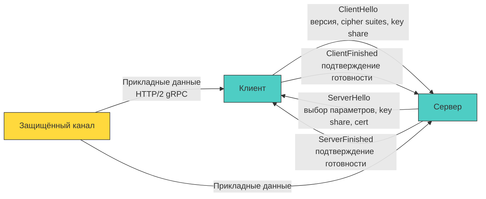

## Фундамент защищённых соединений: от рукопожатия до передачи байт

TLS (Transport Layer Security) — это не просто «замочек в браузере». Это сложный криптографический протокол, накладывающийся поверх транспортного уровня (TCP/UDP). В современном бэкенде на Go работа с TLS встроена глубоко в сетевой стек: от `crypto/tls` до интеграции с `net/http` и `netpoll` планировщиком. Понимание того, как происходит установление соединения, валидация сертификатов и согласование ключей, критично для настройки производительности, предотвращения атак и корректного управления жизненным циклом соединений.



### Эволюция рукопожатия: TLS 1.2 против 1.3

В TLS 1.2 рукопожатие требовало двух круговых задержек (2-RTT) до начала передачи данных. TLS 1.3 оптимизировал этот процесс до 1-RTT, объединив согласование параметров и обмен ключами. Убраны небезопасные алгоритмы (RSA key exchange, RC4, SHA-1, CBC). Ключевой механизм — **ECDHE** (Elliptic Curve Diffie-Hellman Ephemeral), обеспечивающий Perfect Forward Secrecy (PFS). Сессионный ключ вычисляется на лету и никогда не передаётся по сети.

### Интеграция с рантаймом Go: как `crypto/tls` обёртывает сокет

В Go TLS не реализован как отдельный демон или C-библиотека (в отличие от `libssl` в C++ или OpenSSL в Python). Это чистая Go-реализация поверх стандартных системных вызовов. `tls.Conn` — это декоратор вокруг `net.Conn`. При чтении/записи происходит:
- Захват данных из буфера сокета через `syscall.Read` или `netpoll` (epoll/kqueue).
- Парсинг TLS-записей (5 байт заголовка: тип, версия, длина).
- Расшифровка блоков в памяти процесса (аллокация буферов под AES/ChaCha20).
- Передача расшифрованных данных в `net/http` или ваше приложение.

```go
package tls_example

import (
	"crypto/tls"
	"log"
	"net"
)

// Идиоматичная настройка TLS-сервера в Go
func runTLSServer(certFile, keyFile string) {
	cert, err := tls.LoadX509KeyPair(certFile, keyFile)
	if err != nil {
		log.Fatalf("load cert: %v", err)
	}

	cfg := &tls.Config{
		Certificates: []tls.Certificate{cert},
		MinVersion:   tls.VersionTLS13, // Отключение устаревших версий
		NextProtos:   []string{"h2", "http/1.1"}, // ALPN для HTTP/2
	}

	ln, err := net.Listen("tcp", ":443")
	if err != nil {
		log.Fatalf("listen: %v", err)
	}

	// tls.Listener оборачивает TCP-соединения
	tlsLn := tls.NewListener(ln, cfg)
	defer tlsLn.Close()

	log.Println("TLS server listening on :443")
	for {
		conn, err := tlsLn.Accept()
		if err != nil {
			log.Printf("accept: %v", err)
			continue
		}
		// Каждая горутина обрабатывает одно соединение
		go handleConnection(conn)
	}
}

func handleConnection(conn net.Conn) {
	defer conn.Close()
	buf := make([]byte, 1024)
	for {
		n, err := conn.Read(buf)
		if err != nil {
			return
		}
		conn.Write(buf[:n])
	}
}
```

> [!info] Под капотом
> **Парсинг сертификатов и давление на GC**
> При каждом новом соединении сервер парсит цепочку сертификатов клиента (если включён `tls.VerifyClientCertIfGiven`). Парсинг ASN.1DER (`encoding/asn1`) создаёт множество промежуточных структур, `interface{}` и слайсов. При высоком RPS это генерирует тысячи короткоживущих объектов, вызывая `Minor GC` паузы.
> 
> **Оптимизация:** Кэшируйте результаты парсинга или используйте `GetCertificate` для динамической загрузки без повторного парсинга. В современных версиях `tls.X509KeyPair` уже оптимизирован, но частая ротация сертификатов «на лету» требует аккуратного управления ссылками, чтобы старые `tls.Certificate` не удерживались в куче живыми ссылками дольше необходимого.

### Механическое сочувствие: системные вызовы, кэш и CPU

TLS добавляет накладные расходы на каждом этапе сетевого взаимодействия:
- **Системные вызовы:** Каждое `conn.Read()`/`Write()` в `tls.Conn` может требовать нескольких `syscall.read`/`write` для чтения полного TLS-фрагмента (макс 16 КБ). `netpoll` мультиплексирует их через `epoll_wait` (Linux) или `kqueue` (macOS), но криптографическая обработка происходит в User Space, блокируя горутину до завершения расшифровки.
- **CPU и кэш-линии:** AES-GCM использует `PCLMULQDQ` и `AES-NI`. Однако вычисление MAC и проверка целостности происходят последовательно. При множестве одновременных соединений данные сертификатов и ключей постоянно вытесняются из L1/L2 кэша, увеличивая `memory stall`.
- **Синхронизация состояния:** `tls.Conn` не является потокобезопасным для параллельных чтений/записей. `net/http` решает это, выделяя по одной горутине на чтение и запись, используя внутренние примитивы синхронизации. Это предотвращает гонки, но добавляет контекстные переключения.

### Продвинутые механизмы: Resumption, SNI и 0-RTT

- **Session Resumption (Session Tickets):** Вместо полного рукопожатия сервер выдаёт клиенту зашифрованный «билет» состояния. При повторном подключении клиент присылает билет, сервер расшифровывает его и восстанавливает параметры сессии. В Go это настраивается через `TicketKey(s)` и `SessionTicketsDisabled`. Ключи билетов должны регулярно ротироваться (каждые 12-24 часа) для PFS.
- **SNI (Server Name Indication):** Позволяет хостить несколько доменов на одном IP. В Go обрабатывается через `tls.Config.GetCertificate`. Функция вызывается *до* завершения рукопожатия, поэтому она не должна содержать блокирующих операций (запрос к БД, долгие вычисления).
- **0-RTT (Early Data):** Клиент отправляет данные сразу после `ClientHello`, до `ServerFinished`. Ускоряет повторные соединения, но подвержен replay-атакам. В Go `tls.Conn.SetSessionTicketKeys()` управляет этим, но `net/http` по умолчанию отключает 0-RTT из-за рисков.

> [!warning] Ловушка / Gotcha
> **Блокировка в `GetCertificate` и таймауты рукопожатия**
> Если ваша функция `GetCertificate` выполняет сетевой запрос (например, к Vault или БД за сертификатом), вы блокируете горуину на этапе установления TCP+TLS. Клиент получит таймаут соединения, а в рантайме Go накопятся заблокированные горутины в состоянии `syscall` или `chan receive`.
> 
> **Решение:** Все тяжелые операции загрузки сертификатов выносите в фоновый процесс. `GetCertificate` должен работать только с уже загруженной в память структурой `tls.Certificate`, используя атомарное обновление указателя при ротации.

### Валидация цепочек и OCSP Stapling

По умолчанию `crypto/tls` проверяет цепочку сертификатов против системных корневых хранилищ (`crypto/x509.SystemCertPool()`). В минималистичных контейнерах (Alpine, distroless) корневые сертификаты могут отсутствовать, что вызывает `x509: failed to load system roots`.
**OCSP Stapling:** Сервер заранее запрашивает статус отзыва сертификата у CA и «прикрепляет» его к рукопожатию. Это снимает нагрузку с клиента и ускоряет проверку. В Go включается автоматически, если сертификаты валидны и сервер может достучаться до OCSP-респондера. Для высокой доступности кэшируйте ответы в `sync.Map` с TTL.

> [!tip] Собеседование
> **Вопрос:** Почему установка `tls.InsecureSkipVerify = true` в продакшене считается критической уязвимостью, и как правильно тестировать TLS без валидации?
> **Ответ:**
> 1 - Флаг полностью отключает проверку имени хоста и цепочки сертификатов. Любой самоподписанный или подставной сертификат (MITM-атака) будет принят.
> 2 - В производственном коде это эквивалентно открытым дверям для перехвата трафика.
> 3 - **Правильный подход:** Для интеграционных тестов создавайте собственный `x509.CertPool` с корневым сертификатом тестового CA. Передавайте его через `tls.Config.RootCAs`. Это сохраняет проверку целостности и аутентичности, но изолирует тестовое окружение от системных сертификатов.
> 4 - В рантайме `crypto/x509` проверяет расширение `Subject Alternative Name` (SAN), а не `Common Name`. Игнорирование SAN — частая ошибка при генерации самоподписанных сертификатов.

### Сравнение подходов: Go против C++/Python

- **C++:** Обычно зависит от `OpenSSL`, `BoringSSL` или `mbedTLS`. Требует управления жизненным циклом `SSL_CTX`, `SSL*`, ручного `free()`. Уязвимости в C-библиотеке затрагивают все приложения, пока их не пересоберут.
- **Python/Java:** Делегируют работу `ssl` модулю (обёртка над OpenSSL) или JSSE. Высокий уровень абстракции, но сложно кастомизировать низкоуровневые параметры без JNI/FFI.
- **Go:** Статическая линковка `crypto/tls`. Полный контроль над аллокациями, отсутствие зависимости от ОС. Минус: обновление криптографических стандартов требует обновления компилятора или `go.mod`, а не просто патча системной библиотеки. Однако это даёт предсказуемость и безопасность памяти.

## Итог

1. TLS в Go — это чистая реализация поверх `net.Conn`, интегрированная в планировщик и `netpoll`, что обеспечивает высокую производительность без зависимостей от внешних C-библиотек.
2. Рукопожатие TLS 1.3 оптимизировано до 1-RTT, использует ECDHE для PFS и требует аккуратного управления session tickets для балансировки скорости и безопасности.
3. Парсинг сертификатов и криптографические операции создают давление на `GC` и кэш-линии. Кэширование результатов, `GetConfigForClient` и атомарная ротация ключей обязательны для высоконагруженных сервисов.
4. Блокирующие операции в `GetCertificate` или `GetConfigForClient` ломают процесс установления соединения. Все тяжелые загрузки должны выполняться асинхронно.
5. Контейнерное окружение требует явного подключения `SystemCertPool` или кастомных пулов. `InsecureSkipVerify` допустим только в изолированных тестах с собственным `RootCAs`.

[[4. Работа с crypto пакетом Go]]