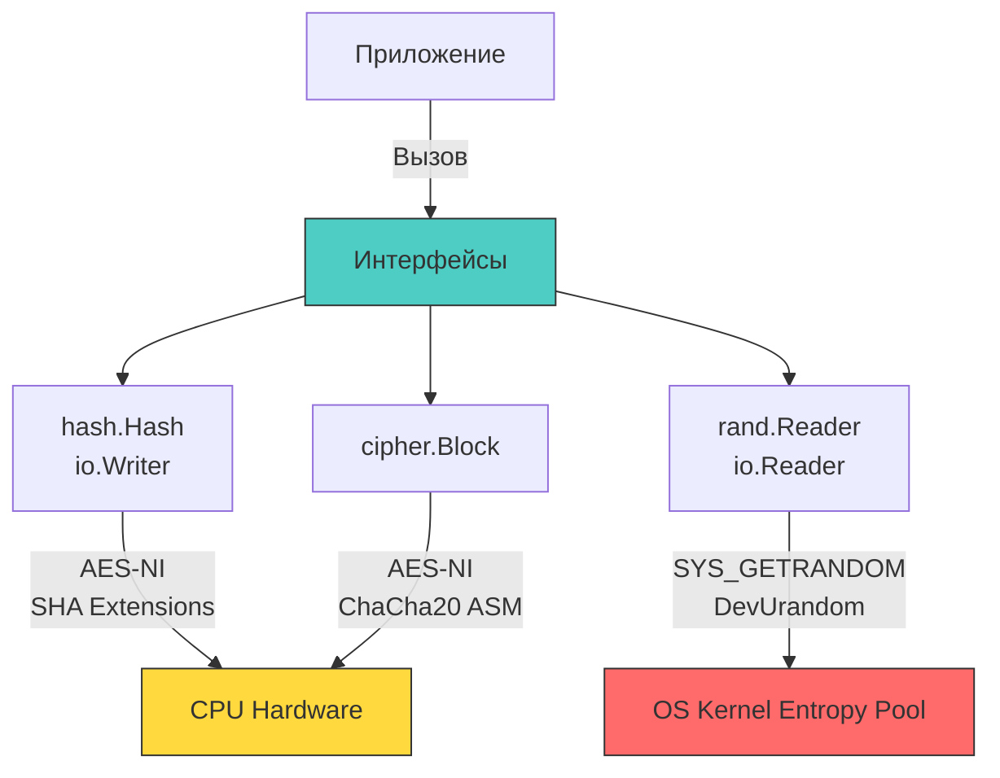

## Архитектура стандартной криптографии: Интерфейсы и безопасность памяти

Пакет `crypto` в Go — это не просто набор функций, а продуманная система интерфейсов, абстрагирующих конкретные алгоритмы от их использования. Это позволяет писать код, совместимый с разными примитивами (например, заменить `sha256` на `sha512` одной строкой), и гарантирует, что реализация алгоритмов следует строгим стандартам безопасности.

Для разработчика критично понимать разницу между стандартными интерфейсами и их реализацией, так как именно в стыках интерфейсов часто скрываются уязвимости и проблемы с производительностью.



## `crypto/rand`: Энтропия и системные вызовы

В отличие от `math/rand`, который работает полностью в User Space с детерминированным генератором (обычно PCG или_xorshift_), `crypto/rand.Reader` является интерфейсом к источнику энтропии ОС.

На уровне ОС и железа:
- **Linux**: Используется системный вызов `getrandom(2)` (начиная с ядра 3.17). Он блокирует вызов *только* если пул энтропии ещё не инициализирован после загрузки. На современных ядрах (5.6+) используется `GRND_INSECURE` или `GRND_RANDOM`, но стандартная библиотека Go обычно вызывает `getrandom` без флагов, что безопасно и неблокирующе в большинстве сценариев.
- **Windows**: Используется `BCryptGenRandom` из CNG API.
- **macOS/BSD**: Чтение из `/dev/urandom`.

> [!info] Под капотом
> **Почему `crypto/rand` может быть медленным?**
> Чтение из `crypto/rand` — это переход в ядро (syscall). Для каждого вызова `Read` происходит смена контекста Ring 3 -> Ring 0. Если вы читаете по 1 байту в цикле, производительность упадёт катастрофически.
> 
> **Решение:** Всегда запрашивайте буферы оптимального размера (например, 32, 64 или 128 байт за раз). Это амортизирует стоимость системного вызова.

## `hash.Hash`: Интерфейс `io.Writer` и управление состоянием

Пакет `crypto/sha256` (и другие) реализует интерфейс `hash.Hash`. Главная особенность этого интерфейса — он встраивает `io.Writer`. Это позволяет использовать хеширование в конвейерах `io` без лишних аллокаций.

```go
package hash_example

import (
	"crypto/sha256"
	"fmt"
	"hash"
	"io"
	"os"
)

// HashFileWithoutLoadingInMemory хеширует файл, не загружая его целиком в ОЗУ
func HashFileWithoutLoadingInMemory(path string) ([32]byte, error) {
	f, err := os.Open(path)
	if err != nil {
		return [32]byte{}, err
	}
	defer f.Close()

	h := sha256.New()
	
	// io.Copy использует буферизацию (обычно 32 КБ) и вызывает h.Write кусками
	// Это минимизирует аллокации и эффективно использует кэш CPU
	if _, err := io.Copy(h, f); err != nil {
		return [32]byte{}, err
	}

	// Sum возвращает хеш, добавляя его к переданному слайсу
	return *(*[32]byte)(h.Sum(nil)), nil
}
```

> [!warning] Ловушка / Gotcha
> **Состояние хеша и метод `Reset`**
> Объект `hash.Hash` — это структура в куче (из-за `Escape Analysis` при возврате из `New`), которая хранит внутреннее состояние (текущий блок данных).
> 
> Метод `Sum(b []byte)` **не очищает** состояние. Он просто возвращает текущий дайджест.
> Если вы хотите использовать один объект `h` для хеширования разных данных, вы *обязаны* вызвать `h.Reset()`.
> 
> ```go
> h := sha256.New()
> h.Write([]byte("data1"))
> fmt.Println(h.Sum(nil)) // Хеш data1
> 
> h.Write([]byte("data2"))
> // ⚠️ Здесь хеш будет от "data1 + data2", а не просто "data2"!
> // Нужно было вызвать h.Reset() перед Write("data2")
> ```
> 
> В высоконагруженных сервисах переиспользование `hash.Hash` через `sync.Pool` вместе с `Reset` снижает давление на `GC`, так как структура `sha256.digest` не пересоздаётся, а переинициализируется.

## `crypto/subtle`: Защита от Timing-атак на уровне CPU

Пакет `crypto/subtle` реализует операции с постоянным временем выполнения. Это критически важно для сравнения криптографических значений (паролей, MAC-тегов, подписей).

**Почему стандартное сравнение `==` опасно?**
Процессор сравнивает байты последовательно. При первом несовпадении он выбрасывает `false`.
- Сравнение `A` и `B` (отличаются в 1-м байте) занимает $t_1$.
- Сравнение `A` и `C` (отличаются в 100-м байте) занимает $t_{100} > t_1$.
Атакующий, измеряя время ответа сервера (даже через сеть с джиттером, используя статистический анализ тысяч запросов), может подобрать значение байт за байтом. Это превращает сложность перебора из $O(256^n)$ в $O(n \times 256)$.

```go
package subtle_example

import (
	"crypto/hmac"
	"crypto/sha256"
	"crypto/subtle"
)

// VerifyMAC безопасно проверяет подпись
func VerifyMAC(data, key, mac []byte) bool {
	m := hmac.New(sha256.New, key)
	m.Write(data)
	expectedMAC := m.Sum(nil)
	
	// 🔒 Сравнение за константное время.
	// Реализовано через XOR и аккумуляцию флагов.
	// Никаких ветвлений (branches), зависящих от данных.
	return subtle.ConstantTimeCompare(expectedMAC, mac) == 1
}
```

> [!info] Под капотом
> **Как работает `ConstantTimeCompare`?**
> Вместо проверки `if a[i] != b[i] { return false }`, функция выполняет:
> ```go
> var v byte
> for i := range a {
>     v |= a[i] ^ b[i]
> }
> return subtle.ConstantTimeByteEq(v, 0)
> ```
> Операция `XOR` возвращает 0 только если байты равны. Оператор `|=` (ИЛИ с присваиванием) накапливает любые ненулевые различия в переменную `v`. В итоге `v` будет 0 только если *все* байты совпали.
> Процессор исполняет этот цикл полностью, независимо от данных. Это исключает влияние предсказателя ветвлений (Branch Predictor) и кэширования на время выполнения.

## `cipher` и режимы шифрования: Интерфейсы и опасности

Пакет `crypto/cipher` предоставляет абстракции для блочных шифров. Ключевой интерфейс — `cipher.Block`.

Однако использование режима `CBC` (Cipher Block Chaining) считается устаревшим для новых систем из-за сложности корректной реализации (требует `Padding`, чувствителен к Padding Oracle атакам).

Современный стандарт — **AEAD (Authenticated Encryption with Associated Data)**. В Go это интерфейс `cipher.AEAD`. Самая популярная реализация — `AES-GCM`.

```go
package cipher_example

import (
	"crypto/aes"
	"crypto/cipher"
	"crypto/rand"
	"io"
)

// EncryptAESGCM демонстрирует идиоматичное использование AEAD
func EncryptAESGCM(plaintext, key []byte) ([]byte, error) {
	block, err := aes.NewCipher(key)
	if err != nil {
		return nil, err
	}

	// Создание AEAD обёртки. 
	// В рантайме Go это проверяет поддержку CPU инструкций (AES-NI).
	// Если поддержки нет, используется fallback на чистом Go.
	aesGCM, err := cipher.NewGCM(block)
	if err != nil {
		return nil, err
	}

	nonce := make([]byte, aesGCM.NonceSize())
	if _, err := io.ReadFull(rand.Reader, nonce); err != nil {
		return nil, err
	}

	// Seal шифрует данные и добавляет аутентификационный тег (обычно 16 байт)
	// Результат: nonce + ciphertext + tag
	// Обратите внимание: первый аргумент dst часто передаётся как nil,
	// тогда функция сама аллоцирует память. Для оптимизации можно передать буфер.
	ciphertext := aesGCM.Seal(nil, nonce, plaintext, nil)
	
	// Добавляем nonce в начало, чтобы его можно было извлечь при расшифровке
	return append(nonce, ciphertext...), nil
}
```

> [!warning] Ловушка / Gotcha
> **Повторное использование Nonce в GCM**
> Использование одного и того же `nonce` с одним `key` в AES-GCM позволяет атакующему восстановить ключевой поток и расшифровать *любые* сообщения, зашифрованные этим ключом. Это полная катастрофа для безопасности.
> 
> **Решение:**
> 1. Всегда генерируйте `nonce` через `crypto/rand`.
> 2. Никогда не инкрементируйте `nonce` вручную без гарантии атомарности и отсутствия дубликатов (что сложно в распределённых системах).
> 3. Если требуется детерминизм, рассмотрите `AES-SIV` (Synthetic IV), но он пока не встроен в стандартную библиотеку (требуется `golang.org/x/crypto`).

## Взаимодействие `crypto` и Garbage Collector

Криптографические операции часто работают с большими буферами и чувствительными данными.
1. **Escape Analysis**: Параметры `[]byte`, передаваемые в функции `crypto`, часто "убегают" в кучу.
2. **Очистка памяти**: `GC` в Го освобождает память, но не перезаписывает её нулями перед отдачей аллокатору. Это значит, что ключи и пароли могут оставаться в памяти (в "свободных" страницах) долгое время.
   - Для высокозащищённых систем (например, работа с приватными ключами) следует использовать `syscall.Mlock` для закрепления страниц в RAM (чтобы они не попали в swap) и явно обнулять слайсы функцией `clear()` (доступна с Go 1.21) перед тем, как ссылка на них будет утеряна.

> [!tip] Собеседование
> **Вопрос:** Почему метод `hash.Hash` возвращает `Sum(b []byte) []byte`, а не просто слайс?
> **Ответ:**
> Исторически и архитектурно это сделано для возможности объединения хешей (например, `H(H(data))` или добавления суффикса) без лишних аллокаций.
> Функция `Sum` *добавляет* хеш в конец слайса `b`.
> Если передать `nil`, она аллоцирует новый слайс нужного размера.
> Это позволяет эффективно строить цепочки вычислений, переиспользуя один буфер, если разработчик понимает, что результат — это `append(b, hash...)`.

## Итог

1.  `crypto` пакет в Го использует интерфейсы (`io.Reader`, `io.Writer`), что делает код гибким, но требует понимания состояния объектов (особенно `hash.Hash`).
2.  `crypto/rand` использует системные вызовы (`getrandom`), которые могут быть дорогими при частых мелких чтениях.
3.  Сравнение криптографических значений должно происходить только через `crypto/subtle.ConstantTimeCompare` для защиты от timing-атак на уровне CPU.
4.  Для шифрования следует использовать AEAD режимы (например, AES-GCM), избегая CBC, и строго следить за уникальностью Nonce.
5.  Память с ключами не очищается `GC` автоматически. В критичных сценариях требуется явное обнуление (`clear`) и блокировка страниц в памяти.

В следующей статье мы разберём, как создавать и проверять цифровые подписи и коды аутентичности сообщений, что является фундаментом для безопасности API и токенов.

[[5. Подписи и HMAC]]