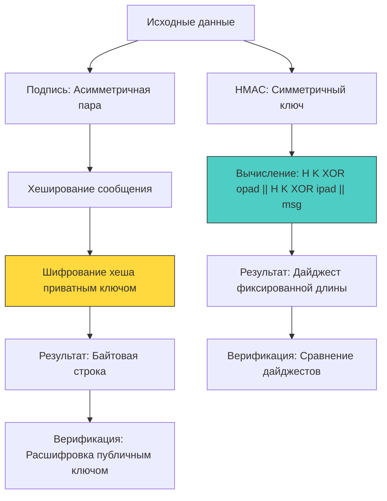

## Фундамент аутентификации данных: HMAC и цифровые подписи

В защищённых распределённых системах недостаточно просто зашифровать данные. Необходимо гарантировать, что они не были изменены при передаче и действительно созданы ожидаемым отправителем. Для этого используются два фундаментальных криптографических примитива: **HMAC** (Hash-based Message Authentication Code) и **цифровые подписи** (Digital Signatures). Их выбор определяет архитектуру обмена ключами, производительность верификации и возможность доказательства авторства (неотказуемость).



## HMAC: Симметричная целостность и конструкция

HMAC использует симметричный ключ и криптографическую хеш-функцию (обычно SHA-256) для создания кода аутентификации. Конструкция стандартизирована в RFC 2104 и выглядит так:
`HMAC(K, m) = H((K ⊕ opad) || H((K ⊕ ipad) || m))`

Почему не просто `H(K || m)` или `H(m || K)`?
1 - **Атаки расширения длины (Length Extension):** Хеш-функции семейства Merkle-Damgård (SHA-1, SHA-256) уязвимы к добавлению данных к вычисленному хешу без знания ключа. Двойное хеширование с разными масками (`opad`, `ipad`) полностью нейтрализует эту векторную атаку.
2 - **Коллизии:** Если базовый хеш теоретически допускает коллизию, конструкция HMAC сохраняет безопасность, пока внутренний хеш устойчив к атакам типа "birthday paradox" для конкретного размера ключа.

В рантайме Go `crypto/hmac` реализован на чистом Go с оптимизированными вызовами внутренних хешей. Это обеспечивает высокую скорость и отсутствие зависимостей от C-библиотек.

```go
package auth

import (
	"crypto/hmac"
	"crypto/sha256"
	"crypto/subtle"
	"encoding/hex"
	"errors"
	"fmt"
)

// ComputeHMAC генерирует код аутентификации
func ComputeHMAC(data, key []byte) ([]byte, error) {
	if len(key) == 0 {
		return nil, errors.New("hmac key must not be empty")
	}

	mac := hmac.New(sha256.New, key)
	if _, err := mac.Write(data); err != nil {
		return nil, fmt.Errorf("hmac write: %w", err)
	}
	return mac.Sum(nil), nil
}

// VerifyHMAC безопасно проверяет подпись
func VerifyHMAC(data, key, macHex []byte) error {
	expected, err := ComputeHMAC(data, key)
	if err != nil {
		return fmt.Errorf("compute hmac: %w", err)
	}

	got, err := hex.DecodeString(string(macHex))
	if err != nil || len(got) != len(expected) {
		return errors.New("invalid mac format")
	}

	// 🔒 Constant-time comparison. Любой ранний возврат в зависимости от данных
	// открывает вектор для timing-атак.
	if subtle.ConstantTimeCompare(expected, got) != 1 {
		return errors.New("invalid hmac signature")
	}

	return nil
}
```

> [!info] Под капотом
> **Почему `hmac.New` возвращает интерфейс `hash.Hash`?**
> Интерфейс `hash.Hash` встраивает `io.Writer`, что позволяет streamed-запись данных без буферизации всего сообщения в памяти. Внутренне `hmac` поддерживает два состояния ключа (`ipad` и `opad`), которые предварительно вычисляются при создании экземпляра. Это снижает накладные расходы на каждый вызов `Write` до простого XOR и копирования блоков. На уровне CPU это означает линейный доступ к памяти, предсказуемое заполнение кэш-линий L1 и отсутствие ветвлений, зависящих от данных.

## Цифровые подписи: Асимметрия и неотказуемость

Цифровая подпись решает проблему распределения ключей в недоверённой среде. Отправитель подписывает данные своим **приватным ключом**, а любой получатель может проверить подпись, имея только **публичный ключ**.

В современной индустрии доминируют три алгоритма:
1 - **RSA-PSS**: Математически стойкий, но медленный. Требует больших ключей (2048-4096 бит). В Go использует `math/big`, что создаёт значительное давление на `GC`.
2 - **ECDSA (NIST P-256/P-384)**: Быстрее RSA при сопоставимой стойкости. Использует эллиптические кривые. В Go реализован через `crypto/ecdsa`, но исторически содержал переменное время выполнения для операций с `big.Int`. Современные версии используют `crypto/internal/nistec` с ассемблерными оптимизациями.
3 - **Ed25519 (EdDSA)**: Современный стандарт. Детерминированный, константное время, 32-байтовый ключ, высокая скорость. В Го `crypto/ed25519` полностью переписан с использованием ассемблерных вставок для `amd64`/`arm64`, исключающих сайд-каналы.

```go
package signatures

import (
	"crypto/ed25519"
	"crypto/rand"
	"errors"
	"fmt"
)

// GenerateEd25519KeyPair создаёт пару ключей
func GenerateEd25519KeyPair() (ed25519.PrivateKey, ed25519.PublicKey, error) {
	pub, priv, err := ed25519.GenerateKey(rand.Reader)
	if err != nil {
		return nil, nil, fmt.Errorf("generate key: %w", err)
	}
	return priv, pub, nil
}

// SignData подписывает данные приватным ключом Ed25519
func SignData(priv ed25519.PrivateKey, data []byte) ([]byte, error) {
	// 🔒 Под капотом: вычисляется хеш (SHA-512), затем применяется
	// скалярное умножение на кривой. Все операции в константном времени.
	signature := ed25519.Sign(priv, data)
	return signature, nil
}

// VerifySignature проверяет подпись публичным ключом
func VerifySignature(pub ed25519.PublicKey, data, signature []byte) error {
	if len(pub) != ed25519.PublicKeySize || len(signature) != ed25519.SignatureSize {
		return errors.New("invalid key or signature length")
	}
	
	if !ed25519.Verify(pub, data, signature) {
		return errors.New("invalid ed25519 signature")
	}
	return nil
}
```

## Механическое сочувствие: Влияние на CPU, кэш и GC

Выбор алгоритма подписи напрямую влияет на профиль производительности сервиса под нагрузкой.

| Параметр | HMAC-SHA256 | Ed25519 | ECDSA P-256 | RSA-2048 |
|----------|-------------|---------|-------------|----------|
| **Операции на ядро** | ~500-800 МБ/с | ~150-200 К оп/с | ~50-80 К оп/с | ~5-10 К оп/с |
| **Аллокации** | Минимальные (буфер хеша) | Низкие (стек/куча, фикс) | Средние (`big.Int` точки) | Высокие (`big.Int` модули) |
| **Кэш-поведение** | Линейное, предсказуемое | Оптимизировано (scalar mul) | Переменное (зависит от impl) | Хаотичное (модульная арифметика) |
| **GC Давление** | Практически нулевое | Низкое | Среднее | Высокое при частом вызове |
| **Размер вывода** | 32 байта | 64 байта | 64-72 байта | 256 байт |

В рантайме Go `crypto/ed25519` избегает аллокаций в куче за счёт фиксированных массивов `[32]byte` и `[64]byte`. Операции с кривой выполняются в регистрах и стеке, что минимизирует промахи кэша. В отличие от `crypto/ecdsa`, где каждая операция с точкой `(x, y)` требует выделения `big.Int`, что провоцирует `Minor GC` при 10k+ RPS.

> [!warning] Ловушка / Gotcha
> **Domain Separation в HMAC**
> Использование одного ключа для разных контекстов (например, `webhook_signature` и `session_token`) ведёт к катастрофическим последствиям. Атакующий может взять подпись из одного контекста и использовать её в другом.
> 
> **Решение:** Всегда добавляйте префикс контекста к данным перед вычислением HMAC, либо используйте разные ключи, выведенные через KDF (например, `HKDF-SHA256` из `crypto/hkdf`):
> ```go
> ctxKey := hkdf.Expand(sha256.New, masterKey, []byte("webhook-v1"))
> ```

> [!tip] Собеседование
> **Вопрос:** Почему Ed25519 предпочтительнее ECDSA для новых систем, и как Go решает проблему malleability?
> **Ответ:** 
> 1 - **Детерминизм:** ECDSA требует генерации криптографически стойкого `nonce` (k) для каждой подписи. Повторное использование `k` с разными сообщениями раскрывает приватный ключ. Ed25519 вычисляет `k` детерминированно из хеша сообщения и приватного ключа, исключая эту уязвимость полностью.
> 2 - **Malleability:** ECDSA-подпись можно математически преобразовать в другую валидную подпись без изменения сообщения. Это ломает блокчейны и некоторые схемы аутентификации. Ed25519 не подвержен этому.
> 3 - **Реализация в Go:** `crypto/ed25519` использует скрученную эдвардсову кривую, где формулы сложения точек унифицированы (нет исключительных случаев для точек на бесконечности). Это упрощает ассемблерную реализацию и гарантирует константное время выполнения.

## Интеграция в API и вебхуки

В продакшене HMAC чаще всего используется для верификации вебхуков (Stripe, GitHub, Slack). Паттерн стандартизирован:
1 - Сервер получает заголовок `X-Signature` и тело запроса.
2 - Извлекает временную метку `t=...` и подпись `s=...`.
3 - Вычисляет `HMAC(secret, t.signed_payload)`.
4 - Сравнивает с `s` через `ConstantTimeCompare`.
5 - Проверяет разницу `t` и текущего времени (защита от replay-атак).

```go
func VerifyWebhook(reqBody []byte, sigHeader string, secret []byte) error {
	// Парсинг формата: "t=1234567890,v1=abcdef..."
	var timestamp int64
	var signature []byte
	
	// ... парсинг заголовка ...
	
	if time.Now().Unix()-timestamp > 300 { // 5 минут допустимого дрейфа
		return errors.New("webhook expired")
	}
	
	payload := fmt.Sprintf("%d.%s", timestamp, string(reqBody))
	return VerifyHMAC([]byte(payload), secret, signature)
}
```

## Итог

1 - HMAC обеспечивает быструю симметричную аутентификацию и целостность. Идеален для внутренних сервисов и вебхуков. Требует строгого разделения доменов (domain separation) для ключей.
2 - Цифровые подписи решают проблему распределения ключей в недоверённой среде и обеспечивают неотказуемость. `Ed25519` является современным стандартом благодаря детерминизму, константному времени и компактности.
3 - В рантайме Go `crypto/ed25519` оптимизирован на уровне ассемблера, минимизируя аллокации и влияние на `GC`. `ECDSA` и `RSA` создают значительное давление на сборщик мусора из-за `math/big`.
4 - Верификация HMAC обязана использовать `crypto/subtle.ConstantTimeCompare`. Любые ранние возвраты в зависимости от данных открывают вектор для timing-атак.
5 - Выбор примитива диктуется архитектурой доверия: общие секреты → HMAC, публичная верификация → Ed25519/ECDSA. Микс подходов без чётких границ ведёт к уязвимостям и падению производительности.

[[6. Генерация случайных данных]]