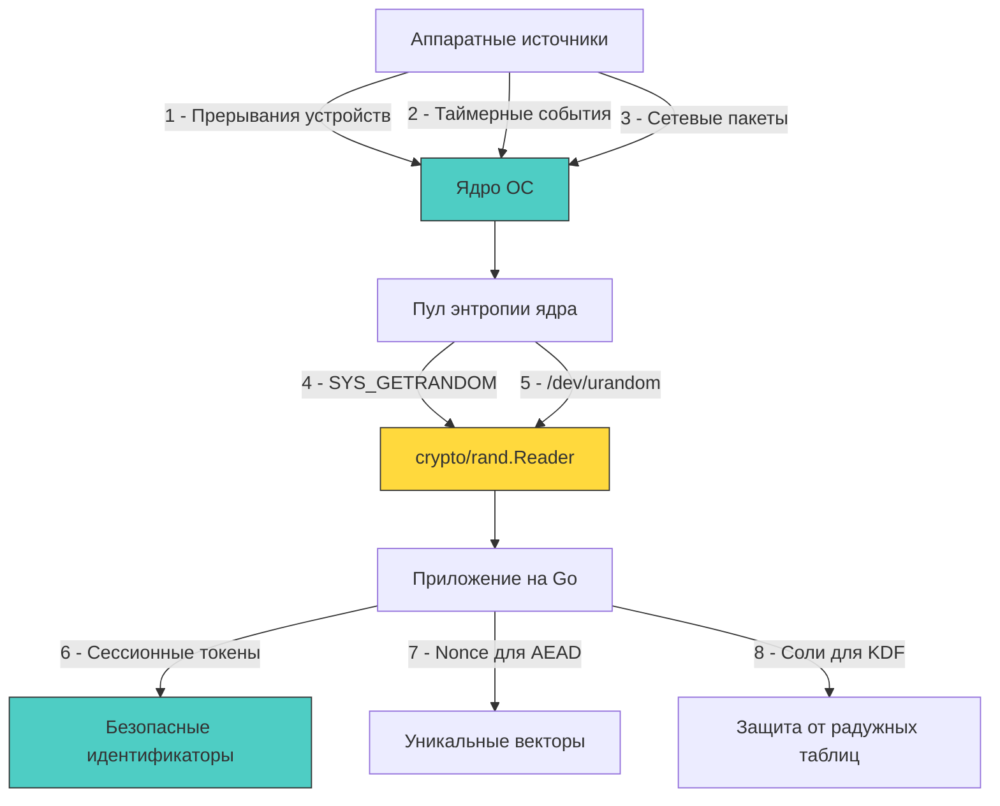

## Фундамент энтропии: от аппаратных источников к пользовательскому пространству

Криптографически стойкие случайные данные (CSPRNG - Cryptographically Secure Pseudorandom Number Generator) являются краеугольным камнем любой защищённой системы. Предсказуемость сессионных идентификаторов, nonce, соли для паролей или ключей шифрования равносильна открытым дверям. В бэкенде на Го генерация таких данных выглядит как один вызов функции, но под капотом скрывается сложный путь от прерываний железа через системные вызовы ядра до оптимизированного рантайма.



## Операционная система: пул энтропии и системные вызовы

В современных ОС энтропия собирается из недетерминированных аппаратных событий: таймингов дискового ввода-вывода, прерываний сетевых карт, вариаций таймеров и движения мыши. Ядро смешивает эти данные криптографическими хеш-функциями (в последних версиях Linux используется ChaCha20/BLAKE2s) и поддерживает непрерывный пул энтропии.

Исторически существовало два интерфейса:
- `/dev/random`: Блокирующий. Останавливал процесс, если оценка доступной энтропии падала ниже порога. Вызывал массовые таймауты при загрузке серверов и в виртуальных машинах.
- `/dev/urandom`: Неблокирующий. Использовал CSPRNG, расшифровывающий выход из пула. До ядра 5.6 мог выдавать недостаточно случайные данные на ранних этапах загрузки.

**Современный стандарт:** Системный вызов `getrandom(2)` (Linux 3.17+). Он работает напрямую в ядре, не создаёт файловых дескрипторов, автоматически блокируется *только* до первой инициализации пула после загрузки, а затем работает неблокирующе. Это устраняет оверхед на `open`/`read`/`close` для `/dev/urandom` и защищает от ранних фаз нехватки энтропии.

## Реализация в Go: `crypto/rand` под капотом

Пакет `crypto/rand` в стандартной библиотеке предоставляет интерфейс `io.Reader` через переменную `rand.Reader`. Его реализация платформозависима и оптимизирована для безопасности и скорости:

1 - **Linux/Android**: Приоритетно вызывает `SYS_GETRANDOM` напрямую через `runtime.asm` или `libc`. Если вызов недоступен (старое ядро), фоллбэчит на `/dev/urandom`.
2 - **macOS/iOS**: Использует `CCRandomGenerateBytes` из Security.framework или `/dev/urandom`.
3 - **Windows**: Вызывает `BCryptGenRandom` из CNG API, который напрямую работает с ядром и аппаратными генераторами (RDRAND), если доступны.
4 - **WASM/JS**: Делегирует генерацию в `crypto.getRandomValues` браузера.

В рантайме Go это абстрагировано за `io.Reader`, что позволяет использовать `io.ReadFull` для гарантированного заполнения буфера без обработки коротких чтений.

```go
package securegen

import (
	"crypto/rand"
	"encoding/hex"
	"fmt"
	"io"
)

// GenerateSecureToken создаёт криптографически стойкий токен заданной длины в байтах
func GenerateSecureToken(lengthBytes int) (string, error) {
	if lengthBytes <= 0 {
		return "", fmt.Errorf("token length must be positive")
	}

	buf := make([]byte, lengthBytes)
	// io.ReadFull гарантирует чтение ровно len(buf) байт или возврат ошибки.
	// Простое rand.Read может вернуть меньше запрошенного при прерывании сигналами.
	if _, err := io.ReadFull(rand.Reader, buf); err != nil {
		return "", fmt.Errorf("failed to generate secure token: %w", err)
	}

	return hex.EncodeToString(buf), nil
}

// GenerateSecureNonce создаёт 12-байтовый nonce для AES-GCM или ChaCha20-Poly1305
func GenerateSecureNonce() ([12]byte, error) {
	var nonce [12]byte
	if _, err := io.ReadFull(rand.Reader, nonce[:]); err != nil {
		return [12]byte{}, fmt.Errorf("nonce generation failed: %w", err)
	}
	return nonce, nil
}
```

> [!info] Под капотом
> **Почему `rand.Reader` использует `io.ReadFull` внутри?**
> На уровне ОС системный вызов `getrandom` может вернуть меньше запрошенных байт, если запрошен большой буфер, а пул энтропии временно ограничен (хотя в современных ядрах это редкость). `io.ReadFull` в стандартной библиотеке реализует цикл повторных вызовов, пока буфер не будет заполнен полностью или не возникнет фатальная ошибка. Это гарантирует детерминизм поведения в высоконагруженных сервисах, где частичные чтения могут привести к неинициализированной памяти в структуре данных.

## Механическое сочувствие: стоимость, аллокации и оптимизация

Каждый вызов `crypto/rand` требует перехода в ядро (`Ring 3 -> Ring 0`). Это включает:
- Сохранение регистров, переключение стека.
- Выполнение кода в контексте ядра, обращение к буферу энтропии.
- Копирование данных обратно в User Space.
- Возврат управления.

На современных ядрах один вызов `getrandom` стоит ~500-1500 наносекунд. Если вы генерируете случайные данные по 1 байту в цикле, накладные расходы составят >95% общего времени.

**Оптимизации:**
1 - **Буферизация:** Запрашивайте данные большими блоками (32, 64, 128 байт). Это амортизирует стоимость системного вызова.
2 - **Переиспользование буферов:** Для генерации множества токенов используйте `sync.Pool` для `[]byte`, но **обязательно** перезаписывайте их полностью через `io.ReadFull`. Не используйте оставшиеся байты из старых буферов.
3 - **Избегайте `math/rand` для безопасности:** `math/rand` работает полностью в User Space, использует детерминированный алгоритм (PCG/Xorshift) и предсказуемое начальное состояние (сид). Зная несколько выходных значений, можно восстановить внутреннее состояние и предсказать все будущие. В криптографии это смертельно.

```go
package securegen

import (
	"crypto/rand"
	"encoding/base64"
	"io"
	"sync"
)

// SecureIDGenerator генерирует безопасные идентификаторы с переиспользованием буферов
type SecureIDGenerator struct {
	pool sync.Pool
}

func NewSecureIDGenerator() *SecureIDGenerator {
	return &SecureIDGenerator{
		pool: sync.Pool{
			New: func() any {
				return make([]byte, 32)
			},
		},
	}
}

func (g *SecureIDGenerator) NextID() (string, error) {
	buf := g.pool.Get().([]byte)
	defer g.pool.Put(buf) // Возврат в пул. ⚠️ Буфер будет перезаписан при следующем вызове.

	if _, err := io.ReadFull(rand.Reader, buf); err != nil {
		return "", err
	}

	// Base64URL без паддинга оптимален для HTTP заголовков и URL
	return base64.RawURLEncoding.EncodeToString(buf), nil
}
```

> [!warning] Ловушка / Gotcha
> **Смещение по модулю (Modulo Bias) и `math/rand.Intn`**
> Частая ошибка: `rand.Intn(n) % limit` или прямой выбор из слайса через `rand.Intn(len(slice))`. Если `n` не кратно размеру диапазона, некоторые значения выпадают чаще других.
> В `math/rand` это решается алгоритмом отбраковки (rejection sampling), но он не является криптографически стойким.
> **Решение для криптографии:** Никогда не используйте `math/rand` для выбора элементов, требующих равномерного распределения. Если необходимо выбрать случайное число в диапазоне `[0, max)`, используйте `crypto/rand` с алгоритмом отбраковки или берите достаточно большой буфер байт (например, 32 байта = 256 бит) и интерпретируйте его как большое число, применяя модуль только если он значительно меньше `2^256`, что делает смещение статистически ничтожным. Для выбора из слайса используйте криптографический рандом для индекса и проверяйте границы.

## `math/rand` в 2024+: изменения и допустимые сценарии

Начиная с Go 1.20, глобальный генератор `math/rand` автоматически инициализируется случайным сидом из `crypto/rand`. Это решило проблему предсказуемости при запуске, но **не сделало его криптографически стойким**. В Go 1.22 появился `math/rand/v2` с улучшенным алгоритмом (PCG) и API.

**Где `math/rand` допустим:**
- Генерация идентификаторов для трассировки, не требующих безопасности.
- A/B тестирование, равномерное распределение нагрузки.
- Симуляции, игры, нефункциональные ID.
- Рандомизация задержек для exponential backoff (с учётом допустимой предсказуемости).

**Где `math/rand` запрещён:**
- Сессионные ID, токены доступа, nonce, соли, ключи шифрования.
- Любые данные, утечка или предсказуемость которых ведёт к компрометации системы.

> [!tip] Собеседование
> **Вопрос:** Почему в Docker-контейнерах или виртуальных машинах часто возникают проблемы с генерацией случайных данных при старте, и как это влияет на рантайм Go?
> **Ответ:**
> 1 - В изолированных средах отсутствуют аппаратные прерывания клавиатуры, мыши, диска. Пул энтропии заполняется медленно.
> 2 - На старых ядрах (<5.6) вызов `getrandom` или чтение `/dev/random` блокируется до набора достаточной энтропии. Рантайм Го висит на `syscall` во время `init()` или первого запроса `crypto/rand`.
> 3 - В современных системах ядро использует `vDSO` и аппаратные генераторы (RDRAND), что решает проблему. Но если виртуальная машина их не пробрасывает, задержка сохраняется.
> 4 - **Решение:** На уровне хоста настроить `haveged` или `rng-tools` для сбора энтропии. В контейнере использовать `--device=/dev/urandom` или современные базовые образы. В коде Го это обходится автоматическим фоллбэком `crypto/rand` на `/dev/urandom`, который на современных ядрах не блокируется после первой инициализации.

## Итог

1 - Криптографическая случайность обеспечивается ядром ОС через `getrandom` или `/dev/urandom`, собирая энтропию из аппаратных прерываний. `crypto/rand` в Го является безопасной обёрткой над этими механизмами.
2 - Системные вызовы генерации энтропии дороги при мелких запросах. Буферизация, использование `io.ReadFull` и переиспользование слайсов через `sync.Pool` критичны для высоконагруженных сервисов.
3 - `math/rand` и `math/rand/v2` детерминированы и не подходят для безопасности, несмотря на автоматическую инициализацию сида в Go 1.20+. Их применение допустимо только для нефункциональных задач.
4 - Смещение по модулю и предсказуемость выхода — частые архитектурные ошибки. Для криптографии требуются алгоритмы отбраковки или буферы достаточной энтропии.
5 - Контейнерные и виртуальные среды исторически страдали от нехватки энтропии, что приводило к блокировкам на старте. Современные ядра и аппаратные генераторы решают проблему, но мониторинг задержек генерации обязателен.

[[1. SQL injection]]