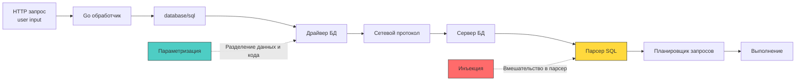

## SQL injection: нарушение границы между кодом и данными

SQL-инъекция остаётся одной из самых разрушительных уязвимостей в истории информационной безопасности. На высоком уровне проблема выглядит тривиально: смешивание исполняемого кода (структуры запроса) с пользовательскими данными без чёткого разделения. Однако для разработчика уровня Senior/Go важно понимать, как именно рантайм `database/sql`, драйверы и планировщик базы данных реагируют на инъекцию, и почему параметризация — это не просто «хорошая практика», а контракт на уровне сетевого протокола.



### 1 - Как работает инъекция на уровне протокола

Большинство современных драйверов БД (например, `pgx` для PostgreSQL или `go-sql-driver/mysql`) используют расширенный протокол запросов. Вместо одной команды `SELECT ...` отправляется цепочка:

`Parse` -> `Bind` -> `Execute`

1 - `Parse`: Сервер БД получает текст запроса с плейсхолдерами (`$1`, `?`), строит план выполнения, компилирует его в подготовленный запрос и кэширует.
2 - `Bind`: Клиент отправляет только значения параметров в бинарном виде. Сервер привязывает их к плейсхолдерам, не анализируя синтаксис.
3 - `Execute`: Сервер выполняет уже готовый план с привязанными данными.

Инъекция возможна только когда разработчик нарушает этот контракт, конкатенируя строки *до* отправки драйверу. В этом случае `Parse` получает изменённую структуру запроса, парсер воспринимает пользовательские данные как исполняемый SQL, а планировщик строит совершенно другой, часто катастрофичный план.

### 2 - Идиоматичная защита в Go

В Go защита строится на строгом использовании параметризованных запросов и понимании ограничений `database/sql`.

```go
package dbsec

import (
	"context"
	"database/sql"
	"fmt"
)

// GetUserSecure корректно использует параметризованный запрос
func GetUserSecure(ctx context.Context, db *sql.DB, email string) (*User, error) {
	// 🔒 $1 передаётся отдельно от структуры запроса. 
	// Драйвер кодирует значение в бинарный протокол БД.
	// Парсер сервера никогда не увидит содержимое email как код.
	query := `SELECT id, name, created_at FROM users WHERE email = $1 LIMIT 1`
	
	var u User
	err := db.QueryRowContext(ctx, query, email).Scan(&u.ID, &u.Name, &u.CreatedAt)
	if err != nil {
		if err == sql.ErrNoRows {
			return nil, fmt.Errorf("user not found")
		}
		return nil, fmt.Errorf("query failed: %w", err)
	}
	return &u, nil
}
```

#### Динамические идентификаторы: реальная опасность

Параметризация защищает **значения**, но не **структуру запроса**. Имена таблиц, колонок, ключевые слова `ORDER BY`, `LIMIT` не могут быть параметрами. Попытка вставить их через `$1` приведёт к синтаксической ошибке на стороне БД.

```go
// ❌ НЕВЕРНО: драйвер передаст сортировку как строковое значение, 
// а не как ключевое слово. БД вернёт ошибку или проигнорирует.
db.QueryContext(ctx, "SELECT * FROM users ORDER BY $1", userInput)

// ✅ ВЕРНО: явный allowlist + экранирование идентификатора
func SortByColumn(col string) (string, error) {
	allowed := map[string]bool{"name": true, "created_at": true, "id": true}
	if !allowed[col] {
		return "", fmt.Errorf("invalid sort column")
	}
	// pq.QuoteIdentifier или аналоги для разных драйверов экранируют 
	// двойные кавычки и защищают от инъекции через спецсимволы.
	return fmt.Sprintf(`"users" ORDER BY "%s"`, col), nil
}
```

> [!info] Под капотом
> **Почему `database/sql` не экранирует автоматически?**
> Драйверы БД работают с бинарными протоколами, где типы данных строго определены. При вызове `db.Query(query, args...)` Go передаёт аргументы через интерфейс `driver.Value`. Драйвер преобразует `string` в соответствующий тип протокола (например, `VARCHAR` или `TEXT` с указанием длины). Это исключает интерпретацию кавычек или спецсимволов как части синтаксиса. Автоматическое экранирование в стиле `mysql_real_escape_string` из PHP не требуется и вредит безопасности, так как создаёт иллюзию защиты при динамической конкатенации.

### 3 - Влияние на рантайм и системные ресурсы

Успешная или частичная инъекция наносит урон не только данным, но и производительности самого Go-сервиса.

- **Истощение пула соединений (`sql.ConnPool`)**: Инъекция вида `pg_sleep(10)` или сложного `CROSS JOIN` блокирует соединение на длительное время. `database/sql` ожидает ответа, горутина зависает в `syscall read` или `chan receive`. При превышении `db.SetMaxOpenConns()` новые запросы встают в очередь. На уровне ОС это приводит к росту открытых файловых дескрипторов, а на уровне рантайма — к накоплению горутин в состоянии `blocked`.
- **Давление на GC**: `SELECT *` с инъекцией `UNION ALL` возвращает миллионы строк. `rows.Next()` аллоцирует память под каждую строку и сканирует её в структуры. Кратковременный всплеск аллокаций провоцирует частые `Minor GC` циклы, вытесняя кэш-линии L1/L2 и повышая `P99` латентность всего сервиса.
- **Планировщик запросов БД**: Подставленный предикат сбивает статистику оптимизатора. Вместо `Index Scan` используется `Sequential Scan` или `Nested Loop`. CPU БД загружается на 100%, что через сетевой стек бьёт обратно по таймаутам `context.DeadlineExceeded` в Go-обработчиках.

> [!warning] Ловушка / Gotcha
> **Second-order SQL injection**
> Разработчик считает запрос безопасным, потому что использует параметризацию. Но данные сначала записываются в БД без валидации, а позже подставляются в другой запрос уже как «надёжные».
> ```go
> // 1. Сохранение (безопасно, но данные токсичны)
> db.Exec(ctx, "INSERT INTO comments (text) VALUES ($1)", userInput)
> 
> // 2. Использование (инъекция срабатывает здесь!)
> db.QueryRow(ctx, fmt.Sprintf("SELECT id FROM posts WHERE title LIKE '%%%s%%'", commentText))
> ```
> **Решение:** Никогда не доверяйте данным из БД как «санитизированным». Применяйте параметризацию или строгую валидацию на каждом этапе использования, независимо от происхождения данных.

> [!tip] Собеседование
> **Вопрос:** Как защититься от SQL-инъекции в запросах с динамическими таблицами или `IN (...)` списками, и почему `sql.In` из `database/sql` (если бы он существовал) проблематичен?
> **Ответ:**
> 1 - Для `IN (?)` драйверы не поддерживают один плейсхолдер для массива значений. Требуется генерация `$1, $2, $3` и передача слайса аргументов. Это нужно делать через библиотеки вроде `pgx` (поддерживает `pgtype.Array`) или генераторы кода (`sqlc`, `squirrel`), которые валидируют длину и типы на этапе компиляции.
> 2 - Динамические имена таблиц экранируются только через `QuoteIdentifier` и строгий allowlist. Параметризировать их нельзя по определению протокола.
> 3 - В отличие от PHP, где `PDO::prepare` иногда эмулирует подготовку, в Go драйверы (особенно `pgx` и `mysql`) используют нативные расширенные протоколы. Это гарантирует, что разделение кода и данных происходит на сетевом уровне, а не в пользовательском процессе.

### Итог

1 - `database/sql` и современные драйверы защищают от инъекций через параметризацию, но только при условии отсутствия строковой конкатенации запросов.
2 - Параметризация работает на уровне сетевого протокола БД (`Parse` -> `Bind` -> `Execute`), полностью изолируя данные от синтаксического анализа.
3 - Динамические идентификаторы (`ORDER BY`, имена таблиц, `LIMIT`) не могут быть параметрами и требуют строгого `allowlist` и экранирования (`pq.QuoteIdentifier`).
4 - Инъекции истощают пул соединений `database/sql`, провоцируют `GC` спайки из-за неконтролируемых выборок и ломают планировщик запросов на стороне БД.
5 - `Second-order injection` возникает при повторном использовании «надёжных» данных из БД без параметризации. Безопасность должна применяться на каждом этапе жизненного цикла данных.

[[2. XSS и CSRF]]