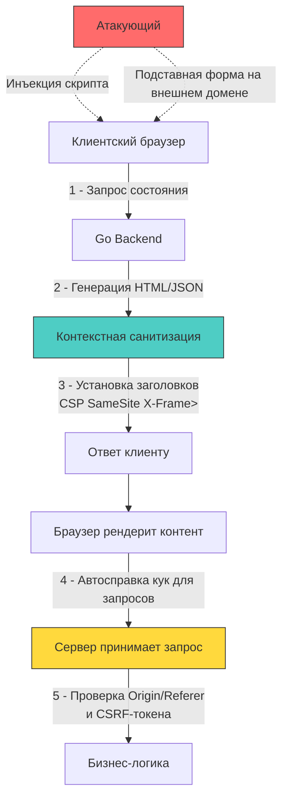

## Введение: Почему бэкенд отвечает за то, что происходит в браузере

XSS (Cross-Site Scripting) и CSRF (Cross-Site Request Forgery) традиционно классифицируются как клиентские уязвимости, но их корень и основные векторы защиты лежат на стороне сервера. Браузер — это среда исполнения с расширенными привилегиями для активного контента. Если бэкенд отдаёт неотфильтрованные данные или не устанавливает строгие контекстные границы доверия, атакующий получает возможность выполнить произвольный код или инициировать действия от имени аутентифицированного пользователя.

Для разработчика на Go это означает, что `net/http`, стандартные шаблоныизаторы и middleware должны проектироваться с учётом контекста исполнения, аллокаций памяти при санитизации и строгих контрактов сетевых заголовков.



## 1. XSS: Инъекция кода и контекстная санитизация

Суть XSS — внедрение исполняемого скрипта в доверенный контекст страницы. В зависимости от точки попадания различают:
- **Отражённый (Reflected):** Полезная нагрузка приходит в запросе и сразу возвращается в ответе.
- **Хранимый (Stored):** Полезная нагрузка сохраняется в БД и рендерится для всех пользователей.
- **DOM-базированный:** Вредоносный код внедряется клиентским JavaScript без перезагрузки страницы. Бэкенд влияет косвенно, через отдачу сырых данных в API.

В экосистеме Go стандартом является пакет `html/template`. В отличие от `text/template`, он строит абстрактное синтаксическое дерево (АСТ) шаблона на этапе компиляции и применяет контекстно-зависимое экранирование на этапе рендеринга.

```go
package views

import (
	"html/template"
	"net/http"
)

var profileTmpl = template.Must(template.New("profile").Parse(`
<!DOCTYPE html>
<html>
<head>
    <meta http-equiv="Content-Security-Policy" content="default-src 'self'; script-src 'none';">
</head>
<body>
    <h1>Привет, {{.Username}}</h1>
    <script>
        // Контекст JavaScript экранируется автоматически
        var userBio = "{{.Bio}}";
        console.log("User loaded:", userBio);
    </script>
    <a href="/profile?id={{.ProfileID}}">Открыть профиль</a>
</body>
</html>
`))

func ProfileHandler(w http.ResponseWriter, r *http.Request) {
	data := struct {
		Username  template.HTMLAttr
		Bio       string
		ProfileID string
	}{
		Username: template.HTMLAttr("admin"), // ⚠️ Использовать осторожно, только для доверенных частей разметки
		Bio:      "<script>alert('XSS')</script>", // Безопасно экранируется в JS-контексте как &lt;script&gt;...
		ProfileID: "123&callback=malicious",      // Экранируется как 123%26callback%3Dmalicious
	}

	w.Header().Set("Content-Type", "text/html; charset=utf-8")
	w.Header().Set("X-Content-Type-Options", "nosniff")
	w.Header().Set("X-XSS-Protection", "0") // Современные браузеры отключают этот флаг, лучше полагаться на CSP
	
	if err := profileTmpl.Execute(w, data); err != nil {
		http.Error(w, "template render error", http.StatusInternalServerError)
		return
	}
}
```

> [!info] Под капотом
> **Как `html/template` работает с памятью и кэшем**
> При первом вызове `template.New().Parse()` шаблон компилируется в оптимизированное представление. Каждый `Execute` запускает обход АСТ и запись в `io.Writer` (обычно `http.ResponseWriter`).
> Экранирование происходит посимвольно. Для строк используется `strings.Builder`, который минимизирует аллокации за счёт переаллокации буфера с коэффициентом роста ~2. Однако при обработке больших текстов (статьи, комментарии) это создаёт давление на `GC`. В высоконагруженных сервисах рекомендуется кэшировать отрендеренные фрагменты или использовать `sync.Pool` для `strings.Builder`, если вы реализуете кастомный рендеринг.

### Почему ручное экранирование через `regexp` или `strings.Replace` опасно

Регулярные выражения не учитывают контекст. Скрипт может быть внедрён через:
- `onerror` атрибуты: ``
- JavaScript-строки: `var x = "</script><script>alert(1)</script>";`
- CSS: `background: url(javascript:alert(1))`
- Unicode-нормализацию или двойное кодирование

`html/template` решает это на уровне парсера, распознавая контекст (тег, атрибут, JS, CSS, URL) и применяя специфичные правила кодирования. Попытки написать кастомный санитайзер в 99% случаев приводят к уязвимостям из-за неполного покрытия стандартов HTML5 и кодировок.

## 2. CSRF: Атаки через доверие браузера

Браузер автоматически прикрепляет `Cookie` к запросам на тот же домен, независимо от источника запроса. Если атакующий размещает на своём сайте скрытую форму `<form action="https://bank.com/transfer" method="POST">` и заставляет пользователя её отправить (через клик, iframe или автоматическую загрузку), браузер подставит валидные сессионные куки. Сервер воспримет запрос как легитимный.

Современная защита строится на трёх уровнях:

### Уровень 1: `SameSite` атрибут кук
`SameSite=Strict` блокирует отправку кук при любых кросс-доменных переходах. `SameSite=Lax` разрешает только безопасные `GET` с навигацией верхнего уровня. Для POST/PUT/DELETE через AJAX или формы куки не отправляются.

В Го это настраивается на уровне `http.Cookie`:
```go
cookie := &http.Cookie{
    Name:     "session_id",
    Value:    token,
    Path:     "/",
    HttpOnly: true,
    Secure:   true,
    SameSite: http.SameSiteStrictMode, // 🔒 Ключевая защита от CSRF
}
http.SetCookie(w, cookie)
```

> [!warning] Ловушка / Gotcha
> **`SameSite=None` требует `Secure`**
> Если вам нужно отправлять куки кросс-доменно (например, CDN или микросервисная архитектура с разными доменами), вы обязаны установить `SameSite: http.SameSiteNoneMode` **и** `Secure: true`. Без `Secure` современные браузеры (Chrome 80+, Firefox, Safari) игнорируют `None` и применяют `Lax`, ломая аутентификацию.

### Уровень 2: Проверка заголовков `Origin` и `Referer`
Перед обработкой состояния запроса проверяйте источник. Это быстрый путь, не требующий генерации токенов.

```go
func isOriginAllowed(r *http.Request, allowedDomains []string) bool {
	origin := r.Header.Get("Origin")
	if origin == "" {
		// Fallback на Referer, если Origin отсутствует (старые клиенты)
		referer := r.Header.Get("Referer")
		if referer == "" {
			return false
		}
		origin = referer
	}

	// Парсим и проверяем домен. Избегаем строковых костылей вроде strings.Contains
	u, err := url.Parse(origin)
	if err != nil || u.Scheme != "https" {
		return false
	}
	for _, domain := range allowedDomains {
		if u.Host == domain || strings.HasSuffix(u.Host, "."+domain) {
			return true
		}
	}
	return false
}
```

### Уровень 3: CSRF-токены (Double Submit или Synchronized Token)
Когда `SameSite` недостаточен (legacy-клиенты, специфичные интеграции), используйте токены. Паттерн Double Submit Cookie популярен для SPA с REST API:
1 - Сервер генерирует токен, кладёт в куку с `HttpOnly=false` (чтобы JS мог его прочитать) и `Secure/SameSite`.
2 - Клиент отправляет токен в заголовке `X-CSRF-Token`.
3 - Сервер сравнивает значение из куки и заголовка. Так как кросс-доменный запрос не может прочитать куки другого домена (Same-Origin Policy), атакующий не сможет подставить валидный заголовок.

```go
func VerifyCSRFToken(r *http.Request) error {
	tokenHeader := r.Header.Get("X-CSRF-Token")
	if tokenHeader == "" {
		return errors.New("missing CSRF token")
	}

	cookie, err := r.Cookie("csrf_token")
	if err != nil {
		return fmt.Errorf("missing CSRF cookie: %w", err)
	}

	// 🔒 Сравнение в константном времени для защиты от timing-атак
	if subtle.ConstantTimeCompare([]byte(tokenHeader), []byte(cookie.Value)) != 1 {
		return errors.New("CSRF token mismatch")
	}
	return nil
}
```

## 3. Механика производительности: парсинг заголовков и аллокации

Проверка `Origin`, `Referer` и генерация токенов происходят в критическом пути каждого запроса. Накладные расходы влияют на рантайм следующим образом:

- **Парсинг URL:** `url.Parse` выделяет память под структуру `url.URL`, мапу параметров и строки. При 50к RPS это генерирует ~100-150 МБ мусора в секунду, провоцируя `Minor GC`. Оптимизация: используйте быстрые парсеры вроде `github.com/valyala/fasthttp` для высоконагруженных шлюзов или кэшируйте результат `url.Parse` для статических доменов.
- **Сравнение строк:** `strings.EqualFold` и `subtle.ConstantTimeCompare` работают линейно, но `ConstantTimeCompare` выполняет полную итерацию независимо от результата. Это защита от атак, но ценой ~20-30% замедления на коротких строках. Для CSRF-токенов (32-64 байта) это пренебрежимо мало.
- **Аллокации токенов:** Генерация через `crypto/rand` создаёт системный вызов. Пул буферов (`sync.Pool`) и переиспользование структур снижают давление на кучу и `GC`.

> [!tip] Собеседование
> **Вопрос:** Почему защита от CSRF в Go-сервисах, отдающих только JSON (REST API), всё ещё необходима, даже если фронтенд использует `Bearer` токены в `localStorage`?
> **Ответ:**
> 1 - Если фронтенд хранит токен в `localStorage`, он уязвим к XSS. При успешной XSS атакующий получает токен и может делать запросы напрямую, минуя браузерные ограничения на куки. CSRF тут не нужен, нужен контроль XSS.
> 2 - Однако если сервис поддерживает `HttpOnly` куки для Refresh токенов или использует смешанный режим, CSRF снова становится актуальным.
> 3 - **Лучшая практика:** Для JSON API используйте `SameSite=Strict` + проверку `Content-Type: application/json` + валидацию `Origin`. Кросс-доменные `POST` с `Content-Type: application/json` не могут быть отправлены простой формой без `preflight` (CORS), а браузер блокирует простые формы с нестандартными заголовками. Это создаёт естественный барьер, но не заменяет явную проверку источника.

## Архитектурные заголовки и `net/http`

Помимо логики, бэкенд обязан выставлять заголовки безопасности на уровне `ResponseWriter`. В Го это делается централизованно через мидлварь:

```go
func SecurityHeadersMiddleware(next http.Handler) http.Handler {
	return http.HandlerFunc(func(w http.ResponseWriter, r *http.Request) {
		h := w.Header()
		// 🔒 CSP: запрет исполнения скриптов с внешних доменов и inline-скриптов
		h.Set("Content-Security-Policy", "default-src 'self'; script-src 'self' https://cdn.example.com; object-src 'none'")
		// 🔒 Запрет MIME-сниффинга: браузер не будет менять Content-Type
		h.Set("X-Content-Type-Options", "nosniff")
		// 🔒 Запрет встраивания в iframe (защита от Clickjacking)
		h.Set("X-Frame-Options", "DENY")
		// 🔒 HSTS: принудительное использование HTTPS
		h.Set("Strict-Transport-Security", "max-age=31536000; includeSubDomains; preload")
		
		next.ServeHTTP(w, r)
	})
}
```

Эти заголовки не создают значительных аллокаций, так как `w.Header()` возвращает мапу, которая инициализируется лениво. Установка строковых значений происходит быстро, но их порядок и кэширование влияют на размер сетевого пакета и время `syscall write`.

## Итог

1 - Защита от XSS на бэкенде строится на контекстно-зависимом экранировании (`html/template`), а не на ручных заменах или регуляных выражениях.
2 - `SameSite` атрибут кук и строгая проверка `Origin`/`Referer` являются базовым барьером против CSRF. Токены используются как дополнительный слой для легаси или специфичных сценариев.
3 - Парсинг заголовков, генерация токенов и экранирование строк создают аллокации в куче. Пул буферов, кэширование результатов `url.Parse` и использование `sync.Pool` снижают давление на `GC` в высоконагруженных сервисах.
4 - `net/http` middleware позволяет централизованно применять политики безопасности (CSP, HSTS, X-Frame-Options), минимизируя дублирование кода и риски человеческой ошибки.
5 - Защита от XSS и CSRF — это многоуровневая стратегия: санитизация на входе/выходе, строгие атрибуты кук, валидация источников запросов и корректная настройка заголовков безопасности.

[[3. SSRF]]