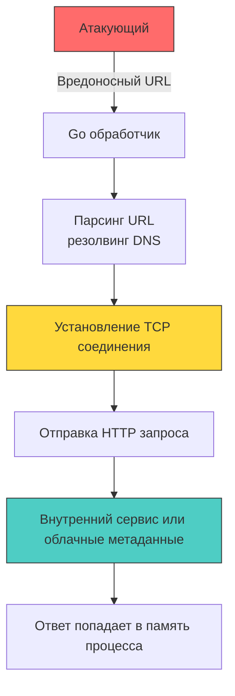

## Введение: Когда сервер становится прокси атакующего

SSRF (Server-Side Request Forgery) позволяет злоумышленнику заставить ваш сервер выполнить исходящий сетевой запрос к ресурсам, доступным только из внутренней сети. В современных микросервисных архитектурах на Go, где сервисы общаются через Kubernetes DNS, service mesh и облачные метаданные, SSRF превращается из теоретической уязвимости в критический вектор атаки на инфраструктуру.



Для разработчика на Go SSRF опасен не только доступом к внутренним API. Успешная эксплуатация позволяет:
- Прочитать метаданные облачных провайдеров (`169.254.169.254` в AWS, `100.100.100.200` в Yandex Cloud).
- Сканировать внутренние порты и сервисы.
- Вызвать отказ в обслуживании через бесконечные редиректы или долгие таймауты.
- Получить доступ к локальным unix-сокетам или `localhost` эндпоинтам.

## Механика SSRF в рантайме Go: от резолвинга до syscall

В Go сетевые запросы обслуживаются пакетом `net/http` и низкоуровневым `net`. Понимание того, как они взаимодействуют с ОС, помогает проектировать устойчивую защиту.

### 1. Архитектура `http.Client` по умолчанию

Стандартный `http.DefaultClient` и `http.Get` **не имеют таймаутов** и автоматически следуют за редиректами до 10 раз. Это историческое решение для удобства, но в продакшене оно создаёт уязвимость для DoS и SSRF.

```go
// ❌ Опасно: стандартный клиент без ограничений
func FetchURLBad(w http.ResponseWriter, r *http.Request) {
	target := r.URL.Query().Get("url")
	resp, err := http.Get(target) // 🔴 Нет таймаута, авто-редиректы, нет валидации
	if err != nil {
		http.Error(w, "failed", http.StatusInternalServerError)
		return
	}
	defer resp.Body.Close()
	// ... обработка
}
```

### 2. Под капотом: сетевой стек, планировщик и аллокации

Когда вы вызываете `http.Client.Get(url)`, рантайм проходит через несколько этапов:
1. **Парсинг и резолвинг DNS**: `net.DefaultResolver.LookupIPAddr` вызывает `getaddrinfo` (через `cgo`) или использует pure-Go резолвер, читающий `/etc/resolv.conf`. Каждая операция создаёт аллокации в куче (`[]byte` для буферов, структуры `IP`, `Addr`).
2. **Установление соединения**: `net.Dialer.DialContext` выполняет `syscall connect`. В Linux вызов блокирующий, но `netpoll` (через `epoll`) асинхронно отслеживает его завершение. Горутина переходит в состояние `syscall` или `netpoll`, не занимая `P`.
3. **TLS Handshake**: Если `https://`, происходит полное рукопожатие в User Space (`crypto/tls`). Выделяются буферы под сертификаты, ключи, состояния шифра.
4. **Чтение ответа**: `http.ReadResponse` буферизует заголовки и тело. Без `io.LimitReader` большой ответ аллоцирует мегабайты в куче, провоцируя `Minor GC` и вытесняя кэш-линии.

> [!info] Под капотом
> **Влияние на планировщик и файловые дескрипторы**
> Если атакующий укажет адрес, который не отвечает (например, чёрная дыра `10.255.0.1:9999`), `connect` будет ждать таймаута ядра (обычно 60-120 секунд). Горутина заблокирована, но файловый дескриптор сокета открыт. При 1000 одновременных таких запросов сервис упрётся в `ulimit -n`, начнёт возвращать `EMFILE`, а `http.Server` перестанет принимать новые соединения. Это не CPU-буря, а истощение ресурсов ОС.

## Идиоматичная защита: транспорт, редиректы и валидация

Защита от SSRF в Go должна быть многоуровневой: валидация до резолвинга, проверка после резолвинга, ограничение редиректов и строгие таймауты.

```go
package ssrf

import (
	"context"
	"fmt"
	"net"
	"net/http"
	"strings"
	"time"
)

// NewSecureHTTPClient создаёт клиент, защищённый от SSRF
func NewSecureHTTPClient() *http.Client {
	dialer := &net.Dialer{
		Timeout:   5 * time.Second,
		KeepAlive: 30 * time.Second,
		// DUALSTACK разрешает пробовать IPv6 и IPv4 параллельно
	}

	transport := &http.Transport{
		DialContext: func(ctx context.Context, network, addr string) (net.Conn, error) {
			// 1. Извлекаем хост и порт
			host, _, err := net.SplitHostPort(addr)
			if err != nil {
				return nil, fmt.Errorf("split host port: %w", err)
			}

			// 2. Резолвим адрес принудительно перед соединением
			ips, err := net.DefaultResolver.LookupIPAddr(ctx, host)
			if err != nil {
				return nil, fmt.Errorf("dns lookup: %w", err)
			}

			// 3. Проверяем все разрешённые адреса на попадание в запрещённые диапазоны
			for _, ip := range ips {
				if isBlockedIP(ip.IP) {
					return nil, fmt.Errorf("blocked IP range: %s", ip.IP.String())
				}
			}

			// 4. Устанавливаем соединение только после проверки
			return dialer.DialContext(ctx, network, addr)
		},
		TLSHandshakeTimeout:   5 * time.Second,
		ResponseHeaderTimeout: 5 * time.Second,
		ExpectContinueTimeout: 1 * time.Second,
		MaxIdleConns:          100,
		IdleConnTimeout:       90 * time.Second,
	}

	return &http.Client{
		Transport: transport,
		Timeout:   10 * time.Second, // Жёсткий общий таймаут
		CheckRedirect: func(req *http.Request, via []*http.Request) error {
			if len(via) >= 5 {
				return fmt.Errorf("stopped after 5 redirects")
			}
			// 🔒 Повторная проверка URL перед каждым редиректом
			if err := validateURL(req.URL.String()); err != nil {
				return fmt.Errorf("redirect blocked: %w", err)
			}
			return nil
		},
	}
}

// isBlockedIP проверяет, находится ли адрес в приватных или зарезервированных диапазонах
func isBlockedIP(ip net.IP) bool {
	if ip.IsLoopback() {
		return true
	}
	if ip.IsPrivate() {
		return true
	}
	// Облачные метаданные и link-local
	if ip.IsLinkLocalUnicast() || ip.IsLinkLocalMulticast() {
		return true
	}
	// Обработка IPv4-mapped IPv6 (::ffff:127.0.0.1)
	if ip4 := ip.To4(); ip4 != nil {
		return isBlockedIP(ip4)
	}
	return false
}

// validateURL базовая проверка схемы и хоста до резолвинга
func validateURL(rawURL string) error {
	if !strings.HasPrefix(rawURL, "http://") && !strings.HasPrefix(rawURL, "https://") {
		return fmt.Errorf("only HTTP/HTTPS allowed")
	}
	return nil
}
```

## Подводные камни и векторы обхода

1. **DNS Rebinding**: Атакующий контролирует домен. Сначала `LookupIP` возвращает публичный IP (проходит проверку), но во время редиректа или медленного чтения атакующий меняет DNS-запись на `127.0.0.1`. `http.Client` переиспользует соединение, но новые запросы к тому же хосту могут резолвиться заново.
   **Решение:** В `DialContext` проверка должна быть жёсткой. Для полной защиты используют allowlist доменов и `http.Transport.TLSClientConfig` с привязкой к ожидаемым сертификатам, либо проксируют трафик через sidecar с собственным DNS-кэшем.
2. **Обход через форматы адресов**: `http://[0:0:0:0:0:ffff:127.0.0.1]`, `http://127.0.0.1.nip.io`, `http://127.0.0.1%00.example.com`. Стандартный `net/url` и `net` парсеры в Го строго следуют RFC, но разработчик должен проверять результат `net.ParseIP` и `ip.IsPrivate()`, а не строковые совпадения.
3. **Локальные файлы и протоколы**: `file:///etc/passwd`, `gopher://`, `dict://`. `http.Client` блокирует не-HTTP схемы автоматически, но если используется кастомный `RoundTripper` или `exec.Command` для проксирования, необходимо явно валидировать схему.
4. **Повторное использование соединений (`Keep-Alive`)**: `http.Transport` кеширует соединения. Если атакующий инициирует запрос к разрешённому домену, а затем сервер пытается соединиться с внутренним ресурсом через тот же пул, возможны утечки контекста. Отключение `DisableKeepAlives` для пользовательских запросов снижает риск, но увеличивает нагрузку на TCP-стек.

> [!warning] Ловушка / Gotcha
> **`net.Dialer.LocalAddr` и IPv6**
> При проверке `ip.IsPrivate()` помните, что в IPv6 диапазоны приватных сетей (`fc00::/7`) и loopback (`::1`) отличаются от IPv4. `net.ParseIP` корректно обрабатывает оба формата, но `ip.IsPrivate()` в Go 1.21+ учитывает только RFC-1918 для IPv4 и `fc00::/7` для IPv6. Обязательно приводите адрес к `ip4 := ip.To4()` перед проверкой, если ваша инфраструктура использует IPv4-mapped адреса.

> [!tip] Собеседование
> **Вопрос:** Почему простой `strings.Contains(url, "localhost")` или `ip.IsPrivate()` недостаточен для защиты от SSRF, и как Go обрабатывает IPv4-mapped IPv6 адреса?
> **Ответ:**
> 1. Строковые проверки обходятся через кодирование (`%6C%6F%63%61%6C%68%6F%73%74`), DNS-туннели или альтернативные представления (`127.0.0.1` = `2130706433` десятичный).
> 2. `ip.IsPrivate()` корректен, но не покрывает link-local (`169.254.0.0/16`), loopback (`127.0.0.0/8`), multicast и зарезервированные диапазоны.
> 3. Go поддерживает IPv4-mapped IPv6 (`::ffff:192.168.1.1`). `net.ParseIP` возвращает 16-байтовый массив. Метод `ip.To4()` конвертирует его в 4-байтовый формат. Без этого `IsPrivate()` может вернуть `false` для `::1` или `::ffff:127.0.0.1`, если логика проверки не рекурсивна.
> 4. **Правильная защита:** Валидация на уровне `DialContext`, использование `net` API для парсинга, проверка `IsLoopback/IsPrivate/IsLinkLocal`, строгие таймауты и редирект-полиси.

## Итог

1. `http.Client` в Go по умолчанию не имеет таймаутов и следует редиректам, что делает его уязвимым к SSRF и DoS без явной конфигурации.
2. Сетевой стек рантайма (`net.Dialer`, `netpoll`, `epoll`) асинхронно обрабатывает соединения, но отсутствие таймаутов приводит к исчерпанию файловых дескрипторов и утечке горутин.
3. Валидация IP-адресов должна происходить в `DialContext` после DNS-резолвинга, с обязательной проверкой `IsLoopback`, `IsPrivate`, `IsLinkLocalUnicast` и учётом IPv4-mapped IPv6 форматов.
4. Редиректы требуют отдельной проверки (`CheckRedirect`), так как атакующий может изменить целевой адрес после первоначальной валидации.
5. Защита от SSRF — это комбинация строгого `http.Transport`, временных ограничений, пула соединений и многоуровневой валидации, встроенной в сетевой примитив, а не в бизнес-логику.

[[4. Command injection]]