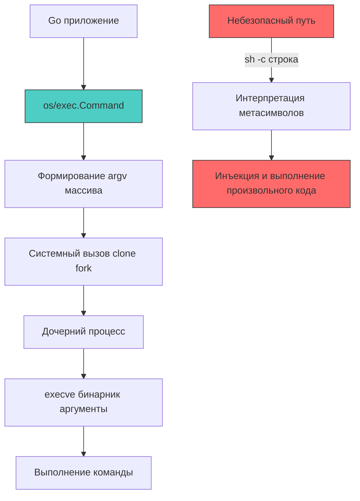

## Архитектура уязвимости: когда интерфейс ОС становится вектором атаки

Command Injection (инъекция команд ОС) возникает, когда приложение передаёт непроверенные пользовательские данные в системный интерпретатор команд без должной изоляции или санитизации. В отличие от SQL-инъекций, которые работают на уровне протокола базы данных, здесь атака происходит непосредственно в пространстве процессов операционной системы, что даёт атакующему привилегии вызывающего процесса (обычно `www-data` или `app-user`).

В экосистеме PHP или C исторически популярны функции вроде `exec()`, `system()` или `shell_exec()`, которые по умолчанию передают строку через `/bin/sh -c`. Интерпретатор парсит строку, раскрывает переменные, обрабатывает операторы конвейера `|`, `&&`, `;` и подстановки `` ` ``. Это фундаментально небезопасно, если строка формируется конкатенацией с пользовательским вводом.

Go спроектирован иначе. Пакет `os/exec` по умолчанию **не вызывает оболочку**. Он использует системный вызов `execve`, передавая команду и аргументы в виде вектора `argv[]`. Это архитектурное решение исключает интерпретацию метасимволов на уровне ядра. Уязвимость в Go появляется только когда разработчик явно обходит эту защиту, запрашивая `sh -c` или используя небезопасные обёртки.



## Под капотом `os/exec`: `fork`, `execve` и вектор аргументов

Когда вызывается `exec.Command("ls", "-l", "/tmp")`, рантайм Go выполняет следующую цепочку:

1 - **Сборка параметров**: Создается структура `exec.Cmd`. `Path` указывает на бинарник, `Args` на слайс `[]string{"ls", "-l", "/tmp"}`.
2 - **Подготовка среды**: Копируются или явно задаются переменные окружения `Env`, текущий рабочий каталог `Dir`, и стандартные потоки `Stdin/Stdout/Stderr`.
3 - **Системный вызов создания процесса**: Вызывается `runtime.fork/exec` (в Linux это `clone` с флагами `CLONE_VFORK | CLONE_VM` или `fork`). Ядро создаёт новый `task_struct`, копирует таблицы страниц с атрибутом Copy-on-Write.
4 - **Замена образа (`execve`)**: Дочерний процесс вызывает `syscall.Exec`. Ядро проверяет бинарник, загружает ELF-заголовки, мапит сегменты кода и данных, очищает наследуемые дескрипторы (если установлены флаги `FD_CLOEXEC`), и заменяет адресное пространство.
5 - **Ожидание завершения**: Родительский процесс (ваша горутина) блокируется или асинхронно опрашивает статус через `wait4`.

Ключевой момент безопасности: ядро **не парсит** строку команды. Оно получает массив указателей на строки. `sh -c` опасен именно тем, что первым аргументом становится `sh`, вторым `-c`, а третьим — вся ваша строка, которую уже `/bin/sh` парсит по правилам POSIX.

## Механическое сочувствие: цена создания процесса и утечка ресурсов

Запуск внешнего процесса — одна из самых дорогих операций в бэкенде. Для разработчика уровня Senior/Lead важно понимать влияние на рантайм и ОС:

- **Контекстные переключения и аллокации**: `fork` вызывает копирование структур ядра. `execve` загружает сотни страниц в память, обновляет TLB. В рантайме Go это блокирует тред ОС (`M`). Планировщик видит блокировку, может создать новый тред, увеличивая накладные расходы на синхронизацию пула.
- **Утечка файловых дескрипторов**: По умолчанию дочерний процесс наследует **все** открытые файловые дескрипторы родителя. Если ваше приложение держит соединения с БД, Redis, сокеты `netpoll` и файлы логов, дочерний процесс унаследует их. Это приводит к:
  - Блокировке записей в БД (потому что дочерний процесс держит копию соединения открытой).
  - Исчерпанию лимита `ulimit -n`.
  - Утечке чувствительных данных через `/proc/<pid>/fd`.
- **Zombie-процессы**: Если не вызвать `Cmd.Wait()` после `Cmd.Start()`, дочерний процесс останется в состоянии `Z` (зомби), занимая запись в таблице процессов ядра. Рантайм Go автоматически вызывает `Wait` для `Run`, `Output`, `CombinedOutput`, но при ручном `Start` ответственность лежит на разработчике.

> [!info] Под капотом
> **Почему `SysProcAttr` критичен для безопасности?**
> В Go структура `syscall.SysProcAttr` позволяет настроить поведение `exec` на уровне ядра. Например, `Setpgid: true` помещает процесс в новую группу, что позволяет посылать сигналы всему дереву процессов (`SIGTERM`), а не только головному. `NoNewPrivileges: true` запрещает дочернему процессу получать дополнительные права через `setuid`/`setgid` бинарники, что блокирует целый класс вертикальных эскалаций привилегий.

## Идиоматичная защита в Go

Безопасное выполнение внешних команд строится на трёх столпах: явная передача аргументов, контроль окружения и изоляция процессов.

```go
package cmdsec

import (
	"context"
	"fmt"
	"os"
	"os/exec"
	"syscall"
	"time"
)

// SafeRunCommand безопасно выполняет внешнюю утилиту с ограничением прав и ресурсов
func SafeRunCommand(ctx context.Context, binary string, args []string, input []byte) ([]byte, error) {
	// 1 - Явное указание бинарника и аргументов. Никаких "sh -c".
	cmd := exec.CommandContext(ctx, binary, args...)

	// 2 - Жёсткие таймауты. Отмена контекста пошлёт SIGKILL дочернему процессу.
	ctxWithTimeout, cancel := context.WithTimeout(ctx, 5*time.Second)
	defer cancel()
	cmd = exec.CommandContext(ctxWithTimeout, binary, args...)

	// 3 - Минимальное окружение. Не наследовать AWS_SECRET_KEY, PATH и прочее.
	cmd.Env = []string{
		"PATH=/usr/local/bin:/usr/bin",
		"LC_ALL=C",
	}
	cmd.Dir = "/tmp" // Ограничить рабочую директорию

	// 4 - Изоляция на уровне ядра через SysProcAttr
	cmd.SysProcAttr = &syscall.SysProcAttr{
		// Блокировка эскаляции привилегий через setuid/setgid
		NoNewPrivileges: true,
		// При смерти родительского процесса дочерний получит SIGTERM
		Pdeathsig: syscall.SIGTERM,
		// Запуск в новой группе процессов для корректного управления сигналами
		Setpgid: true,
	}

	// 5 - Передача данных через пайп, а не через командную строку
	cmd.Stdin = nil // В данном примере входных данных нет, но для безопасности лучше явно указать

	output, err := cmd.CombinedOutput()
	if err != nil {
		// Ошибка контекста означает таймаут или отмену
		if ctxWithTimeout.Err() != nil {
			return nil, fmt.Errorf("command timed out or cancelled: %w", ctxWithTimeout.Err())
		}
		return output, fmt.Errorf("command execution failed: %w", err)
	}

	return output, nil
}
```

## Ловушки и углы (Gotchas)

1 - **Обход через `PATH`**: Если `binary` не содержит абсолютный путь, `exec` ищет его в `cmd.Env` переменной `PATH`. Атакующий может модифицировать переменную окружения или подставить свой бинарник в директорию, которая проверяется первой. **Решение:** Всегда указывать абсолютные пути к бинарникам (`/usr/bin/convert`, а не `convert`).

2 - **Наследование `stdout`/`stderr` в основной поток**: Если не перенаправить вывод, `exec` по умолчанию наследует дескрипторы родителя. Это может смешать вывод утилиты с логами приложения или, что хуже, отправить сырой вывод клиенту. **Решение:** Всегда явно задавать `cmd.Stdout` и `cmd.Stderr`, либо использовать `cmd.CombinedOutput()`.

3 - **`exec.Command` с переменными окружения**: Передача пользовательских данных в `cmd.Env` без фильтрации может привести к инъекции переменных, которые утилита интерпретирует особым образом (например, `LD_PRELOAD` для подгрузки библиотек, `PYTHONPATH` для изменения импортов). **Решение:** Использовать строгий allowlist разрешённых переменных.

> [!warning] Ловушка / Gotcha
> **Почему нельзя просто экранировать спецсимволы вручную?**
> Попытки написать кастомную санитизацию через `strings.Replace` или `regexp` (`escapeshellarg`) исторически приводили к катастрофам (баги в гексадецимальном экранировании, обход через многобайтовые кодировки). Архитектура `exec.Command` в Го решает проблему на уровне ядра: вы не передаёте строку оболочке, вы передаёте массив `argv[]`. Ядро гарантирует, что каждый элемент массива будет передан бинарнику как один аргумент, независимо от содержимого. Экранирование не требуется, если вы избегаете `sh -c`.

> [!tip] Собеседование
> **Вопрос:** Что произойдёт, если родительский Go-процесс завершится аварийно (panic или OOM), а дочерний процесс продолжает работать? Как гарантировать его завершение?
> **Ответ:** 
> 1 - По умолчанию дочерний процесс становится сиротой и переходит под иници (PID 1). Он продолжает потреблять ресурсы.
> 2 - В Го это решается через `syscall.SysProcAttr.Pdeathsig = syscall.SIGTERM` (или `SIGKILL`). При смерти родителя ядро отправляет сигнал потомку.
> 3 - Для контейнерных сред рекомендуется использовать `prctl` с `PR_SET_PDEATHSIG` (что `Pdeathsig` и делает) или запускать процесс в отдельной cgroup с лимитами памяти и CPU, чтобы контейнерный runtime мог корректно утилизировать все потомки.
> 4 - На уровне кода использовать `exec.CommandContext` с `defer cancel()` для гарантии отмены при завершении хендлера.

## Итог

1 - `os/exec` в Го безопасен по умолчанию, так как использует `execve` и вектор аргументов, исключая интерпретацию оболочки. Уязвимость возникает только при явном вызове `sh -c` или аналогов.
2 - Создание процесса вызывает тяжёлые системные вызовы (`fork`/`clone`, `execve`), блокирует тред ОС и создаёт аллокации в ядре. Частый запуск внешних команд без пулинга или асинхронности деградирует производительность сервиса.
3 - Наследование файловых дескрипторов и переменных окружения — критический риск. Необходимо явно задавать `cmd.Env`, `cmd.Dir` и использовать `SysProcAttr` для контроля изоляции.
4 - `Pdeathsig` и `Setpgid` позволяют корректно управлять жизненным циклом дочерних процессов, предотвращая появление зомби и процессов-сирот при паниках или рестартах.
5 - Ручная санитизация спецсимволов в командах является антипаттерном. Архитектурно верное решение — передача аргументов как отдельных элементов слайса и строгий контроль окружения.

[[5. Path traversal]]