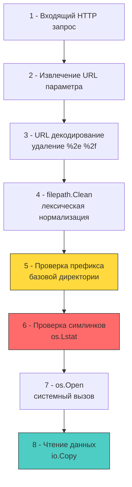

## Введение: выход за границы виртуальной файловой системы

Path Traversal (обход путей) — это уязвимость, позволяющая атакующему получить доступ к файлам и директориям за пределами разрешённой базовой директории приложения. В бэкенде на Go она возникает при неправильной обработке пользовательских путей в `os.Open`, `http.FileServer` или кастомных загрузчиках файлов.

На уровне операционной системы эта проблема тесно связана с тем, как ядро разрешает пути в виртуальной файловой системе (VFS). При вызове `open()` ядро последовательно обходит кэш записей каталогов (`dentry cache`), обрабатывает компоненты `.` и `..`, разрешает символические ссылки и проверяет права доступа. Если приложение передаёт ядру невалидированный путь, VFS слепо следует инструкциям, игнорируя бизнес-логику изоляции.



## Механика в Go: `filepath.Clean`, `filepath.Join` и их ограничения

Стандартная библиотека Go предоставляет `filepath.Clean` и `filepath.Join`, которые часто ошибочно воспринимаются как полноценная защита от Path Traversal. На самом деле они выполняют только **лексическую нормализацию**:
- Убирают избыточные разделители (`//` -> `/`)
- Сворачивают `./` и `../` до канонического вида
- Не разрешают символические ссылки
- Не проверяют физическое существование файла
- Не защищают от обхода через `%2e%2e%2f` или `..%c0%af` (в старых кодировках)

```go
package filesec

import (
	"errors"
	"fmt"
	"net/http"
	"os"
	"path/filepath"
	"strings"
)

// SecureFileHandler безопасно отдаёт файлы из разрешённой директории
func SecureFileHandler(baseDir string) http.HandlerFunc {
	// 🔒 Абсолютный путь к базовой директории для надёжных сравнений
	absBaseDir, err := filepath.Abs(baseDir)
	if err != nil {
		panic(fmt.Sprintf("invalid base dir: %v", err))
	}

	return func(w http.ResponseWriter, r *http.Request) {
		requestPath := r.URL.Query().Get("file")
		if requestPath == "" {
			http.Error(w, "missing file parameter", http.StatusBadRequest)
			return
		}

		// 1 - URL декодирование (net/http делает это автоматически для Query)
		// Но важно проверить, нет ли двойного кодирования или нестандартных схем
		if strings.Contains(requestPath, "\x00") {
			http.Error(w, "invalid characters", http.StatusBadRequest)
			return
		}

		// 2 - Лексическая очистка пути
		cleanPath := filepath.Clean(requestPath)

		// 3 - Сборка полного пути
		fullPath := filepath.Join(absBaseDir, cleanPath)

		// 4 - 🔒 Жёсткая проверка префикса. Это ключевой этап защиты.
		if !strings.HasPrefix(fullPath, absBaseDir+string(os.PathSeparator)) && fullPath != absBaseDir {
			http.Error(w, "forbidden path", http.StatusForbidden)
			return
		}

		// 5 - Проверка на символические ссылки и чтение метаданных
		info, err := os.Lstat(fullPath)
		if err != nil {
			if os.IsNotExist(err) {
				http.Error(w, "file not found", http.StatusNotFound)
				return
			}
			http.Error(w, "access denied", http.StatusForbidden)
			return
		}
		if info.Mode()&os.ModeSymlink != 0 {
			http.Error(w, "symlinks not allowed", http.StatusForbidden)
			return
		}
		if info.IsDir() {
			http.Error(w, "directories not allowed", http.StatusForbidden)
			return
		}

		// 6 - Безопасная отдача
		http.ServeFile(w, r, fullPath)
	}
}
```

> [!info] Под капотом
> **Аллокации и производительность `filepath.Clean`**
> Функция `filepath.Clean` создаёт новый слайс байт, проходит по строке в два прохода и аллоцирует результат в куче (из-за Escape Analysis при возврате). При обработке тысяч запросов в секунду это генерирует короткоживущий мусор, нагружающий `GC`. Для высоконагруженных файловых шлюзов рекомендуется использовать `strings.Builder` с преаллоцированным буфером или кэшировать валидированные пути в `sync.Map`, если набор файлов статичен.

## Под капотом: syscalls, dentry cache и проблема TOCTOU

Даже при идеальной лексической проверке существует фундаментальная проблема **Time-of-Check-Time-of-Use (TOCTOU)**. Между вызовом `os.Lstat` (проверка) и `os.Open` (чтение) злоумышленник с правами на запись в ту же директорию может заменить файл символической ссылкой на `/etc/shadow`.

В Unix-подобных ОС решение этой проблемы лежит на уровне ядра через системный вызов `openat2` с флагом `RESOLVE_BENEATH` или `O_NOFOLLOW`. В стандартной библиотеке Go прямой доступ к этим флагам ограничен. На практике разработчики используют `golang.org/x/sys/unix` для низкоуровневого контроля:

```go
package filesec_unix

import (
	"fmt"
	"os"
	"path/filepath"
	"syscall"

	"golang.org/x/sys/unix"
)

// OpenSecure открывает файл атомарно, без TOCTOU, используя openat2
func OpenSecure(baseDir, requestPath string) (*os.File, error) {
	absBase, err := filepath.Abs(baseDir)
	if err != nil {
		return nil, err
	}

	dirFd, err := unix.Openat(unix.AT_FDCWD, absBase, unix.O_RDONLY|unix.O_DIRECTORY|unix.O_CLOEXEC, 0)
	if err != nil {
		return nil, fmt.Errorf("open base dir: %w", err)
	}
	defer unix.Close(dirFd)

	// openat2 с RESOLVE_BENEATH гарантирует, что путь не выйдет за пределы dirFd
	// Доступно в Linux 5.6+
	var how unix.OpenHow
	how.Flags = unix.O_RDONLY | unix.O_CLOEXEC
	how.Resolve = unix.RESOLVE_BENEATH | unix.RESOLVE_NO_SYMLINKS | unix.RESOLVE_NO_MAGICLINKS

	fd, err := unix.Openat2(dirFd, requestPath, &how)
	if err != nil {
		return nil, fmt.Errorf("openat2 failed: %w", err)
	}

	return os.NewFile(uintptr(fd), filepath.Base(requestPath)), nil
}
```

> [!warning] Ловушка / Gotcha
> **`http.FileServer` и скрытая уязвимость**
> Стандартный `http.FileServer(http.Dir("/uploads"))` **не проверяет префиксы**. Он просто передаёт путь из URL напрямую в `os.Open`. Если URL содержит `/../../etc/passwd`, сервер успешно отдаст файл. Многие разработчики оборачивают `http.Dir` в кастомный `http.FileSystem`, забывая, что `http.Dir` уже реализует этот интерфейс небезопасным образом. Всегда используйте строгий middleware или кастомную реализацию `Open(name)`, как показано выше.

> [!tip] Собеседование
> **Вопрос:** Почему проверка `strings.Contains(path, "..")` является ненадёжной защитой, и как атакующий может её обойти?
> **Ответ:**
> 1 - Проверка на подстроку не учитывает URL-кодирование (`%2e%2e%2f`), двойное кодирование или нормализацию в разных ОС.
> 2 - В Windows допустимы альтернативные разделители путей (`\`), а в Unix возможны `..` в середине строки, которые `Contains` отловит, но легитимные пути с `..` в именах файлов (например, `file..txt`) будут ложно заблокированы.
> 3 - Архитектурно верный подход: использовать `filepath.Clean` для нормализации, затем `filepath.Abs` для получения физического пути, и строго проверять `strings.HasPrefix(absolutePath, allowedBase)`. Это работает независимо от формата ввода.
> 4 - На уровне ядра Linux 5.6+ используется `RESOLVE_BENEATH` в `openat2`, что полностью устраняет риск на уровне VFS, а не пользовательского пространства.

## Сравнение подходов: Go, PHP, C/C++

| Аспект | Go | PHP | C / C++ |
|--------|----|-----|---------|
| **Базовая защита** | `filepath.Clean` + `strings.HasPrefix` | `realpath()` + `strpos()` | `realpath()` или `openat()` |
| **Символические ссылки** | Требует явной проверки `os.Lstat` или `RESOLVE_NO_SYMLINKS` | `realpath` автоматически разрешает | `O_NOFOLLOW` в `open()` |
| **TOCTOU mitigation** | `x/sys/unix.Openat2` с `RESOLVE_BENEATH` | Слабая (user-space only) | `openat()` + `fchdir()` или `openat2` |
| **Аллокации** | `filepath.Clean` создаёт новые строки | Строки неизменяемы, аллоцируются при конкатенации | `strdup`, ручное управление памятью |

В Go преимущество заключается в строгой типизации и отсутствии «магии» вроде `include` или `require` с автоматическим резолвингом путей. Однако ответственность за валидацию полностью ложится на разработчика.

## Итог

1 - Path Traversal возникает при передаче невалидированных путей в `os.Open` или `http.FileServer`. Ядро ОС слепо разрешает `..` и симлинки на уровне VFS.
2 - `filepath.Clean` и `filepath.Join` выполняют только лексическую нормализацию. Они не защищают от обхода за пределы базовой директории и не разрешают символические ссылки.
3 - Надёжная защита требует комбинации: URL-декодирование, `filepath.Clean`, `filepath.Abs`, строгая проверка префикса `strings.HasPrefix` и запрет симлинков через `os.Lstat` или `RESOLVE_NO_SYMLINKS`.
4 - Проблема TOCTOU между проверкой и открытием файла решается на уровне ядра через `openat2` с `RESOLVE_BENEATH` (Linux 5.6+) или атомарными `openat` операциями в `golang.org/x/sys/unix`.
5 - В высоконагруженных системах аллокации при нормализации путей и системные вызовы `stat`/`open` влияют на `GC` и latency. Кэширование валидированных путей и использование пулов буферов снижают накладные расходы.

[[6. Deserialization уязвимости]]