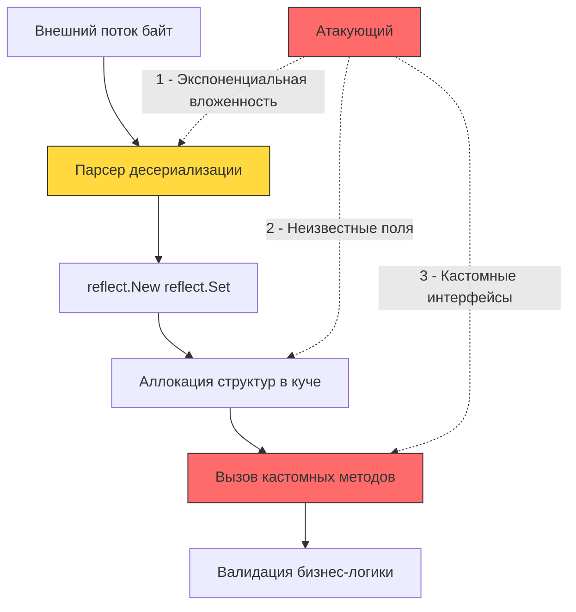

## Введение: Когда парсер данных становится исполнителем

Десериализация — это процесс преобразования неструктурированного потока байт (JSON, XML, Protobuf, Gob) во внутренние структуры приложения. В высоконагруженном бэкенде это не просто «парсинг», а критическая точка конвертации ненадёжного внешнего ввода в исполняемый код и аллоцируемые объекты. Уязвимости десериализации исторически ассоциируются с RCE через `__wakeup` в PHP или `readObject` в Java. В Go ситуация иная благодаря строгой статической типизации и отсутствию произвольного инстанцирования классов, но риски смещаются в сторону DoS, логических инъекций и скрытых вызовов через интерфейсы.



## Под капотом: отражение, куча и скрытые вызовы

Стандартные пакеты `encoding/json`, `encoding/xml` и `encoding/gob` активно используют пакет `reflect`. При вызове `Unmarshal` рантайм выполняет:
1 - **Кэширование типа:** Компилятор генерирует метаданные структур. `reflect.Type` хранит смещения полей, теги, типы. Это происходит один раз и кешируется в `sync.Map`.
2 - **Рекурсивный обход:** Парсер сопоставляет ключи из потока с полями структуры. Для каждого поля вызывается `reflect.ValueOf` и `reflect.Set`.
3 - **Аллокация:** Указатели, слайсы и мапы аллоцируются в куче. Escape Analysis не может предсказать размер входящих данных, поэтому `Unmarshal` почти всегда генерирует `heap` аллокации.
4 - **Кастомные хуки:** Если тип реализует интерфейсы `Unmarshaler`, `GobDecoder` или `encoding.BinaryUnmarshaler`, парсер вызывает их методы автоматически. Именно здесь кроется вектор для выполнения произвольного кода.

## 1. JSON: Бомбы, глубина и `interface{}`

Формат JSON сам по себе не исполняет код, но его структура позволяет эффективно истощать ресурсы процесса.

**JSON-бомбы (Zip Bomb аналог):** Вложенные объекты или массивы. Парсер рекурсивно создаёт `map[string]any` и `[]any`. Для глубины 30 и коэффициента ветвления 5 это ~10^21 аллокаций. Рантайм падает с `runtime: goroutine stack exceeds` или OOM до завершения парсинга.
**Массовое назначение (Mass Assignment):** Использование `map[string]any` или динамических DTO позволяет атакующему передавать поля, которых не ожидает бизнес-логика (`is_admin`, `price`, `role`). При последующей сериализации в БД или передаче в другой сервис это ведёт к логическим уязвимостям.

```go
package deserial

import (
	"encoding/json"
	"io"
	"net/http"
)

// SecureJSONHandler демонстрирует защиту от массового назначения и DoS
func SecureJSONHandler(w http.ResponseWriter, r *http.Request) {
	// 🔒 Ограничение размера тела запроса. 1 МБ достаточно для большинства API.
	limitedReader := io.LimitReader(r.Body, 1<<20)
	
	// 🔒 DisallowUnknownFields запрещает инъекцию лишних полей
	// Это критично для защиты от mass assignment
	decoder := json.NewDecoder(limitedReader)
	decoder.DisallowUnknownFields()

	var payload struct {
		ID    int64  `json:"id"`
		Name  string `json:"name"`
		Email string `json:"email"`
	}

	if err := decoder.Decode(&payload); err != nil {
		// Ошибка может быть: превышение лимита, неизвестное поле, malformed JSON
		http.Error(w, "invalid payload", http.StatusBadRequest)
		return
	}
	
	// Дальнейшая бизнес-логика...
}
```

> [!info] Под капотом
> **Почему `DisallowUnknownFields` работает быстро?**
> Парсер сравнивает каждый ключ из JSON с кэшированной картой полей структуры. Если ключ отсутствует, он сразу возвращает ошибку без выделения памяти для значения. Это предотвращает аллокацию `any` и последующую нагрузку на GC при парсинге вредоносных запросов с тысячами неизвестных полей.

## 2. Gob: `GobDecoder` и вектор RCE в Go

Пакет `encoding/gob` бинарный, эффективный, но **категорически не предназначен для приёма ненадёжных данных**. Его архитектура подразумевает обмен между доверенными микросервисами одной экосистемы.

Если структура реализует интерфейс `gob.GobDecoder`, метод `GobDecode([]byte) error` вызывается автоматически в процессе распаковки. В отличие от JSON, где вы контролируете десериализацию, `gob` даёт библиотеке возможность выполнять произвольную логику при чтении байт.

```go
// ⚠️ ОПАСНО: Пример структуры, которая может выполнить код при десериализации
type UnsafeCacheItem struct {
	Key   string
	Value []byte
}

// Этот метод вызовется АВТОМАТИЧЕСКИ при gob.Decode
func (u *UnsafeCacheItem) GobDecode(data []byte) error {
	// 🔴 Если атакующий подставит данные, которые десериализуются в эту структуру,
	// здесь может выполниться exec.Command, os.Remove, или сетевой вызов.
	return nil 
}
```
> [!warning] Ловушка / Gotcha
> **Никогда не декодируйте `gob` от клиентов**
> `gob` не имеет встроенной защиты от `GobDecoder` векторов. Любой байт-поток, соответствующий формату, запустит ваши кастомные методы. Для внешних API используйте Protobuf или JSON. Для внутреннего обмена в Go экосистеме `gob` допустим, но только между компонентами с одинаковыми версиями бинарников и строгим контролем трафика.

## 3. XML: XXE и парсинг DTD

Стандартный `encoding/xml` в Go защищён от XXE (XML External Entity) по умолчанию. Начиная с версии 1.15, парсер игнорирует `<!DOCTYPE>` и внешние сущности, предотвращая чтение локальных файлов или SSRF через DTD. Однако, при использовании сторонних библиотек (`libxml2` bindings) или кастомных `Decoder` с включённым `Strict`, риск возвращается. Всегда проверяйте документацию сторонних XML-парсеров на наличие флагов `ExternalEntities` или `DTD`.

## Идиоматичная защита в рантайме

Архитектура безопасной десериализации в Go строится на трёх принципах: строгие контракты, лимиты ресурсов и отказ от динамики в критическом пути.

1 - **Структуры вместо `interface{}`:** Жёсткие DTO компилятор проверяет на этапе сборки. Это исключает type confusion и mass assignment.
2 - **Лимиты на входе:** `io.LimitReader` + `http.MaxBytesReader` (для `http.Server`) отрезают DoS до начала парсинга.
3 - **Глубина и сложность:** Для JSON в Go 1.24+ добавлен `Decoder.MaxDepth`, но в более ранних версиях требуется кастомная обёртка или использование библиотек вроде `jsoniter` с лимитами.
4 - **Валидация до десериализации:** Сырой JSON можно проверить на структуру через `json.RawMessage` или использовать OpenAPI-генераторы (`oapi-codegen`, `deepmap/oapi-codegen`), которые генерируют строгие валидаторы.

## Механическое сочувствие: давление на GC и аллокации

Десериализация — один из главных источников короткоживущего мусора в бэкенде. Каждый вызов `json.Unmarshal` создаёт:
- `[]byte` буферы для строк
- `reflect` структуры для полей
- Временные объекты для маппинга типов

При 50к RPS это сотни мегабайт мусора в секунду. Частые `Minor GC` фазы приостанавливают все горутины, вытесняя кэш-линии L1/L2 из-за сканирования кучи. **Оптимизации:**
- Используйте `sync.Pool` для структур-запросов, если они аллоцируются часто.
- Предпочитайте `json.Decoder` поверх `json.Unmarshal`, так как он стримит данные и может избежать создания промежуточного `[]byte` всего тела.
- В критичных к latency путях рассмотрите `go-json` (от `goccy`) или `sonic` (от `Bytedance`), которые используют JIT-компиляцию или ассемблерные оптимизации для снижения отражения и аллокаций, но учитывайте, что это сторонние зависимости с собственным threat modeling.

> [!tip] Собеседование
> **Вопрос:** Почему `json.Unmarshal` медленнее `json.Decoder` при работе с большими потоками, и как это связано с управлением памятью в Go?
> **Ответ:**
> 1 - `json.Unmarshal` сначала читает всё тело в `[]byte` (полная аллокация), затем парсит его дважды: первый раз для валидации структуры, второй для заполнения полей.
> 2 - `json.Decoder` работает с `io.Reader` и парсит по мере поступления байт. Это позволяет избежать загрузки гигантских буферов в кучу и снижает давление на GC.
> 3 - `Decoder` также кеширует состояние парсера между вызовами `Decode`, тогда как `Unmarshal` каждый раз создаёт новый парсер с нуля.
> 4 - **Архитектурный вывод:** Для HTTP-хендлеров всегда используйте `json.NewDecoder(r.Body)`. Для локальных структур фиксированного размера `Unmarshal` допустим, но требует контроля `MaxPayloadSize`.

## Итог

1 - Десериализация в Go защищена от классического RCE благодаря статической типизации, но остаётся критическим вектором для DoS и логических инъекций.
2 - `GobDecoder` интерфейс позволяет выполнять произвольный код при распаковке. `encoding/gob` не должен использоваться для ненадёжных внешних данных.
3 - JSON-бомбы и массовое назначение нейтрализуются через `io.LimitReader`, `DisallowUnknownFields` и строгие DTO вместо `map[string]any`.
4 - Парсинг через `reflect` генерирует значительное давление на GC. Стриминг через `json.Decoder` и переиспользование буферов снижают latency в высоконагруженных системах.
5 - Безопасная десериализация — это комбинация архитектурных ограничений (строгие схемы, лимиты ресурсов) и контроля сторонних зависимостей.

[[7. Race condition как уязвимость]]