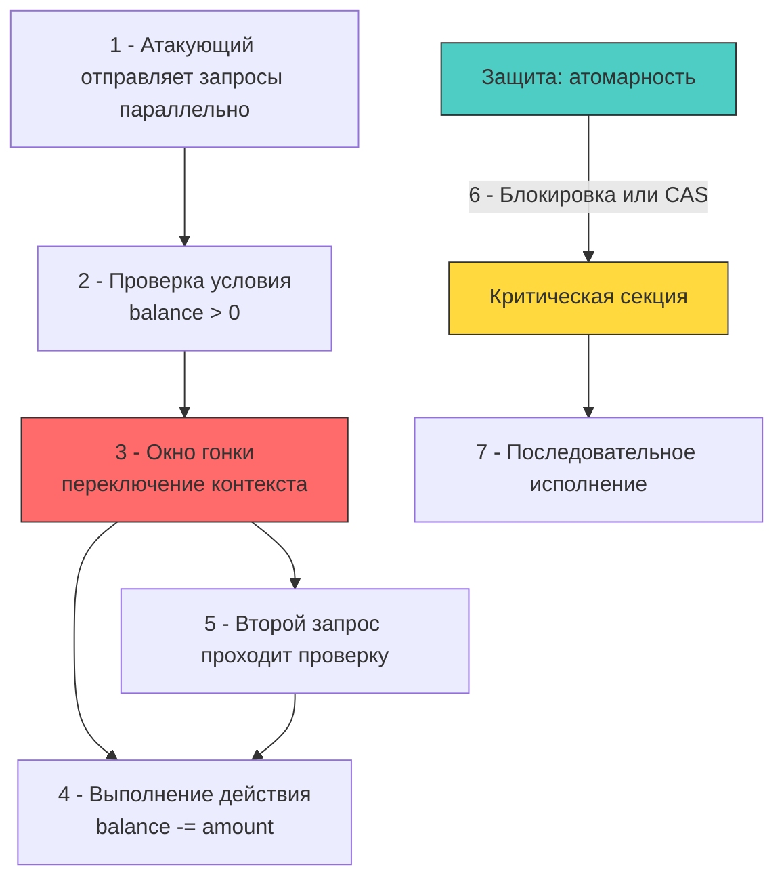

## Гонки состояний: от багов стабильности до векторов атак

В классической разработке race condition рассматривается как ошибка стабильности, приводящая к неопределённому поведению или паникам. В контексте безопасности это критическая уязвимость, позволяющая атакующему эксплуатировать временное окно между проверкой условия и использованием ресурса (TOCTOU). В высоконагруженном Go-бэкенде, где тысячи горутин конкурируют за общие ресурсы, грань между оптимистичной конкурентностью и уязвимостью проходит через дисциплину работы с памятью и состоянием.



### Под капотом: кэш-когерентность, модель памяти и планировщик

На уровне процессора не существует единого мгновенного представления памяти. Каждое ядро CPU имеет собственные кэш-линии L1/L2. Протокол когерентности (MESI/MOESI) синхронизирует данные, но это требует времени и шинных транзакций. Компилятор и CPU переупорядочивают инструкции для оптимизации конвейера, если это не нарушает семантику внутри одного потока.

Модель памяти Go гарантирует видимость изменений между горутинами **только** при использовании примитивов синхронизации (`sync.Mutex`, `sync/atomic`, `channel`, `context`). Без них одна горутина может видеть stale-данные из своего локального кэша регистров, пока другая уже изменила их в куче. Это не баг компилятора, а фундаментальное свойство многопоточных архитектур.

Инструмент `go run -race` использует ThreadSanitizer (TSan), который создаёт теневую память для отслеживания всех чтений/записей. Однако TSan находит только **гонки данных** (data races), но не **логические гонки** (logical races). Логическая гонка возникает, когда примитивы синхронизации используются корректно, но бизнес-логика допускает окно между проверкой и действием, которое атакующий может эксплуатировать через параллельные запросы.

### Классические сценарии уязвимостей

1 - **TOCTOU в проверке баланса**: Чтение остатка `SELECT balance FROM accounts` -> проверка `if balance >= amount` -> списание `UPDATE accounts SET balance = balance - amount`. Если два запроса проходят чтение одновременно до обновления, оба увидят достаточный баланс и выполнят списание. Итог: отрицательный баланс, финансовая потеря.
2 - **Обход rate limiting**: `if counter < limit { counter++ }` без атомарности. Десять параллельных запросов могут прочитать `counter = 9`, все пройти проверку, и инкрементировать счётчик до 10, пропустив лимит.
3 - **Эскалация привилегий через кэш состояния**: Проверка прав доступа кешируется в `sync.Map` с долгим TTL. Если пользователь отозван администратором, старые горутины продолжают использовать кэшированные разрешения до истечения TTL, получая доступ к закрытым эндпоинтам.

### Идиоматичные паттерны защиты в Go

#### 1 - Атомарные операции для счётчиков и флагов
Для простых состояний используйте `sync/atomic`. Операции используют машинные инструкции с префиксом `LOCK` (например, `LOCK xadd` или `LOCK cmpxchg` на x86), которые гарантируют атомарность на уровне шины и кэш-когерентности.

```go
package ratelimit

import (
	"context"
	"errors"
	"sync/atomic"
	"time"
)

// AtomicRateLimiter реализует простой счётчик с атомарными операциями
type AtomicRateLimiter struct {
	limit     int64
	counter   atomic.Int64
	resetTime time.Time
	mu        sync.Mutex // Только для сброса времени, не для счётчика
}

func (r *AtomicRateLimiter) Allow(ctx context.Context) error {
	current := r.counter.Add(1) // 🔒 Атомарный инкремент и возврат нового значения
	if current <= r.limit {
		return nil
	}
	
	// Сброс счётчика в новый временной слот (логика упрощена для примера)
	r.mu.Lock()
	defer r.mu.Unlock()
	
	if time.Now().After(r.resetTime) {
		r.counter.Store(0) // 🔒 Атомарный сброс
		r.resetTime = time.Now().Add(time.Minute)
		return nil
	}
	
	return errors.New("rate limit exceeded")
}
```

#### 2 - Блокировки и транзакции базы данных
Когда состояние комплексное, `atomic` недостаточен. Требуется `sync.Mutex` или, что критичнее, блокировки на уровне БД. В распределённых системах примитивы Go защищают только внутри одного процесса. Для кластера нужны `SELECT ... FOR UPDATE`, optimistic concurrency control (версионирование строк) или распределённые блокировки (Redis `SETNX`, etcd).

```go
package payments

import (
	"context"
	"database/sql"
	"fmt"
)

// TransferWithLock реализует защиту от double-spend через транзакцию и FOR UPDATE
func TransferWithLock(ctx context.Context, db *sql.DB, fromID, toID int64, amount int64) error {
	tx, err := db.BeginTx(ctx, &sql.TxOptions{Isolation: sql.LevelSerializable})
	if err != nil {
		return fmt.Errorf("begin tx: %w", err)
	}
	defer tx.Rollback()

	// 🔒 FOR UPDATE блокирует строку на запись. Другие транзакции ждут или падают.
	var balance int64
	err = tx.QueryRowContext(ctx, 
		"SELECT balance FROM accounts WHERE id = $1 FOR UPDATE", fromID,
	).Scan(&balance)
	if err != nil {
		return fmt.Errorf("read balance: %w", err)
	}

	if balance < amount {
		return fmt.Errorf("insufficient funds")
	}

	_, err = tx.ExecContext(ctx,
		"UPDATE accounts SET balance = balance - $1 WHERE id = $2",
		amount, fromID,
	)
	if err != nil {
		return fmt.Errorf("update balance: %w", err)
	}

	_, err = tx.ExecContext(ctx,
		"UPDATE accounts SET balance = balance + $1 WHERE id = $2",
		amount, toID,
	)
	if err != nil {
		return fmt.Errorf("credit balance: %w", err)
	}

	return tx.Commit()
}
```

#### 3 - Каналы и паттерн "Owner Goroutine"
Когда состояние сложное и требует строгой последовательности обработки, используйте каналы для передачи запросов в единую горутину-владельца. Это устраняет гонки на уровне языка, так как доступ к состоянию имеет только один потребитель.

> [!warning] Ловушка / Gotcha
> **Ложная экономия на `sync.Map`**
> `sync.Map` оптимизирован для сценариев, где ключи стабильны, а большинство операций — чтение. Однако `LoadOrStore` и `LoadAndDelete` не являются транзакционными для комплексной бизнес-логики. Если между `Load` и `Store` другая горутина изменит значение, логическая гонка возникнет, даже если данные структуры потокобезопасны.
> **Решение:** Для сложной логики с условиями используйте `sync.Mutex` + обычная `map`, либо `atomic.Pointer` с циклом `CompareAndSwap` для lock-free алгоритмов, если требуется экстремальная производительность.

> [!tip] Собеседование
> **Вопрос:** Почему `go run -race` не гарантирует отсутствие уязвимостей race condition в продакшене?
> **Ответ:** 
> 1 - TSan детектирует только одновременный доступ к одной переменной, где хотя бы одна операция — запись. Он не видит логические TOCTOU, где доступ сериализован, но бизнес-правила нарушены.
> 2 - Инструмент добавляет 5-15x оверхед на CPU и память, поэтому не используется в продакшене постоянно.
> 3 - Гонки могут проявляться только под специфичной нагрузкой или на определённых архитектурах (разный порядок выполнения инструкций на ARM vs x86).
> 4 - **Правильный подход:** Threat modeling на этапе дизайна, формальная верификация критических секций, написание интеграционных тестов с параллельными запросами и использование `SELECT FOR UPDATE` / оптимистичной блокировки на уровне БД для распределённых состояний.

## Механическое сочувствие: цена синхронизации

Защита от гонок имеет прямое влияние на производительность и планировщик Go:
- **`atomic` операции**: Используют префикс `LOCK`, который вызывает invalidation кэш-линий на всех ядрах (протокол MESI). При высокой конкуренции это создаёт "cache ping-pong", увеличивая латентность доступа к памяти в 10-50 раз.
- **`sync.Mutex`**: В Linux реализуется через `futex`. При первом конфликте мьютекс пробует спин-лок (активное ожидание в цикле). Если contention сохраняется, вызывается `futex(FUTEX_WAIT)`, что блокирует тред ОС (`M`), вызывает `syscall` и переключение контекста. Планировщик создаёт новые треды, что ведёт к троттлингу и росту потребления памяти.
- **Каналы**: Структура `hchan` использует внутренние мьютексы. Отправка/приём может блокировать горутины. Небуферизованные каналы особенно чувствительны к рассинхронизации производителей и потребителей, вызывая рост числа заблокированных горутин в `pprof`.

Для высоконагруженных систем рекомендуется:
- Минимизировать критические секции (выносите тяжелые вычисления за пределы `mu.Lock()`).
- Использовать `sync.RWMutex`, если чтение доминирует над записью.
- Применять `singleflight` для дедупликации одинаковых запросов к внешним ресурсам.
- Мониторить `mutex profile` через `runtime.SetMutexProfileFraction` для выявления горячих точек.

## Итог

1 - Race condition в безопасности — это не только гонка данных, но и логическое TOCTOU, позволяющее эксплуатировать окно между проверкой и действием.
2 - `go run -race` находит только гонки данных, но не защищает от уязвимостей бизнес-логики. Требуются архитектурные ограничения и транзакционная семантика.
3 - На уровне CPU атомарные операции вызывают инвалидацию кэш-линий, а мьютексы приводят к `futex` syscall и блокировке тредов ОС при высоком contention.
4 - В распределённых системах примитивы Go недостаточны. Необходимы блокировки на уровне БД (`FOR UPDATE`), оптимистичная конкурентность (версионирование) или распределённые координаторы.
5 - Идиоматичная защита строится на чётком выборе примитива: `atomic` для счётчиков, `Mutex` для комплексного состояния, каналы для строгой последовательности, и транзакции БД для финансовых/критичных данных.

[[1. Валидация входных данных]]