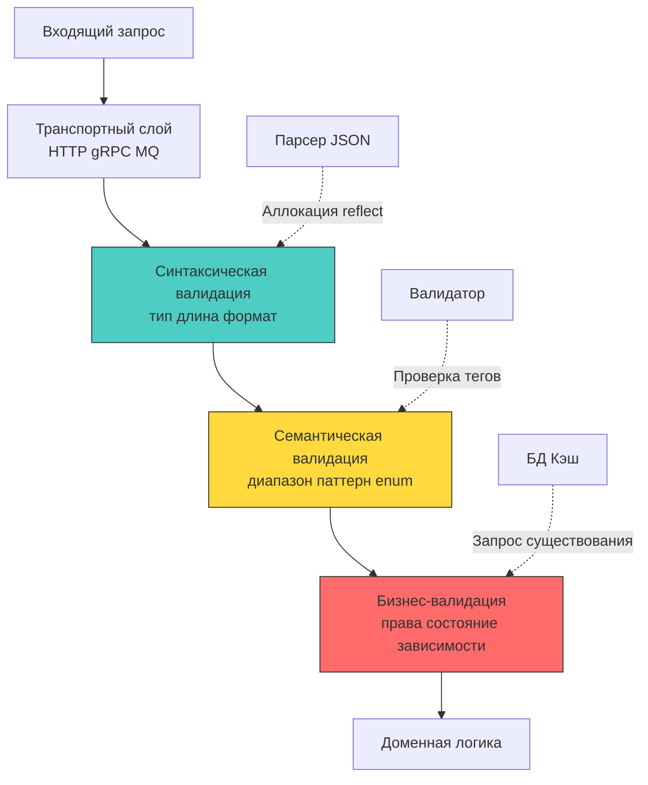

## Архитектурный контракт: валидация как граница доверия

Валидация входных данных — это не набор `if`-условий в хендлере, а строгий архитектурный контракт на границе доверия. Любые данные извне (HTTP-запрос, gRPC-сообщение, событие из очереди, загруженный файл) считаются враждебными. В экосистеме Go, где строгая типизация и модель конкурентности требуют явного управления состоянием, ошибки валидации могут привести не только к багам, но к паникам в горутинах, гонкам данных и логическим уязвимостям.

Правильно спроектированный слой валидации работает как фильтр: он отсекает невалидный трафик до попадания в доменную логику, минимизируя аллокации в куче, нагрузку на сборщик мусора и вероятность SQL/NoSQL-инъекций.



## Уровни валидации и механика рантайма Go

Валидация делится на три независимых слоя, каждый из которых имеет свои требования к производительности и доступным данным:

1 - **Синтаксическая**: Проверка формата, длины, допустимых символов, соответствия типу. Выполняется сразу после десериализации. Пример: `email` должен содержать `@`, `age` должен быть целым числом в диапазоне `int32`.
2 - **Семантическая**: Проверка значений в контексте домена. Пример: дата начала не может быть позже даты окончания, `role` должен быть одним из предопределенных значений, `currency` должен совпадать с кодом ISO 4217.
3 - **Бизнес-логическая**: Зависит от внешнего состояния. Пример: пользователь с таким `email` не зарегистрирован, баланс достаточен, товар в наличии. Требует запросов к БД/кэшу и выполняется после успешной синтаксической и семантической проверки.

### Под капотом: рефлексия, кэширование типов и GC

Популярные библиотеки валидации в Go (`go-playground/validator`, `gookit/validate`) используют пакет `reflect`. При первом вызове `validator.ValidateStruct` происходит:
- Загрузка `reflect.Type` структуры. Рантайм создаёт метаданные полей, кэширует их в `sync.Map`.
- При последующих вызовах `sync.Map` отдаёт уже распарсенные теги (`validate:"required,email"`) и функции валидаторов.
- Для каждого поля вызывается `reflect.Value.Field(i)`, который создаёт временный объект, указывающий на значение в памяти.

Это создаёт скрытую нагрузку на рантайм:
- **Escape Analysis**: `reflect.Value` и аргументы функций-валидаторов уходят в кучу. На высоких RPS это генерирует тысячи короткоживущих объектов, провоцируя `Minor GC`.
- **Кэш-промахи**: Метаданные типов разбросаны в памяти рандомно. Процессор не может эффективно предзагружать данные в L1/L2, что увеличивает латентность парсинга.
- **Вызовы через интерфейс**: Динамический диспетчинг функций валидации (`func(fl validate.FieldLevel) bool`) не инлайнится компилятором `gc`. Каждый вызов требует проверки `itable` и перехода по указателю.

> [!info] Под капотом
> **Почему кодогенерация быстрее рефлексии?**
> Инструменты вроде `oapi-codegen`, `makiuchi-d/valid` или ручные валидаторы генерируют статический код проверки на этапе компиляции. Компилятор `gc` инлайнит проверки, оптимизирует ветвления и располагает данные последовательно в памяти. Это устраняет накладные расходы `reflect`, снижает аллокации до нуля (при использовании стековых буферов) и повышает hit-rate кэша CPU. Для высоконагруженных API (10k+ RPS) кодогенерация или ручная валидация предпочтительнее рефлексивных библиотек.

## Идиоматичные паттерны валидации в Go

### 1 - Fail-fast с агрегацией ошибок
Ранний возврат (`return err`) оптимален для внутренних API, но для пользовательских форм часто требуется показать все ошибки сразу. В Go это реализуется через накопление ошибок в слайс или специализированную структуру.

```go
package validation

import (
	"fmt"
	"strings"
)

// ValidationError содержит список полей с ошибками
type ValidationError struct {
	Errors map[string]string
}

func (e *ValidationError) Error() string {
	if len(e.Errors) == 0 {
		return "validation succeeded"
	}
	var msgs []string
	for field, err := range e.Errors {
		msgs = append(msgs, fmt.Sprintf("%s: %s", field, err))
	}
	return strings.Join(msgs, "; ")
}

// ValidateUser синтаксическая и семантическая проверка
func ValidateUser(req *CreateUserRequest) error {
	verr := &ValidationError{Errors: make(map[string]string)}

	if req.Email == "" {
		verr.Errors["email"] = "required"
	} else if !isValidEmail(req.Email) {
		verr.Errors["email"] = "invalid format"
	}

	if req.Age < 0 || req.Age > 150 {
		verr.Errors["age"] = "must be between 0 and 150"
	}

	if len(verr.Errors) > 0 {
		return verr
	}
	return nil
}
```

### 2 - Контекстно-зависимая валидация
Иногда валидация зависит от роли пользователя или флага режима. В Go контекст (`context.Context`) или явная передача параметров предпочтительнее глобальных состояний.

```go
func ValidateRole(ctx context.Context, role string, isAdmin bool) error {
	allowedRoles := []string{"viewer", "editor"}
	if isAdmin {
		allowedRoles = append(allowedRoles, "admin", "superadmin")
	}
	
	for _, r := range allowedRoles {
		if role == r {
			return nil
		}
	}
	return fmt.Errorf("role %q is not permitted", role)
}
```

## Механическое сочувствие: CPU, кэш и регуляторные выражения

Валидация строк часто опирается на регулярные выражения. В Go используется движок **RE2**, который гарантирует линейное время выполнения (`O(n)`), исключая катастрофический откат (backtracking) и атаки ReDoS. Однако цена за безопасность — отсутствие поддержки lookbehind/lookahead и некоторых расширений PCRE.

**Влияние на CPU:**
- Компиляция regex (`regexp.MustCompile`) выполняется один раз, но требует выделения памяти под DFA/NFA графы. Храните скомпилированные выражения в глобальных переменных или `sync.Once`.
- `regex.MatchString` проходит по строке байт за байтом, используя кэш-локальный доступ. При валидации больших payload это может занять значительное время. Для email/UUID используйте простые строковые проверки или специализированные парсеры.
- Интенсивное использование `strings.Contains`, `strings.HasPrefix` в циклах валидации создаёт предсказуемые переходы (branch prediction friendly), что эффективно для конвейера CPU.

> [!warning] Ловушка / Gotcha
> **Unicode-нормализация и null-байты**
> Разработчики часто валидируют длину строки через `len(str)`. В Go `len` возвращает количество **байт**, а не символов. Строка `"👋"` занимает 4 байта, но является одним символом. Атакующий может использовать комбинированные символы (diacritics), emoji или null-байты (`\x00`) для обхода проверок длины или формата.
> **Решение:** Используйте `utf8.RuneCountInString(str)` для подсчёта символов. Фильтруйте `\x00` до валидации. Применяйте `norm.NFC.String()` для нормализации Unicode, если данные будут сравниваться или хешироваться. В веб-контексте `net/url` автоматически декодирует, но двойное кодирование (`%252e%252f`) требует явной проверки.

## Сравнение подходов: Go против PHP и C#

| Аспект | Go | PHP (Laravel/Symfony) | C# (ASP.NET Core) |
|--------|----|------------------------|-------------------|
| **Механизм** | Явные вызовы, кодогенерация, теги + reflect | Атрибуты/массивы правил, приведение типов на лету | Атрибуты `DataAnnotations`, валидация в middleware |
| **Производительность** | Высокая (статика/кодогенерация) или средняя (reflect) | Средняя (динамический рантайм, JIT-оптимизации) | Высокая (скомпилированные выражения, Expression Trees) |
| **Обработка ошибок** | Явное возвращение `error`, накопление в структуре | Коллекция `Validator`, инъекция в модель | `ModelState`, автоматический `400 Bad Request` |
| **Безопасность** | Строгая типизация, RE2, явный контроль | Риск type juggling, слабые сравнения `==` | Строгая типизация, но возможны проблемы с nullable |

В Go отсутствует «магия» фреймворков, которая автоматически валидирует тело запроса. Разработчик обязан явно вызвать валидатор, что снижает риск скрытых side-effects, но требует дисциплины в архитектуре слоев.

> [!tip] Собеседование
> **Вопрос:** Как валидировать динамический JSON-объект, где ключи неизвестны заранее, а значения должны соответствовать разным схемам?
> **Ответ:**
> 1 - Использовать `json.RawMessage` для захвата сырых байт без аллокации структур.
> 2 - Определить поле-маркер (`"type": "user" | "company"`), распарсить только его через `json.Unmarshal` в отдельную структуру.
> 3 - На основе маркера выбрать соответствующую схему валидации (switch-case).
> 4 - Распарсить остальное тело в целевую структуру и вызвать валидатор.
> 5 - **Производительность:** Это требует двух проходов парсера, но исключает создание `map[string]any` и рекурсивный reflect overhead. Для высоконагруженных систем предпочтительнее кодогенерация через OpenAPI или строгий контракт с `oneOf`/`discriminator`.

## Итог

1 - Валидация — это архитектурный фильтр, разделяющий транспортный слой и доменную логику. Данные извне всегда враждебны.
2 - Рефлексивные валидаторы удобны, но создают давление на GC и кэш-линии из-за динамического диспетчинга и аллокаций `reflect.Value`. Для high-load предпочтительна кодогенерация или ручная валидация.
3 - Валидация делится на синтаксическую, семантическую и бизнес-логическую. Смешивание их в одном блоке кода усложняет тестирование и повышает latency.
4 - Движок RE2 в Go защищает от ReDoS, но требует явной работы с Unicode-нормализацией, подсчётом рун и фильтрацией null-байтов для корректной проверки длины и формата.
5 - Идиоматичный подход в Go: fail-fast для внутренних API, агрегация ошибок для пользовательских форм, явный контроль контекста и отказ от скрытой магии фреймворков в пользу компонуемых функций.

[[2. Rate limiting]]