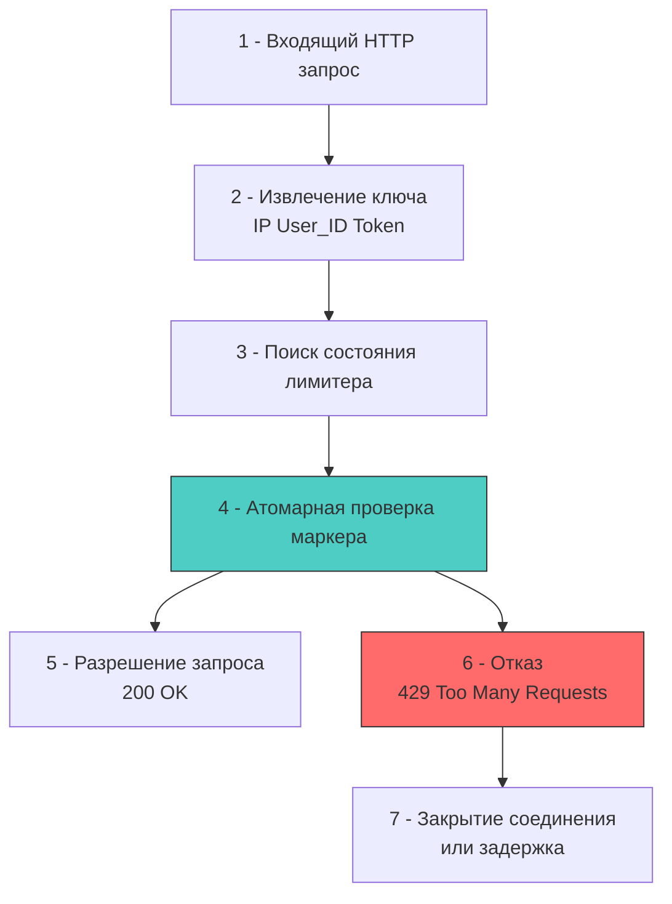

## Архитектурный щит: от алгоритмов к машинным инструкциям

Rate limiting (ограничение частоты запросов) — это не просто «защита от спама», а фундаментальный механизм управления отказоустойчивостью и SLA. В высоконагруженном Go-бэкенде он выступает архитектурным шлюзом, который отсекает избыточный трафик до попадания в бизнес-логику, экономя CPU-циклы, аллокации в куче и соединения с БД.

Для разработчика уровня Senior/Lead важно понимать, что каждый алгоритм ограничения имеет чёткий профиль нагрузки на подсистемы рантайма: частоту блокировок мьютексов, паттерны доступа к кэш-линиям L1/L2, давление на сборщик мусора и количество системных вызовов к сетевому стеку или внешним хранилищам.



## Алгоритмы и их стоимость в рантайме

Выбор алгоритма определяет баланс между точностью, потреблением памяти и предсказуемостью задержек:

1 - **Fixed Window**: Счётчик сбрасывается по таймеру. Прост в реализации, но допускает всплески на границе окна (в два раза выше лимита).
2 - **Sliding Window Log**: Хранит временные метки каждого запроса. Точный, но требует хранения массива `time.Time` и частой очистки. Высокое давление на GC.
3 - **Token Bucket**: Контейнер с маркерами, который пополняется с фиксированной скоростью. Разрешает контролируемые всплески (burst), если маркеры накопились. Идеален для API.
4 - **Leaky Bucket**: Запросы ставятся в очередь и обрабатываются с постоянной скоростью. Сглаживает трафик полностью, но увеличивает latency из-за буферизации.

В стандартной библиотеке Go доминирует Token Bucket через пакет `golang.org/x/time/rate`. Он спроектирован для работы в User Space без внешних зависимостей, но его внутреннее устройство требует понимания при масштабировании.

### Под капотом `golang.org/x/time/rate`

Структура `rate.Limiter` хранит:
- `tokens float64`: текущее количество доступных маркеров.
- `last time.Time`: момент последнего обновления.
- `limit Limit`: скорость пополнения.
- `mu sync.Mutex`: защита от гонок.

При вызове `Allow()` или `Wait()` происходит:
1. Блокировка `mu.Lock()`.
2. Вычисление прошедшего времени `now - last`.
3. Пополнение `tokens += elapsed * float64(limit)`.
4. Проверка `tokens >= 1`. Если да: `tokens--`, возврат `true`.
5. `mu.Unlock()`.

> [!info] Под капотом
> **Проблема Cache Line Bouncing при высокой конкуренции**
> Когда десятки горутин одновременно вызывают `Allow()` на одном `*rate.Limiter`, они конкурируют за один `sync.Mutex`. Протокол когерентности кэша CPU (MESI) постоянно переводит кэш-линию, содержащую `mu` и поля `tokens/last`, в состояние `Invalid` на других ядрах. Это вызывает `cache ping-pong`: ядра вынуждены запрашивать данные по шине QPI/UPI, а не из L1/L2. Латентность блокировки растёт с 10-20 нс до 500+ нс. В терминах планировщика Go это означает накопление горутин в состоянии `mutex wait`, рост тредов ОС и троттлинг сервиса.

## Идиоматичная реализация и оптимизация contention

Для локального rate limiting на множество ключей (IP, API-ключи) нельзя создавать один глобальный `Limiter`. Требуется маппинг `ключ -> лимитер`. Стандартный `map[string]*rate.Limiter` + `sync.Mutex` создаёт ещё большую точку contention.

Решение: **шардирование лимитеров** или `sync.Map` с `LoadOrStore`, либо атомарные счётчики для простых сценариев.

```go
package ratelimit

import (
	"context"
	"net/http"
	"sync"
	"time"

	"golang.org/x/time/rate"
)

// MultiLimiter управляет отдельными лимитерами для каждого ключа
type MultiLimiter struct {
	mu       sync.RWMutex
	limiters map[string]*rate.Limiter
	r        rate.Limit
	burst    int
	ttl      time.Duration
}

func NewMultiLimiter(r rate.Limit, burst int, ttl time.Duration) *MultiLimiter {
	return &MultiLimiter{
		limiters: make(map[string]*rate.Limiter),
		r:        r,
		burst:    burst,
		ttl:      ttl,
	}
}

func (m *MultiLimiter) getLimiter(key string) *rate.Limiter {
	m.mu.RLock()
	l, ok := m.limiters[key]
	m.mu.RUnlock()

	if ok {
		return l
	}

	m.mu.Lock()
	defer m.mu.Unlock()

	// Повторная проверка после захвата write-lock
	if l, ok = m.limiters[key]; ok {
		return l
	}

	l = rate.NewLimiter(m.r, m.burst)
	m.limiters[key] = l
	return l
}

// Middleware ограничивает запросы по IP
func (m *MultiLimiter) Middleware(next http.Handler) http.Handler {
	return http.HandlerFunc(func(w http.ResponseWriter, r *http.Request) {
		key := r.RemoteAddr
		l := m.getLimiter(key)
		
		if !l.Allow() {
			http.Error(w, "429 Too Many Requests", http.StatusTooManyRequests)
			return
		}
		next.ServeHTTP(w, r)
	})
}
```

> [!warning] Ловушка / Gotcha
> **Утечка памяти в `MultiLimiter`**
> Если ключи (IP-адреса, сессионные ID) постоянно меняются, мапа `limiters` будет расти бесконечно, съедая гигабайты RAM. Рантайм Go не собирает записи в мапе автоматически.
> **Решение:** 
> 1 - Использовать `sync.Map` с периодической очисткой.
> 2 - Внедрить TTL-инвалидацию: фоновая горутина раз в N минут проходит по мапе и удаляет неиспользуемые лимитеры.
> 3 - Для высоких нагрузок применять LRU-кэш с фиксированным размером (например, `hashicorp/golang-lru`), где каждый слот содержит `*rate.Limiter`. Это ограничивает память и снижает GC-давление.

## Распределённое ограничение: Redis, Lua и сетевые вызовы

Локальные лимитеры не работают в кластере. Запрос от одного IP попадёт на разные инстансы, и каждый будет считать лимит независимо. Для согласованности требуется распределённое хранилище.

Стандарт индустрии: **Redis + Lua-скрипт**. Lua выполняется атомарно внутри одного потока Redis, что исключает гонки без использования `MULTI/EXEC` и дополнительных `round-trip`.

```lua
-- Lua скрипт для Redis (Token Bucket)
local key = KEYS[1]
local limit = tonumber(ARGV[1])
local window = tonumber(ARGV[2])
local current = redis.call("GET", key)

if current and tonumber(current) >= limit then
    return 0 -- Отказ
end

redis.call("INCR", key)
if current == nil then
    redis.call("EXPIRE", key, window)
end
return 1 -- Разрешено
```

В рантайме Go вызов этого скрипта через `go-redis` или `redigo` выглядит так:

```go
func (r *RedisLimiter) Allow(ctx context.Context, key string) (bool, error) {
	// 🔒 Пайплайнинг и atomic eval в одном syscall к Redis
	res, err := r.client.Eval(ctx, luaScript, []string{key}, 10, 60).Int()
	if err != nil {
		return false, fmt.Errorf("redis eval: %w", err)
	}
	return res == 1, nil
}
```

**Механическое сочувствие:** Каждый `Allow()` теперь требует:
1. Сериализации запроса в RESP-протокол.
2. `syscall write` в сокет Redis.
3. Сетевой round-trip (1-5 мс в кластере, до 0.1 мс в localhost).
4. `syscall read` ответа.
5. Парсинг ответа, аллокация структур `redis.Result`.

При 50k RPS это создаёт 100k системных вызовов в секунду, загружая `netpoll`, планировщик горутин и CPU ядра. Для критичных путей распределённый лимитер часто кешируют локально на 1-2 секунды (приближённая согласованность), либо используют гибридную схему: быстрый локальный `rate.Limiter` как первый эшелон, и точный Redis как второй.

## Сравнение подходов: Go, Java, PHP

| Аспект | Go | Java (Resilience4j/Spring) | PHP (Laravel/Redis) |
|--------|----|----------------------------|---------------------|
| **Модель** | User Space, `x/time/rate`, атомики | Фреймворковые `Limiter`, AOP-интерсепторы | Middleware, часто делегирование в Redis |
| **Конкурентность** | Горутины, `sync.Mutex`, `atomic` | `CompletableFuture`, `ReentrantLock` | Блокирующие процессы (PHP-FPM), нет общего состояния |
| **Аллокации** | Явный контроль, `sync.Pool` | GC поколений, JIT-оптимизации | Цикл запрос-ответ, сборка мусора на каждый запрос |
| **Распределённость** | Ручная интеграция с Redis/Etcd | Spring Cloud Gateway, встроенные провайдеры | Зависит от внешнего кэша, stateless-архитектура |

В Go преимущество — отсутствие фреймворковой магии и полный контроль над примитивами синхронизации. Недостаток — необходимость вручную проектировать шардирование, инвалидацию и обработку сетевых ошибок.

> [!tip] Собеседование
> **Вопрос:** Почему `time.Ticker` или `time.Sleep` не подходят для реализации rate limiting в высоконагруженном сервисе, и как `golang.org/x/time/rate` решает проблему спящих горутин?
> **Ответ:**
> 1 - `time.Ticker` создаёт канал и внутреннюю горутину в рантайме для отправки сигналов. При тысячах лимитеров это тысячи дополнительных горутин, каналов и аллокаций `time.Timer`, что перегружает планировщик.
> 2 - `time.Sleep` блокирует горутину на конкретное время, увеличивая latency и не позволяя обработать другие запросы.
> 3 - `rate.Limiter` использует **ленивое вычисление**: он не спит и не создаёт таймеры. При вызове `Allow()` он просто смотрит на `time.Now()` и вычисляет, сколько маркеров накопилось за прошедшее время. Если маркеров нет — возвращает `false` мгновенно. Для `Wait()` используется `context.Context` и `sync.Cond`, которые эффективно приостанавливают горутину без спин-локов и пробуждений по таймеру. Это минимизирует CPU-нагрузку и аллокации.

## Итог

1 - Rate limiting — архитектурный фильтр, защищающий SLA и ресурсы системы. Выбор алгоритма (Token Bucket, Sliding Window) диктует баланс между точностью, памятью и latency.
2 - `golang.org/x/time/rate` эффективен для локального ограничения, но `sync.Mutex` внутри него создаёт contention и cache line bouncing при высокой конкуренции. Шардирование или атомарные счётки снижают накладные расходы.
3 - Распределённое ограничение через Redis + Lua атомарно, но добавляет сетевые round-trip, системные вызовы и аллокации сериализации. Гибридная схема (локальный + распределённый) оптимальна для микросервисов.
4 - Управление жизненным циклом лимитеров (TTL, LRU, инвалидация) критично для предотвращения утечек памяти в `map[string]*Limiter`.
5 - Идиоматичная реализация в Go требует явного контроля аллокаций, отказа от блокирующих таймеров в пользу ленивых вычислений и проектирования под паттерны доступа к кэш-линиям CPU.

[[3. CORS]]