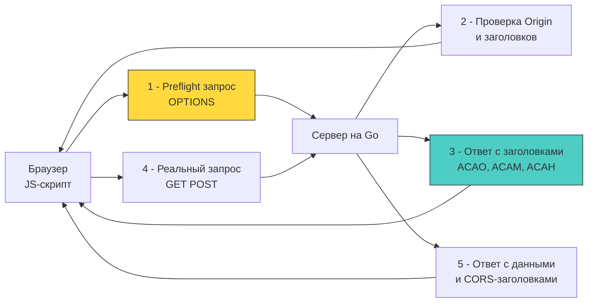

## Архитектура перекрестного домена: от Same-Origin Policy к HTTP-заголовкам

CORS (Cross-Origin Resource Sharing) — это механизм, основанный на HTTP-заголовках, который позволяет веб-браузеру запрашивать ресурсы с другого домена (origin), нарушая стандартную политику одинакового источника (Same-Origin Policy, SOP).

Для разработчика бэкенда на Go важно понимать фундаментальный парадокс CORS: **это не защита сервера, это защита клиента**. Сервер не «отклоняет» запросы без CORS-заголовков; он их обрабатывает. Это браузер, получив ответ, проверяет заголовки и блокирует доступ к данным скрипту на странице, если правила не соблюдены. Инструменты вроде `curl` или Postman игнорируют CORS, так как они не являются браузерным окружением.



### Механика работы и типы запросов

Браузер делит запросы на две категории:
1. **Простые (Simple Requests):** Методы `GET`, `HEAD`, `POST` с безопасными заголовками (`Accept`, `Content-Type` только с `text/plain`, `multipart/form-data`, `application/x-www-form-urlencoded`). Такие запросы отправляются сразу. Если сервер не вернул `Access-Control-Allow-Origin`, браузер обработает ответ, но JS не получит к нему доступ.
2. **Предварительные (Preflight Requests):** Любые другие методы (`PUT`, `DELETE`, `PATCH`) или кастомные заголовки (например, `Authorization`). Браузер сначала шлёт запрос с методом `OPTIONS`. Только если сервер разрешит это через `Access-Control-Allow-Methods`, последует основной запрос.

### Идиоматичная реализация в Go

В стандартной библиотеке `net/http` нет встроенной поддержки CORS. Вы обязаны реализовать её сами через middleware или использовать библиотеки вроде `rs/cors`. Для Senior-разработчика важно понимать, как написать это корректно, без лишней аллокации и с соблюдением протокола.

#### Паттерн Middleware

CORS-заголовки должны присутствовать в ответе на **любой** запрос от клиента, включая `OPTIONS`.

```go
package cors

import (
	"net/http"
	"strings"
)

// CORSMiddleware реализует обработку CORS
func CORSMiddleware(allowedOrigins []string) func(http.Handler) http.Handler {
	// Pre-compile map for O(1) lookup
	allowed := make(map[string]bool, len(allowedOrigins))
	for _, o := range allowedOrigins {
		allowed[strings.ToLower(o)] = true
	}

	return func(next http.Handler) http.Handler {
		return http.HandlerFunc(func(w http.ResponseWriter, r *http.Request) {
			origin := r.Header.Get("Origin")
			
			// Если это CORS-запрос (есть заголовок Origin)
			if origin != "" {
				// Проверка белого списка. Не используйте * с Credentials!
				if _, ok := allowed[strings.ToLower(origin)]; ok {
					w.Header().Set("Access-Control-Allow-Origin", origin)
				}
				
				w.Header().Set("Access-Control-Allow-Methods", "GET, POST, PUT, DELETE, OPTIONS")
				w.Header().Set("Access-Control-Allow-Headers", "Content-Type, Authorization")
				
				// Кэширование результата Preflight (в секундах)
				// Уменьшает количество OPTIONS запросов на клиенте
				w.Header().Set("Access-Control-Max-Age", "3600")

				// Обработка Preflight запроса
				if r.Method == http.MethodOptions {
					w.WriteHeader(http.StatusNoContent) // 204 No Content
					return
				}
				
				// Для простых запросов заголовки уже установлены, 
				// продолжаем цепочку обработки
			}
			
			next.ServeHTTP(w, r)
		})
	}
}
```

### Под капотом: влияние на производительность и соединения

1. **Latency и Preflight:** Каждый `OPTIONS` запрос добавляет полный сетевой RTT (Round-Trip Time) к задержке. В эпоху HTTP/1.1 это было критично, так как браузеры ограничивали количество параллельных соединений (обычно 6) на домен. В HTTP/2 это менее болезненно из-за мультиплексирования, но всё ещё создает нагрузку на сервер.
2. **Парсинг заголовков:** Каждый раз, когда сервер читает `r.Header.Get("Origin")`, происходит поиск в `http.Header` (который является `map[string][]string`). Это быстро, но при 50k RPS создает микроскопическое, но измеримое давление на кэш-линии CPU из-за работы с хеш-таблицами.
3. **Состояние соединения:** `OPTIONS` запрос — это полноценный HTTP-запрос. Он парсится рантаймом, проходит через `net/http` сервер, вызывает аллокацию `http.Request` и `ResponseWriter`. Если вы реализуете `OPTIONS` на уровне балансировщика (Nginx/HAProxy), вы экономите ресурсы Go-процесса.

> [!info] Под капотом
> **Почему `Access-Control-Allow-Origin: *` опасен с куки?**
> Если вы отправляете `Access-Control-Allow-Credentials: true` (чтобы браузер передавал куки сессии), спецификация CORS строго запрещает использовать `*` в качестве разрешенного происхождения.
> 
> **Механика ошибки:** 
> Браузер игнорирует ответ, если видит комбинацию `*` + `Credentials`. Это фундаментальное ограничение безопасности: если разрешено всё, нельзя гарантировать, что запрос инициирован доверенным сайтом, а не фишинговой страницей, которая хочет использовать авторизацию жертвы.
> 
> **Решение:** Сервер должен зеркально отражать `Origin` из запроса (после проверки по белому списку), как показано в примере кода выше.

### Ловушки и уязвимости (Gotchas)

1. **Невалидированное отражение Origin:**
   Частая ошибка — брать заголовок `Origin` и подставлять его в `Access-Control-Allow-Origin` без проверки.
   ```go
   // ❌ ОПАСНО
   w.Header().Set("Access-Control-Allow-Origin", r.Header.Get("Origin"))
   ```
   Это создает уязвимость, позволяющую любому домену (даже `evil.com`) читать ответы вашего API, если пользователь аутентифицирован. Всегда используйте строгий Allowlist (белый список).

2. **Кэширование браузером:**
   Если вы изменили настройки CORS на сервере (например, добавили новый заголовок в `Access-Control-Allow-Headers`), браузер может не узнать об этом немедленно из-за `Access-Control-Max-Age`. Для отладки используйте `curl -v`, так как он не кэширует Preflight результаты.

3. **Wildcards в заголовках:**
   Браузеры поддерживают `Access-Control-Allow-Headers: *` только в ответах на Preflight запросы в современных версиях (Chrome 76+), но для обратной совместимости лучше явно перечислять заголовки (`Authorization, Content-Type`).

> [!tip] Собеседование
> **Вопрос:** Вы видите ошибку CORS в консоли браузера, но при этом запрос в Network Tab завершается со статусом 200 OK. Почему данные не доступны в JS?
> **Ответ:**
> Запрос дошел до сервера и был обработан (200 OK). Но в ответе сервер не вернул заголовок `Access-Control-Allow-Origin` с значением текущего домена страницы, либо браузер заблокировал чтение тела ответа из-за несоответствия заголовков безопасности. Это означает, что проблема на стороне конфигурации сервера (не настроен CORS middleware) или на стороне фронтенда (запрос уходит не туда). Сервер не «блокировал» запрос, браузер заблокировал доступ к *результату*.

> [!warning] Ловушка / Gotcha
> **OPTIONS и аутентификация**
> Запросы `OPTIONS` (Preflight) **не должны** требовать аутентификации (проверки JWT токенов или сессий). Если ваш middleware авторизации проверяет токен ДО CORS middleware, браузер получит 401 Unauthorized на `OPTIONS` запрос, и основной запрос не будет отправлен.
> **Правило:** CORS-обработчик всегда должен быть самым первым в цепочке middleware, чтобы гарантировать ответ 204 на `OPTIONS` без проверки прав доступа.

## Итог

1. CORS — это механизм безопасности браузера. Сервер лишь сигнализирует о готовности принимать запросы извне через HTTP-заголовки.
2. В Go необходимо явно обрабатывать метод `OPTIONS`, возвращая статус 204 и соответствующие заголовки, прежде чем передавать управление бизнес-логике.
3. Использование `Access-Control-Allow-Origin: *` недопустимо в сочетании с `Access-Control-Allow-Credentials: true`. Требуется валидация Origin и его отражение в ответе.
4. Заголовки `Access-Control-Max-Age` критичны для производительности, так как снижают количество лишних Preflight-запросов.
5. Архитектурно верное расположение CORS-middleware — в самом начале цепочки, чтобы он срабатывал до проверок аутентификации и бизнес-валидации.

[[4. API keys]]