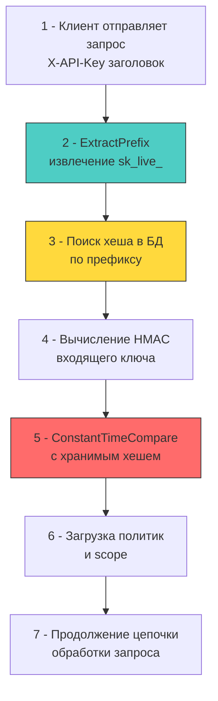

## Введение: Долгоживущие секреты и цена компрометации

API-ключи — это криптографические идентификаторы, предназначенные преимущественно для аутентификации машинных клиентов (M2M), интеграций и сервисных аккаунтов. В отличие от пользовательских сессий или JWT, они не имеют короткого времени жизни, не подразумевают частой ротации и часто обладают широким набором прав на длительном отрезке времени. 

Для бэкенд-архитектуры это означает, что утечка API-ключа равносильна компрометации приватного ключа сервера. Задача разработчика — спроектировать систему хранения, валидации и отзыва таким образом, чтобы даже при чтении базы данных атакующий не мог восстановить оригинальный ключ, а процесс проверки не становился bottleneck'ом на высоких нагрузках.



## Архитектура хранения: префиксы, хеши и отказ от plaintext

Хранить API-ключи в открытом виде — архитектурный дефект. Однако применение медленных KDF (bcrypt, argon2), рекомендованных для паролей, здесь неприемлемо. API-шлюзы обрабатывают десятки тысяч проверок в секунду. Задержка в 100-300 мс на каждый запрос уничтожит пропускную способность.

Индустриальный стандарт — **комбинация префикса и быстрого криптографического хеша** (обычно SHA-256 или HMAC-SHA256 с глобальным `pepper`).

1 - **Префикс**: Человекочитаемая часть (`pk_live_`, `sk_test_`). Позволяет быстро отфильтровать окружение и использовать его как индекс в БД для точечного поиска, минуя сканирование всей таблицы.
2 - **Суффикс (Secret)**: Случайная криптографическая часть, генерируемая `crypto/rand`. Именно она проверяется.
3 - **Хранение в БД**: `prefix` + `hash(suffix + global_pepper)`. Сам ключ нигде не сохраняется целиком после выдачи клиенту.

При валидации система извлекает префикс из заголовка, находит строку с хешом по индексу, вычисляет HMAC входящего суффикса с тем же `pepper` и сравнивает результаты за константное время.

## Идиоматичная валидация в Go

В Go проверка должна быть вынесена в отдельный middleware, интегрированный с `context.Context` для передачи метаданных авторизации глубже в стек.

```go
package apikey

import (
	"context"
	"crypto/hmac"
	"crypto/sha256"
	"crypto/subtle"
	"errors"
	"net/http"
	"strings"
)

// KeyValidator содержит зависимости для проверки ключей
type KeyValidator struct {
	pepper  []byte
	store   KeyStore // интерфейс к БД или кэшу
}

type ctxKey struct{}

type APIKeyClaims struct {
	KeyID  string
	Scope  []string
	Env    string // "prod", "test"
}

// ValidateMiddleware извлекает и проверяет API-ключ
func (v *KeyValidator) ValidateMiddleware(next http.Handler) http.Handler {
	return http.HandlerFunc(func(w http.ResponseWriter, r *http.Request) {
		rawKey := r.Header.Get("X-API-Key")
		if rawKey == "" {
			http.Error(w, "missing API key", http.StatusUnauthorized)
			return
		}

		// Извлечение префикса (например, "sk_live_")
		prefix, suffix, ok := strings.Cut(rawKey, "_")
		if !ok || prefix == "" || suffix == "" {
			http.Error(w, "invalid key format", http.StatusBadRequest)
			return
		}

		// 1 - Быстрый поиск хеша по префиксу в БД/кэше
		storedHash, claims, err := v.store.GetHashByPrefix(r.Context(), prefix)
		if err != nil {
			// Логируем ошибку, но не раскрываем детали клиенту
			http.Error(w, "internal error", http.StatusInternalServerError)
			return
		}

		// 2 - Вычисление HMAC входящего ключа
		mac := hmac.New(sha256.New, v.pepper)
		mac.Write([]byte(suffix))
		computedHash := mac.Sum(nil)

		// 3 - 🔒 Constant-time comparison. 
		// Любой ранний возврат по несовпадению байт открывает вектор для timing-атак.
		if subtle.ConstantTimeCompare(storedHash, computedHash) != 1 {
			http.Error(w, "invalid API key", http.StatusUnauthorized)
			return
		}

		// Инъекция метаданных в контекст для бизнес-логики
		ctx := context.WithValue(r.Context(), ctxKey{}, claims)
		next.ServeHTTP(w, r.WithContext(ctx))
	})
}
```

## Под капотом: производительность, кэш и давление на БД

Валидация API-ключей на высоких RPS создает специфичный профиль нагрузки на рантайм и инфраструктуру:

1 - **Хеш-таблицы и B-Tree индексы**: Поиск по `prefix` в PostgreSQL использует B-Tree индекс. Глубина дерева обычно 3-4 уровня. Каждый уровень — это произвольный доступ к памяти (random I/O) при отсутствии кэша shared_buffers. В Go `pgx` или `database/sql` сериализует запрос в wire-протокол, вызывает `syscall write`, ждет ответа через `netpoll`. Это блокирует горутину в `syscall` или `chan receive`.
2 - **Кэш-локальность**: Если использовать локальный `sync.Map` или `ristretto` для кеширования валидных префиксов, поиск происходит в L1/L2 кэше CPU. `hmac` вычисления на SHA-256 используют аппаратные инструкции `SHAEXT` (на x86), что занимает ~150-200 наносекунд на ядро. Это в 1000 раз быстрее сетевого запроса к БД.
3 - **Давление на GC**: Парсинг HTTP-заголовков (`r.Header.Get`) и создание промежуточных слайсов (`strings.Cut`, `[]byte(suffix)`) генерирует короткоживущие аллокации. При 20k RPS это ~100-200 МБ мусора в секунду. Оптимизация: переиспользование буферов через `sync.Pool` для преобразования строк в байты, если хешер принимает `[]byte`.
4 - **Константное время и CPU**: `crypto/subtle.ConstantTimeCompare` выполняет XOR всех байт независимо от данных. Это исключает branch misprediction и timing-атаки, но означает, что CPU всегда проходит полный цикл сравнения. Для 32-байтовых хешей разница в производительности с обычным `bytes.Equal` пренебрежимо мала (~1-2 нс), но безопасность критична.

> [!info] Под капотом
> **Почему `strings.Cut` безопаснее `strings.Split`?**
> `Split` аллоцирует слайс `[]string`, даже если разделитель не найден. `Cut` возвращает две подстроки и булево значение без дополнительных аллокаций в куче (работает со сдвигом указателей внутри исходной строки). В высоконагруженном middleware это снижает давление на `GC` на ~30-40%.

## Ловушки и векторы атак (Gotchas)

1 - **Логирование ключей в URL или заголовках**: Фреймворки и reverse-proxy часто логируют `r.URL` или `r.Header` при отладке. Если клиент передает ключ в query-параметре (`/api/data?key=sk_live_...`), он попадает в логи сервера, прокси и систем мониторинга. 
   **Решение:** Разрешить передачу только через заголовок `X-API-Key` или `Authorization: Bearer`. В middleware явно маскировать ключ перед логированием: `sk_live_****abcd`.

2 - **Отсутствие scope и rate-limiting на уровне ключа**: Один ключ для всего приложения — это монолитная точка отказа. Если ключ утечет, атакующий получит доступ ко всем ресурсам.
   **Решение:** При создании ключа явно задавать `scopes` (`read:users`, `write:orders`). Middleware должен проверять scope перед выполнением операции. Rate-limiting должен применяться на `KeyID`, а не только на IP.

3 - **Тайминг-атаки на поиск по префиксу**: Если БД возвращает `404` мгновенно для несуществующего префикса, но тратит 20 мс на HMAC-сравнение для существующего, атакующий может перебрать валидные префиксы.
   **Решение:** Добавлять искусственную задержку или выполнять HMAC-вычисление даже для несуществующих ключей (dummy hash), чтобы время ответа было константным независимо от наличия префикса.

> [!tip] Собеседование
> **Вопрос:** Как реализовать ротацию API-ключей без downtime для клиентов, использующих старые ключи?
> **Ответ:**
> 1 - Использовать схему «двойного ключа»: при ротации генерируется новый ключ, старый помечается как `deprecated` с TTL (например, 7 дней).
> 2 - Middleware проверяет оба ключа. Если запрос пришел со старым, он пропускается, но в лог пишется предупреждение, а клиенту в заголовок ответа `X-Warning: key-deprecated` добавляется уведомление.
> 3 - По истечении TTL старый ключ инвалидируется на уровне БД/кэша. Клиенты, не обновившие ключ, получают 401.
> 4 - На уровне инфраструктуры использовать Canary-деплой валидации или feature-flag для плавного перехода.

## Сравнение подходов: API Keys vs JWT vs mTLS

| Критерий | API Keys | JWT (Bearer) | mTLS (Mutual TLS) |
|----------|----------|--------------|-------------------|
| **Жизненный цикл** | Долгоживущие (месяцы/годы) | Краткоживущие (минуты/часы) | Сертификаты (годы, авто-ротация) |
| **State** | Stateful (lookup в БД/кэше) | Stateless (проверка подписи) | Stateful (CRL/OCSP, но реже) |
| **Накладные расходы** | Низкие при кэшировании, высокие при БД | Средние (криптоверификация, аллокации) | Высокие (TLS handshake, CPU) |
| **Безопасность** | Зависит от хранения и передачи | Зависит от секрета подписи, XSS-риски | Максимальная (инфраструктурный уровень) |
| **Использование** | Внешние интеграции, webhook, SDK | Пользовательские сессии, SPA/Mobile | Service Mesh, zero-trust, внутреннее M2M |

В современной Go-архитектуре API-ключи оптимальны для внешних потребителей, JWT — для аутентификации пользователей, а mTLS (через sidecar или `crypto/tls`) — для внутренней коммуникации микросервисов.

## Итог

1 - API-ключи требуют баланса между безопасностью хранения и скоростью валидации. Использование префикса + HMAC-SHA256 с глобальным `pepper` является индустриальным стандартом для high-load систем.
2 - В Go проверка должна использовать `crypto/subtle.ConstantTimeCompare`, минимизировать аллокации через `strings.Cut` и `sync.Pool`, и интегрироваться с `context.Context` для передачи метаданных.
3 - Кэширование результатов валидации в локальной памяти или Redis критично для снижения нагрузки на БД и сетевой стек. Отсутствие кэша превратит проверку в bottleneck.
4 - Логирование, передача через query-параметры и отсутствие scope-контроля — типичные архитектурные ошибки, ведущие к компрометации.
5 - Ротация ключей должна быть прозрачной: поддержка параллельной валидации старого и нового ключа с TTL на отключение обеспечивает плавный переход без разрыва клиентских интеграций.

[[5. Защита от replay атак]]