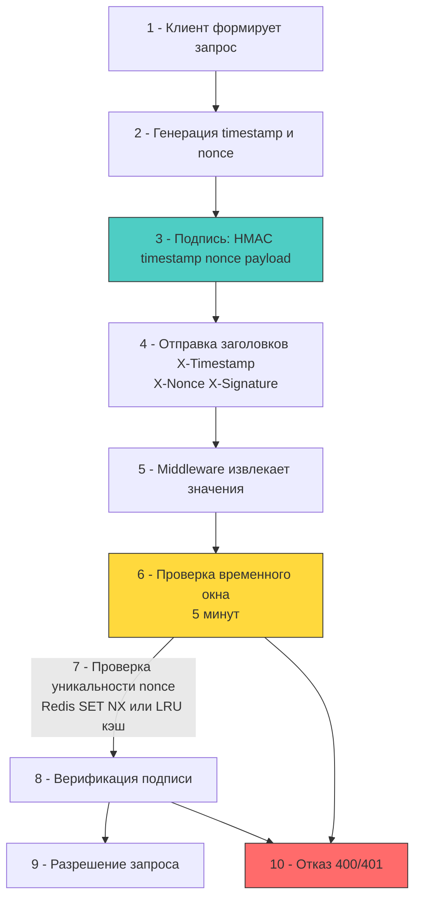

## Архитектура защиты: от одноразовых номеров к криптографическим подписям

Replay-атака (атака повторного воспроизведения) возникает, когда атакующий перехватывает валидный сетевой запрос (например, с авторизационным заголовком или подписью) и повторно отправляет его без изменений. Сервер, не имея механизма отслеживания уникальности, обрабатывает запрос как легитимный, что приводит к дублированию финансовых операций, повторному списанию баланса или обходу однократных ограничений.

В высоконагруженном бэкенде на Go защита от replay-атак строится на комбинации трёх криптографических примитивов: временного окна, уникального идентификатора (nonce) и криптографической привязки. Реализация требует баланса между строгостью проверок, задержками сетевого стека и потреблением памяти.



## Механизмы защиты и их комбинация

1 - **Временное окно (Timestamp)**: Клиент прикладывает текущее время Unix. Сервер сверяет его с `time.Now()`. Если разница превышает допустимый порог (обычно 1-5 минут), запрос отклоняется. Это ограничивает жизнь перехваченного пакета.
2 - **Одноразовый номер (Nonce)**: Криптографически стойкий случайный идентификатор, генерируемый для каждого запроса. Сервер сохраняет его на время, равное длительности временного окна. Повторное использование nonce приводит к отказу.
3 - **Криптографическая привязка (Signature)**: Timestamp и nonce включаются в тело, по которому вычисляется HMAC. Это предотвращает манипуляции атакующим: изменить timestamp или nonce без знания секрета невозможно, так как подпись станет невалидной.

Разделение этих механизмов критично. Без nonce атака возможна внутри временного окна. Без timestamp хранилище nonce раздуется до бесконечности. Без подписи атакующий может подставить свои значения и обойти проверку.

## Идиоматичная реализация в Go

В Go защита реализуется как middleware, который извлекает заголовки, проверяет окно, валидирует nonce через атомарную операцию и верифицирует подпись. Для распределённых систем используется Redis, для монолитов или edge-сервисов — локальный LRU-кэш.

```go
package replay

import (
	"context"
	"crypto/hmac"
	"crypto/sha256"
	"crypto/subtle"
	"errors"
	"fmt"
	"net/http"
	"strconv"
	"sync"
	"time"
)

// AntiReplayMiddleware проверяет запрос на повторное воспроизведение
type AntiReplayMiddleware struct {
	secret    []byte
	window    time.Duration
	maxDrift  time.Duration
	nonceStore NonceStore // интерфейс для сохранения nonce с TTL
}

type NonceStore interface {
	Store(ctx context.Context, nonce string, ttl time.Duration) (bool, error)
}

func (m *AntiReplayMiddleware) ServeHTTP(next http.Handler) http.Handler {
	return http.HandlerFunc(func(w http.ResponseWriter, r *http.Request) {
		tsStr := r.Header.Get("X-Timestamp")
		nonce := r.Header.Get("X-Nonce")
		signature := r.Header.Get("X-Signature")

		if tsStr == "" || nonce == "" || signature == "" {
			http.Error(w, "missing anti-replay headers", http.StatusBadRequest)
			return
		}

		// 1 - Парсинг и проверка временного окна
		reqTime, err := strconv.ParseInt(tsStr, 10, 64)
		if err != nil {
			http.Error(w, "invalid timestamp", http.StatusBadRequest)
			return
		}

		now := time.Now().Unix()
		if now-reqTime > int64(m.window.Seconds()) || now-reqTime < -int64(m.maxDrift.Seconds()) {
			http.Error(w, "request expired or clock skew too large", http.StatusUnauthorized)
			return
		}

		// 2 - Атомарная проверка nonce. SET NX гарантирует, что только первый запрос пройдёт.
		ok, err := m.nonceStore.Store(r.Context(), nonce, m.window)
		if err != nil {
			http.Error(w, "nonce check failed", http.StatusInternalServerError)
			return
		}
		if !ok {
			http.Error(w, "replay attempt detected", http.StatusConflict)
			return
		}

		// 3 - Верификация подписи. Привязываем timestamp и nonce к payload.
		mac := hmac.New(sha256.New, m.secret)
		mac.Write([]byte(tsStr))
		mac.Write([]byte(nonce))
		// В реальном коде здесь добавляется тело запроса или его хеш
		expected := mac.Sum(nil)

		if subtle.ConstantTimeCompare([]byte(signature), expected) != 1 {
			http.Error(w, "invalid signature", http.StatusUnauthorized)
			return
		}

		next.ServeHTTP(w, r)
	})
}
```

## Под капотом: время, атомарность и давление на память

Реализация антиповтора напрямую затрагивает низкоуровневые механизмы ОС и рантайма Go:

1 - **Получение времени (`time.Now`)**: В Linux `time.Now()` вызывает системный вызов `clock_gettime(CLOCK_REALTIME)`. На современных ядрах это выполняется через VDSO (Virtual Dynamic Shared Object) без перехода в Kernel Space, что занимает ~10-30 нс. Однако при значительном рассинхронизации NTP или ручном изменении времени сервера проверка может давать ложные срабатывания.
2 - **Атомарность хранения nonce**: В Redis используется `SET key value NX PX <ttl>`. Команда выполняется в одном потоке Redis, что исключает гонки. В рантайме Go это один `syscall write/read` в сокет. При 10k RPS это создаёт 10k сетевых round-trip в секунду. Для снижения latency применяется локальный кэш (`sync.Map` или `ristretto`) с фоновой синхронизацией или шардированием по хешу nonce.
3 - **Память и GC**: Хранение nonce в памяти без TTL приводит к линейному росту потребления RAM. Каждый новый запрос аллоцирует строку для ключа. Сборщик мусора не очищает записи в `map` автоматически. Идиоматичное решение: использовать структуры с явным сроком жизни, фоновый worker для очистки или LRU-алгоритм с фиксированным размером, что ограничивает давление на `GC` и предотвращает `OOM Killer`.
4 - **Константное сравнение**: `crypto/subtle.ConstantTimeCompare` выполняется за фиксированное количество тактов CPU независимо от позиции первого несовпадающего байта. Это предотвращает timing-атаки, при которых атакующий измеряет время ответа для подбора сигнатуры. На x86_64 это реализуется через инструкции `XOR` и `OR`, исключающие ветвления (`JNE`/`JE`), что стабилизирует предсказатель переходов (Branch Predictor).

> [!warning] Ловушка / Gotcha
> **Гонка условий при проверке nonce в локальном кэше**
> Если использовать обычную `map[string]bool` с `sync.RWMutex` для хранения nonce, возникает окно между `RLock` (проверка существования) и `Lock` (вставка). Два параллельных запроса с одинаковым nonce могут оба пройти проверку и вставиться, сломав защиту.
> **Решение:** Использовать атомарные операции хранилища. В Redis это `SET NX`. В локальном Go-коде — `sync.Map` не подходит, так как `LoadOrStore` не возвращает флаг "было ли значение уже записано ранее" для TTL-инвалидации. Правильный паттерн: `singleflight.Group` для дедупликации запросов или `atomic.Pointer` с lock-free алгоритмами, либо делегирование проверки в распределённое хранилище с гарантированной атомарностью.

> [!tip] Собеседование
> **Вопрос:** В чём архитектурная разница между Idempotency Key и Anti-Replay Nonce, и почему их нельзя заменять друг другом?
> **Ответ:**
> 1 - **Idempotency Key** гарантирует, что повторный запрос с тем же ключом вернёт *тот же результат*, но не выполнит действие заново. Он привязан к бизнес-операции и живёт долго (дни/недели). Используется для безопасных повторных отправок при сетевых таймаутах.
> 2 - **Anti-Replay Nonce** гарантирует, что запрос *никогда не будет обработан дважды*, независимо от контекста. Он живёт мало (минуты) и служит исключительно для защиты от перехвата.
> 3 - Замена nonce на idempotency key опасна: при сбое сети клиент может отправить запрос дважды, idempotency-система вернёт кэшированный ответ, но если сервер перезагрузится и потеряет состояние, nonce-защита сработает корректно, а idempotency может пропустить дубликат.
> 4 - **В Go**: Idempotency часто реализуется через `redis SETNX` с долгим TTL и хранением ответа. Anti-Replay — через короткоживущий `SETNX` + криптографическую привязку к payload.

## Итог

1 - Защита от replay-атак требует комбинации временного окна, уникального nonce и криптографической подписи, связывающей эти параметры с телом запроса.
2 - В рантайме Go проверка времени использует VDSO для минимизации syscalls, но требует учёта сетевого рассинхронизования часов.
3 - Хранение nonce должно быть атомарным (`SET NX` в Redis или lock-free структуры в памяти) для предотвращения гонок при параллельных запросах.
4 - Память под nonce ограничивается через TTL и LRU-эвикцию, иначе неограниченный рост мапы приведёт к давлению на `GC` и `OOM` процесса.
5 - `crypto/subtle.ConstantTimeCompare` обязателен для верификации подписи, чтобы исключить timing-атаки на уровне предсказателя ветвлений CPU.

[[6. Secure headers]]