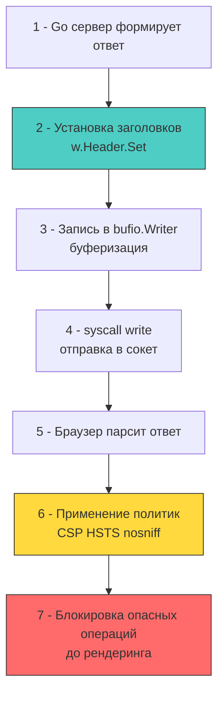

## HTTP-заголовки как политики безопасности на границе доверия

Secure HTTP Headers — это не метаданные для отладки, а строгие директивы, которые браузер применяет до начала рендеринга или выполнения скриптов. Они формируют последний рубеж защиты на клиентской стороне, дополняя серверную валидацию и криптографические механизмы. Для разработчика бэкенда на Go понимание их работы означает умение правильно настраивать `net/http` сервер, минимизировать накладные расходы на сериализацию и избегать конфликтов с современными сетевыми протоколами.



## Ключевые заголовки и механизм enforcement

Каждый заголовок решает конкретную задачу безопасности. Смешивание их целей или дублирование функционала ведёт к конфликтам политик и ложному чувству защищённости.

1 - `Strict-Transport-Security (HSTS)`: Принудительно переводит все запросы к домену на HTTPS на заданный период (`max-age`). Браузер сохраняет правило в внутренней таблице. При попытке открыть `http://...` браузер локально редиректит на `https://` до установления TCP-соединения, что исключает SSL-stripping атаки на уровне сети.
2 - `Content-Security-Policy (CSP)`: Декларативный список разрешённых источников для скриптов, стилей, фреймов, шрифтов и изображений. Браузер парсит директивы до выполнения JS. Нарушение CSP не блокирует загрузку страницы, но подаёт `Refused to load` в консоль и отправляет `report-uri`/`report-to` для аудита.
3 - `X-Content-Type-Options: nosniff`: Отключает MIME-сниффинг. Браузер строго следует `Content-Type`, указанному сервером. Без этого заголовок IE/Chrome могли интерпретировать `.txt` файл с JS-кодом как исполняемый скрипт, открывая вектор для XSS.
4 - `Referrer-Policy`: Контролирует передачу заголовка `Referer` при переходах. `strict-origin-when-cross-origin` скрывает путь и query-параметры при кросс-доменных запросах, защищая токены и сессионные идентификаторы от утечки.
5 - `Permissions-Policy`: Ограничивает доступ к аппаратным API браузера (камера, микрофон, геолокация, акселерометр). Заменяет устаревший `Feature-Policy` и работает на уровне инициализации iframe или основного документа.

> [!info] Под капотом
> **Почему `X-` заголовки считаются deprecated?**
> Заголовки `X-XSS-Protection`, `X-Frame-Options`, `X-Content-Type-Options` исторически вводились браузерами как экспериментальные расширения. Современный стандарт IETF требует удаления префикса `X-` после стабилизации спецификации. 
> `X-XSS-Protection` признан вредным: он включал неэффективные фильтры, которые атакующие обходили через полиморфные пейлоады, создавая иллюзию защиты. В современных браузерах (Chrome 78+, Safari 16+) он игнорируется. 
> `X-Frame-Options` заменён на `Content-Security-Policy: frame-ancestors`, который даёт гранулярный контроль над встраиванием. Оставлять `X-` заголовки в продакшене — технический долг, который усложняет аудит и увеличивает размер ответа.

## Под капотом: HTTP/2 HPACK, bufio и syscall write

В Go заголовки обрабатываются пакетом `net/http`. При вызове `w.Header().Set(key, value)` запись попадает в `http.Header`, который является `map[string][]string`. Это создаёт скрытые накладные расходы:

1 - **Аллокации мапы**: `http.Header` инициализируется лениво. Каждый `Set` вызывает `make([]string, 1)` или `append` для слайса значений. При 50k RPS это генерирует сотни тысяч короткоживущих объектов, нагружая `GC`.
2 - **HTTP/2 и HPACK сжатие**: Протокол HTTP/2 использует HPACK для сжатия заголовков. Он поддерживает статическую таблицу индексации (стандартные заголовки) и динамическую таблицу для пользовательских. `HSTS`, `CSP` и `nosniff` попадают в сжатый фрейм `HEADERS` с минимальным оверхедом. Однако порядок установки не влияет на размер сжатого пакета в HTTP/2, но критичен для HTTP/1.1 прокси, которые могут обрезать ответ при превышении лимита заголовков (обычно 8 КБ).
3 - **Буферизация и syscall**: Заголовки записываются в `bufio.Writer` внутреннего `*http.response`. Вызов `next.ServeHTTP(w, r)` не отправляет данные сразу. Только при первом `w.Write()` или `w.WriteHeader()` буфер сбрасывается через `syscall.Write` (Linux) или `WriteFile` (Windows). Это означает, что модификация заголовков после начала записи тела ответа игнорируется или вызывает панику.

```go
package security

import (
	"net/http"
	"sync"
)

// precomputedHeaders инициализируется один раз, исключая аллокации мапы на каждый запрос
var precomputedHeaders http.Header
var initHeaders sync.Once

func getSecureHeaders() http.Header {
	initHeaders.Do(func() {
		precomputedHeaders = make(http.Header, 7)
		precomputedHeaders.Set("Strict-Transport-Security", "max-age=63072000; includeSubDomains; preload")
		precomputedHeaders.Set("X-Content-Type-Options", "nosniff")
		precomputedHeaders.Set("X-Frame-Options", "DENY") // Legacy, но полезно для старых браузеров
		precomputedHeaders.Set("Referrer-Policy", "strict-origin-when-cross-origin")
		precomputedHeaders.Set("Permissions-Policy", "camera=(), microphone=(), geolocation=()")
		precomputedHeaders.Set("Content-Security-Policy", "default-src 'self'; script-src 'self'; object-src 'none'")
	})
	return precomputedHeaders
}

// SecureHeadersMiddleware эффективно применяет политики безопасности
func SecureHeadersMiddleware(next http.Handler) http.Handler {
	return http.HandlerFunc(func(w http.ResponseWriter, r *http.Request) {
		headers := getSecureHeaders()
		
		// 🔒 Прямое копирование в ответный writer.
		// В Go 1.21+ maps.Copy или ручной цикл эффективнее, чем w.Header().Set() в цикле,
		// так как избегает повторных поисков в хеш-таблице и аллокаций слайсов.
		for key, values := range headers {
			for _, value := range values {
				w.Header().Add(key, value)
			}
		}

		next.ServeHTTP(w, r)
	})
}
```

## Ловушки и архитектурные риски

1 - **CSP `unsafe-inline` и nonce-генерация**: Использование `'unsafe-inline'` в CSP полностью нейтрализует защиту от XSS. Правильный подход — динамическая генерация криптографического `nonce` для каждого запроса и встраивание его в тег `<script nonce="...">`. В Go это требует интеграции с генератором `crypto/rand` и передачи значения в шаблон. Кэширование HTML-страниц с CSP ломает nonce-механизм, так как nonce должен быть уникальным для каждого HTTP-ответа.
2 - **HSTS `max-age` и Preload List**: Установка `max-age=31536000` (1 год) с `includeSubDomains` означает, что откатить HTTP на год будет невозможно без очистки кэша браузера. Добавление домена в HSTS Preload List (встроен в Chrome/Firefox/Safari) — это irreversible операция. Удаление из списка занимает месяцы. Тестируйте политику с `max-age=0` и `report-only` перед продакшен-деплоем.
3 - **Размер заголовков и HTTP/431**: Современные балансировщики и `net/http` серверы ограничивают размер заголовков (по умолчанию 1 МБ в Go, но часто 8-16 КБ в прокси). CSP-директивы с длинными URI или hashes могут превысить лимит, вызывая `431 Request Header Fields Too Large` или `ERR_RESPONSE_HEADERS_TOO_BIG` на клиенте. Оптимизация: выносить длинные списки доменов в отдельные конфигурационные эндпоинты или использовать `frame-src` вместо `default-src` с гранулярным контролем.
4 - **Порядок middleware**: Security Headers должны устанавливаться **до** middleware авторизации, валидации и бизнес-логики. Если хендлер возвращает `500 Internal Server Error` до установки заголовков, клиент получит ответ без политик безопасности. Используйте глобальный `http.Server.Handler` или `chi`/`gorilla` роутер на верхнем уровне.

> [!tip] Собеседование
> **Вопрос:** Как браузер обрабатывает CSP в контексте HTTP/2 Server Push и prefetch, и почему Go-разработчику это важно?
> **Ответ:**
> 1 - HTTP/2 Server Push позволяет серверу заранее отправить ресурсы до запроса клиента. CSP применяется к push-ресурсам так же, как к обычным: если источник не в `script-src` или `style-src`, браузер отбрасывает push-фрейм.
> 2 - В Go `http.Pusher` интерфейс доступен через type assertion `w.(http.Pusher)`. Если вы используете Server Push без учёта CSP, вы генерируете бесполезный трафик и забиваете соединение.
> 3 - **Архитектурный вывод:** Всегда синхронизируйте CSP-политики с конфигурацией HTTP/2 push и `link rel="preload"`. Асинхронная загрузка ресурсов должна явно разрешаться в заголовках, иначе браузер будет логировать CSP-violations, увеличивая нагрузку на `report-uri` эндпоинт.

## Итог

1 - Secure HTTP Headers — это декларативные политики безопасности, применяемые браузером до выполнения кода. Они дополняют серверную защиту, но не заменяют её.
2 - Устаревшие `X-` заголовки игнорируются современными браузерами. Индустриальный стандарт сместился к `CSP`, `Permissions-Policy` и `Referrer-Policy`.
3 - В рантайме Go заголовки аллоцируются в `http.Header` мапе. Преинициализация и пакетное применение снижают давление на `GC` и ускоряют обработку в высоконагруженных сценариях.
4 - HPACK в HTTP/2 эффективно сжимает стандартные заголовки, но CSP-директивы с hashes/nonces могут увеличивать размер ответа и влиять на буферизацию `bufio.Writer`.
5 - Архитектурно верное размещение middleware безопасности — на самом верхнем уровне обработки запроса, до авторизации и бизнес-валидации, чтобы политики применялись даже к ответам с ошибками.

[[1. Secrets management]]