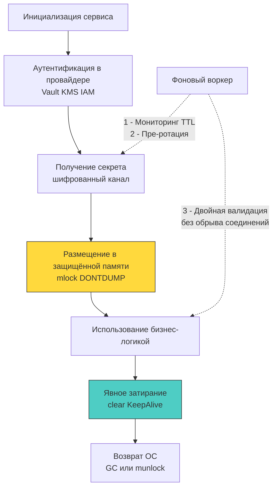

## Философия управления секретами: от `.env` к динамическим идентичностям

Секреты — это не конфигурационные параметры. Это криптографические материалы, пароли, ключи шифрования и токены доступа, утечка которых ведёт к немедленной компрометации инфраструктуры. Исторически бэкенд-разработка полагалась на переменные окружения (`ENV`) и `.env` файлы. С архитектурной точки зрения это антипаттерн: переменные окружения наследуются дочерними процессами, попадают в дампы памяти, логируются метриками и доступны через файловую систему ОС (`/proc/<pid>/environ`).

В современных высоконагруженных системах на Go управление секретами строится на трёх принципах:
1 - **Никаких секретов в статических конфигурациях** (бинарники, репозиторий, `.env`).
2 - **Динамическая доставка и краткосрочный жизненный цикл**. Секреты загружаются в рантайме, валидируются и автоматически ротируются.
3 - **Минимизация времени жизни в памяти**. Чувствительные данные должны находиться в RAM ровно столько, сколько требуется для операции, и гарантированно затираться после использования.



## Под капотом ОС и рантайма: где на самом деле живут секреты

Когда вы вызываете `os.Getenv("DB_PASSWORD")`, Go обращается к системному вызову `getenv` (или напрямую к `libc`/`vDSO`), который возвращает указатель на область памяти процесса, выделенную ядром при `execve`. Эта область:
- Доступна на чтение любому процессу с тем же UID или root-доступом через `/proc/<pid>/environ`.
- Наследуется при `fork`/`clone`, попадая в дочерние процессы.
- Не защищена от попадания в swap-раздел. Ядро может вытеснить страницы с секретами на диск, где они останутся в plaintext даже после перезагрузки.
- Попадает в core dump при `panic` или `SIGSEGV`, если не настроен `prctl(PR_SET_DUMPABLE, 0)`.

В рантайме Go ситуация усугубляется моделью работы `GC`. Строки и слайсы, содержащие секреты, проходят Escape Analysis и аллоцируются в куче. `GC` в Go не перезаписывает освобождаемую память нулями. Секрет остаётся в "свободных" страницах до тех пор, пока аллокатор не переиспользует этот участок для новых объектов. Атакующий, получивший доступ к дампу кучи или использующий уязвимость чтения памяти, может восстановить секреты статистическим анализом или паттерн-матчингом.

## Идиоматичные паттерны загрузки и защиты памяти в Go

Безопасная работа с секретами в Go требует явного контроля над жизненным циклом памяти и интеграции с внешними провайдерами.

```go
package secrets

import (
	"context"
	"crypto/subtle"
	"fmt"
	"runtime"
	"syscall"
	"time"
)

// SecureBuffer представляет защищённый буфер в памяти
type SecureBuffer struct {
	data []byte
	size int
}

// NewSecureBuffer аллоцирует буфер и блокирует его в памяти
func NewSecureBuffer(size int) (*SecureBuffer, error) {
	// Аллокация выровненного буфера
	buf := make([]byte, size)
	
	// mlock предотвращает вытеснение страниц в swap
	if err := syscall.Mlock(buf); err != nil {
		return nil, fmt.Errorf("mlock failed: %w", err)
	}
	
	// MADV_DONTDUMP исключает страницу из core dump (Linux 2.6.16+)
	syscall.Madvise(buf, syscall.MADV_DONTDUMP)
	
	return &SecureBuffer{data: buf, size: size}, nil
}

// Fill безопасно копирует данные и затирает буфер при выходе
func (b *SecureBuffer) Fill(source []byte) error {
	if len(source) > b.size {
		return fmt.Errorf("source exceeds buffer capacity")
	}
	copy(b.data, source)
	return nil
}

// Wipe гарантирует обнуление и разблокировку
func (b *SecureBuffer) Wipe() {
	if b.data == nil {
		return
	}
	// clear встроен в Go 1.21+. Компилятор встраивает цикл обнуления.
	clear(b.data)
	runtime.KeepAlive(b.data) // Запрещает Dead Store Elimination
	syscall.Munlock(b.data)   // Возвращает страницу ОС для управления
	b.data = nil
}

// ConstantCompare безопасное сравнение без раннего возврата
func (b *SecureBuffer) ConstantCompare(other []byte) bool {
	if len(other) != b.size {
		return false
	}
	return subtle.ConstantTimeCompare(b.data, other) == 1
}
```

> [!info] Под капотом
> **Почему `runtime.KeepAlive` обязателен после `clear()`?**
> Компилятор Go выполняет оптимизацию Dead Store Elimination (DSE). Если переменная больше не используется после цикла обнуления, оптимизатор может удалить вызов `clear()` полностью, посчитав его бесполезным. `runtime.KeepAlive(slice)` сообщает компилятору, что ссылка на слайс "жива" до этой точки, гарантируя выполнение инструкций обнуления. В production-сборках (`-gcflags="-l -N"`) поведение может меняться, поэтому явный вызов `KeepAlive` — стандарт индустрии для криптографических операций.

## Жизненный цикл, ротация и нулевой downtime

Статическая загрузка секрета при старте приложения (`init()` или `main()`) создаёт архитектурный дефект: для смены пароля требуется деплой или рестарт. В распределённых системах это неприемлемо.

Индустриальный подход — **асинхронная ротация с двойной валидацией**:
1 - Приложение загружает `SecretVersion: v1`.
2 - Фоновый воркер опрашивает провайдер (Vault, AWS Secrets Manager) за новой версией.
3 - При обнаружении `v2` воркер атомарно обновляет кэш в памяти (`atomic.Pointer` или `sync/atomic.Value`).
4 - Мидлвари или драйверы БД используют **двойную проверку**: сначала `v2`, при ошибке аутентификации фоллбэк на `v1` в течение grace-period (обычно 5-15 минут).
5 - По истечении grace-period `v1` инвалидируется и стирается из памяти.

```go
package secrets

import (
	"sync/atomic"
	"time"
)

// RotatingSecret хранит активную и предыдущую версии секрета
type RotatingSecret struct {
	current    atomic.Pointer[SecureBuffer]
	previous   atomic.Pointer[SecureBuffer]
	graceEnd   time.Time
	mu         sync.RWMutex // Для защиты graceEnd
}

func (r *RotatingSecret) Rotate(newSecret *SecureBuffer, gracePeriod time.Duration) {
	old := r.current.Swap(newSecret)
	if old != nil {
		r.previous.Store(old)
		r.mu.Lock()
		r.graceEnd = time.Now().Add(gracePeriod)
		r.mu.Unlock()
	}
}

func (r *RotatingSecret) GetActive() *SecureBuffer {
	r.mu.RLock()
	now := time.Now()
	expired := now.After(r.graceEnd)
	r.mu.RUnlock()
	
	if expired {
		prev := r.previous.Swap(nil)
		if prev != nil {
			prev.Wipe() // Окончательное уничтожение
		}
	}
	
	return r.current.Load()
}
```

## Ловушки и архитектурные антипаттерны

1 - **Логирование и трассировка**: Фреймворки (`gin`, `chi`, `otel`) часто логируют заголовки или метки. Секреты в `Authorization` или кастомных заголовках попадают в Loki/ELK. **Решение:** Централизованный `redactMiddleware`, который маскирует значения через `strings.Replacer` до передачи в логгер.
2 - **`os/exec` и наследование**: `exec.Command` наследует все переменные окружения родителя. Если процесс запущен с `DB_PASS`, дочерний утилита получит его. **Решение:** Явно задавать `cmd.Env = nil` или передавать только разрешённые переменные.
3 - **Паники и `recover()`**: При `panic` стек разворачивается, но если в нём есть строки с секретами, они остаются в дампе. **Решение:** Отключать core dumps на уровне ОС (`sysctl kernel.core_pattern=/dev/null`) или использовать `runtime/debug.SetCrashDump(false)` (если доступно в версии), плюс `MADV_DONTDUMP`.
4 - **Сторонние библиотеки и рефлексия**: Библиотеки вроде `viper` или `dotenv` загружают всё в память и кэшируют. Для secrets они не подходят. Используйте прямые вызовы к провайдерам или `go-cloud/secrets`, который абстрагирует доступ, но не кеширует plaintext.

> [!tip] Собеседование
> **Вопрос:** Как безопасно передавать секреты в контейнерную среду (Kubernetes), и почему `Secret` в K8s по умолчанию не является криптографически защищённым?
> **Ответ:**
> 1 - Kubernetes Secrets хранятся в `etcd` в base64-кодированном виде (не шифрование!). Любой пользователь с правами `get secrets` или доступом к `etcd` может их восстановить.
> 2 - Безопасный подход: шифрование `etcd` на уровне кластера (`--encryption-provider-config`), ограничение RBAC до минимума, и использование внешних провайдеров (Vault, AWS Secrets Manager) через CSI-драйвер или init-контейнер.
> 3 - В рантайм секреты не должны попадать через переменные окружения. Рекомендуется монтировать их как `tmpfs` тома с правами `0400` или инжектировать через sidecar, который шифрует канал и помещает данные в защищённую память (`mlock`), избегая env.
> 4 - Для Go-приложений это означает отказ от `os.Getenv` в production и переход на динамические fetch-клиенты с ротацией.

## Итог

1 - Переменные окружения и `.env` файлы архитектурно небезопасны: они наследуются, попадают в дампы, логи и доступны через `/proc`.
2 - В рантайме Go секреты убегают в кучу, `GC` не затирает память автоматически, а страницы могут вытесняться в swap. Требуется `mlock`, `MADV_DONTDUMP` и явное обнуление через `clear()` с `runtime.KeepAlive()`.
3 - Безопасный жизненный цикл строится на динамической загрузке, асинхронной ротации с grace-period и атомарном переключении указателей для обеспечения нулевого downtime.
4 - Логирование, трассировка и дочерние процессы — скрытые векторы утечки. Централизованная редукция и строгий контроль `exec.Env` обязательны.
5 - Индустриальный стандарт смещается от статических secrets к динамическим идентичностям (IAM Roles, SPIFFE/SPIRE, краткосрочные токены), где секреты генерируются на лету и привязаны к контексту выполнения.

[[2. Vault и альтернативы]]