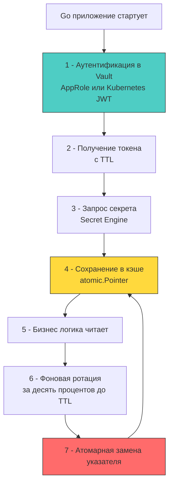

## Архитектура централизованного хранения и доставки

В высоконагруженных распределённых системах секреты не могут жить в файлах конфигурации или переменных окружения. Им требуется управляемый жизненный цикл: динамическая генерация, автоматическая ротация, детальный аудит доступа и гарантированная недоступность после отзыва. HashiCorp Vault стал де-факто стандартом, но для разработчика на Go важно понимать его не как «чёрный ящик с REST API», а как распределённую систему с собственным консенсусом, моделью аренды (leases) и строгими ограничениями на пропускную способность.



### Под капотом Vault: Seal, Unseal и хранилище

Архитектура Vault спроектирована вокруг принципа «Zero Trust» для самого хранилища. При запуске узел находится в запечатанном состоянии (`Sealed`). Данные на диске зашифрованы мастер-ключом, который в свою очередь разбит на несколько частей по схеме разделения секрета Шамира (`Shamir's Secret Sharing`). Для разблокировки (`Unseal`) требуется предоставить кворум частей. Это гарантирует, что даже при компрометации хранилища или физического диска, данные останутся недоступны без явного вмешательства администраторов.

Внутри Vault использует `raft` или `consul` как бэкенд хранения. Raft обеспечивает консенсус и репликацию состояния между узлами. При запросе секрета:
1 - Клиент проходит аутентификацию через Auth Method (AppRole, Kubernetes, JWT, AWS IAM).
2 - Vault выписывает клиентский токен с жёстким TTL.
3 - При запросе к Secret Engine (KV, Database, PKI) Vault генерирует или выдаёт секрет и создаёт Lease (аренду) с собственным TTL.
4 - После истечения TTL секрет автоматически инвалидируется в хранилище. Динамические секреты (например, временные креды БД) при этом удаляются в целевой системе.

Для Go-разработчика это означает, что Vault — это **stateful сетевой сервис с высокой латентностью**. Прямые синхронные запросы на каждый HTTP-запрос приложения убьют пропускную способность. Требуется локальное кэширование с атомарной ротацией.

## Идиоматичная интеграция в Go: кэширование и атомарная ротация

Стандартный подход `vault-client.Read(path)` на каждый запрос архитектурно неверен. Правильный паттерн строится вокруг «ленивой» загрузки, фонового обновления и `atomic.Pointer` для чтения без блокировок.

```go
package vaultsec

import (
	"context"
	"fmt"
	"sync/atomic"
	"time"

	"github.com/hashicorp/vault/api"
)

// CachedSecret безопасно хранит и обновляет секреты из Vault
type CachedSecret struct {
	path        string
	value       atomic.Pointer[[]byte]
	client      *api.Client
	refreshTTL  time.Duration
	mu          sync.Mutex // Защита от thundering herd при обновлении
	cancelRenew context.CancelFunc
}

// NewCachedSecret инициализирует кэшированный секрет
func NewCachedSecret(client *api.Client, path string, initialTTL time.Duration) *CachedSecret {
	cs := &CachedSecret{
		path:       path,
		client:     client,
		refreshTTL: initialTTL * 9 / 10, // Обновляем за 10 процентов до истечения
	}
	cs.value.Store(nil)
	return cs
}

// Start запускает фоновую ротацию. Должен вызываться один раз при старте сервиса.
func (cs *CachedSecret) Start(ctx context.Context) error {
	ctx, cancel := context.WithCancel(ctx)
	cs.cancelRenew = cancel

	// Первичная загрузка
	if err := cs.load(ctx); err != nil {
		return fmt.Errorf("initial load: %w", err)
	}

	go cs.renewLoop(ctx)
	return nil
}

func (cs *CachedSecret) renewLoop(ctx context.Context) {
	ticker := time.NewTicker(cs.refreshTTL)
	defer ticker.Stop()

	for {
		select {
		case <-ctx.Done():
			return
		case <-ticker.C:
			if err := cs.load(ctx); err != nil {
				// Логирование ошибки. Старый секрет остаётся активным до следующего тика.
				// Это trade-off между доступностью и свежестью данных.
				continue
			}
		}
	}
}

// load атомарно заменяет значение секрета
func (cs *CachedSecret) load(ctx context.Context) error {
	cs.mu.Lock()
	defer cs.mu.Unlock()

	secret, err := cs.client.Logical().ReadWithContext(ctx, cs.path)
	if err != nil || secret == nil {
		return fmt.Errorf("vault read %s: %w", cs.path, err)
	}

	data, ok := secret.Data["data"].(map[string]any)
	if !ok {
		return fmt.Errorf("invalid secret structure at %s", cs.path)
	}

	val, ok := data["password"].(string)
	if !ok {
		return fmt.Errorf("missing password field in %s", cs.path)
	}

	buf := []byte(val)
	// Атомарная замена. Читатели не блокируются и не видят частично записанных данных.
	cs.value.Store(&buf)
	return nil
}

// Get возвращает текущую копию секрета. Вызывающий обязан затереть []byte после использования.
func (cs *CachedSecret) Get() []byte {
	ptr := cs.value.Load()
	if ptr == nil {
		return nil
	}
	// Возвращаем копию, чтобы избежать гонки при ротации
	res := make([]byte, len(*ptr))
	copy(res, *ptr)
	return res
}

// Stop освобождает ресурсы
func (cs *CachedSecret) Stop() {
	if cs.cancelRenew != nil {
		cs.cancelRenew()
	}
}
```

### Механическое сочувствие: сеть, TLS и давление на GC

Интеграция с Vault затрагивает несколько подсистем рантайма Go:
1 - **HTTP/2 и мультиплексирование**: Vault использует HTTP/2. Стандартный `net/http` клиент автоматически переиспользует соединения. При высоком RPS это снижает накладные расходы на TLS-рукопожатия и `syscall connect`. Однако `http.Client` по умолчанию держит `MaxIdleConns` равным 2. В продакшене необходимо явно настраивать `http.Transport` с `MaxIdleConns: 100+` и `IdleConnTimeout: 60s`, чтобы избежать постоянного создания/закрытия соединений и давления на файловые дескрипторы.
2 - **TLS-сессии и CPU**: Первый запрос требует полного TLS 1.3 handshake (~1-3 мс). Последующие используют Session Tickets (~0.1 мс). При ротации тысяч секретов или кластере из 50 инстансов это создаёт измеримую нагрузку на CPU. Использование `tls.Config.SessionTicketsDisabled = false` (по умолчанию) и `TicketKeys` в балансировщике смягчает проблему.
3 - **Аллокации и GC**: Каждый вызов `client.Logical().Read` парсит JSON-ответ, создаёт `map[string]any`, аллоцирует `[]byte` для полей. При 10k RPS это сотни мегабайт мусора. Кэширование через `atomic.Pointer` снижает частоту аллокаций до одного раза за TTL (обычно 1 час). Возврат копии в `Get()` намеренно аллоцирует память, чтобы бизнес-логика работала с изолированным буфером, а `GC` мог собрать оригинал после атомарной замены.
4 - **Блокировка памяти**: Для сверхчувствительных данных (мастер-ключи, root-токены) рекомендуется `syscall.Mlock`. Однако в контейнерах (Docker/K8s) это требует `--cap-add=IPC_LOCK` и настройки `ulimit -l`. Без этого вызов вернёт `EPERM`.

> [!warning] Ловушка / Gotcha
> **Thundering Herd при истечении TTL**
> Если 100 инстансов одновременно обнаружат истечение TTL секрета, они начнут синхронно запрашивать обновление у Vault. Это создаст мгновенный всплеск нагрузки, превысит лимиты `rate_limit` Vault и приведёт к таймаутам.
> **Решение:** 
> 1 - В код добавлен `time.Ticker` с расчётом `refreshTTL = TTL * 0.9`.
> 2 - Для распределённого сглаживания добавьте случайную джиттеризацию: `refreshTTL += time.Duration(rand.Int63n(int64(TTL / 10)))`. Это разнесёт запросы по временной шкале.
> 3 - Используйте `singleflight` или `sync.Mutex` (как в примере) на уровне процесса, чтобы параллельные горутины одного инстанса не дублировали запрос к Vault.

## Альтернативы и сравнение подходов

Vault не всегда оптимален. Выбор провайдера зависит от архитектуры, облачного вендора и требований к задержкам.

| Подход | Механика работы | Плюсы | Минусы | Влияние на Go-рантайм |
|--------|----------------|-------|--------|----------------------|
| **HashiCorp Vault** | Централизованный сервис, динамические секреты, leases | Аудит, авто-ротация, динамические креды БД/PKI | Высокая латентность, сложность эксплуатации, SPOF без кластера | Требует кэширования, тонкой настройки HTTP-пулов, обработки таймаутов |
| **AWS/GCP Secrets Manager** | Облачный managed-сервис, API-доступ через SDK | Нативная интеграция IAM, SLA, автоматическое шифрование | Vendor lock-in, ограничение RPS на чтение, платный вызов API | SDK создаёт аллокации, требуется локальный кэш. Ротация через Cloud Functions |
| **SOPS + Age/GPG** | Статическое шифрование файлов `yaml`/`json` в репозитории | Stateless, GitOps-совместимо, нулевая латентность | Нет динамической ротации, ручное управление ключами, аудит в Git | Чтение файла при старте, `os.ReadFile` аллоцирует буфер. Быстро, но статично |
| **SPIFFE/SPIRE** | Workload Identity, автоматическая выдача X.509/SVID | Zero-trust, mTLS из коробки, отсутствие статических секретов | Высокий порог входа, сложность настройки, требует sidecar/agent | `crypto/tls` получает динамические сертификаты. Требует ротации `tls.Config` в рантайме |

> [!tip] Собеседование
> **Вопрос:** Почему в современных микросервисных архитектурах на Go наблюдается тренд на отказ от статических секретов в пользу Workload Identity (SPIFFE, AWS IAM Roles for Service Accounts)?
> **Ответ:**
> 1 - Статические секреты требуют ручного или полуавтоматического распространения, ротации и отзыва. При утечке требуется немедленный деплой.
> 2 - Workload Identity привязывает доступ к контексту выполнения процесса (PID, Namespace, ServiceAccount). Сервис аутентифицируется через короткоживущие токены или x509-сертификаты, выданные платформой.
> 3 - Для Go это означает переход от `os.Getenv` или `vault.Read` к инициализации `grpc.Dial` или `http.Client` с динамически обновляемым `tls.Config` через `GetClientCertificate`. Это снижает attack surface до нуля (нет секрета в памяти на старте), но требует интеграции с платформенными механизмами (K8s ServiceAccountTokenProjection, SPIRE Agent).
> 4 - **Производственный нюанс:** Рантайм Go требует атомарной замены `tls.Config` в `http.Client` или gRPC connection pool. Прямая модификация поля `TLSClientConfig` после инициализации соединения не работает. Необходимо использовать `http.Transport.DialTLSContext` или кастомные `CredentialsBundle`.

## Итог

1 - Vault решает проблему жизненного цикла секретов, но вводит сетевую задержку и архитектурную сложность. Прямые запросы на каждый вызов неприемлемы в high-load системах.
2 - В Go интеграция требует локального кэширования с атомарной ротацией (`atomic.Pointer`), фоновой подгрузки с джиттеризацией TTL и жёсткой обработки таймаутов.
3 - HTTP/2 мультиплексирование, настройка `http.Transport` пулов и контроль TLS-сессий критичны для предотвращения троттлинга и истощения файловых дескрипторов.
4 - Давление на `GC` снижается за счёт редких аллокаций при ротации и изоляции буферов. Для высокозащищённых систем требуется `mlock` и `MADV_DONTDUMP`.
5 - Индустрия смещается от централизованных хранилищ к Workload Identity, где секреты генерируются динамически на основе контекста выполнения, что исключает статические уязвимости, но требует глубокой интеграции с рантаймом сети Go.

[[3. Хранение ключей]]