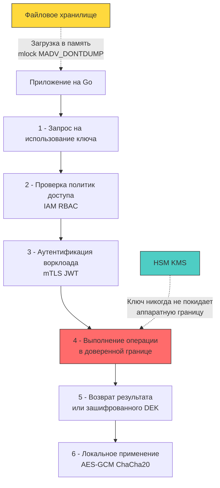

## Архитектура хранения: от аппаратных модулей до файловой системы

Криптографические ключи — это не просто секреты с длинным сроком жизни. Это математические объекты, которые используются напрямую в операциях шифрования, подписи и проверки целостности. Утечка ключа шифрования эквивалентна мгновенной компрометации всех данных, защищённых этим ключом, включая исторические архивы. В отличие от паролей или API-токенов, ключи нельзя просто «сбросить» без дорогостоящей операции решифрования (re-encryption) терабайтов данных.

Для архитектора бэкенда на Go управление ключами требует понимания трёх уровней доверия: аппаратного (HSM), облачного (KMS) и программного (файловая система/память). Выбор уровня диктует профиль производительности, стоимость операций и стратегию защиты от компрометации памяти.



### Уровни доверия и механизмы изоляции

1 - **HSM (Hardware Security Module)**: Физическое устройство с защищённым чипом, сертифицированным по FIPS 140-2/3 Level 3. Ключи генерируются внутри, никогда не покидают чип, все криптографические операции выполняются аппаратно. Физическое вскрытие приводит к криптографическому уничтожению (zeroization). Используется в банковском секторе и государственных системах.
2 - **Cloud KMS (Key Management Service)**: Управляемый сервис (AWS KMS, GCP KMS, Yandex Cloud KMS). Ключи хранятся в мультитенантных HSM провайдера. Приложение вызывает API `Encrypt/Decrypt/Sign`. KMS никогда не видит сырые данные приложения, работает только с небольшими блоками или Data Encryption Keys (DEK).
3 - **Программное хранение**: Ключи в PEM/PKCS#8 файлах с правами `0600`, зашифрованные архивы (SOPS, git-crypt), или переменные окружения (антипаттерн). Требует самостоятельной реализации `mlock`, очистки памяти и ротации. Подходит для on-premise сред или edge-устройств, где недоступен облачный KMS.

## Под капотом ОС и рантайма Go: память, swap и дампы

Когда ключ загружается в процесс, он проходит через несколько критических этапов, каждый из которых потенциально уязвим:

1 - **Аллокация и Escape Analysis**: Вызов `os.ReadFile` возвращает `[]byte`, который почти всегда убегает в кучу. Рантайм Go не гарантирует физическую смежность страниц.
2 - **Вытеснение в swap**: Ядро Linux может выгрузить неактивные страницы процесса на диск для освобождения RAM. Если ключ попал в swap-раздел, он остаётся в plaintext даже после перезагрузки сервера.
3 - **Core Dump**: При `panic`, `SIGSEGV` или настройке `ulimit -c unlimited` ядро создаёт дамп памяти процесса. Все ключи, даже обнуленные позже, могут быть восстановлены из предыдущих состояний кучи.
4 - **Сборщик мусора**: `GC` освобождает память, но не перезаписывает её нулями перед отдачей аллокатору. Ключ остаётся в "свободных" страницах до тех пор, пока они не будут переиспользованы для новых объектов.

Для противодействия используются системные вызовы `mlock` (блокировка страниц в RAM) и `madvise` с флагом `MADV_DONTDUMP` (исключение из core dump). В Go это требует `golang.org/x/sys/unix` и явного управления жизненным циклом буферов.

```go
package keymanager

import (
	"crypto/x509"
	"encoding/pem"
	"fmt"
	"os"
	"runtime"
	"syscall"

	"golang.org/x/sys/unix"
)

// SecureKey представляет ключ, загруженный в защищённую память
type SecureKey struct {
	data []byte
}

// LoadKeyFromFile безопасно загружает PEM-ключ с блокировкой памяти
func LoadKeyFromFile(path string) (*SecureKey, error) {
	f, err := os.Open(path)
	if err != nil {
		return nil, fmt.Errorf("open key file: %w", err)
	}
	defer f.Close()

	// Проверка прав доступа на уровне ОС
	stat, err := f.Stat()
	if err != nil {
		return nil, fmt.Errorf("stat file: %w", err)
	}
	if stat.Mode().Perm() != 0600 {
		return nil, fmt.Errorf("insecure file permissions: want 0600, got %o", stat.Mode().Perm())
	}

	data, err := os.ReadFile(path)
	if err != nil {
		return nil, fmt.Errorf("read file: %w", err)
	}

	// Блокировка страницы в RAM
	if err := unix.Mlock(data); err != nil {
		return nil, fmt.Errorf("mlock failed: %w", err)
	}

	// Исключение из core dump
	unix.Madvise(data, unix.MADV_DONTDUMP)

	return &SecureKey{data: data}, nil
}

// ParsePrivateKey распаковывает PEM и затирает сырые данные
func (k *SecureKey) ParsePrivateKey() (any, error) {
	block, _ := pem.Decode(k.data)
	if block == nil {
		return nil, fmt.Errorf("invalid PEM format")
	}

	// Парсинг занимает память, но мы обязаны затереть сырую PEM-строку
	// после успешного парсинга, так как она содержит ключ в открытом виде
	key, err := x509.ParsePKCS8PrivateKey(block.Bytes)
	if err != nil {
		return nil, fmt.Errorf("parse PKCS8: %w", err)
	}

	// Затирание исходного буфера
	clear(k.data)
	runtime.KeepAlive(k.data)

	return key, nil
}

// Wipe гарантирует обнуление и разблокировку
func (k *SecureKey) Wipe() {
	if k.data == nil {
		return
	}
	clear(k.data)
	runtime.KeepAlive(k.data)
	unix.Munlock(k.data)
	k.data = nil
}
```

## KMS и Envelope Encryption: паттерн промышленного стандарта

Прямое шифрование больших объёмов данных через KMS API экономически невыгодно и ограничено квотами (обычно 1-4 КБ за запрос). Индустриальный стандарт — **Envelope Encryption** (конвертное шифрование):

1 - Приложение запрашивает у KMS генерацию или шифрование Data Encryption Key (DEK).
2 - KMS возвращает `PlaintextDEK` (в памяти на 1-2 секунды) и `EncryptedDEK`.
3 - Приложение использует `PlaintextDEK` локально через `crypto/aes` или `golang.org/x/crypto/chacha20` для шифрования payload.
4 - `PlaintextDEK` затирается. `EncryptedDEK` сохраняется вместе с зашифрованными данными.
5 - При чтении: `EncryptedDEK` отправляется в KMS, возвращается `PlaintextDEK`, данные расшифровываются локально.

Этот паттерн минимизирует сетевые вызовы, снижает стоимость и позволяет работать офлайн с уже зашифрованными данными.

```go
package envelope

import (
	"context"
	"crypto/aes"
	"crypto/cipher"
	"crypto/rand"
	"fmt"
	"io"
)

// KMSClient абстракция для работы с облачным провайдером
type KMSClient interface {
	GenerateDataKey(ctx context.Context) (plaintext, encrypted []byte, err error)
	Decrypt(ctx context.Context, encrypted []byte) ([]byte, error)
}

// EncryptData реализует конвертное шифрование
func EncryptData(ctx context.Context, kms KMSClient, plaintext []byte) ([]byte, []byte, error) {
	// 1 - Получение DEK от KMS
	plainDEK, encryptedDEK, err := kms.GenerateDataKey(ctx)
	if err != nil {
		return nil, nil, fmt.Errorf("kms generate key: %w", err)
	}
	
	// Дефер для гарантированного затирания DEK в памяти
	defer func() {
		clear(plainDEK)
	}()

	// 2 - Локальное шифрование данных через AES-GCM
	block, err := aes.NewCipher(plainDEK)
	if err != nil {
		return nil, nil, fmt.Errorf("aes init: %w", err)
	}

	aesGCM, err := cipher.NewGCM(block)
	if err != nil {
		return nil, nil, fmt.Errorf("gcm init: %w", err)
	}

	nonce := make([]byte, aesGCM.NonceSize())
	if _, err := io.ReadFull(rand.Reader, nonce); err != nil {
		return nil, nil, fmt.Errorf("nonce gen: %w", err)
	}

	// Seal возвращает nonce + ciphertext + tag
	ciphertext := aesGCM.Seal(nil, nonce, plaintext, nil)
	
	// 3 - Возврат: зашифрованные данные + зашифрованный DEK
	return ciphertext, encryptedDEK, nil
}
```

> [!warning] Ловушка / Gotcha
> **Неявное копирование ключей в стеке**
> При передаче `[]byte` в функции `aes.NewCipher` или `hmac.New`, компилятор может создать временные копии в стеке горутины. После выхода из функции стек не очищается, и ключ остаётся доступен следующей горутине, переиспользующей этот же стековый фрейм.
> **Решение:** Для высокозащищённых сценариев используйте `crypto/internal` утилиты или явно обнуляйте все промежуточные буферы. В Go 1.21+ `clear()` частично решает проблему, но контроль над стековыми копиями остаётся на совести разработчика. Избегайте передачи ключей как `string` — они иммутабельны и никогда не будут затёрты автоматически.

> [!tip] Собеседование
> **Вопрос:** В чём архитектурная разница между KMS и HSM, и почему современные облачные KMS не заменяют аппаратные HSM в регулируемых отраслях?
> **Ответ:**
> 1 - HSM — это изолированное физическое устройство с сертификатами FIPS, обеспечивающее криптографическую и физическую защиту. Ключи физически не покидают чип.
> 2 - KMS — это программно-аппаратный мультитенантный сервис. Хотя под капотом используются HSM, границы доверия шире, а доступ осуществляется через сетевой API с аутентификацией IAM.
> 3 - Для банков, госсектора и PCI-DSS требуется гарантия отсутствия side-channel атак между арендаторами и физический контроль zeroization. Только выделенные (dedicated) HSM предоставляют такие гарантии.
> 4 - **В Go:** Интеграция с KMS проще (HTTP/gRPC SDK), но требует обработки таймаутов, ротации endpoint-ов и кэширования DEK. Интеграция с HSM часто требует `PKCS#11` через `cgo`, что усложняет сборку, деплой и мониторинг памяти.

## Итог

1 - Хранение ключей требует многоуровневой защиты: аппаратной (HSM), облачной (KMS) или программной с явным контролем памяти (`mlock`, `MADV_DONTDUMP`).
2 - В рантайме Go ключи уходят в кучу, не очищаются `GC` автоматически и могут попасть в swap или core dump. Требуется строгий жизненный цикл с `clear()` и `runtime.KeepAlive()`.
3 - Envelope Encryption является индустриальным стандартом: KMS управляет только DEK, а приложение локально шифрует данные через симметричные алгоритмы, минимизируя сетевые вызовы и стоимость.
4 - Загрузка ключей из файлов требует проверки прав `0600`, парсинга PEM без оставления сырых строк в памяти и предотвращения неявных копий в стеке.
5 - Переход от статических файловых ключей к динамическим KMS/Workload Identity снижает attack surface, но требует интеграции с сетевым стеком Go, обработки таймаутов и атомарной ротации в памяти.

[[4. Безопасность Docker]]