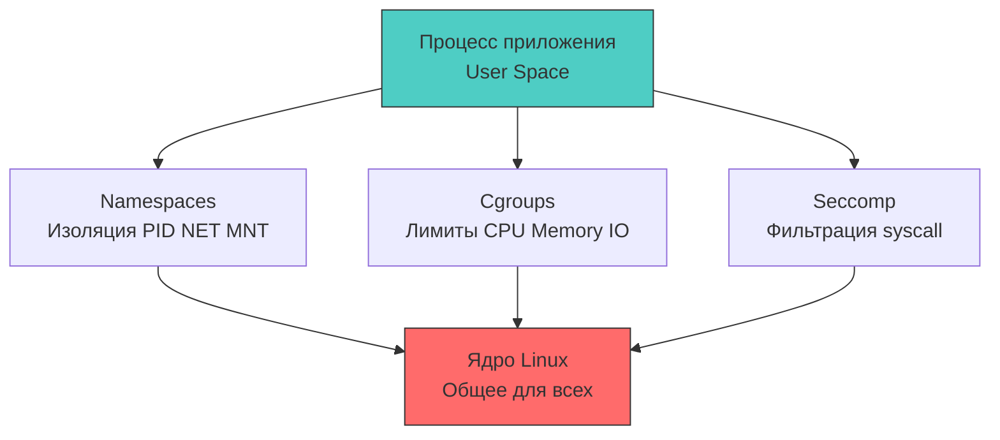

## Контейнеризация как граница доверия

Docker-контейнеры исторически воспринимаются как «лёгкие виртуальные машины», но с точки зрения системной архитектуры и безопасности это фундаментально иная модель. Контейнер не эмулирует железо и не запускает отдельное ядро ОС. Это обычный процесс Linux, изолированный с помощью механизмов ядра: `namespaces`, `cgroups`, `capabilities` и `seccomp`. Для разработчика уровня Senior/Lead понимание этой механики критично, так как уязвимости контейнерного окружения возникают именно на стыке конфигурации изоляции, поведения рантайма Go и политик ядра.



### 1. Архитектура изоляции: namespaces, cgroups и ядро

Изоляция в Docker строится на системных вызовах `clone()` и `unshare()`, которые создают новые пространства имён (namespaces). Каждый namespace изолирует определённый ресурс ядра:

- `PID Namespace`: Видимость процессов. Внутри контейнера приложение видит PID 1, но в хостовой таблице процессов это обычный тред с высоким номером.
- `NET Namespace`: Сетевой стек. Свои таблицы маршрутизации, правила `iptables`, сокеты и сетевые интерфейсы.
- `MNT Namespace`: Файловая система. Контейнер видит только смонтированные слои UnionFS (overlay2/aufs). Прямой доступ к `/proc`, `/sys` хоста ограничен.
- `UTS/IPC/User Namespaces`: Изоляция hostname, межпроцессного взаимодействия и UID/GID.

Важно понимать: namespaces не являются криптографическими границами. Они защищают от случайного доступа, но не от malicious-кода, эксплуатирующего уязвимости ядра или неправильные `capabilities`. Например, процесс с `CAP_SYS_ADMIN` может монтировать файловую систему хоста внутрь своего namespace, эффективно вырываясь из контейнера.

### 2. Go-рантайм в контейнере: планировщик и лимиты ресурсов

Планировщик горутин Go (`G-M-P`) полагается на информацию о количестве доступных логических ядер для создания пула `P` (processors). До версии Go 1.25 рантайм читал `/proc/cpuinfo`, что возвращало количество ядер хоста, а не лимиты cgroups. Это приводило к созданию избыточного количества `P`, троттлингу CPU и росту latency из-за переключений контекста между тредами.

Решение `go.uber.org/automaxprocs` (и нативная поддержка в Go 1.25+) читает `cgroups v2` файл `cpu.max`. Рантайм корректирует `GOMAXPROCS` под фактические лимиты, что синхронизирует пул `P` с разрешёнными CPU-квантами.

**Влияние на сборщик мусора:**
Cgroups также ограничивают память (`memory.max`). Когда контейнер приближается к лимиту, ядро начинает aggressively thrash страницы. Go-рантайм получает сигналы `SIGBUS` или `ENOMEM` при аллокации. Если `GOMEMLIMIT` не настроен, `GC` пытается освободить память, но cgroups-тормоз вызывает OOM Killer, который завершает процесс без graceful shutdown. Правильная конфигурация требует явного указания `GOMEMLIMIT`, согласованного с лимитом контейнера, чтобы рантайм начал агрессивную сборку *до* вмешательства ядра.

```go
package main

import (
	"log"
	"os"
	"runtime/debug"

	_ "go.uber.org/automaxprocs" // Автоматически настраивает GOMAXPROCS по cgroups
)

func init() {
	// Чтение лимита памяти из cgroups v2 (примерный путь)
	memLimitBytes := readCgroupMemoryLimit()
	if memLimitBytes > 0 {
		// Устанавливаем лимит на 10-15 процентов ниже, чтобы оставить запас рантайму
		debug.SetMemoryLimit(int64(float64(memLimitBytes) * 0.85))
		log.Printf("Set GOMEMLIMIT to %d bytes", int64(float64(memLimitBytes)*0.85))
	}
}

func readCgroupMemoryLimit() int64 {
	// В продакшене используется специализированный пакет типа github.com/KimMachineGun/automemlimit
	// Здесь упрощённая логика для демонстрации
	return 0
}

func main() {
	// Бизнес-логика
}
```

### 3. Системные вызовы и seccomp-фильтры

Docker по умолчанию применяет `seccomp` (Secure Computing Mode), который фильтрует системные вызовы через BPF-программу ядра. Go-рантайм активно использует сотни syscall:
- `epoll_create1`, `epoll_ctl`, `epoll_wait` для `netpoll`
- `mmap`, `madvise`, `munmap` для аллокатора и `GC`
- `futex` для примитивов синхронизации (`sync.Mutex`, `sync.Cond`)
- `clone3`, `rt_sigprocmask` для управления горутинами
- `getrandom` для `crypto/rand`

Если применить строгий профиль `seccomp` (например, `syscall-whitelist`), разрешающий только `read/write/open`, Go-приложение мгновенно упадёт с `SIGSYS`. Стандартный Docker-профиль (`default.json`) уже содержит необходимые исключения для Go. Однако для high-security сценариев рекомендуется использовать профили, разрешающие только минимальный набор syscall, требуемый рантайму, и явно блокировать `mount`, `ptrace`, `unshare`, `personality`.

> [!info] Под капотом
> **Почему `mlock` и `MADV_DONTDUMP` требуют дополнительных прав?**
> Системные вызовы `mlock()` и `madvise()` с флагом `MADV_DONTDUMP` ограничены по умолчанию для непривилегированных процессов (`ulimit -l`). В контейнере они вернут `EPERM`. Для защиты криптографических ключей в памяти необходимо запускать контейнер с `--cap-add=IPC_LOCK` или настраивать `sysctl vm.max_map_count` и `limits.conf` на хосте. Без этого секреты могут быть вытеснены в swap или попасть в core dump при `panic`.

### 4. Идиоматичный Dockerfile для Go

Безопасность начинается на этапе сборки. Многоэтапные сборки и минималистичные базовые образы (`distroless`, `alpine` без шелла) сокращают attack surface.

```dockerfile
# 1 - Этап сборки
FROM golang:1.22-alpine AS builder
WORKDIR /src
COPY go.mod go.sum ./
RUN go mod download
COPY . .
# Статическая сборка без CGO. Исключает зависимости от libc и уязвимости в ней.
RUN CGO_ENABLED=0 GOOS=linux go build -ldflags="-s -w -extldflags '-static'" -o /app/server ./cmd/server

# 2 - Финальный образ
FROM gcr.io/distroless/static-debian12:nonroot
WORKDIR /app
COPY --from=builder /app/server .

# 🔒 Запрет изменения файловой системы
USER 1000:1000
ENTRYPOINT ["/app/server"]
```

При запуске в `docker run` или Kubernetes `securityContext`:
```bash
docker run --read-only \
           --cap-drop ALL \
           --security-opt=no-new-privileges:true \
           --tmpfs /tmp \
           myapp:latest
```
- `--read-only`: Rootfs только для чтения. Исключает запись malware или изменение бинарников.
- `--cap-drop ALL`: Убирает все capabilities. Приложение работает с правами обычного пользователя.
- `--security-opt=no-new-privileges:true`: Ядро запрещает `execve` получать расширенные права через setuid/setgid бинарники.
- `--tmpfs /tmp`: Временные файлы пишутся в RAM, не касаясь диска.

### 5. Ловушки и векторы атак

1 - **Escalation через `/proc`**: Даже с `--cap-drop ALL`, процесс может читать `/proc/1/environ`, `/proc/1/fd`, `/proc/sys/kernel` хоста, если namespace не настроен корректно или контейнер запущен с `--privileged`. Решение: явно мапить только необходимые файлы, использовать `rootfs` без доступа к хостовому `/proc`.
2 - **CGO и динамические библиотеки**: `CGO_ENABLED=1` тянет `glibc` или `musl`. Уязвимости в `libc` (например, `GHOST`, `Pwnkit`) становятся уязвимостями приложения. `CGO_ENABLED=0` компилирует всё статически, исключая этот вектор, но отключает `netgo` и `cgo`-зависимые профилировщики в некоторых случаях.
3 - **Температурные и CPU-троттлинг атаки**: Атакующий может запустить внутри контейнера бесконечный цикл вычислений, если не настроены `cpu.cfs_quota_us` и `memory.limit`. Rantaйм Go не ограничивает CPU сам, он полагается на cgroups. Отсутствие лимитов ведёт к DoS всего хоста.
4 - **Логирование в stdout**: `docker logs` собирает всё из stdout/stderr. Если приложение логирует секреты, токены или стек-трейсы с пользовательскими данными, они попадают в хостовый `/var/lib/docker/containers/...`, доступный root-пользователю демона.

> [!tip] Собеседование
> **Вопрос:** Почему запуск Go-приложения с `--privileged` в Kubernetes или Docker считается критической архитектурной ошибкой, даже если код не использует `os/exec`?
> **Ответ:**
> 1 - `--privileged` включает все capabilities, отключает `seccomp` и `AppArmor`, пробрасывает все устройства `/dev` и отключает `no-new-privileges`.
> 2 - Это превращает контейнер в процесс с почти полным доступом к ядру. Любая уязвимость в рантайме Go, стандартной библиотеке или сторонней зависимости позволяет выполнить kernel exploit и получить полный контроль над хостом.
> 3 - **Альтернатива:** Использовать минимальные capabilities (`CAP_NET_BIND_SERVICE` если порт < 1024), `readOnlyRootFilesystem`, `runAsNonRoot` и изолировать сеть через `NetworkPolicy`. Для доступа к устройствам использовать `devicePlugin` или CSI-драйверы, а не монтирование `/dev`.

## Итог

1. Контейнеры изолируют процессы через `namespaces`, `cgroups`, `capabilities` и `seccomp`, но не предоставляют криптографической защиты. Граница доверия остаётся на уровне ядра Linux.
2. Go-рантайм должен синхронизироваться с лимитами cgroups через `automaxprocs` и `GOMEMLIMIT`, чтобы планировщик горутин и `GC` не вызывали троттлинг или OOM-киллер.
3. Seccomp-фильтры критичны для блокировки опасных syscall (`mount`, `ptrace`), но стандартный профиль Docker уже оптимизирован под нужды Go-рантайма.
4. Идиоматичная сборка требует `CGO_ENABLED=0`, статической линковки, `distroless` базовых образов и запуска от непривилегированного пользователя с `--cap-drop ALL` и `--read-only`.
5. Векторы атак на контейнеры часто связаны с избыточными правами (`--privileged`), доступом к `/proc` хоста и незащищённым логированием. Безопасность строится на минимальной поверхности атаки и строгом контроле системных вызовов.

[[5. Supply chain атаки]]