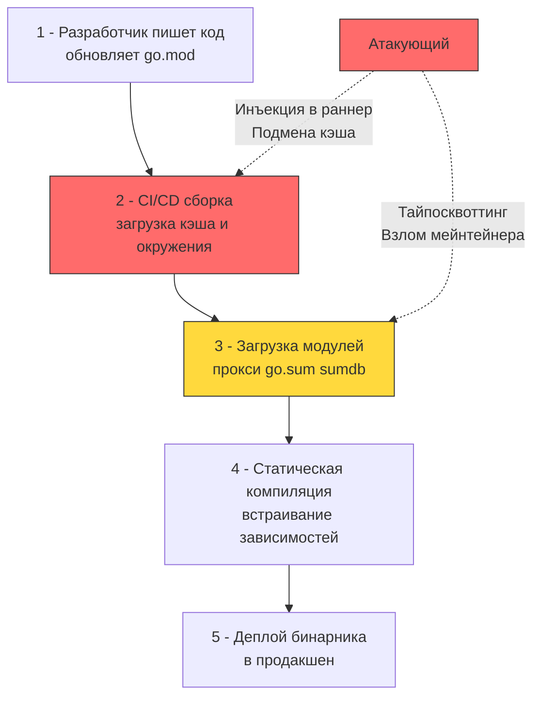

## Введение: Цепочка поставок как расширенная поверхность атаки

Supply chain attack (атака на цепочку поставок) переносит вектор компрометации с вашего кода на инфраструктуру разработки: зависимости, реестры модулей, сборочные конвейеры CI/CD и кэши окружения. В экосистеме Go эта проблема стоит особенно остро из-за принципа статической линковки. Любая сторонняя библиотека, втянутая через `go mod download`, компилируется прямо в финальный бинарник. После деплоя исправить уязвимость или удалить закладку невозможно без пересборки и выкатки новой версии.



### Под капотом: как Go разрешает и верифицирует модули

Механизм работы `go mod` в Go 1.11+ спроектирован вокруг криптографической гарантии целостности. При выполнении `go mod download` или `go build` происходит следующее:

1 - **Загрузка через прокси**: Клиент обращается к `GOPROXY` (по умолчанию `https://proxy.golang.org,direct`). Прокси отдаёт `.zip` архив модуля и `.info` файл с мета-версией.
2 - **Криптографический хеш**: Рантайм вычисляет SHA-256 хеш содержимого архива.
3 - **Проверка по Checksum DB**: Полученный хеш отправляется в `sum.golang.org` (или приватный сум-сервер). База данных возвращает подтверждение соответствия. Это исключает MITM-атаки и подмену архивов злонамеренным прокси.
4 - **Сверка с go.sum**: Хеш сравнивается с локальным файлом `go.sum`. Если совпадает, модуль распаковывается в `GOMODCACHE`.

На уровне ОС и рантайма это создаёт сетевые вызовы к прокси и сум-БД, аллокацию временных `.zip` файлов и записей в кэш. `GOMODCACHE` по умолчанию находится в `$GOPATH/pkg/mod`. Если этот кэш попадает в общий CI-раннер без изоляции, атакующий, получивший доступ к раннеру, может заменить содержимое `.zip` в кэше, обойдя повторную верификацию (так как Go считает распакованный модуль проверенным).

### Основные векторы атак на цепочку поставок

1 - **Тайпосквоттинг и namespace confusion**: Регистрация модулей с названиями, похожими на популярные (`github.com/sirupsen/logrus` vs `github.com/sirupson/logrus`). Разработчик ошибается в `go get`, тянет вредоносный код.
2 - **Компрометация мейнтейнера**: Взлом аккаунта автора библиотеки и публикация обновления с бэкдором. Поскольку `go.sum` фиксирует версию, а не хеш навсегда, автообновление до новой мажорной или минорной версии подтянет вредоносный релиз.
3 - **Поиск уязвимостей через AST и govulncheck**: `govulncheck` (официальный инструмент от Go team) не просто ищет CVE в `go.mod`. Он строит граф вызовов приложения, анализирует AST и проверяет, достижим ли уязвимый код из вашего бинарника. Это снижает шум от транзитивных зависимостей, которые вы не используете.
4 - **CI/CD Poisoning**: Инъекция в сборочное окружение. Подмена `GOPROXY`, модификация `go.mod` в процессе сборки, использование заражённых `go` бинарников или кэшированных `pkg/mod` директорий.

### Идиоматичная защита в Go

Архитектура защиты строится на герметичности сборки, строгой верификации и минимизации поверхности атаки зависимостей.

```bash
# 1 - Интеграция govulncheck в CI/CD пайплайн
# Устанавливаем последнюю версию анализатора
go install golang.org/x/vuln/cmd/govulncheck@latest

# 2 - Сканирование проекта на достижимые уязвимости
# Инструмент автоматически читает go.mod, строит граф вызовов и сверяет с vuln.go.dev
govulncheck ./...

# 3 - Верификация локального кэша против sumdb
# Гарантирует, что распакованные модули в GOMODCACHE не были изменены
go mod verify
```

> [!info] Под капотом
> **Почему `go mod vendor` безопаснее для CI?**
> Команда `vendor` копирует исходники зависимостей прямо в репозиторий. При сборке `go build -mod=vendor` игнорирует `GOPROXY` и `GOMODCACHE`. Сборка становится полностью детерминированной и не требует сетевых вызовов к внешним реестрам. Это исключает атаки на прокси и нестабильность загрузки в закрытых контурах. Минус: увеличение размера репозитория и ответственность за аудит кода внутри `vendor/`.

### Ловушки и архитектурные риски

1 - **Директива `replace`**: Часто используется для локальной разработки (`replace github.com/my/lib => ../local-lib`). В production-ветке она **обходит проверку Checksum DB** для указанного пути, так как Go использует локальную файловую систему. Если `replace` остаётся в `go.mod` после мержа, вы теряете криптографическую гарантию целостности для этого модуля.
2 - **Переменные окружения `GONOSUMDB` и `GONOSUMCHECK`**: Отключают верификацию для приватных репозиториев. Ошибка в wildcard (например, `GONOSUMDB=github.com/*` вместо `github.com/mycompany/*`) открывает дыру для всех публичных пакетов.
3 - **Статическая линковка и Blast Radius**: `CGO_ENABLED=0` создаёт один монолитный ELF-бинарник. Уязвимость в `golang.org/x/crypto` или `github.com/redis/go-redis` требует полного роллаута нового артефакта. Hot-patch невозможен. Это требует строгого SLA на обновление зависимостей и мониторинга `vuln.go.dev` в реальном времени.
4 - **Воспроизводимость сборки (Reproducible Builds)**: По умолчанию `go build` включает метаданные VCS и пути к исходникам (`-buildvcs=true`). Это может раскрыть внутреннюю структуру репозитория или привязать бинарник к конкретной машине разработчика. Для безопасности используйте `go build -trimpath -buildvcs=false`.

> [!tip] Собеседование
> **Вопрос:** В чём фундаментальная разница между `go.mod` и `go.sum`, и почему одного `go.mod` недостаточно для защиты от supply chain атак?
> **Ответ:**
> 1 - `go.mod` это декларативный файл. Он описывает *какие* версии модулей нужны приложению, но не содержит криптографических доказательств их содержимого.
> 2 - `go.sum` содержит SHA-256 хеши архивов модулей и их `go.mod` файлов. Он гарантирует, что именно эти байты будут загружены.
> 3 - Без `go.sum` и Checksum DB злоумышленник, контролирующий прокси или сеть, мог бы подменить `.zip` архив на лету. `sum.golang.org` выступает публичным реестром доверия. При первом получении хеша Go сверяет его с БД и записывает в `go.sum`. Последующие сборки проверяют локальный `go.sum`, исключая повторные сетевые вызовы и защищая от изменения репозитория после фиксации.

## Итог

1 - Цепочка поставок в Go расширяет поверхность атаки от рантайма до этапа загрузки зависимостей. Статическая линковка делает каждую зависимость частью финального бинарника, исключая возможность горячей замены.
2 - Механизм `GOPROXY` + `sum.golang.org` + `go.sum` обеспечивает криптографическую верификацию целостности модулей, но требует корректной настройки переменных окружения в CI.
3 - `govulncheck` анализирует AST и граф вызовов, отсеивая шум от недостижимых уязвимостей. Интеграция в пайплайн обязательна для автоматического обнаружения регрессий.
4 - `go mod vendor` и `go build -mod=vendor` обеспечивают герметичность и детерминизм сборки, исключая сетевые векторы атак на этапе CI.
5 - Директива `replace`, некорректные `GONOSUM*` паттерны и отсутствие `-trimpath` являются типичными архитектурными ошибками, ослабляющими защиту цепочки поставок.

[[6. Dependency vulnerabilities]]