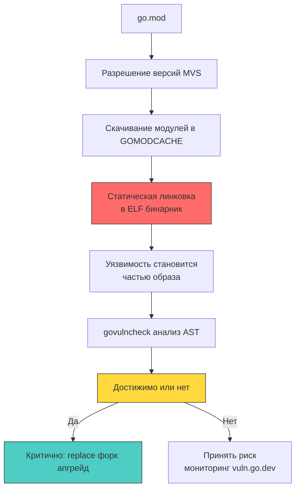

## Статическая линковка и радиус поражения

В отличие от динамических языков (Python, PHP, Node.js), где зависимости загружаются и парсятся в рантайме, Go компилирует сторонние пакеты прямо в ELF-бинарник на этапе сборки. Это означает, что любая уязвимость в транзитивной зависимости, даже если она не вызывается напрямую, становится частью вашего артефакта. Уязвимость в `golang.org/x/crypto` или `github.com/redis/go-redis` превращается из «проблемы вендора» в «проблему вашего продакшена». Горячий патч невозможен: единственное решение — пересборка, перевыкатка и перезапуск процессов.

Понимание того, как Go разрешает версии, строит граф вызовов и изолирует уязвимый код, критично для архитекторов, ответственных за SLA и соответствие стандартам безопасности (PCI-DSS, SOC2, ГОСТ Р 57580).



### 1. Механика разрешения зависимостей: MVS и минимализм

Go использует алгоритм **Minimal Version Selection (MVS)**. В отличие от SemVer-максимизации в NPM или Pip, где менеджеры пакетов автоматически тянут последнюю совместимую версию, Go выбирает *минимальную* версию, удовлетворяющую всем требованиям `go.mod`. Это архитектурное решение снижает поверхность атаки: вы не получаете автоматические обновления с новыми фичами или скрытыми изменениями поведения, которые могут принести уязвимости.

Однако MVS создаёт нюанс: если две транзитивные зависимости требуют разные версии одного пакета, Go выбирает максимальную из требуемых, но только если она явно указана или выводится из графа. Уязвимая версия может быть «затянута» косвенно. `go mod why` и `go mod graph` позволяют отследить, какой именно пакет тянет проблемную зависимость.

### 2. Анализ достижимости: как работает `govulncheck`

Простое сканирование `go.mod` по списку CVE даёт ложные срабатывания. Уязвимость в пакете `x/net/html` не актуальна, если ваш бинарник никогда не парсит HTML. Официальный инструмент `govulncheck` решает это через статический анализ:

1 - Загрузка модулей из `GOMODCACHE` и построение полного графа зависимостей.
2 - Парсинг AST всех пакетов проекта и зависимостей.
3 - Построение графа вызовов (call graph) с учётом полиморфизма интерфейсов Go.
4 - Сравнение уязвимых функций из `vuln.go.dev` с достижимыми путями исполнения в вашем коде.

Если уязвимая функция не достижима из `main()`, `govulncheck` пометит её как `Not reachable`. Это позволяет приоритизировать исправления, не тратя ресурсы на пересборку ради «спящих» CVE.

> [!info] Под капотом
> **Почему анализ интерфейсов Go сложен для статического анализатора?**
> В Go вызов метода через интерфейс (`io.Reader.Read`) не привязан к конкретной реализации на этапе компиляции. Фактический тип определяется динамически в рантайме. `govulncheck` использует эвристический анализ типов и отражение (`reflect`), чтобы построить консервативный граф достижимости. Если код использует `interface{}` и рефлексивные вызовы, анализатор может пометить путь как `Potentially reachable`, требуя ручной верификации.

### 3. Стратегии исправления: `replace`, форк и явный апгрейд

Когда уязвимость обнаружена и признана достижимой, архитектор выбирает стратегию исправления:

1 - **Прямой апгрейд (`go get package@vX.Y.Z`)**: Безопасный путь, если мейнтейнер выпустил фикс. `go mod tidy` обновляет `go.mod` и `go.sum`.
2 - **Директива `replace`**: Временный хак или патч до релиза фикса. `replace github.com/vuln/lib => github.com/secure/fork v1.2.3-fix`. Компилятор игнорирует версию в `go.mod` и подставляет указанную локальную или внешнюю замену. На уровне сборки это работает прозрачно, но усложняет аудит зависимостей.
3 - **Форк и вложенный модуль**: Копирование исходников уязвимого пакета в `internal/pkg`, ручное применение патча, изменение импортов. Полная изоляция от внешней цепочки поставок, но потеря автоматических обновлений.

```go
// Пример go.mod с временным патчем через replace
module github.com/company/secure-api

go 1.22

require (
	github.com/golang-jwt/jwt/v5 v5.2.0
)

// 🔒 Явная замена уязвимой транзитивной зависимости
replace github.com/lestrrat-go/jwx/v2 => github.com/company/jwx-patch v2.0.1-fix
```

### 4. Под капотом: влияние уязвимостей на рантайм и память

Статическая линковка означает, что уязвимый код физически присутствует в секциях `.text`, `.rodata` и `.data` ELF-бинарника. Даже если функция не вызывается, она занимает место, увеличивает время загрузки бинарника и может быть обнаружена при реверс-инжиниринге.

В контексте безопасности это создаёт специфичные риски:
- **Syscall Exposure**: Уязвимая библиотека может выполнять `syscall` (например, `open`, `connect`), которые не видны в вашем бизнес-коде. Seccomp-профиль контейнера может неожиданно пропустить запрещённый вызов, если он встроен через транзитивную зависимость.
- **Memory Corruption в CGO**: Если зависимость использует `cgo` и содержит ошибки работы с памятью (double-free, buffer overflow), это ломает безопасность памяти Go и открывает векторы для RCE, обходящие GC и Escape Analysis.
- **GC Pressure**: Уязвимые парсеры (JSON, XML, Protobuf) могут создавать неограниченные аллокации при обработке злонамеренного ввода, провоцируя `Stop-The-World` паузы и OOM.

> [!warning] Ловушка / Gotcha
> **Неявные обновления через `go mod tidy`**
> Разработчик запускает `go mod tidy` в локальном окружении с новыми транзитивными пакетами. Менеджер модулей автоматически добавляет в `go.mod` новые `require` с последними совместимыми версиями. В CI/CD, где `GOPROXY` или кэш отличаются, могут подтянуться другие версии, потенциально содержащие уязвимости или breaking changes.
> **Решение:** Никогда не коммитить `go.mod` и `go.sum` с изменениями, не прошедшими ревью зависимостей. Использовать `go mod vendor` для герметичности и `go mod verify` в CI. В корпоративных средах проксировать все запросы через внутренний `Athens` или `Artifactory`, блокируя публичные реестры.

> [!tip] Собеседование
> **Вопрос:** Как обработать критическую уязвимость в популярной транзитивной зависимости, если мейнтейнер игнорирует issue и не выпускает патч уже месяц?
> **Ответ:**
> 1 - Проверить достижимость через `govulncheck`. Если не достижима, документировать принятие риска и настроить мониторинг `vuln.go.dev`.
> 2 - Если достижима, использовать `replace` для подмены на форк с ручным применением патча. Зафиксировать хеш форка в `go.sum`.
> 3 - Альтернативно, рефакторить бизнес-код, чтобы исключить использование уязвимого API, заменив его на стандартную библиотеку `crypto/*` или `net/http`.
> 4 - В долгосрочной перспективе исключить зависимость из `go.mod` через `go mod edit -droprequire` и `go mod tidy`, чтобы разорвать цепочку поставок.

## Итог

1 - Статическая линковка в Go встраивает уязвимые зависимости прямо в бинарник, делая невозможным горячее исправление и требуя полной пересборки артефакта.
2 - Алгоритм MVS минимизирует автоматическое обновление версий, снижая риск скрытых регрессий, но требует явного контроля транзитивных зависимостей через `go mod graph` и `go mod why`.
3 - `govulncheck` анализирует AST и граф вызовов, отсеивая ложные срабатывания по принципу достижимости. Консервативный анализ интерфейсов может требовать ручной верификации.
4 - Стратегии исправления включают прямой апгрейд, временный `replace` на пропатченный форк или полный отказ от зависимости через рефакторинг. `replace` должен документироваться и удаляться после официального фикса.
5 - Уязвимые зависимости влияют не только на логику, но и на профиль системных вызовов, потребление памяти и безопасность памяти (при использовании `cgo`). Интеграция анализа в CI/CD и проксирование реестров обязательны для производственных сред.

[[1. Security testing]]