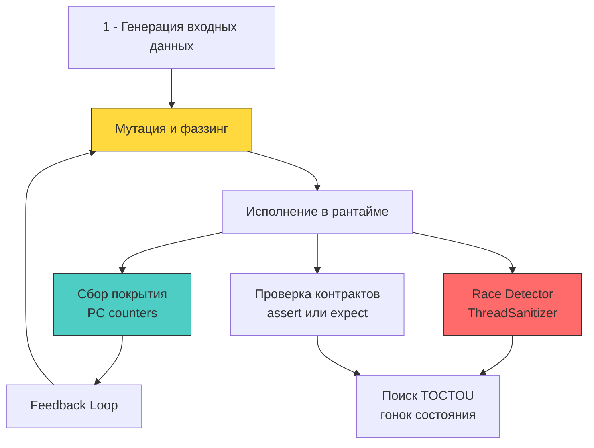

## От позитивных сценариев к модели противника

Security testing в Go — это не просто запуск линтера или сканера уязвимостей. Это систематическая проверка контрактов, границ доверия и поведения рантайма под adversarial-нагрузкой. В отличие от классического unit-тестирования, которое проверяет «работает ли логика правильно», security testing отвечает на вопрос «что произойдёт, если атакующий подаст специально сконструированные данные, создаст гонку или превысит лимиты?».

Для Senior/Lead разработчика важно понимать, что security-тесты должны быть интегрированы в цикл разработки наравне с функциональными. В Go это достигается через нативный фаззинг, ThreadSanitizer, стресс-тесты конкурентности и автоматизированные проверки в CI/CD.



### 1 - Фаззинг в Go: libFuzzer и coverage feedback под капотом

Начиная с Go 1.18, фаззинг встроен в стандартный пакет `testing`. Механика основана на libFuzzer с coverage-guided мутациями. Фаззер генерирует байтовые последовательности, запускает функцию `FuzzXxx`, отслеживает новые пути исполнения через счётчики PC и сохраняет «интересные» кейсы в `testdata/fuzz`.

**Под капотом:** При запуске `go test -fuzz=Fuzz` компилятор `gc` с флагом `-fuzz` внедряет инструменты санитайзеров в код. Покрытие собирается через битовую карту `__sanitizer_cov_trace_pc_guard`. Каждый переход по новой ветке атомарно инкрементирует ячейку в памяти. Это создаёт оверхед ~3-10x по CPU, так как требует дополнительных инструкций `LOCK cmpxchg` для атомарности и постоянного доступа к кэш-линиям.

```go
package auth_test

import (
	"testing"
	"yourapp/auth"
)

func FuzzVerifyToken(f *testing.F) {
	// Сидируем фаззер валидными и полу-валидными данными для ускорения поиска путей
	f.Add([]byte("valid.token.structure.here"))
	f.Add([]byte("short"))
	f.Add(make([]byte, 0))

	f.Fuzz(func(t *testing.T, data []byte) {
		// Фаззинг не должен вызывать паник или сегфолтов даже на мусоре
		// Мы проверяем, что функция всегда возвращает результат или корректную ошибку
		_, err := auth.VerifyToken(data)
		
		// Ошибка допустима, главное - детерминизм и отсутствие крахов рантайма
		if err != nil {
			return
		}
		
		// Если ошибка nil, структура токена должна проходить все внутренние инварианты
		// Это защищает от состояния, когда уязвимость «молча» пропускает невалидные данные
	})
}
```

> [!info] Под капотом
> **Почему фаззинг не ловит логические уязвимости?**
> Coverage-guided фаззер оптимизирован под поиск паник, переполнений буфера и бесконечных циклов. Он не понимает бизнес-контекст. Например, если функция `CheckPermission(role, resource)` всегда возвращает `true` для `role="admin"`, фаззер не найдёт проблему, так как путь исполнения стабилен и не вызывает краха. Для логических уязвимостей требуется property-based testing или ручное моделирование атак.

### 2 - Race Detector и тестирование TOCTOU

`go test -race` использует ThreadSanitizer (TSan). Он создаёт теневую память (shadow memory) размером ~16x от реальной, отслеживает все чтения/записи и синхронизационные события. При обнаружении гонки данных выводится стек-трейс с точными местами конфликтов.

Для security testing это критично: уязвимости TOCTOU часто проявляются только под высокой конкуренцией. Табличные тесты их не ловят. Требуется эмуляция параллельных запросов через `sync.WaitGroup` и рандомизацию задержек.

```go
func TestRateLimitRace(t *testing.T) {
	rl := ratelimit.NewAtomicLimiter(100, time.Minute)
	var wg sync.WaitGroup
	allowed := int32(0)

	// Эмуляция 1000 параллельных запросов без синхронизации вызовов
	for i := 0; i < 1000; i++ {
		wg.Add(1)
		go func() {
			defer wg.Done()
			// Если лимитер содержит гонку, счётчик превысит 100
			if rl.Allow() {
				atomic.AddInt32(&allowed, 1)
			}
		}()
	}
	wg.Wait()

	if allowed > 100 {
		t.Errorf("logical race condition: allowed %d requests, hard limit is 100", allowed)
	}
}
```

**Механическое сочувствие:** TSan перехватывает `atomic` инструкции и `futex` syscall. При каждом чтении/записи проверяется теневая память. Это добавляет ~5-15x оверхед по CPU и резко увеличивает потребление RAM. В CI-окружениях с лимитированной памятью это часто приводит к OOM-киллеру. Решение: запускать `-race` только на узлах с `>=4GB` RAM или использовать инкрементальный режим для критичных пакетов.

### 3 - Table-driven tests с adversarial payloads

Стандарт Go для тестирования — табличные тесты. В security-контексте таблицы наполняются adversarial-данными: SQL-инъекции, XSS-векторы, переполнения, unicode-нормализация, null-bytes, обход путей.

Ключевое правило: тест должен проверять не только возврат ошибки, но и отсутствие side-effects. Для этого используются `httptest.NewRecorder`, моки БД и проверка состояния объектов после вызова.

```go
func TestInputSanitization(t *testing.T) {
	tests := []struct {
		name    string
		payload string
		wantErr bool
	}{
		{"SQL Injection", "admin' OR 1=1--", true},
		{"Path Traversal", "../../etc/passwd", true},
		{"Null Byte", "file.txt\x00.log", true},
		{"Unicode Normalization", "caf\u0065\u0301", false}, // Допустимо, если нормализуется
	}

	for _, tt := range tests {
		t.Run(tt.name, func(t *testing.T) {
			err := sanitizeInput(tt.payload)
			if (err != nil) != tt.wantErr {
				t.Errorf("sanitizeInput() error = %v, wantErr %v", err, tt.wantErr)
			}
			// Проверка отсутствия сайд-эффектов: моки БД не должны вызываться
			if !tt.wantErr {
				// assertDBNotCalled(t)
			}
		})
	}
}
```

### 4 - Интеграция в CI/CD и gating-пайплайн

Security-тесты не должны жить локально. Они становятся блокерами мержа:

1 - **Фаззинг в PR:** `go test -fuzz=FuzzXxx -fuzztime=60s` запускается на каждом пул-реквесте. Фаззер читает `testdata/fuzz`, пытается найти новые пути за отведённое время. Если находит креш — CI падает с `exit code 1`.
2 - **Race-регрессия:** `go test -race ./...` на каждой сборке main-ветки. Отлов новых гонок данных до продакшена.
3 - **Static Gating:** `govulncheck` и `gosec` как обязательные шаги. Уязвимости с уровнем `moderate` и выше блокируют деплой.
4 - **DAST на Staging:** OWASP ZAP или `nuclei` сканируют развёрнутый staging-инстанс после успешного CI.

**Механика фаззера в CI:** При запуске на CI-агенте фаззер сохраняет найденные corpus-файлы в артефактах. На следующем запуске он начинает не с нуля, а с последней сохранённой точки. Это обеспечивает кумулятивный рост покрытия без увеличения времени прогона.

> [!warning] Ловушка / Gotcha
> **Сборщик мусора во время фаззинга**
> Фаззер генерирует миллионы вызовов в секунду. Если тестируемая функция аллоцирует память, `GC` переходит в агрессивный режим, вызывая паузы Stop-The-World. Это искусственно замедляет фаззер и может скрыть race condition из-за неравномерного распределения нагрузки по ядрам.
> **Решение:** В критичных бенчмарках используйте `sync.Pool` для переиспользования буферов или запускайте фаззер с переменной `GODEBUG=gctrace=1` для анализа давления. В продакшен-тестах лимитируйте время `fuzztime` и используйте выделенные раннеры.

> [!tip] Собеседование
> **Вопрос:** Как в Go тестировать устойчивость к timing-атакам, учитывая детерминизм рантайма и влияние GC?
> **Ответ:** 
> 1 - Прямое измерение времени в Go ненадёжно из-за `GC` STW-пауз, планировщика горутин и сетевых джиттеров.
> 2 - Архитектурный подход: полагаться на доказательства константного времени на уровне CPU (`crypto/subtle.ConstantTimeCompare`, ассемблерные реализации `crypto/*`).
> 3 - Для эмпирической проверки: отключить `GC` (`debug.SetGCPercent(-1)`), привязать горутины к ядрам (`runtime.LockOSThread`), запустить 10 000 итераций и сравнить статистическое распределение (медиана, дисперсия) для разных входных данных.
> 4 - Если дисперсия превышает порог шума ОС, алгоритм считается уязвимым. В реальных проектах это заменяется ревью кода и использованием стандартных криптографических примитивов, а не написанием своих.

## Итог

1 - Security testing в Go строится на комбинации нативного фаззинга, ThreadSanitizer, adversarial table-driven тестов и автоматизированного gating в CI/CD.
2 - Фаззер `testing/fuzz` использует coverage-guided мутации и атомарные счётчики PC, создавая ~3-10x оверхед. Он ловит крахи рантайма, но не логические уязвимости.
3 - `go test -race` выявляет гонки данных через теневую память TSan, но требует значительных ресурсов RAM и CPU. Логические TOCTOU требуют отдельного стресс-тестирования с параллельными горутинами.
4 - Table-driven тесты с вредоносными payload проверяют корректность валидации и отсутствие сайд-эффектов, а не только возврат ошибок.
5 - Интеграция в CI должна быть инкрементальной: сохранение corpus между запусками, gating по `govulncheck` и `gosec`, DAST на staging. Это обеспечивает непрерывный контроль security posture без замедления разработки.

[[2. Static analysis]]