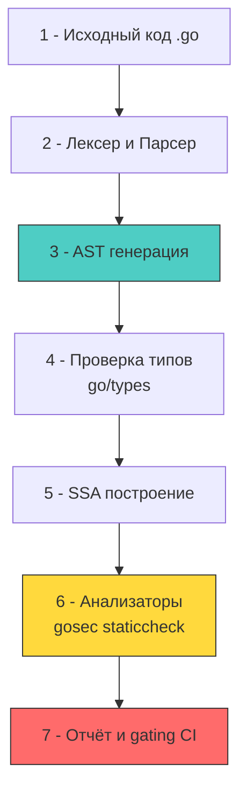

## Введение: AST, SSA и граница компиляции

Статический анализ в Go — это не просто проверка форматирования или стиля. Это анализ абстрактного синтаксического дерева (AST) и формы единичного присваивания (SSA) на этапе компиляции. В отличие от динамических языков, где анализаторы часто полагаются на интерпретатор или runtime-инструменты, Go-анализаторы работают с исходным кодом и промежуточным представлением компилятора. Это даёт высокую точность и нулевой оверхед в продакшене, но сталкивается с фундаментальными ограничениями теоремы о неразрешимости (halting problem).

Для разработчика уровня Senior/Lead статический анализ — это архитектурный фильтр, который отлавливает уязвимости ещё до запуска приложения. Понимание того, как работают парсеры, разрешители типов и SSA-генераторы, позволяет правильно конфигурировать линтеры, писать кастомные проверки и избегать ложных срабатываний, которые тормозят пайплайны.



### Механика работы: от парсера до SSA

Инструменты статического анализа в Go базируются на пакете `go/analysis`. Его конвейер повторяет фазы компилятора `gc`:

1 - **Загрузка пакетов**: `go/packages` вызывает `go list -json`, собирая граф зависимостей, импорты и флаги компиляции. На уровне ОС это порождает процессы, читает `.go` файлы и кэширует результаты.
2 - **Парсинг в AST**: Исходный текст преобразуется в дерево узлов (`ast.File`, `ast.FuncDecl`, `ast.CallExpr`). Каждый узел содержит позиции в файле (line/col), что позволяет генерировать точные репорты. Обход дерева рекурсивен, создаёт временные объекты в стеке и куче.
3 - **Разрешение типов**: `go/types` связывает идентификаторы с объявлениями, проверяет совместимость типов, разрешает методы интерфейсов. Это самая тяжёлая фаза по памяти: строится полный граф объектов (`types.Object`, `types.Type`), который живёт в куче до завершения анализа пакета.
4 - **Генерация SSA**: `golang.org/x/tools/go/ssa` преобразует AST в управляющий граф потока (CFG) в форме единичного присваивания. Здесь каждая переменная назначается ровно один раз, что упрощает анализ потоков данных, констант и выявления недостижимого кода.

> [!info] Под капотом
> **Почему анализаторы потребляют много RAM в CI?**
> Пакет `go/types` строит денормализованный граф всех пакетов и их зависимостей. Для крупного монолита это десятки тысяч структур в куче. Рантайм Go аллоцирует их без предсказуемых паттернов доступа, что вызывает промахи кэша L1/L2 при обходе. На сервере CI с 4 ГБ RAM анализ может спровоцировать `GC` в агрессивном режиме, увеличивая время пайплайна на 30-50%. Решение: инкрементальный анализ (`golangci-lint run --new-from-rev`), выделение отдельных раннеров с `GOMEMLIMIT` и кэширование результатов `go/packages`.

### Ключевые инструменты и их архитектура

В экосистеме Go доминирует связка из специализированных анализаторов, каждый из которых решает свой класс задач безопасности:

1 - `gosec`: Сканирует AST на поиск паттернов уязвимостей (SQL-инъекции, хеш-коллизии, небезопасные TLS-конфиги, `math/rand`). Работает быстро, так как не строит SSA, а обходит AST с правилами-матчерами.
2 - `staticcheck`: Глубокий анализатор. Проверяет семантику, недостижимый код, ошибки в конкурентности, неправильное использование `context`. Использует SSA для анализа потоков данных.
3 - `govulncheck`: Сравнивает граф вызовов с базой `vuln.go.dev`. Отличается от CVE-сканеров тем, что проверяет **достижимость** уязвимого кода из вашей точки входа.
4 - `nilaway` / `nilness`: Анализаторы нулевых указателей. В Go nil-паники — частый вектор DoS. Эти инструменты используют SSA для отслеживания путей, где переменная может быть nil.

```yaml
# .golangci-lint.yml: оптимизированная конфигурация для CI
run:
  timeout: 5m
  modules-download-mode: readonly
  go: "1.22"

linters-settings:
  gosec:
    config:
      G104: false # Отключаем шумные проверки, которые ловит statikcheck
      G304: true  # File path traversal
      G401: true  # Use of weak crypto
      G501: true  # Blocklisted import MD5
  
  staticcheck:
    checks:
      - all
      - "-SA1019" # Разрешаем deprecated временно, если есть миграционный план

linters:
  enable:
    - gosec
    - staticcheck
    - errcheck
    - govet
    - bodyclose # Закрывает ли http.Response.Body

issues:
  exclude-rules:
    - path: "_test\\.go"
      linters:
        - gosec
        - staticcheck
  max-issues-per-linter: 0
  max-same-issues: 0
```

### Идиоматичная разработка кастомного анализатора

Когда стандартных правил недостаточно, архитектура `go/analysis` позволяет писать собственные проверки, которые интегрируются в `golangci-lint` и `go vet`.

```go
package main

import (
	"go/ast"
	"go/types"

	"golang.org/x/tools/go/analysis"
	"golang.org/x/tools/go/analysis/passes/inspect"
	"golang.org/x/tools/go/ast/inspector"
)

// noTimeoutHTTPChecker ищет вызовы http.Get без context или timeout
var Analyzer = &analysis.Analyzer{
	Name: "notimeouthttp",
	Doc:  "checks for http.Get/Post calls without explicit context or timeout",
	Run:  run,
	Requires: []*analysis.Analyzer{inspect.Analyzer},
}

func run(pass *analysis.Pass) (any, error) {
	insp := pass.ResultOf[inspect.Analyzer].(*inspector.Inspector)

	nodeFilter := []ast.Node{(*ast.CallExpr)(nil)}

	insp.Preorder(nodeFilter, func(n ast.Node) {
		call := n.(*ast.CallExpr)
		
		// Проверяем, что это селектор (http.Get)
		sel, ok := call.Fun.(*ast.SelectorExpr)
		if !ok {
			return
		}
		
		// Проверяем пакет http и методы Get/Post
		pkgName, ok := sel.X.(*ast.Ident)
		if !ok || pkgName.Name != "http" {
			return
		}
		if sel.Sel.Name != "Get" && sel.Sel.Name != "Post" && sel.Sel.Name != "PostForm" {
			return
		}

		// Проверяем сигнатуру: http.Get не принимает context
		// Это архитектурная ошибка в Go 1.7+
		pass.Reportf(call.Pos(), "http.%s is blocking without timeout, use http.NewRequestWithContext", sel.Sel.Name)
	})

	return nil, nil
}
```

> [!warning] Ловушка / Gotcha
> **Отражение (reflect) и unsafe как слепые зоны**
> Статический анализатор работает с AST и типами на этапе компиляции. `reflect.Value.Call()` или `unsafe.Pointer` разрушают статическую модель. Анализатор не знает, какая функция будет вызвана через рефлексию, и не может отследить алиасы через `unsafe`. 
> **Решение:** Не полагаться на статический анализ для кода с интенсивным использованием `reflect` или `cgo`. Для таких участков обязательны dynamic-тесты, фаззинг и ручное ревью. В `golangci-lint` используйте `//nolint` с явным комментарием, а не глушите правила глобально.

### Под капотом: влияние на планировщик и файловый I/O

Запуск линтеров в CI — это стресс-тест для дисковой подсистемы и CPU. `golangci-lint` запускает десятки анализаторов параллельно через `errgroup`. Каждый анализатор:
- Читает `.go` файлы с диска (syscall `open`, `read`).
- Вызывает `go list` для разрешения зависимостей.
- Строит AST/SSA в памяти.

Без кэширования каждый коммит вызывает полную перекомпиляцию графа. Современные CI-системы кэшируют директории `~/.cache/go-build` и `~/.cache/golangci-lint`. Однако инкрементальный кэш инвалидируется при изменении `go.mod`, флагов сборки или версии Go. Это приводит к «холодным» запускам, где время анализа может достигать 5-10 минут для крупных монолитов.

Оптимизации:
- Использовать `--new-from-rev=HEAD~1` для проверки только изменённых файлов в PR.
- Настроить `run.skip-dirs` и `skip-files` для кодогенерированных файлов (`*_gen.go`, `mock_*`).
- Включить `build-tags` только для продакшен-кода, исключая `_test.go` из тяжёлых проверок.

> [!tip] Собеседование
> **Вопрос:** Почему `govulncheck` не находит уязвимость в зависимости, которая есть в `go.mod`, но вы уверены, что она уязвима?
> **Ответ:** 
> 1 - `govulncheck` анализирует достижимость кода. Если ваша бизнес-логика не импортирует и не вызывает функции из уязвимого пакета, анализатор пометит это как `Not reachable`.
> 2 - Это не баг, а архитектурная фича, отсеивающая шум от транзитивных зависимостей, которые вы не используете.
> 3 - Для полной уверенности запустите `govulncheck -show verbose ./...`. Он покажет граф вызовов и объяснит, почему код недостижим.
> 4 - **Важно:** Даже недостижимая уязвимость остаётся в бинарнике из-за статической линковки. Если атакующий найдёт другой вектор для вызова этого кода (например, через `reflect` или инъекцию URL), защита не сработает. Поэтому `govulncheck` — это приоритизация, а не полное игнорирование.

## Итог

1 - Статический анализ в Go опирается на AST, `go/types` и SSA. Это даёт высокую точность, но требует значительных ресурсов CPU и памяти для построения графа пакетов.
2 - Инструменты (`gosec`, `staticcheck`, `govulncheck`) решают разные задачи: паттерн-матчинг, семантический анализ и проверку достижимости уязвимостей. Их комбинация обязательна.
3 - `reflect` и `unsafe` создают слепые зоны для статических анализаторов. Для таких участков необходимы динамические тесты и фаззинг.
4 - Интеграция в CI требует кэширования, инкрементального анализа и разделения проверок для PR и nightly-сборок, чтобы избежать троттлинга пайплайнов.
5 - Кастомные анализаторы на базе `go/analysis` позволяют внедрять архитектурные правила безопасности, специфичные для вашей кодовой базы, и встраивать их в стандартный `go vet`.

[[3. Логирование и аудит]]