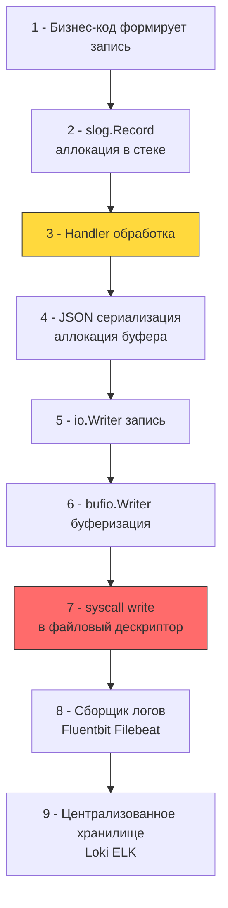

## Фундамент безопасного логирования: от отладки к аудит-контролю

Логирование в production-бэкенде — это не средство отладки, а критический компонент безопасности и наблюдаемости. В контексте AppSec логи выполняют две функции: **детектирование угроз** в реальном времени и **аудит** для пост-фактум расследований. Архитектурная ошибка заключается в смешивании диагностических логов, метрик и аудита. Это ведёт к росту стоимости хранения, шуму в алертинге и, что критичнее, к утечке чувствительных данных через неконтролируемые `fmt.Printf` или сторонние библиотеки.



### Механика записи: syscall, буферизация и влияние на планировщик

На уровне ОС запись лога — это синхронный системный вызов `write(fd, buf, count)`. Если буфер полностью заполняет кэш страниц ядра (page cache), вызов возвращается мгновенно. При переполнении или использовании `O_SYNC`/`O_DSYNC` вызов блокирует тред до физической записи на диск.

В рантайме Go `os.File` по умолчанию **не буферизует** запись. Каждый `log.Printf` или `slog.Info` вызывает `syscall.Write`. При 10 000 RPS с логами на каждый запрос это 10 000 переключений контекста `Ring 3 -> Ring 0` в секунду. Ядро ставит горуину в состояние `blocked`, планировщик создаёт новый `M` (тред ОС), что ведёт к троттлингу CPU и росту latency.

**Решение:** Обязательная буферизация через `bufio.NewWriter` или асинхронный `io.Writer`. В стандартной библиотеке `log/slog` позволяет передать кастомный `io.Writer`. Комбинация `bufio` + `sync.Pool` для буферов снижает количество `syscall` в сотни раз и выносит I/O из горячего пути обработчика.

### log/slog под капотом: аллокации, GC и escape analysis

Пакет `log/slog` (с Go 1.21) построен вокруг интерфейса `slog.Handler`. Стандартный `JSONHandler` при вызове `Info(msg, key, val...)`:
1. Создаёт `slog.Record` на стеке вызывающей горутины. Это избегает аллокации самой структуры записи.
2. Вызывает `handler.WithAttrs` или `handler.Handle`. Для сериализации в JSON выделяется `[]byte` буфер.
3. Использует `encoding/json` или кастомный сериализатор. Каждый `map[string]any` в аргументах проходит `reflect` или интерфейсные преобразования, что **гарантирует Escape Analysis** в кучу.

**Влияние на GC:** При высокой нагрузке короткие JSON-буферы быстро заполняют молодое поколение (`gen0`). Сборщик мусора запускает частые `Minor GC` фазы. Во время `Stop-The-World` (хоть и микро-паузы в Go) все горутины приостанавливаются, что создаёт хвосты на `P99` латентности.

> [!info] Под капотом
> **Почему `slog.Any(key, value)` убивает производительность?**
> `slog.Any` принимает `interface{}`. Компилятор не может статически определить тип, поэтому значение упаковывается в `eface` (указатель на тип + указатель на данные). При сериализации `JSONHandler` использует `reflect` для обхода структуры. `reflect` аллоцирует временные объекты, вызывает динамический диспетчинг и ломает инлайнинг. 
> **Идиоматичная замена:** `slog.Int64`, `slog.String`, `slog.Bool`. Они передают значения напрямую, упаковываются в `slog.Record` без кучевых аллокаций и сериализуются без `reflect`. Это снижает GC-давление на 40-60% в высоконагруженных API.

### Безопасность данных: санитизация и предотвращение инъекций

Логи — вектор утечки PII (Personal Identifiable Information), секретов и данных сессий. Кроме того, текстовые логи уязвимы к **Log Forging** (инъекции новых строк). Если пользователь передаёт `email: "admin@test.com\n2024/01/01 [CRITICAL] System hacked by admin"`, парсер логов воспримет вторую строку как отдельную запись, ломая корреляцию событий и системы алертинга.

Архитектурная защита строится на:
1. **Структурированном формате** (JSON): Новые строки в значениях автоматически экранируются (`\n` -> `\\n`), что исключает инъекции.
2. **Кастомном `slog.Handler` с редукцией**: Централизованное правило для маскирования полей (`password`, `token`, `authorization`, `email` -> `***`).
3. **Allowlist полей**: Логируются только явно разрешённые атрибуты. Всё остальное дропается.

```go
package securelog

import (
	"context"
	"log/slog"
	"strings"
)

// RedactingHandler маскирует чувствительные поля до сериализации
type RedactingHandler struct {
	slog.Handler
	redactKeys map[string]bool
	mask       string
}

func NewRedactingHandler(h slog.Handler, keys []string) *RedactingHandler {
	redact := make(map[string]bool, len(keys))
	for _, k := range keys {
		redact[strings.ToLower(k)] = true
	}
	return &RedactingHandler{Handler: h, redactKeys: redact, mask: "***REDACTED***"}
}

func (h *RedactingHandler) Handle(ctx context.Context, r slog.Record) error {
	// Проходим по всем атрибутам записи. Это происходит в горячем пути.
	r.Attrs(func(a slog.Attr) bool {
		if h.redactKeys[strings.ToLower(a.Key)] {
			r.AddAttrs(slog.String(a.Key, h.mask))
		}
		return true // Продолжаем обход
	})
	return h.Handler.Handle(ctx, r)
}

// WithAttrs оборачивает вызов для корректной работы групп и вложенных хендлеров
func (h *RedactingHandler) WithAttrs(attrs []slog.Attr) slog.Handler {
	// Упрощённо: в продакшене нужно применять редукцию и к новым attrs
	return &RedactingHandler{
		Handler:    h.Handler.WithAttrs(attrs),
		redactKeys: h.redactKeys,
		mask:       h.mask,
	}
}
```

### Аудит и неизменяемость: криптографические цепи

Аудит-логи отличаются от операционных: они фиксируют **кто**, **что**, **когда** и **с каким результатом** выполнил операцию, влияющую на безопасность или данные. Требования:
- **Идемпотентность**: Дублирующая запись не должна ломать отчёт.
- **Атрибуты авторизации**: `user_id`, `role`, `ip`, `user_agent`.
- **Контекст запроса**: `trace_id` для корреляции с распределённой трассировкой.
- **Защита от модификации**: Хранение хеш-цепи (hash chain) или подпись каждой записи.

В Go аудит реализуется через отдельный `slog.Handler`, который пишет в изолированный `io.Writer` (например, `os.OpenFile` с флагами `O_APPEND|O_WRONLY|O_CREATE`) и отправляет события в асинхронную очередь (Kafka, NATS).

> [!warning] Ловушка / Gotcha
> **Блокировка горячего пути синхронным аудитом**
> Если аудитор вызывает `db.Exec` или `http.Post` внутри хендлера, ошибка записи в аудит вернёт `500` клиенту или добавит задержку. Аудит никогда не должен быть синхронным барьером для бизнес-ответа.
> **Решение:** Использовать канал с буфером `make(chan AuditEvent, 1024)`. Фоновая горутина читает из канала и пишет в хранилище. Если канал переполнен, событие дропается с инкрементом метрики `audit_events_dropped_total`, но бизнес-логика продолжает работу.

### Идиоматичная реализация высокопроизводительного логгера

```go
package securelog

import (
	"context"
	"io"
	"log/slog"
	"os"
	"sync"
)

// SetupLogger конфигурирует безопасный и производительный логгер
func SetupLogger(output io.Writer, level slog.Leveler, redactKeys []string) *slog.Logger {
	// Буферизация для снижения syscall
	bufWriter := io.Writer(output)
	if _, ok := output.(*os.File); ok {
		bufWriter = &syncWriter{
			w:   output,
			buf: make([]byte, 0, 4096),
			mu:  &sync.Mutex{},
		}
	}

	// JSON формат, оптимальный для парсинга и защиты от инъекций
	jsonHandler := slog.NewJSONHandler(bufWriter, &slog.HandlerOptions{
		Level:     level,
		AddSource: true, // Для дебага, в продакшене часто false для снижения размера
	})

	// Оборачиваем в редуктор
	handler := NewRedactingHandler(jsonHandler, redactKeys)

	return slog.New(handler)
}

// syncWriter реализует потокобезопасный буферизированный writer
type syncWriter struct {
	w   io.Writer
	buf []byte
	mu  *sync.Mutex
}

func (sw *syncWriter) Write(p []byte) (int, error) {
	sw.mu.Lock()
	defer sw.mu.Unlock()

	if len(sw.buf)+len(p) > cap(sw.buf) {
		if _, err := sw.w.Write(sw.buf); err != nil {
			return 0, err
		}
		sw.buf = sw.buf[:0]
	}

	sw.buf = append(sw.buf, p...)
	if len(sw.buf) >= 4096 { // Сброс по достижении лимита
		n, err := sw.w.Write(sw.buf)
		sw.buf = sw.buf[:0]
		return n, err
	}
	return len(p), nil
}
```

### Ловушки и вопросы с собеседований

1 - **Log Injection через JSON**: Разработчики думают, что JSON экранирует всё. Но если значение содержит `\u0000` (null byte) или управляющие символы, некоторые агенты сбора логов (Filebeat, Fluentd) могут обрезать строку или упасть. **Решение:** Использовать `encoding/json` стандартный маршаллер, который корректно экранирует control chars, или валидировать UTF-8 перед записью.
2 - **`slog` vs `zap`/`logrus`**: `logrus` устарел (аллоцирует `Entry` на куче, использует `reflect`). `zap` быстрее за счёт zero-allocation API и пулов буферов. `slog` догнал `zap` по производительности в Go 1.22+ за счёт оптимизированного `JSONHandler` и компиляторных улучшений. Для новых проектов `slog` — стандарт. Для legacy-highload `zap` остаётся оправданным.
3 - **Асинхронность и потеря данных**: При `panic` или `os.Exit(1)` буферизованные логи могут не успеть записаться. **Решение:** Регистрировать `defer log.Flush()` или использовать `os/signal` для graceful shutdown с принудительным сбросом буферов.
4 - **Контекст vs Аргументы**: Передача `trace_id` через `context.Value` и извлечение его в `slog.Handler` создаёт дополнительную аллокацию `context.WithValue`. В высоконагруженных системах лучше передавать `trace_id` явно первым аргументом или использовать `slog.With()` на уровне middleware, создавая один дочерний логгер на запрос.

> [!tip] Собеседование
> **Вопрос:** Как сравнить производительность логирования в Go с PHP (Monolog) или Java (Logback), и почему Go требует явной буферизации?
> **Ответ:**
> 1 - В PHP каждый запрос изолирован. Буферизация происходит на уровне `php://output` или веб-сервера (PHP-FPM). `Monolog` пишет синхронно, но процесс умирает сразу после ответа, сбрасывая буферы ОС.
> 2 - В Java `Logback`/`Log4j2` имеют встроенные асинхронные аппендеры с lock-free кольцевыми буферами (LMAX Disruptor), которые работают на уровне фреймворка.
> 3 - В Go `os.File` — тонкая обёртка над syscall. Рантайм не буферизует запись автоматически. Разработчик обязан явно применять `bufio` или асинхронные воркеры. Это даёт полный контроль над памятью и syscall, но требует дисциплины.
> 4 - **Архитектурный вывод:** В Go логирование проектируется как явный конвейер `io.Writer`. Это позволяет заменить stdout на сеть, буфер или шифрованное хранилище одной строкой кода без изменения бизнес-логики.

## Итог

1 - Логирование в Go — это явный конвейер `io.Writer`. Без буферизации каждый вызов генерирует дорогой `syscall write`, блокируя горутину и тред ОС.
2 - `log/slog` минимизирует аллокации через стековый `slog.Record`, но использование `slog.Any` или `map[string]any` провоцирует `reflect`, escape analysis в кучу и GC-паузы.
3 - Безопасность логов обеспечивается структурированным форматом (JSON), кастомным `Handler` с редукцией чувствительных полей и строгой санитизацией входных данных для предотвращения log forging.
4 - Аудит-события должны быть асинхронными, идемпотентными и изолированными от бизнес-пути. Переполнение очереди аудита не должно ломать клиентский ответ.
5 - Архитектурно верное логирование балансирует между детализацией для безопасности, производительностью CPU/GC и стоимостью хранения. Интеграция с распределённой трассировкой (`trace_id`) обязательна для корреляции инцидентов.

[[4. Incident response]]