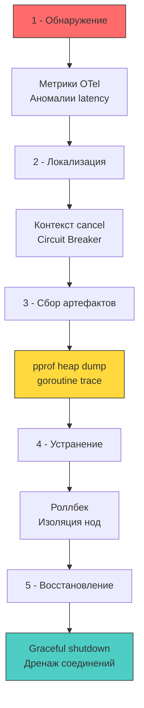

## Инцидент-менеджмент в высоконагруженном Go-бэкенде

Incident Response (IR) в распределённых системах — это не просто «починить прод». Это структурированный цикл обнаружения, локализации, устранения и восстановления, где каждая секунда простоя или компрометации конвертируется в финансовые и репутационные потери. В экосистеме Go инцидент-менеджмент имеет уникальную специфику: отсутствие виртуальной машины, статическая линковка, кооперативный планировщик горутин и встроенные инструменты профилирования делают live-forensics доступными прямо из рантайма. Однако неправильное обращение с этими механизмами во время стресса ускоряет коллапс процесса.



### Под капотом рантайма: что происходит во время инцидента

Понимание поведения планировщика, аллокатора и сборщика мусора под нагрузкой критично для принятия верных решений в момент кризиса.

1 - **Утечка горутин и лимиты ядра**: Горутины не собираются GC. Они остаются в памяти, пока не завершатся или не будут принудительно остановлены. Каждая горутина стартует с 2 КБ стека, но может расти динамически до 1 ГБ. При утечке тысяч горутин процесс упирается в `RLIMIT_NPROC` (лимит тредов ОС) или `vm.max_map_count` (лимит маппингов памяти). Ядро начинает килить соседние процессы или возвращает `EAGAIN` на `clone`, что ломает весь сервис.
2 - **Паника и раскрутка стека**: `panic` немедленно прерывает текущую горутину, вызывает все зарегистрированные `defer` и завершает программу, если не пойман `recover()`. В Go один `panic` убивает **весь процесс**, а не отдельный HTTP-запрос. Это фундаментальное отличие от Java, где исключения изолированы в тредах, или PHP, где процесс умирает вместе с запросом.
3 - **GC под стрессом**: При атаках типа JSON-bomb или memory-leak аллокатор быстро заполняет арену кучи. `GC` переходит в агрессивный режим, пытаясь вернуть память ОС. В Go 1.19+ `debug.SetMemoryLimit` заставляет рантайм возвращать память до того, как ядро вызовет OOM-killer. Это даёт окном в 10-30 секунд для graceful shutdown и снятия дампов.

> [!info] Под капотом
> **Почему `pprof` в момент инцидента может добить процесс?**
> Вызов `/debug/pprof/heap` или `runtime.GC()` перед снятием дампа требует остановки всех горутин на короткое время (Stop-The-World). Если рантайм уже борется с нехваткой памяти или блокировками, микро-пауза `GC` может растянуться до секунд. В этот момент `netpoll` перестаёт обрабатывать сокеты, клиенты получают таймауты, а балансировщик выводит ноду из пула.
> **Правило IR:** Снимайте дампы только после локализации и отключения трафика. Используйте `SIGQUIT` (выдаёт стек всех горутин в stderr без паники) или `pprof` с ограниченным таймаутом.

## Live Forensics в Go: инструменты и механика

В отличие от JVM, где форензика требует `jstack`/`jmap` и работы с тяжелыми core-файлами, или PHP, где доступен только анализ логов, Go предоставляет встроенные инструменты интроспекции.

### 1 - `net/http/pprof` и структура рантайма
Эндпоинты `pprof` читают внутренние структуры рантайма:
- `goroutine`: Обходит список `allg` (связный список всех горутин `g`), фильтрует по состоянию (`running`, `runnable`, `syscall`, `waiting`).
- `heap`: Читает `mheap` и арены, считает живые объекты, игнорируя фантомные указатели.
- `mutex` / `block`: Агрегирует данные из `runtime.mutexprofile` и `runtime.blockprofile`.
Все операции выполняются в User Space, но требуют синхронизации с планировщиком. В продакшене `pprof` должен быть защищён `BasicAuth` или доступен только через sidecar с `localhost` binding.

### 2 - Programmatic Dumps и `runtime/debug`
Для автоматизации IR-сборников можно использовать `runtime/pprof.Lookup("goroutine").WriteTo(w, 2)` или `debug.WriteHeapDump(fd)`. Однако `WriteHeapDump` блокирует процесс на время записи в файл. Идиоматичный подход — асинхронная запись в `io.Pipe` с последующей отправкой в S3 или Object Storage через фоновый worker.

```go
package incident

import (
	"context"
	"log/slog"
	"net/http"
	"os"
	"runtime/pprof"
	"time"
)

// CaptureDumps безопасно снимает дампы горутин и хипа
func CaptureDumps(ctx context.Context, dir string) error {
	// 1 - Принудительный GC для очистки мусора перед снимком хипа
	// Это снижает размер дампа, но вызывает STW. Использовать только в IR.
	// runtime.GC() 

	for _, name := range []string{"goroutine", "heap", "mutex", "block"} {
		prof := pprof.Lookup(name)
		if prof == nil {
			continue
		}

		f, err := os.CreateTemp(dir, name+"-*.pprof")
		if err != nil {
			return err
		}

		// Запись с детализацией 2 (полные стек-трейсы)
		if err := prof.WriteTo(f, 2); err != nil {
			f.Close()
			return err
		}
		f.Close()
		slog.InfoContext(ctx, "profile captured", "name", name, "file", f.Name())
	}
	return nil
}
```

## Graceful Shutdown и изоляция повреждённых компонентов

Во время инцидента критично не просто «убить процесс», а корректно завершить активные транзакции, закрыть соединения и освободить ресурсы. В Go это реализуется через `context.Context` и `http.Server.Shutdown()`.

```go
package server

import (
	"context"
	"log/slog"
	"net/http"
	"os"
	"os/signal"
	"syscall"
	"time"
)

func RunWithGracefulShutdown(srv *http.Server, timeout time.Duration) {
	ctx, stop := signal.NotifyContext(context.Background(), syscall.SIGINT, syscall.SIGTERM)
	defer stop()

	go func() {
		<-ctx.Done()
		slog.Info("shutdown signal received, draining connections")
		
		shutdownCtx, cancel := context.WithTimeout(context.Background(), timeout)
		defer cancel()

		if err := srv.Shutdown(shutdownCtx); err != nil {
			slog.Error("graceful shutdown failed", "err", err)
			// Fallback: принудительное завершение, если drain не успел
			os.Exit(1)
		}
	}()

	if err := srv.ListenAndServe(); err != http.ErrServerClosed {
		slog.Error("server crashed", "err", err)
		os.Exit(1)
	}
}
```

**Механическое сочувствие:** `srv.Shutdown()` отправляет всем активным соединениям сигнал `EOF` или закрывает слушатель. Новые запросы отклоняются. Существующие горутины обрабатывают `r.Context().Done()`. Если бизнес-логика игнорирует контекст, процесс зависнет на `timeout` и будет убит `SIGKILL` от init-системы. Это приводит к потере метрик, незаписанным логам в `bufio` и обрыву TCP-соединений в состоянии `FIN_WAIT`.

## Архитектура Observability для IR

Инструменты рантайма бесполезны без интеграции в pipeline наблюдаемости. Стандартная связка для Go-бэкенда:

1 - **Метрики (Prometheus)**: `http_requests_total`, `http_request_duration_seconds`, `go_goroutines`, `go_memstats_heap_inuse_bytes`, `process_cpu_seconds_total`. Аномалии в этих метриках триггерят алерты.
2 - **Трассировка (OpenTelemetry)**: `trace_id` пробрасывается через `context.Context` и заголовки `traceparent`. Позволяет восстановить полный путь запроса через микросервисы и найти bottleneck.
3 - **Логи (slog + JSON)**: Структурированные записи с `level`, `msg`, `trace_id`, `user_id`. Аудит-логи отделяются от операционных.
4 - **Алертинг (AlertManager)**: Правила на основе PromQL, отправляющие webhook в PagerDuty/OpsGenie.

> [!warning] Ловушка / Gotcha
> **`recover()` без проброса контекста и метрик**
> Частая ошибка в Go: `defer recover()` проглатывает панику, логирует её в `fmt.Println` и возвращает `500`. Проблема в том, что паника часто возникает из-за `nil pointer` или `out of bounds`, что может быть признаком атаки или бага в парсере. Без проброса `stacktrace`, `trace_id` и алерта инцидент остаётся невидимым до ручного анализа логов.
> **Решение:** Используйте `slog.ErrorContext` с `runtime.Stack`, инкрементируйте метрику `app_panics_total{label="handler_name"}`, и при критичных паниках (OOM, security violation) форсируйте перезапуск пода в K8s через `os.Exit(1)`, чтобы система самовосстановилась.

> [!tip] Собеседование
> **Вопрос:** Как отличить в `pprof` утечку памяти от нормальной работы GC, и какие метрики рантайма Go нужно мониторить в первую очередь при инциденте?
> **Ответ:**
> 1 - `pprof heap` показывает живые объекты (`inuse_space`). Если график растёт ступенчато после каждого GC-цикла и не возвращается к базовой линии — это утечка.
> 2 - Ключевые метрики: `go_memstats_heap_alloc_bytes` (активная память), `go_memstats_next_gc_bytes` (триггер следующего GC), `go_gc_duration_seconds` (время пауз), `go_goroutines` (количество активных горутин).
> 3 - `GOMEMLIMIT` должен быть ниже лимита cgroups. Если `heap_inuse` приближается к `GOMEMLIMIT`, рантайм начнёт aggressively возвращать память, что увеличит CPU usage.
> 4 - **Действие при IR:** Проверить `go_goroutines`. Если число > 10000 и не снижается — вероятна утечка горутин или блокировка в `netpoll`/`mutex`. Снять `goroutine pprof`, найти заблокированные функции, изолировать ноду, провести роллбек.

## Сравнение подходов: Go, Java, PHP

| Аспект | Go | Java (Spring Boot) | PHP (Laravel/Symfony) |
|--------|----|-------------------|------------------------|
| **Forensics** | `pprof` over HTTP, `SIGQUIT`, `runtime` introspection | `jstack`, `jmap`, `hs_err_pid.log`, APM agents | Логи веб-сервера, `coredump`, `xdebug` (dev) |
| **Crash Impact** | Весь процесс падает при `panic` без `recover` | Исключение в треде, JVM продолжает работу | Запрос умирает, PHP-FPM worker перезапускается |
| **Memory IR** | Heap dump лёгкий (текст/protobuf), быстрый анализ | Дамп десятки ГБ, требует `MAT`/`JProfiler`, долгий анализ | Нет дампов состояния, только состояние после рестарта |
| **Shutdown** | `context` + `http.Server.Shutdown()`, явный drain | `ApplicationListener` на `ContextClosedEvent` | Синхронный цикл запроса, нет состояния между вызовами |
| **Runtime Control** | `GOMEMLIMIT`, `GOMAXPROCS`, `SetMaxThreads` | `JVM args` (`-Xmx`, `-XX:+UseG1GC`), MBeans | `php.ini` (`memory_limit`, `max_execution_time`) |

## Итог

1 - Инцидент-менеджмент в Go требует глубокого понимания рантайма: поведения планировщика, аллокатора и GC под стрессом. Паника убивает процесс целиком, а утечка горутин упирается в лимиты ядра.
2 - Live forensics встроены в стандартную библиотеку (`net/http/pprof`, `runtime/debug`), но их использование в момент кризиса может спровоцировать `Stop-The-World` и ускорить коллапс. Дампы снимаются после отключения трафика.
3 - `Graceful shutdown` через `context.WithTimeout` и `http.Server.Shutdown` обязателен для корректного дренажа соединений, записи буферизованных логов и завершения фоновых задач.
4 - Наблюдаемость строится на комбинации метрик (Prometheus), трассировки (OpenTelemetry) и структурированных логов (`slog`). Алертинг должен триггерить автоматические IR-сценарии: снятие дампов, изоляцию ноды, роллбек.
5 - `recover()` должен быть инструментом контроля, а не подавления ошибок: логирование стек-трейсов, проброс `trace_id`, инкремент метрик и принудительный `os.Exit(1)` при критичных нарушениях обеспечивают быстрое самовосстановление кластера.

[[5. Итоги раздела. Security mindset]]