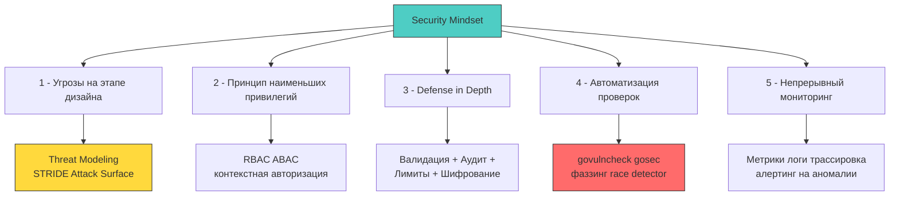
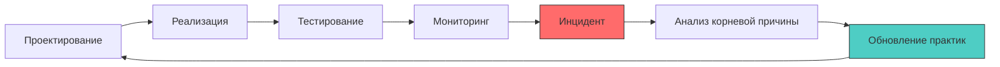

## Безопасность как образ мышления, а не чек-лист

Завершая раздел по безопасности приложений на Go, важно зафиксировать фундаментальный сдвиг парадигмы: **безопасность — это не фича, которую можно «добавить перед релизом», и не список пунктов для код-ревью. Это непрерывный процесс принятия архитектурных решений, где каждый выбор имеет последствия для конфиденциальности, целостности и доступности системы.**

Для разработчика уровня Senior/Lead это означает переход от реактивной модели («починим, когда найдём баг») к проактивной («спроектируем так, чтобы уязвимость не могла возникнуть»). В экосистеме Go, где компилятор помогает отлавливать целые классы ошибок на этапе сборки, этот переход особенно естественен — но требует дисциплины и понимания, что типобезопасность не равна безопасности приложения.



### Ключевые принципы, которые должны стать рефлексами

1 - **Данные извне — враждебны по умолчанию**. Любой входной поток (HTTP-запрос, gRPC-сообщение, событие из очереди, файл) должен проходить валидацию до попадания в бизнес-логику. В Го это реализуется через строгие DTO, `DisallowUnknownFields` в JSON-парсере и контекстную санитизацию. Подробнее: [[1. Валидация входных данных]].

2 - **Разделяй и властвуй**. Аутентификация (кто вы?) и авторизация (что вам можно?) — это разные слои с разными точками отказа. Смешивание их в одном мидлваре ведёт к архитектурным дефектам. Идиоматичный подход в Go: AuthN в глобальном мидлваре, AuthZ — на уровне доменного сервиса с явной проверкой прав. Подробнее: [[4. Аутентификация vs авторизация]].

3 - **Секреты не живут в коде**. Переменные окружения, `.env`-файлы и хардкод ключей — это технический долг, который становится уязвимостью при первом же дампе памяти или утечке репозитория. Используйте динамические провайдеры (Vault, KMS), защищённую память (`mlock`, `MADV_DONTDUMP`) и явное затирание чувствительных данных (`clear()`, `runtime.KeepAlive`). Подробнее: [[1. Секреты и управление секретами]].

4 - **Криптография — это не магия, а контракт**. Выбор алгоритма, режима шифрования и управления ключами определяет, будет ли ваша защита работать через 5 лет. В Го стандартная библиотека `crypto` предоставляет безопасные по умолчанию примитивы (AES-GCM, Ed25519, HMAC-SHA256), но их неправильная композиция (повторный nonce, слабая энтропия, сравнение через `==`) сводит защиту на нет. Подробнее: [[3. Криптография под капотом]].

5 - **Конкурентность — это не только производительность, но и поверхность атаки**. Гонки состояний (TOCTOU), утечка контекста между горутинами и неправильная синхронизация могут превратить оптимистичную архитектуру в уязвимость. Инструменты `-race`, `atomic`, `singleflight` и `context` — ваши союзники, но только при осознанном применении. Подробнее: [[7. Гонки состояний как уязвимость]].

### Преимущества и ответственность экосистемы Go

Go спроектирован с акцентом на простоту, читаемость и безопасность памяти. Это даёт ряд уникальных преимуществ для AppSec:

| Особенность | Преимущество для безопасности | Ответственность разработчика |
|-------------|------------------------------|-----------------------------|
| **Garbage Collector** | Нет use-after-free, buffer overflow через ручное управление памятью | Чувствительные данные остаются в куче до сбора; требуется явное затирание |
| **Статическая типизация + компиляция** | Многие уязвимости отлавливаются на этапе сборки | Динамические конструкции (`interface{}`, `reflect`) обходят компилятор — требуют особого контроля |
| **Стандартная библиотека криптографии** | Аудированные реализации, меньше «велосипедов» | Неправильная композиция примитивов (nonce, key management) ломает защиту |
| **Простота синтаксиса** | Код легче аудировать и ревьювить | Отсутствие «магии» означает, что вся логика безопасности должна быть явной и документированной |
| **Встроенные инструменты профилирования** | Live forensics через `pprof`, `trace`, `race detector` | Инструменты требуют защиты (auth на `/debug`), а их использование в момент инцидента может усугубить ситуацию |

> [!info] Под капотом
> **Почему «безопасность по умолчанию» в Go — это миф?**
> Компилятор защищает от ошибок памяти, но не от логических уязвимостей. `http.DefaultClient` не имеет таймаутов, `math/rand` детерминирован, `os/exec` наследует окружение, `json.Unmarshal` аллоцирует без лимитов. Безопасность в Го — это не результат использования языка, а следствие осознанного проектирования с учётом его особенностей.

### Практический чек-лист для ежедневной работы

Добавьте эти пункты в процесс разработки, код-ревью и деплоя:

```markdown
## Security Checklist (ежедневный)
- [ ] Все пользовательские данные валидируются на входе (allowlist, не blocklist)
- [ ] Ошибки не раскрывают внутреннюю структуру системы или чувствительные данные
- [ ] Чувствительные данные не логируются (или маскируются через кастомный `slog.Handler`)
- [ ] Контекст авторизации проверяется перед каждым доступом к ресурсу
- [ ] Нет хардкода секретов, токенов, паролей в коде или `go:embed`
- [ ] Используется `crypto/subtle.ConstantTimeCompare` для сравнения секретов
- [ ] Таймауты настроены для всех внешних вызовов (БД, HTTP, Redis)
- [ ] Rate limiting реализован для публичных эндпоинтов
- [ ] Зависимости проверены на уязвимости (`govulncheck`, `osv-scanner`)
- [ ] Debug-эндпоинты (`/debug/pprof`) отключены или защищены в продакшене
- [ ] Контейнер запускается с `--cap-drop ALL`, `--read-only`, от непривилегированного пользователя
- [ ] Логи структурированы (JSON), содержат `trace_id` и защищены от инъекций
```

### Непрерывный цикл улучшения: от инцидента к архитектуре

Безопасность — это не пункт в спринте, а петля обратной связи:



1 - **Проектирование**: Проводите threat modeling на старте каждой фичы. Задавайте вопросы: «Что может пойти не так, если этот вход контролирует атакующий?»
2 - **Реализация**: Пишите код с учётом принципа наименьших привилегий. Используйте идиомы Го для безопасной работы с памятью и конкурентностью.
3 - **Тестирование**: Интегрируйте `govulncheck`, `gosec`, фаззинг и race detector в CI. Пишите негативные тесты с adversarial payloads.
4 - **Мониторинг**: Настройте алерты на аномалии в метриках (`go_goroutines`, `http_request_duration`, `auth_failures`). Коррелируйте логи с трассировкой.
5 - **Инцидент**: Имейте готовый плейбук для IR: снятие дампов, изоляция ноды, роллбек. Анализируйте root cause без поиска виноватых.
6 - **Улучшение**: Обновляйте чек-листы, шаблоны кода и архитектурные решения на основе извлечённых уроков.

> [!tip] Собеседование
> **Вопрос:** Как объяснить менеджеру, что «добавить безопасность потом» технически невозможно без переписывания системы?
> **Ответ:** 
> 1 - Приведите аналогию с фундаментом здания: можно пристроить балкон, но нельзя добавить сейсмоустойчивость после постройки.
> 2 - Покажите конкретные примеры: если хендлеры не принимают `context` для авторизации, добавить её постфактум = изменить сигнатуры 50+ функций и переписать все тесты.
> 3 - Оцените стоимость: рефакторинг под безопасность в продакшене стоит в 10-100 раз дороже, чем проектирование с учётом угроз на старте.
> 4 - Предложите компромисс: внедрять безопасность инкрементально, но с чётким планом и приоритизацией по риску (OWASP Top 10, threat model).

### Финал: безопасность как профессиональная ответственность

В заключение — мысль, которая должна резонировать с каждым разработчиком, стремящимся к уровню Senior/Lead:

> **Безопасность — это не то, что вы добавляете в код. Это то, как вы думаете о коде.**

Каждый раз, когда вы пишете функцию, задавайте себе:
- Что произойдёт, если этот параметр будет контролировать атакующий?
- Какие данные попадают в логи, кэш, метрики — и кто может их прочитать?
- Как система поведёт себя при перегрузке, сбое сети или компрометации зависимости?
- Можно ли эту логику протестировать на устойчивость к злоупотреблению?

В экосистеме Го у вас есть мощные инструменты для воплощения этого мышления: строгая типизация, встроенная криптография, профилирование в рантайме, статический анализ. Но инструменты бесполезны без дисциплины их применения.

Этот раздел не ставил цели сделать вас экспертом по криптографии или пентестером. Его задача — дать архитектурную рамку, идиоматичные паттерны и практические приёмы, которые позволят проектировать и реализовывать бэкенд-системы на Го, устойчивые к современным угрозам.

Безопасность — это путь, а не пункт назначения. Продолжайте учиться, задавать вопросы и ставить под сомнение «очевидные» решения. Именно так рождаются надёжные системы.