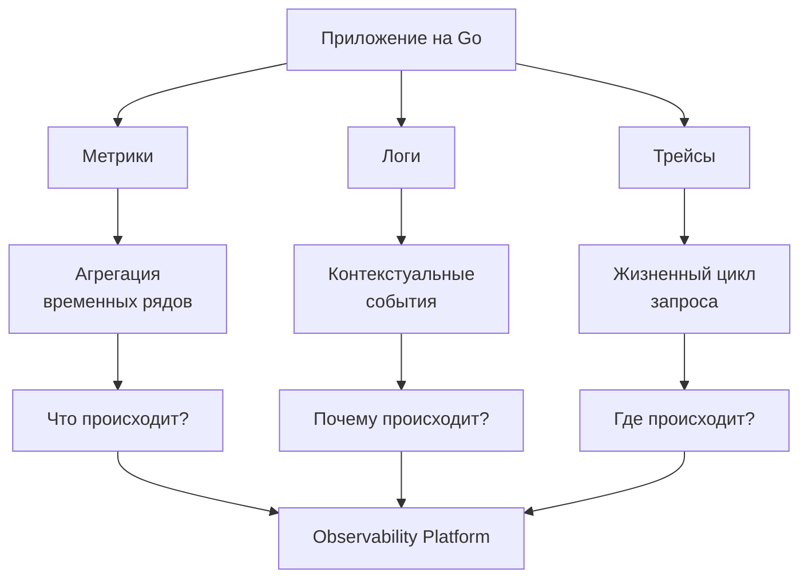

## От мониторинга к наблюдаемости

В традиционных монолитных приложениях (на PHP, Java или C#) диагностика проблем часто сводилась к простому сценарию: «Упала ошибка 500 — смотрим лог-файл на сервере». Если сервер один, а логи линейны, это работает. Но в мире микросервисов, Kubernetes и Go, где один запрос может пройти через десятки сервисов, запущенных в разных контейнерах, старый подход ломается.

Вы больше не можете «предугадать» все возможные отказы. Вы не можете заранее создать алерт на каждую возможную ошибку, потому что в распределенных системах ошибки принимают причудливые, невиданные ранее формы. Здесь на сцену выходит **Observability (Наблюдаемость)**.

### Определение: Monitoring vs Observability

Эти термины часто используют как синонимы, но между ними пропасть.

**Мониторинг** — это сбор и отображение заранее известных показателей. Это ответы на вопросы, которые вы сформулировали *до* того, как система была запущена.
*   *Примеры:* «Какая загрузка CPU?», «Какой код HTTP ответа?», «Сколько запросов в секунду?».
*   *Инструменты:* Zabbix, Prometheus alerts, Grafana dashboards.
*   *Предел:* Мониторинг отлично подходит для проверки «здоровья» системы (Health Check), но плох для выяснения *причин* неочевидных сбоев.

**Наблюдаемость (Observability)** — это мера того, насколько хорошо вы можете понимать внутреннее состояние системы, основываясь только на её внешних выходных данных (логах, метриках, трейсах).
*   *Цель:* Ответить на вопросы, которые вы даже не знали, что нужно задать. «Почему конкретный пользователь из региона X не может оформить заказ, хотя сервисы отвечают 200 OK, но задержка выше обычной?».

> [!tip] Собеседование
> **Вопрос:** В чем разница между мониторингом и наблюдаемостью?
> **Ответ:** Мониторинг сообщает о том, *что* сломалось (известные неизвестные). Наблюдаемость помогает понять, *почему* это сломалось (неизвестные неизвестные). Наблюдаемость позволяет «интерактивно» исследовать систему в момент инцидента, не деплоя новый код с логированием.

### Происхождение термина

Термин пришел из теории управления (Control Theory).
> Система называется наблюдаемой, если по её выходам можно определить текущее внутреннее состояние.

В разработке это означает, что ваших телеметрических данных (выходов) должно быть достаточно, чтобы реконструировать любую сбойную ситуацию без необходимости гадать или добавлять новый код.

## Mechanical Sympathy: Цена слепоты

С точки зрения работы ОС и «железа», система без observability — это «черный ящик».
1.  **Процессор и Syscalls:** Если ваше приложение заблокировано (например, Mutex contention или ожидание I/O), вы не увидите этого через обычные метрики «Requests Per Second». Вам нужно заглянуть в профиль CPU и Goroutines, чтобы увидеть, что поток (M) простаивает, а горутины (G) висят в очереди.
2.  **Память и GC:** Go — язык с Garbage Collector. Снижение пропускной способности может быть вызвано не бизнес-логикой, а частыми Stop-The-World паузами GC. Без observability (метрик кучи и трейсов GC) вы будете оптимизировать код вхолостую.

Наблюдаемость в Go — это не просто «писать логи». Это способ связать высокоуровневую бизнес-операцию (оформление заказа) с низкоуровневыми событиями (выделение памяти, системные вызовы, работа планировщика).

### Три столпа Observability

Чтобы система была наблюдаемой, необходимо собирать три типа данных (три столпа). В следующих статьях мы разберем их детально, но здесь важно понимать их роль в архитектуре.

1.  **Метрики (Metrics):** Числа, агрегированные за промежуток времени. Дешевы в хранении, идеальны для графиков и алертов. Отвечают на вопрос *«Что происходит?»* (например, рост потребления памяти, рост latency).
2.  **Логи (Logs):** Текстовые записи о событиях. Дают контекст. Отвечают на вопрос *«Почему случилось событие?»* (например, текст ошибки, stack trace). В Go особенно важны структурированные логи (JSON).
3.  **Трейсы (Traces):** Запись пути запроса через распределенную систему. Критически важны для микросервисов. Отвечают на вопрос *«Где bottleneck?»* (в каком сервисе запрос застрял).

## Go и Observability: Особенности языка

Go имеет специфические преимущества и вызовы в контексте observability.

1.  **`expvar` и `pprof`:** В Go есть встроенные инструменты. Пакет `net/http/pprof` позволяет в реальном времени получать профили CPU и памяти через HTTP-эндпоинт. Это базовый уровень observability, доступный «из коробки».
2.  **Горутины:** В отличие от тредов ОС, у горутин нет ID, доступного разработчику напрямую (до недавнего времени). Это затрудняет трассировку. Для решения этой проблемы используется `context.Context`, который пробрасывает trace ID через стек вызовов.
3.  **Структурированное логирование:** Go переходит на структурированные логгеры (пакет `log/slog` в стандартной библиотеке с версии 1.21). Это фундамент для парсинга логов системами вроде Loki или ELK.

> [!warning] Ловушка / Gotcha
> **Слепое логирование.**
> В PHP/Java разработчики часто привыкли «логировать всё» (`try...catch...log`). В высоконагруженном Go-сервисе это может стать проблемой.
> *   Логирование — это мьютекс и системный вызов (I/O).
> *   Сериализация в JSON (в структурированном логгере) требует аллокаций (reflection или динамическая типизация).
> *   Логирование каждого запроса может «убить» производительность приложения и забить диск/сеть.
>
> **Решение:** Использовать уровни логирования, семплирование (логировать не 100% запросов, а 10% или только ошибки) и асинхронную запись.

## Практика System Design

При проектировании системы observability для Go-бэкенда следует придерживаться принципа **Instrumentation first**. Инструментирование кода должно быть частью разработки, а не «костылем» после инцидента.

Архитектурно это выглядит так:
1.  **Instrumentation:** Код генерирует данные (SDK OpenTelemetry).
2.  **Collection:** Агент (часто sidecar-контейнер или DaemonSet в K8s) собирает данные.
3.  **Processing:** Телеметрия фильтруется, агрегируется, семплируется.
4.  **Storage:** Данные пишутся в специализированные БД (Prometheus для метрик, Loki/ClickHouse для логов, Jaeger/Tempo для трейсов).
5.  **Visualization:** Grafana или аналоги для отображения.

## Итог

Observability — это не инструмент, а свойство системы. В мире распределенных систем на Go вы не можете полагаться на удачу. Вы должны проектировать систему так, чтобы она «рассказывала» вам о своих проблемах.

В следующей статье мы детально сравним три столпа observability, чтобы понять, когда использовать метрики, а когда логи или трейсы: [[2. Метрики vs логи vs трейсы]].