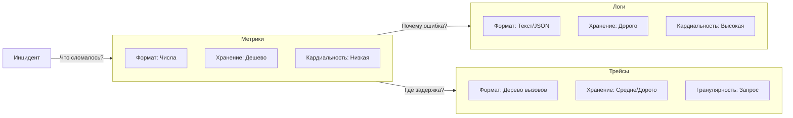

## Выбор инструмента для диагностики

В предыдущей статье мы определили наблюдаемость как способность понимать внутреннее состояние системы по её внешним выходам. Эти «выходы» — это три столпа: Метрики, Логи и Трейсы.

Новички часто совершают ошибку: пытаются использовать один инструмент для всех целей. Например, логируют каждое действие, чтобы потом парсить логи и строить графики. Это путь к краху производительности и раздуванию затрат. Каждый столп имеет свою уникальную природу, стоимость и область применения.

Сравним их через призму System Design и Mechanical Sympathy.

## 1. Метрики (Metrics): Агрегированные числа

Метрика — это одно число, представляющее состояние множества событий за промежуток времени. Это «сжатие» информации.

*   **Пример:** «За последнюю минуту сервис обработал 500 запросов с p99 latency 200мс».
*   **Суть:** Временные ряды (Time Series). Данные агрегируются на клиенте (в вашем приложении) или в агенте сбора (Prometheus Pushgateway/Node Exporter).

### Mechanical Sympathy: Почему метрики дешевы?

Метрики невероятно эффективны с точки зрения ресурсов.
1.  **Память:** Счетчик (Counter) — это просто атомарный инкремент целого числа в памяти. Это операция уровня процессорного регистра, занимающая наносекунды.
2.  **CPU:** Гистограммы (Histogram) в Go (например, в клиенте Prometheus) работают с плавающей точкой, но аллокаций памяти в горячем пути (hot path) почти нет. Бакеты предвыделены.
3.  **Сеть и диск:** Вместо того чтобы отправлять 1 миллион логов, вы отправляете одну «серию» данных (например, `http_requests_total{status="200"} 1000000`). Нагрузка на сеть минимальна.

> [!warning] Ловушка / Gotcha
> **High Cardinality (Высокая кардинальность).**
> Метрики дешевы, пока меток (labels) мало. Если вы создадите метрику `http_requests_total` с лейблом `user_id`, и у вас миллион пользователей, вы создадите миллион временных рядов.
> *   **Результат:** Prometheus упадет с OOM (Out of Memory), так как каждая серия — это отдельный буфер в памяти базы данных.
> *   **Правило:** Метрики не любят уникальные значения (ID, email, IP). Используйте только дискретные множества (status code, endpoint name, region).

## 2. Логи (Logs): Контекст и события

Лог — это запись о конкретном событии с меткой времени. Это «сырые» данные.

*   **Пример:** `2023-10-27 10:00:01 ERROR user_id=123 failed to connect to db: connection refused`.
*   **Суть:** Поток событий (Event Stream).

### Mechanical Sympathy: Почему логи дороги?

В отличие от метрик, логи работают с диском и сетью гораздо интенсивнее.
1.  **Аллокации:** Каждая запись лога в Go (особенно если используется `fmt.Printf` или неоптимизированный JSON-marshaler) требует аллокации памяти под строку. Это создает нагрузку на Garbage Collector.
2.  **Системные вызовы:** Запись лога в файл или сокет — это `write` syscall. Если логировать каждый запрос в нагруженном сервисе, вы упретесь в лимит IOPS диска или сетевой карты.
3.  **Хранение:** Логи растут линейно с трафиком. Метрики — константно (если кардинальность фиксирована).

В Go с версии 1.21 появился пакет `log/slog`. Он позволяет писать структурированные логи эффективно, минимизируя аллокации через ленивое вычисление аргументов, но цена вывода (I/O) всё равно остается.

## 3. Трейсы (Traces): Путь запроса

Трейс показывает жизненный цикл одного запроса, проходящего через множество сервисов. Он состоит из Спанов (Spans).

*   **Пример:** Запрос начался в API Gateway -> перешел в Service A -> вызвал DB -> вернулся. Общее время 150ms, из них 120ms ждали БД.
*   **Суть:** Дерево вызовов (Call Graph).

### Mechanical Sympathy: Стоимость трейсинга

Трейсинг — самый «тяжелый» вид телеметрии с точки зрения CPU и сложности внедрения.
1.  **Context Propagation:** Чтобы трейс работал, вы должны передавать контекст (Trace ID) через все границы: функции, горутины, HTTP-заголовки, gRPC-metadata. В Go это делается через `context.Context`.
2.  **Сериализация:** Каждый спан — это объект в памяти, который нужно сериализовать и отправить в коллектор (Jaeger/Tempo).
3.  **Семплирование:** Из-за высокой стоимости трейсинг почти никогда не пишут для 100% запросов. Используют **Head-based sampling** (решение о записи принимается в начале запроса случайным образом, например, 1% трафика).

> [!tip] Собеседование
> **Вопрос:** Как связать Метрики, Логи и Трейсы между собой?
> **Ответ:** Через **Trace ID**.
> 1.  Генерируем Trace ID в начале запроса.
> 2.  Добавляем его в контекст (`context.Context`).
> 3.  Логгер (например, `slog`) извлекает Trace ID из контекста и пишет его в каждое лог-сообщение.
> 4.  В метриках можно использовать механизм **Exemplars** (доступно в Prometheus). Exemplar связывает метрику (например, медленный запрос) с конкретным Trace ID.
>
> Это позволяет перейти от графика (Метрика) -> к конкретному логу (Лог) -> к визуализации задержки (Трейс).

## Сравнительная таблица

### Когда что использовать?

| Сценарий | Инструмент | Почему? |
| :--- | :--- | :--- |
| **Настройка алерта** «Сервис упал» | **Метрики** | Дешевле всего проверить статус `up` или рост ошибок `rate(500)`. |
| **Поиск причины ошибки** для конкретного пользователя | **Логи** | Метрика скажет «есть ошибки», но только в логе будет `stack trace` и `user_id`. |
| **Оптимизация производительности** | **Трейсы** | Метрика покажет высокую latency, но только трейс покажет, что 90% времени ушло на N+1 запрос в БД. |
| **Анализ трендов** за месяц | **Метрики** | Логи за месяц хранить дорого и сложно агрегировать. |

## Итог

Эти три столпа не конкурируют, а дополняют друг друга.
1.  **Метрики** дают широкий обзор и позволяют быстро заметить проблему (Anomaly Detection).
2.  **Трейсы** позволяют локализовать проблему в конкретном сервисе или компоненте (Root Cause Analysis).
3.  **Логи** дают детальную информацию для исправления бага (Debugging).

В следующей статье мы подробнее остановимся на концептуальном объединении этих элементов: [[3. Три столпа observability]].