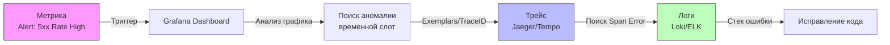

## Синергия данных

В предыдущей статье мы сравнили метрики, логи и трейсы, понимая их сильные и слабые стороны. Но настоящая наблюдаемость рождается не тогда, когда у вас есть три отдельные кучи данных, а когда они работают в связке.

Концепция **«Три столпа observability»** (The Three Pillars of Observability) стала классикой индустрии (популяризирована компанией Honeycomb и Charity Majors). Однако, многие ошибочно полагают, что достаточно купить три инструмента (Prometheus, Loki, Jaeger), и наблюдаемость достигнута.

На самом деле, столпы держат крышу только тогда, когда они **объединены корреляцией**. Давайте разберем, как это выглядит на практике и где здесь место Go-разработчика.

## Жизненный цикл инцидента: Взаимодействие столпов

Представьте, что вы получили алерт: «Количество ошибок 500 выросло». Вот как должны взаимодействовать три столпа:



1.  **Метрики (Обнаружение):** Метрики говорят нам, *что* происходит и *когда*. Они являются системой раннего оповещения. «Latency p99 превысила 1 секунду в 10:42».
2.  **Трейсы (Локализация):** Зная время (из метрик), мы ищем трейсы, которые попали в этот слот. Трейс показывает *где* (в каком микросервисе, в какой функции) запрос застрял. Мы видим, что в спане `db_query` время ожидания аномально высокое.
3.  **Логи (Диагностика):** В найденном спане (Span) есть `trace_id`. Мы идем в систему логирования и ищем логи с этим ID. Там мы видим текст ошибки: `connection refused` или `deadlock detected`.

## Техническая реализация связей в Go

Чтобы эта схема работала, данные должны быть сцеплены. В Go основным переносчиком контекста является `context.Context`.

### 1. Trace Context Propagation
Это стандарт W3C Trace Context. Когда запрос приходит в ваш HTTP-сервер, вы должны извлечь заголовки `traceparent` и `tracestate`, инициализировать контекст трейсинга и передавать его во все функции и downstream-запросы.

Если вы используете OpenTelemetry SDK, это делается автоматически через Middleware, но важно понимать принцип: **Trace ID — это первичный ключ вашей системы наблюдаемости.**

### 2. Structured Logging with Context
В Go 1.21+ появился `log/slog`. Чтобы связать логи и трейсы, логгер должен уметь извлекать Trace ID из контекста.

Пример (концептуальный):
```go
// Правильный подход: Логгер сам вытаскивает TraceID из ctx
logger.InfoContext(ctx, "Processing payment", "amount", 100)

// Вывод будет содержать автоматически подставленный trace_id:
// {"time":"...","level":"INFO","msg":"Processing payment","trace_id":"abc-123","amount":100}
```
Это избавляет от необходимости прокидывать `traceID` вручную в каждый вызов логгера.

### 3. Exemplars: Связь Метрик и Трейсов
Это продвинутая фича, критически важная для Senior-уровня.
**Exemplar** — это ссылка на конкретный трейс, прикрепленная к метрике.

В Prometheus (и клиенте Go) можно настроить так, чтобы при записи метрики (например, длительности запроса) туда добавлялся `TraceID`.

```go
// Пример использования exemplars в клиенте Prometheus
// (упрощенно)
histogram.ObserveWithExemplar(duration, prometheus.Labels{
    "traceID": traceIDFromContext(ctx),
})
```

**Зачем это нужно?**
Вы смотрите на график метрики, видите всплеск. Кликаете на точку на графике — и Grafana сразу открывает конкретный трейс, соответствующий этой точке. Это сокращает время диагностики (MTTR) в разы.

> [!info] Под капотом
> Exemplar-ы хранятся отдельно от основных данных временных рядов (Time Series). В памяти Prometheus они хранятся в специальных структурах, которые позволяют "привязать" метку времени и значение метрики к внешнему ID (TraceID), не раздувая кардинальность основных лейблов (Labels).

## Четвертый столп: Профилирование (Profiling)

Хотя классическая теория говорит о трех столпах, современная практика (особенно в Go) выделяет четвертый, критически важный элемент — **Continuous Profiling**.

Если метрики говорят «CPU высокий», а трейсы говорят «запрос медленный», то Профиль говорит **«какая именно строка кода ест CPU»**.

Go уникален тем, что профилирование встроено в рантайм (`net/http/pprof`).
*   **Профиль CPU:** Показывает, где программа тратит такты процессора.
*   **Heap Profile:** Показывает, где происходят аллокации памяти.
*   **Goroutine Profile:** Показывает количество и состояние горутин (помогает найти утечки).

В контексте Observability профили — это "микроскоп". Они не нужны постоянно, но когда проблема найдена (через метрики/трейсы), именно профиль позволяет поставить точный диагноз.

> [!tip] Собеседование
> **Вопрос:** У вас есть метрики (все зеленые) и логи (ошибок нет), но пользователи жалуются на медленную работу. В чем может быть дело и как диагностировать?
> **Ответ:** Возможно, проблема не в ошибках, а в производительности (CPU contention, lock contention, GC pauses).
> 1.  Метрики могут не показывать проблему, если вы не смотрите на `go_gc_duration_seconds` или `goroutines_count`.
> 2.  Вам нужно подключить **Profiling**. Снять CPU profile и Memory profile через pprof.
> 3.  Использовать **Tracing**, чтобы увидеть, где тратится время в рамках одного запроса (Span duration), даже если нет ошибок.

## Итог

Три столпа observability — это не три отдельных базы данных, а единая экосистема данных.
1.  **Метрики** дают сигнал тревоги.
2.  **Трейсы** локализуют место проблемы.
3.  **Логи** дают контекст ошибки.
4.  **Профили** (как четвертый столп) показывают узкие места производительности.

Главный инженерный вызов здесь — **корреляция данных**. В Go это решается через строгую работу с `context.Context` и использование стандартов вроде OpenTelemetry и Exemplars.

В следующей статье мы углубимся в одну из самых опасных, но важных тем для метрик — кардинальность и её стоимость: [[4. Cardinality и стоимость метрик]].