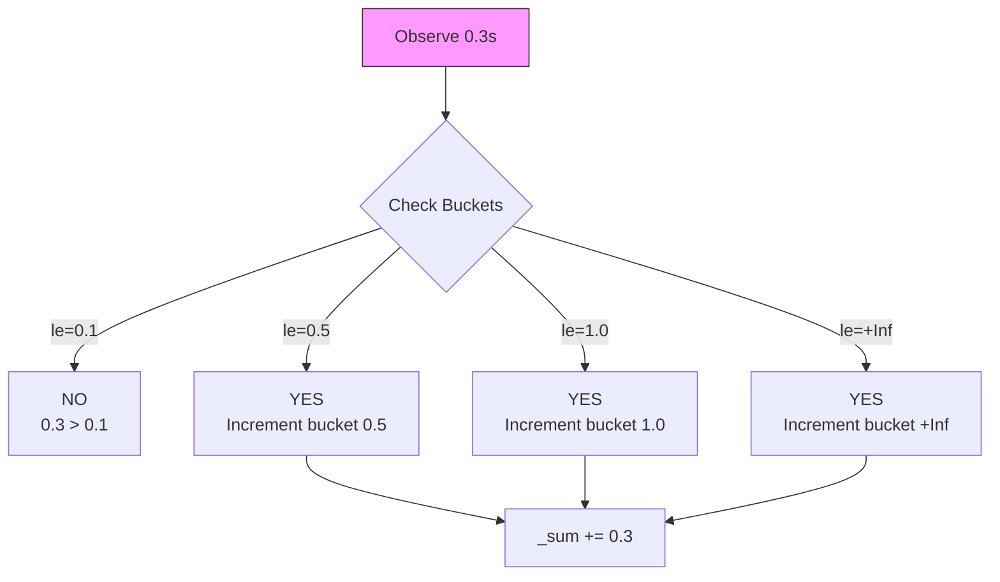

## Основные типы данных в TSDB

В предыдущей статье мы обсудили кардинальность и предупредили об опасности разрастания временных рядов. Теперь настало время понять, какие именно типы данных мы можем безопасно и эффективно использовать для измерения поведения нашей системы.

В экосистеме Prometheus (который стал стандартом де-факто для Go-бэкенда) существует четыре основных типа метрик. Понимание разницы между ними — это база для построения адекватных алертов и дашбордов.

## 1. Counter (Счетчик)

**Counter** — это метрика, значение которой может только расти (или сбрасываться в ноль при рестарте). Она представляет собой кумулятивную сумму.

*   **Примеры:** Количество обработанных запросов, количество ошибок, количество отправленных байт.
*   **Операции:** `Inc()` (увеличить на 1), `Add(float64)` (увеличить на значение).

### Under the Hood
Counter — это, по сути, атомарный инкремент. В Go (`sync/atomic`) это одна из самых дешевых операций с точки зрения CPU. Однако, сам по себе Counter как число бесполезен. Если вы увидите на графике `requests_total = 1,000,000`, это ни о чем не скажет — сервис работает час или год?

Вся мощь Counter раскрывается в функциях запросов (PromQL), например, `rate()`.

```go
// Идиоматичное использование Counter
var (
    httpRequestsTotal = promauto.NewCounterVec(
        prometheus.CounterOpts{
            Name: "http_requests_total",
            Help: "Total number of HTTP requests.",
        },
        []string{"path", "method"},
    )
)

func handler(w http.ResponseWriter, r *http.Request) {
    // Инкремент происходит в конце обработки
    defer func() {
        httpRequestsTotal.WithLabelValues(r.URL.Path, r.Method).Inc()
    }()
    // ... logic
}
```

> [!tip] Собеседование
> **Вопрос:** Почему Counter не может иметь метод `Dec()` (уменьшение)?
> **Ответ:** Потому что Counter предназначен для измерения скорости (rate) процесса за время. Если бы значение могло уменьшаться, функция `rate()` давала бы отрицательные значения скорости, что нарушает физический смысл метрики. Если вам нужно уменьшать значение — вам нужен `Gauge`.

## 2. Gauge (Измеритель)

**Gauge** — это метрика, значение которой может произвольно расти и падать. Это «моментальный снимок» состояния.

*   **Примеры:** Текущая температура CPU, использование памяти (RAM), количество активных горутин, размер очереди.
*   **Операции:** `Inc()`, `Dec()`, `Set(float64)`.

### Under the Hood
Gauge сложнее в реализации, чем Counter, так как требует операций `Load` и `Store` (или мьютексов), чтобы установить произвольное значение.

```go
// Пример мониторинга горутин (Gauge)
var (
    goroutinesGauge = promauto.NewGauge(prometheus.GaugeOpts{
        Name: "current_goroutines",
        Help: "Number of current goroutines.",
    })
)

func recordMetrics() {
    // Periodically update the gauge
    ticker := time.NewTicker(5 * time.Second)
    for range ticker.C {
        // runtime.NumGoroutine() - системный вызов, дорого делать на каждый запрос
        // поэтому обновляем периодически
        goroutinesGauge.Set(float64(runtime.NumGoroutine()))
    }
}
```

> [!warning] Ловушка / Gotcha
> **Gauge и `rate()`**.
> Главная ошибка новичков — пытаться применить функцию `rate()` к Gauge. `rate()` вычисляет скорость роста. Для Gauge это бессмысленно (если только вы не измеряете скорость изменения уровня воды в баке, но это редкий кейс).
> Для Gauge обычно используют функции `min()`, `max()`, `avg()` или просто смотрят текущее значение.

## 3. Histogram (Гистограмма)

**Histogram** — это тип метрик для измерения распределения значений (обычно длительности запросов или размеров ответов). Это самый мощный, но и самый дорогой инструмент.

Вместо того чтобы хранить каждое значение (как в логах), гистограмма «раскладывает» значения по заранее определенным корзинам (buckets).

### Проблема средних значений
Допустим, у вас 99 запросов выполняются за 10мс, и 1 запрос за 10 секунд.
*   **Average (Среднее):** 190мс. Выглядит нормально? Но 1 пользователь реально пострадал.
*   **P99 (99-й перцентиль):** 10 секунд. Это показывает реальную проблему.

### Как это работает в Go?
Когда вы объявляете Histogram, вы должны задать границы корзин (buckets).

```go
var (
    requestDuration = promauto.NewHistogramVec(
        prometheus.HistogramOpts{
            Name:    "http_request_duration_seconds",
            Help:    "A histogram of request durations.",
            Buckets: []float64{.005, .01, .025, .05, .1, .25, .5, 1, 2.5, 5, 10}, // Стандартные DefBuckets
        },
        []string{"path"},
    )
)

func handler(w http.ResponseWriter, r *http.Request) {
    start := time.Now()
    // ... logic
    duration := time.Since(start).Seconds()
    // Метод Observe кладет значение в подходящий бакет
    requestDuration.WithLabelValues(r.URL.Path).Observe(duration)
}
```

### Under the Hood: Cost of Observation
Каждый вызов `Observe()` заставляет Histogram инкрементировать счетчики во всех бакетах, граница которых превышает наблюдаемое значение.

Если у вас запрос выполняется 0.3 секунды, и бакеты `[0.1, 0.5, 1.0]`, то будут инкрементированы счетчики для бакетов `0.5` и `1.0` (и `+Inf`).
Это означает, что **Histogram пишет в несколько временных рядов за одну операцию**. Если у вас 10 бакетов и 1 метрика, вы создаете 10+ временных рядов (bucket, sum, count). Если добавите лейбл с 100 значениями, вы получите 100 * 13 = 1300 рядов.



## 4. Summary (Резюме) — краткое упоминание

Существует еще тип **Summary**. Он похож на Histogram, но вычисляет перцентили (квантили) на стороне клиента (в вашем Go-приложении).
*   **Плюс:** Точные перцентили без необходимости выбирать бакеты.
*   **Минус:** Вы не можете агрегировать Summary данные (нельзя сложить p99 с двух серверов и получить общий p99). Поэтому в современных распределенных системах **Histogram** предпочтительнее.

## Итог

Выбор типа метрики диктует способ её сбора и анализа:

| Тип | Смысл | Использование | Aggregation |
| :--- | :--- | :--- | :--- |
| **Counter** | Сколько всего? | `rate()` для RPS, error rate | Суммируется |
| **Gauge** | Сколько сейчас? | Текущее состояние, тренды | Avg, Max, Min (не Sum) |
| **Histogram** | Как распределено? | Latency (P99), Payload sizes | Суммируется (бакеты) |

Понимание этих примитивов позволяет правильно спроектировать библиотеку метрик. В следующей статье мы перейдем к инструменту, который делает все это возможным — Prometheus, и разберем его архитектуру: [[2. Prometheus. Основы]].