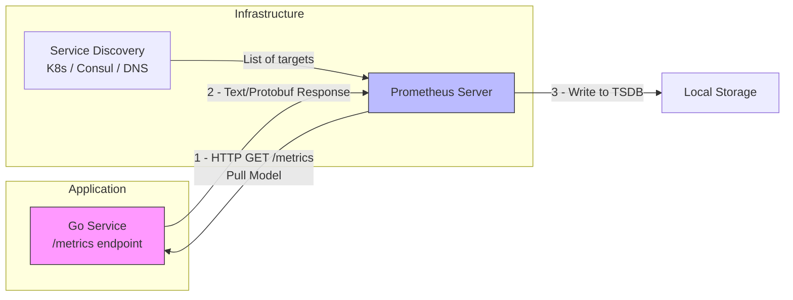

## Стандарт индустрии для Cloud-Native мониторинга

В предыдущей статье мы разобрали типы метрик. Теперь посмотрим на систему, которая стала стандартом де-факто для хранения и обработки этих данных в мире Go и Kubernetes — **Prometheus**.

Prometheus — это не просто база данных. Это полноценная экосистема, включающая сбор данных (scraping), хранение (TSDB), запросы (PromQL) и алертинг.

Главная архитектурная особенность, отличающая Prometheus от систем старой школы (Nagios, Zabbix) и push-систем (InfluxDB в push-режиме, Datadog) — это модель **Pull (Вытягивание)**.

## Архитектура: Pull vs Push

В традиционных системах (Push) приложение само отправляет метрики на сервер мониторинга.
В Prometheus всё наоборот: сервер мониторинга сам опрашивает (scrapes) приложение по HTTP.

### Почему Pull лучше? (System Design View)

1.  **Контроль над инфраструктурой:** Приложению не нужно знать адреса мониторинговых серверов. DevOps-инженер может менять конфигурацию Prometheus, перезапускать его, добавлять новые инстансы, и приложению всё равно. Это упрощает Service Discovery.
2.  **Единая точка истины (Centralized Config):** Все настройки частоты сбора и целей находятся в конфиге Prometheus, а не разбросаны по коду микросервисов.
3.  **Обнаружение проблем (Health Check):** Если Prometheus не может "достучаться" до приложения, он сразу знает, что цель недоступна (`State: DOWN`). В Push-моделях, если приложение зависло, оно не может отправить метрику "Я завис", и мониторинг об этом не узнает, пока не сработает таймаут (gap).



## Under the Hood: Работа с приложением

Ваше Go-приложение не отправляет данные. Оно просто обязано открыть HTTP-эндпоинт (обычно `/metrics`), который возвращает метрики в текстовом формате.

### Exposition Format (Текстовый формат)
Prometheus ожидает получить текст, похожий на этот:

```text
# HELP http_requests_total Total number of HTTP requests.
# TYPE http_requests_total counter
http_requests_total{method="GET",status="200"} 1023
http_requests_total{method="POST",status="500"} 5
```

Это человекочитаемый формат. Преимущество в том, что вы можете просто открыть `http://localhost:8080/metrics` в браузере или вызвать `curl` и увидеть всё своими глазами. Это упрощает отладку.

> [!info] Под капотом
> Хотя текстовый формат дефакто стандарт, Prometheus поддерживает и бинарный формат (Protocol Buffers). Он эффективнее по сети, но в 99% случаев используется текстовый, так как он проще и поддерживается всеми клиентами.

## TSDB: Как Prometheus хранит данные

Prometheus использует локальную Time Series Database (TSDB). Она оптимизирована под паттерн "Append Only" (только добавление новых данных).

### Mechanical Sympathy: Хранение и сжатие

1.  **The Head (Голова):** Новые данные, которые приходят при скрейпинге, сначала пишутся в память и WAL (Write-Ahead Log). Это обеспечивает высокую скорость записи.
2.  **Chunks (Чанки):** Данные сжимаются в блоки фиксированного размера (chunks). Внутри чанка Prometheus использует алгоритм сжатия, вдохновленный Facebook Gorilla. Он сжимает timestamp и value (double) так, что одна точка данных занимает в среднем **1.37 байта**.
    *   *Timestamp:* Хранится как дельта от предыдущего.
    *   *Value:* Хранится через XOR-сжатие, если значения меняются плавно.
3.  **Compaction:** Периодически фоновый процесс "уплотняет" старые чанки в более крупные блоки на диске.

Это делает Prometheus невероятно эффективным по диску. Вы можете хранить миллионы метрик на обычном SSD, пока не упретесь в память или IOPS.

## Service Discovery: Как Prometheus находит цели?

В Kubernetes Prometheus не нужно жестко прописывать IP-адреса подов. Он использует **Service Discovery**.

1.  Prometheus опрашивает API Kubernetes.
2.  Находит все Pod'ы, имеющие определенную аннотацию (например, `prometheus.io/scrape: "true"`).
3.  Добавляет их IP-адреса в список целей (Targets).
4.  Когда под удаляется (Scale Down), Prometheus автоматически перестает его опрашивать.

## PromQL: Язык запросов

Сами по себе сырые числа (Counter = 1000) малоинформативны. Мощность Prometheus раскрывается в **PromQL**.

Самая частая и важная операция для Counter — это вычисление скорости роста (Rate).

```promql
# Запрос: Сколько запросов в секунду обрабатывает сервис за последние 5 минут?
rate(http_requests_total[5m])
```

`rate()` автоматически обрабатывает рестарты приложения (когда Counter сбрасывается в 0) и экстраполирует данные.

> [!warning] Ловушка / Gotcha
> **Отсутствие данных.**
> Если ваш сервис не присылает метрику (например, ошибок не было вообще), Prometheus просто не запишет точку данных. В TSDB нет "нулевых" значений.
> Это важно помнить при построении графиков: отсутствие линии на графике может означать либо `0`, либо то, что сервис умер. Для решения этой проблемы в PromQL используют функцию `clamp_min(rate(...[5m]), 0)` или настройки отображения в Grafana (Connect null values).

## Pushgateway: Исключение из правил

Существуют сценарии, где Pull модель не работает: **Batch Jobs** (короткоживущие задачи).
Например, скрипт импорта данных, который запускается раз в сутки, отрабатывает за 10 секунд и умирает. Prometheus (который скрейпит раз в 15 секунд) может просто не успеть "застать" этот скрипт живым.

Для этого существует **Pushgateway**.
1.  Batch Job сам отправляет (Push) свои метрики в Pushgateway.
2.  Pushgateway хранит их в памяти.
3.  Prometheus забирает (Pull) метрики из Pushgateway, как из обычного экспортера.

> [!tip] Собеседование
> **Вопрос:** Почему Pushgateway считается "злом" и когда его можно использовать?
> **Ответ:** Pushgateway нарушает чистоту модели Pull и становится единой точкой отказа (SPOF). Если он упадет, вы потеряете метрики всех batch-задач. Кроме того, он не умеет автоматически чистить старые метрики (если задача умерла, метрика останется висеть навечно, пока вы не удалите её через API).
> **Можно использовать:** Только для short-lived batch jobs (cron scripts). Никогда не используйте его для долгоживущих сервисов — пусть они просто открывают `/metrics`.

## Итог

1.  **Prometheus** — это Pull-система, что упрощает управление инфраструктурой и Service Discovery.
2.  Приложение должно отдавать данные в текстовом формате на эндпоинте `/metrics`.
3.  TSDB использует агрессивное сжатие (Gorilla-inspired), позволяя хранить огромные объемы метрик на локальном диске.
4.  **PromQL** — мощный язык запросов, где `rate()` — король аналитики.

В следующей статье мы перейдем к практике: как внедрить экспорт метрик в Go-приложение, используя стандартные библиотеки и best practices: [[3. Экспорт метрик в Go]].