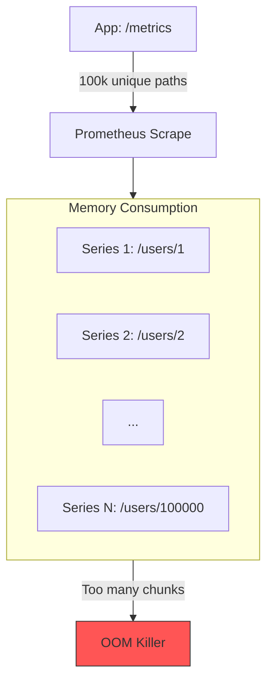

## Лейблы: Мощь и опасность

В предыдущей статье мы научились экспортировать метрики из Go-приложения. Однако простое добавление счетчиков не делает систему наблюдаемой. Всю мощь Prometheus раскрывает именно **Labels (Лейблы)**.

Лейблы позволяют разбить одну метрику на множество измерений (Dimensions). Например, метрика `http_requests_total` без лейблов покажет общее количество запросов. Но добавив лейбл `status`, мы можем узнать, сколько было успешных ответов (200), а сколько ошибок сервера (500).

Однако именно лейблы являются источником главных проблем в продакшене.

## Модель данных: Time Series

В Prometheus нет понятия "объект" или "экземпляр". Есть только **Time Series (Временной ряд)**.
Временной ряд однозначно идентифицируется комбинацией имени метрики и всех её лейблов.

$$ \text{Time Series} = \text{Metric Name} + \text{Label Set} $$

Если у вас есть метрика `http_requests_total` с лейблами `method="GET"` и `status="200"`, это **один** временной ряд.
Если пришел запрос с `status="404"`, Prometheus создаст **другой** временной ряд: `http_requests_total{method="GET", status="404"}`.

## Under the Hood: Как это работает в Go

В библиотеке `client_golang` метрики с лейблами реализованы через структуры `*Vec` (CounterVec, GaugeVec, HistogramVec).

Когда вы вызываете метод `.WithLabelValues("value")`, происходит следующее:

1.  **Хеширование:** Клиент вычисляет хеш от переданных значений лейблов.
2.  **Поиск в карте:** Он ищет этот хеш во внутренней карте (`map[uint64]metric)`).
3.  **Создание или получение:**
    *   Если метрика с таким набором лейблов уже есть — возвращается ссылка на неё.
    *   Если нет — **создается новый объект** (новый счетчик) и помещается в карту.

> [!warning] Ловушка / Gotcha
> **Бесконечный рост карты (Memory Leak).**
> В отличие от обычных map, которые очищаются Garbage Collector'ом, метрики в `prometheus.Registry` хранятся "вечно" (пока программа работает).
> Если вы используете в лейблах уникальные значения (User ID, Request ID, Timestamp), карта внутри `CounterVec` будет расти бесконечно, пока не съест всю оперативную память (OOM Kill).

## Главный враг: Unbounded Cardinality (Неограниченная кардинальность)

Самая частая ошибка, убивающая мониторинг — использование неограниченных значений в лейблах.

### Пример ошибки: URL Paths

Представьте, что вы пишете метрику для HTTP-хендлера:

```go
// ОПАСНЫЙ КОД
httpRequests := promauto.NewCounterVec(prometheus.CounterOpts{
    Name: "http_requests_total",
}, []string{"path"})

func handler(w http.ResponseWriter, r *http.Request) {
    // r.URL.Path может быть любым: /users/1, /users/2, /users/99999
    httpRequests.WithLabelValues(r.URL.Path).Inc()
}
```

Если ваш сервис обрабатывает запросы вида `/users/{id}`, то для каждого пользователя будет создан **новый временной ряд**.
*   1 пользователь = 1 ряд.
*   1 миллион пользователей = 1 миллион рядов.
*   **Результат:** Prometheus падает с OOM, а ваше Go-приложение тратит гигабайты памяти на хранение карты метрик.

### Решение: Нормализация путей

Вам нужно преобразовать динамический путь в статический шаблон.

```go
// ПРАВИЛЬНЫЙ ПОДХОД
// Используем роутер (например, Chi или Gin), который умеет возвращать шаблон пути
func promMiddleware(next http.Handler) http.Handler {
    return http.HandlerFunc(func(w http.ResponseWriter, r *http.Request) {
        start := time.Now()
        next.ServeHTTP(w, r)
        
        // Получаем паттерн вместо реального URL
        // Например, вместо /users/123 -> /users/{id}
        route := getRoutePattern(r) 
        
        httpRequests.WithLabelValues(route).Inc()
    })
}
```

Библиотеки вроде `gorilla/mux`, `chi` или `gin` позволяют получить "шаблон" маршрута (`r.URL.Path` -> `/users/:id`), что превращает бесконечное множество URL в один дискретный лейбл.

## Cardinality Explosion: Влияние на TSDB

Проблема масштабируется не только в памяти вашего приложения, но и в памяти Prometheus сервера.



Каждый временной ряд в Prometheus требует выделения памяти под "Head Chunk" (буфер для записи новых точек данных). Чем больше рядов, тем больше оперативной памяти потребляет сервер мониторинга.

## Best Practices: Безопасная работа с лейблами

1.  **Ограниченное множество (Bounded Set):** Используйте лейблы только тогда, когда вы можете заранее перечислить все возможные значения (или хотя бы оценить их порядок).
    *   `status_code` (200, 404, 500) — OK.
    *   `method` (GET, POST) — OK.
    *   `region` (us-east, eu-west) — OK.
    *   `user_id` — **ЗАПРЕЩЕНО**.

2.  **Избегайте IP-адресов:** В Kubernetes поды пересоздаются, IP-адреса меняются. Используйте лейблы K8s (Deployment name, Service name), а не IP.

3.  **Два способа "убить" прод:**
    *   **Memory Leak в App:** Высокая кардинальность в Go-приложении (бесконечная карта).
    *   **Crash в Prometheus:** Высокая кардинальность в TSDB (бесконечные чанки).

> [!tip] Собеседование
> **Вопрос:** Как обнаружить, какое приложение "убивает" Prometheus кардинальностью?
> **Ответ:** Использовать PromQL запрос:
> ```promql
> topk(10, count by (__name__, job) ({__name__=~".+"}))
> ```
> Этот запрос покажет топ-10 метрик с наибольшим количеством уникальных рядов (инстансов лейблов). Найдя метрику-лидера, вы увидите `job`, из которого она прилетает.

## Итог

Лейблы — это мощный инструмент для срезов данных, но они требуют дисциплины.
1.  **Никогда** не помещайте уникальные данные (ID, Email, IP) в метрики. Это работа для логов или трейсов.
2.  **Нормализуйте** динамические параметры URL в именованные маршруты (`:id`).
3.  **Мониторьте** кардинальность своих метрик, чтобы предотвратить падение инфраструктуры мониторинга.

В следующей статье мы отойдем от технических аспектов сбора данных и поговорим о том, как эти данные превращаются в бизнес-ценность через SLA, SLO и SLI: [[5. SLA, SLO, SLI]].