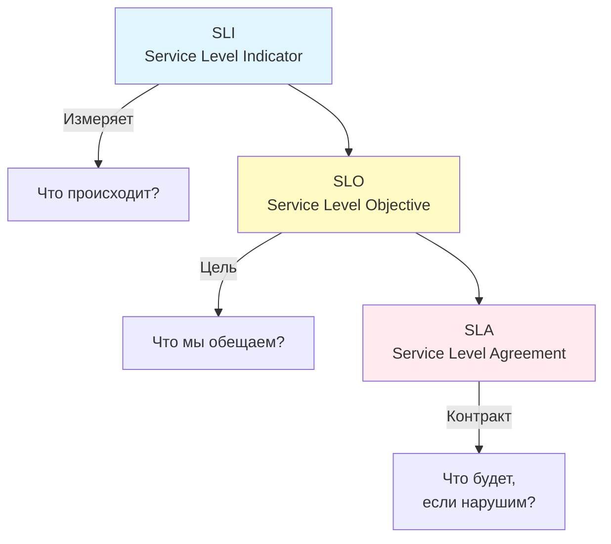

## От метрик к бизнес-ценности

В предыдущих статьях мы научились собирать метрики, выбирать типы данных и избегать ловушек кардинальности. Теперь встает главный вопрос: **«Как понять, что система работает хорошо?»**.

У вас может быть 1000 метрик, зеленые графики и низкая нагрузка на CPU, но если пользователи не могут оформить заказ, ваша система **не работает**. Чтобы связать технические показатели (CPU, Latency) с удовлетворенностью пользователей, инженеры Google сформулировали фреймворк **SLI/SLO/SLA**.

Это фундаментальный навык для Senior/Lead Engineer: умение переводить бизнес-требования на язык Prometheus-запросов.

## Иерархия надежности



### 1. SLI (Service Level Indicator) — Индикатор

Это **метрика**, которая непосредственно отражает поведение системы с точки зрения пользователя.
SLI должен отвечать на вопрос: «Было ли обслуживание успешным?».

*   **Доступность (Availability):** Доля успешных ответов (HTTP 200) от общего числа запросов.
*   **Задержка (Latency):** Доля запросов, обработанных быстрее порогового значения (например, 100мс).
*   **Пропускная способность:** Количество запросов в секунду.

> [!info] Под капотом
> В Go SLI часто реализуется через **Histogram**. Мы можем посчитать долю запросов, попавших в "хорошие" бакеты (например, < 100мс), относительно общего числа запросов.
> Формула SLI: $\frac{\text{Good Events}}{\text{Total Events}}$.

### 2. SLO (Service Level Objective) — Цель

Это **целевое значение** для SLI. Это договоренность внутри команды и с бизнесом о том, что считается «нормальной работой».

*   **Пример:** «99.9% запросов должны возвращаться успешно за месяц».
*   **Пример:** «99% запросов должны обрабатываться быстрее 200мс».

SLO — это инструмент управления ожиданиями. Если SLO выполняется, пользователи счастливы. Если нет — нужно звать на помощь.

### 3. SLA (Service Level Agreement) — Соглашение

Это **формальный контракт** с клиентом (часто финансовый), описывающий последствия нарушения SLO.
*   «Если доступность упадет ниже 99.9%, мы вернем 10% стоимости подписки».

> [!warning] Ловушка / Gotcha
> **SLO ≠ SLA**.
> Вы можете нарушить SLO (цель команды), но не нарушить SLA (контракт с клиентом). Например, цель команды 99.99% (SLO), но в контракте прописано 99.9% (SLA). В этом случае вы можете быть недовольны работой системы, но штрафы платить не придется.

## Error Budget (Бюджет ошибок)

Самая мощная концепция, вытекающая из SLO — **Error Budget**.
Если ваша цель (SLO) — 99.9% доступности, то у вас есть 0.1% «бюджета» на ошибки.

**Зачем это нужно?**
1.  **Скорость разработки vs Стабильность:** Если бюджет полон (ошибок мало) — можно смело деплоить новые фичи, рисковать, проводить рефакторинг. Если бюджет исчерпан (вы на грани нарушения SLO) — разработка замораживается, команда занимается только баг-фиксами и стабильностью.
2.  **Объективные решения:** Больше не нужно спорить «можно ли деплоить в пятницу?». Смотрим на Error Budget. Если он есть — можно. Если нет — нельзя.

**Расчет бюджета:**
Для SLO 99.9% за 30 дней:
$$ 30 \times 24 \times 60 \times 60 \times 0.001 \approx 43.2 \text{ минуты простоя в месяц} $$
Это значит, что все сбои в сумме не должны превышать 43 минуты в месяц.

## Реализация SLO в Prometheus

Как превратить эти абстрактные цифры в работающие алерты?

### SLI: Доступность (Availability)
Мы используем Counter'ы успешных и неуспешных запросов.

```promql
# SLI: Доля успешных запросов (HTTP 2xx, 3xx) за последние 7 дней
sum(rate(http_requests_total{status!~"5.."}[7d])) 
/ 
sum(rate(http_requests_total[7d]))
```

### SLO: Проверка цели
Если мы хотим узнать, соблюдается ли SLO 99.9%, мы сравниваем SLI с константой.

```promql
# Возвращает 1, если SLO соблюдается, 0, если нарушен
(sum(rate(http_requests_total{status!~"5.."}[7d])) / sum(rate(http_requests_total[7d]))) >= 0.999
```

### Alerting: Burn Rate (Скорость сжигания бюджета)

Стандартный алерт `rate(errors) > X` плох тем, что он шумный. Методология SLO предлагает использовать **Burn Rate** (Скорость сжигания бюджета ошибок).

Мы создаем алерты, которые срабатывают, если мы тратим бюджет слишком быстро. Если бюджет на месяц — 43 минуты, то потратить его за 1 час — это катастрофа, а потратить за 29 дней — это норма.

Для этого используется библиотека `slo-libsonnet` в Jsonnet или готовые рекурсии в Grafana, но принцип один: **сравниваем короткое окно (fast burn) с длинным (slow burn)**.

> [!tip] Собеседование
> **Вопрос:** Почему нельзя просто настроить алерт на `latency > 1s`?
> **Ответ:** Потому что один медленный запрос среди миллиона — это шум. Вам важна **доля** медленных запросов. SLO-алерты работают с *агрегатами* за время (оконная функция), а не с мгновенными значениями. Это убирает ложные срабатывания (false positives) и фокусирует внимание на реальных проблемах, влияющих на пользователей.

## Mechanical Sympathy: Точность измерений

При измерении Latency как SLI важно помнить о природе времени в Go.
Использование `time.Since(start)` включает:
1.  Время выполнения бизнес-логики.
2.  Время работы GC (Garbage Collector).
3.  Время на планирование (если горутина долго ждала процессор).

Если вы используете Histogram в Prometheus, вы получаете агрегированные данные. Но выбор **бакетов (Buckets)** критичен.
*   Если ваш SLO — 100мс, у вас **обязан** быть бакет `0.1`.
*   Если бакетов нет рядом с SLO, вы не сможете точно посчитать, сколько запросов попало в норму.

```go
// Правильный выбор бакетов под SLO 200ms
Buckets: []float64{.01, .05, .1, .2, .5, 1} // Бакет .2 (200ms) критически важен
```

## Итог

1.  **SLI** — это измерение (метрика).
2.  **SLO** — это цель (бизнес-требование).
3.  **SLA** — это последствия (контракт).
4.  **Error Budget** — это инструмент балансировки между скоростью разработки и стабильностью.

Переход от «мониторинга железа» (CPU/RAM) к «мониторингу пользовательского опыта» (SLI/SLO) — это маркер зрелости Senior-инженера.

Раздел метрик завершен. Мы переходим к следующему столпу Observability — Логированию. В следующей статье мы разберем, почему современные системы требуют структурированного подхода: [[1. Structured logging]].