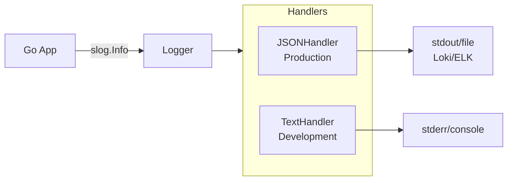

## Эволюция логирования: От текста к данным

В предыдущих разделах мы разобрали метрики — «сигнал тревоги» системы. Теперь мы переходим к «черным ящикам», которые помогают понять, *почему* сработала тревога. Речь пойдет о логах.

Традиционное логирование, к которому многие привыкли в PHP или старых Java-проектах («Напишу строку с timestamp'ом и посмотрю глазами в файл»), в современном Cloud-Native мире на Go неэффективно. В мире микросервисов, Kubernetes и автоматического парсинга побеждает **Structured Logging**.

## Проблема неструктурированных логов

Представьте классический лог в текстовом формате:
```text
2023-10-27 10:00:05 ERROR user_id=123 failed to connect to db: connection refused
2023-10-27 10:00:06 INFO User 456 logged in successfully
```

Для человека это читаемо. Но для машины это строка символов.
Если вы хотите найти все ошибки, связанные с `user_id=123`, вам придется использовать регулярные выражения. Это медленно, дорого (CPU-intensive) и ненадежно (легко пропустить пробел или другой разделитель).

В распределенной системе, где логи пишутся в Loki или ELK, парсинг таких строк на лету — это пустая трата ресурсов.

## Структурированное логирование: JSON как стандарт

Structured Logging меняет парадигму. Лог — это не строка текста, а **набор пар ключ-значение** (Key-Value pairs). Обычно это сериализуется в JSON.

```json
{
  "time": "2023-10-27T10:00:05Z",
  "level": "ERROR",
  "msg": "failed to connect to db",
  "user_id": 123,
  "error": "connection refused",
  "trace_id": "abc-xyz-99"
}
```

**Преимущества:**
1.  **Индексация:** Системы агрегации (Loki, Elasticsearch) могут сразу проиндексировать поля `user_id` или `trace_id`.
2.  **Скорость поиска:** Найти все логи по `user_id=123` — это простой запрос по индексу, а не Full Scan текста.
3.  **Типизация:** `user_id` может храниться как число, `duration` — как float. Это позволяет строить графики и агрегаты прямо из логов (хотя для метрик есть Prometheus).

## Go и log/slog: Новый стандарт

До версии Go 1.21 в стандартной библиотеке не было структурированного логгера. Все использовали сторонние решения: `uber-go/zap`, `rs/zerolog` или `sirupsen/logrus`.

С выходом Go 1.21 появился пакет **`log/slog`**. Это официальный, легковесный и производительный структурированный логгер.

### Идиоматичное использование

Ключевая концепция `slog` — это пара ключ-значение, передаваемая после сообщения.

```go
package main

import (
    "log/slog"
    "os"
)

func main() {
    // Создаем логгер с JSON-хендлером (production-ready)
    logger := slog.New(slog.NewJSONHandler(os.Stdout, nil))
    slog.SetDefault(logger) // Делаем его глобальным

    // Структурированное логирование
    slog.Error("Failed to process payment",
        "user_id", 12345,
        "order_id", "ord-99",
        "error", "insufficient funds",
    )
}
```

Вывод будет валидным JSON, готовым к ingestion в Loki.

## Under the Hood: Mechanical Sympathy

Почему выбор логгера важен для производительности?

### 1. Аллокации (Allocations)
Старый `fmt.Printf` или `log.Printf` неявно используют рефлексию для форматирования строк. Это создает много «мусора» в куче (Heap allocation), нагружая Garbage Collector.
В `slog` и высокопроизводительных логгерах (`zap`, `zerolog`) используется подход с минимальными аллокациями.

`slog` использует интерфейс `slog.LogValuer` и оптимизированные методы для записи значений, избегая рефлексии там, где это возможно.

### 2. Проверка уровня логирования (Level Check)
Самая дорогая операция в логировании — это не запись в файл, а подготовка данных (форматирование, вычисление аргументов).

```go
// ПЛОХО: Строка конкатенируется и аргументы вычисляются ВСЕГДА,
// даже если уровень логирования INFO отключен в проде.
log.Println("Debug info: " + heavyFunction())

// ХОРОШО: slog проверяет уровень ДО выполнения.
// Если уровень ниже Debug, тяжелая функция не вызывается.
slog.Debug("Debug info", "data", slog.Any("val", heavyFunction()))
```

> [!warning] Ловушка / Gotcha
> **Форматирование строк внутри логгера.**
> Новички часто пишут: `slog.Info(fmt.Sprintf("User %s logged in", user))`.
> Это принудительно создает новую строку в памяти (аллокация) *перед* вызовом логгера.
> **Правильно:** `slog.Info("User logged in", "user", user)`. Пусть логгер сам решает, как и когда форматировать данные.

## Архитектура: Handler и Middleware

`slog` построен на паттерне **Handler**. Вы можете переключать вывод (JSON для продакшена, Text для локальной разработки), меняя только хендлер.



Это позволяет писать свой middleware (например, для добавления `trace_id` в каждый лог автоматически, если он есть в контексте).

## Сравнение решений

| Логгер | Особенности | Использование |
| :--- | :--- | :--- |
| **log/slog** | Стандартная библиотека, простота, zero-allocation (почти). | Рекомендуется для всех новых проектов. |
| **uber-go/zap** | Очень быстрый, гибкий, но более сложный API. | Высоконагруженные системы, где каждый такт CPU на счету. |
| **rs/zerolog** | Фокус на производительности, работает с JSON. | Альтернатива Zap, чуть проще API. |

> [!tip] Собеседование
> **Вопрос:** Зачем нам структурированные логи, если есть метрики?
> **Ответ:** Метрики отвечают на вопрос «Сколько?». Логи отвечают на вопрос «Что именно?».
> Метрика скажет: «Ошибок 500 стало 10 в минуту».
> Лог скажет: «Ошибка в функции X, юзер Y, ошибка connection refused».
> Метрики дешевы для хранения и быстры для запросов. Логи дороги, но содержат полный контекст.

## Итог

1.  **Structured Logging** превращает логи из текста в машиночитаемые данные (JSON).
2.  В Go 1.21+ используйте стандартный пакет **`log/slog`**.
3.  Избегайте форматирования строк (`fmt.Sprintf`) внутри вызовов логгера. Передавайте переменные как отдельные аргументы.
4.  Структурированные логи — основа для интеграции с системами агрегации (Loki, ELK).

В следующей статье мы разберем, как правильно управлять объемом логирования через **уровни логирования**: [[2. Уровни логирования]].