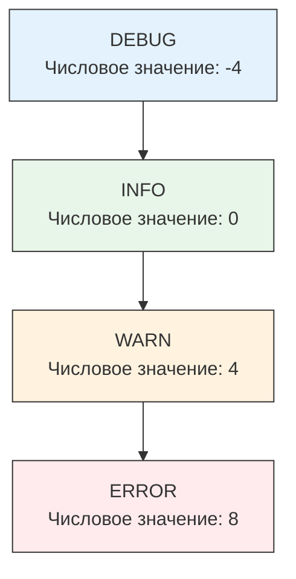

## Управление информационным шумом

В предыдущей статье мы перешли от простого текста к структурированному JSON-логированию. Но даже структурированные логи могут стать проблемой, если их слишком много. Логирование каждого шага алгоритма в продакшене способно «положить» диск или загнать стоимость хранения в облачных сервисах (например, AWS CloudWatch или Grafana Loki) до астрономических значений.

Для решения этой проблемы существуют **Уровни логирования (Log Levels)**. Это механизм фильтрации событий по степени их важности.

## Иерархия уровней

В стандартной библиотеке `log/slog` и популярных фреймворках используется иерархия уровней. Каждому уровню соответствует числовое значение (чем выше число, тем критичнее событие).



### 1. DEBUG (-4)
**Смысл:** Детальная информация для отладки. Содержит трассировку выполнения, значения переменных, метки входа/выхода из функций.
**Когда использовать:** Только при разработке локально или при активном расследовании бага в конкретном поде. В продакшене обычно отключен.

### 2. INFO (0)
**Смысл:** Стандартные события жизненного цикла приложения. То, что происходит в «нормальном» режиме.
**Когда использовать:**
*   Запуск/остановка сервера.
*   Успешное подключение к БД.
*   Завершение бизнес-транзакции (например, «Заказ #123 создан»).

### 3. WARN (4)
**Смысл:** Предупреждение. Что-то пошло не так, но приложение может продолжить работу. Это признак потенциальной проблемы, которая может стать критической.
**Когда использовать:**
*   Попытка подключения не удалась, но есть механизм Retry.
*   Устаревший API вызван пользователем (Deprecation warning).
*   Кэш промахнулся (Cache miss), данные взяты из медленного источника.

### 4. ERROR (8)
**Смысл:** Ошибка. Сбой операции, который требует внимания. Запрос не может быть выполнен корректно.
**Когда использовать:**
*   Не удалось подключиться к БД после всех попыток.
*   Валидация данных провалена.
*   Паника внутри горутины (восстановление через `recover`).

> [!warning] Ловушка / Gotcha
> **Отсутствие FATAL уровня в slog.**
> В классических логгерах есть уровень `FATAL` (или `CRITICAL`), который пишет лог и немедленно завершает программу (`os.Exit(1)`).
> В `log/slog` (как и в философии Go) нет уровня Fatal. Завершение программы — это ответственность программиста, а не логгера. Использование `log.Fatal` из старого пакета `log` в библиотеках считается плохой практикой, так как библиотека не должна убивать приложение без ведома вызывающего кода.

## Mechanical Sympathy: Цена логирования

Многие разработчики думают: «Если уровень DEBUG выключен, то вызов `logger.Debug(...)` ничего не стоит». Это не совсем так. Рассмотрим два сценария.

### Сценарий 1: «Слепое» логирование
```go
// ОПАСНЫЙ КОД
result := heavyComputation()
logger.Debug("Result calculated", "value", result)
```

Даже если уровень установлен как INFO, и лог не запишется, **функция `heavyComputation()` все равно выполнится**. Процессор потратит время, память будет выделена под `result`. Это классическая проблема «вычисления аргументов».

### Сценарий 2: Ленивое вычисление (Log This)
В `slog` и других продвинутых логгерах есть механизм проверки уровня перед вычислением.

```go
// ПРАВИЛЬНЫЙ КОД
if logger.Enabled(nil, slog.LevelDebug) {
    // Код выполнится ТОЛЬКО если Debug включен
    result := heavyComputation()
    logger.Debug("Result calculated", "value", result)
}
```

Или использование `LogValuer` интерфейса (аналог `Stringer`), который вызывается только если лог реально пишется.

> [!info] Под капотом
> `slog` использует интерфейс `LogValuer`. Если вы передаете структуру, реализующую метод `LogValue() Value`, этот метод будет вызван **только** в момент записи. Если уровень логирования фильтрует сообщение, метод вызван не будет, и вы сэкономите ресурсы CPU.

## Best Practices: Что куда писать?

Частая ошибка на собеседованиях и в продакшене — неправильный выбор уровня. Золотое правило: **Логи уровня ERROR должны требовать действия (Actionable).**

Если вы логируете `ERROR`, но игнорируете его в дежурстве (не создаете алерт и не бежите чинить), значит, это `WARN` или `INFO`.

### Пример: Работа с внешним API

1.  **Retry logic (Попытка 1 из 3):** Запрос упал.
    *   Уровень: `DEBUG` или `WARN` (если это частая проблема). Ошибка временная, система сама справляется. Не нужно будить админа ночью.
2.  **Retry logic (Попытка 3 из 3):** Все попытки исчерпаны. Запрос к API критичен для бизнес-процесса.
    *   Уровень: `ERROR`. Бизнес-операция прервана. Нужно вмешательство или компенсирующая транзакция.

## Динамическое управление уровнем

В продакшене часто бывает нужно временно включить `DEBUG` на конкретном инстансе, чтобы поймать редкий баг, не перезагружая приложение.

В Go это реализуется через изменение уровня в Handler'е.
Стандартный `slog` позволяет менять уровень, если вы используете кастомный хендлер или обертку. Многие используют библиотеки вроде `logr` или пишут HTTP-эндпоинт для смены уровня на лету.

```go
// Пример обертки для динамического управления
type dynamicLevelHandler struct {
    handler slog.Handler
    level   *slog.LevelVar // Потокобезопасная переменная уровня
}

func (h *dynamicLevelHandler) SetLevel(l slog.Level) {
    h.level.Set(l)
}
```

Это позволяет реализовать паттерн "Tap to debug": в обычное время уровень INFO, но как только метрики показывают аномалию на конкретном поде, автоматика или человек переключает его в DEBUG на 5 минут.

## Итог

1.  **Уровни логирования** — это фильтр сигнала от шума.
2.  **DEBUG** — для разработки, **INFO** — для бизнес-событий, **WARN** — для аномалий, **ERROR** — для сбоев, требующих внимания.
3.  Избегайте «тяжелых» вычислений в аргументах логгера, если уровень может быть выключен (используйте проверку `Enabled`).
4.  Не злоупотребляйте уровнем `ERROR`. Если вы не собираетесь pager'ить дежурного инженера в 3 часа ночи из-за этого лога — это не `ERROR`.

В следующей статье мы подробно рассмотрим конкретные инструменты и библиотеки для логирования в экосистеме Go: [[3. Логирование в Go]].