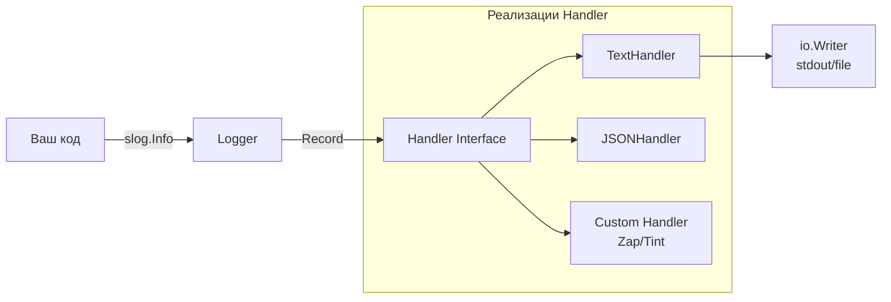

## Эволюция логирования в Go

В предыдущей статье мы разобрали уровни логирования. Теперь посмотрим на инструменты, которые реализуют эти концепции в экосистеме Go. История логирования в Go нетривиальна: от простейшего пакета `log` в стандартной библиотеке до появления мощного `log/slog` в версии 1.21.

Для Senior-разработчика важно понимать не только как подключить логгер, но и как он устроен внутри, так как логирование — это часто «узкое место» (bottleneck) в высоконагруженных системах.

## 1. Пакет `log` (Стандартная библиотека)

Изначально Go предлагал только пакет `log`.
*   **Плюсы:** Простота, есть в стандартной библиотеке, потокобезопасен.
*   **Минусы:** Только текстовый формат, нет структурирования, нет уровней (Debug/Info/Error), нет контекста.
*   **Вердикт:** Используется только в утилитах командной строки (CLI) или коротких скриптах. В современном бэкенде он не применяется.

## 2. `log/slog` — Новый стандарт (Go 1.21+)

Начиная с Go 1.21, стандартная библиотека пополнилась пакететом `log/slog`. Это попытка команды Google стандартизировать структурированное логирование, чтобы избавиться от зоопарка сторонних библиотек.

### Архитектура `slog`

`slog` построен на паттерне **Handler** (Стратегия). Это позволяет отделить интерфейс (как мы пишем лог) от реализации (куда и в каком формате он идет).



### Ключевые особенности:
1.  **Производительность:** `slog` спроектирован так, чтобы не аллоцировать память, если лог не записывается (уровень фильтрации).
2.  **Контекст:** Методы принимают `context.Context`, что позволяет связывать логи с трейсингом (автоматически подставлять `trace_id`).
3.  **Ленивое вычисление (LogValue):** Вы можете передавать объекты, которые вычисляются только в момент записи.

### Пример конфигурации (Production-ready)

```go
package main

import (
    "log/slog"
    "os"
)

func main() {
    // Создаем хендлер, пишущий в JSON в stdout
    // В реальном приложении настройки (Level, AddSource) берутся из конфига
    opts := &slog.HandlerOptions{
        Level:     slog.LevelInfo, // Минимальный уровень
        AddSource: true,           // Добавлять файл:строка (дорого, только для debug/prod)
    }
    
    logger := slog.New(slog.NewJSONHandler(os.Stdout, opts))
    
    // Устанавливаем глобальным (для использования через slog.Info)
    slog.SetDefault(logger)

    // Пример логирования с контекстом
    slog.Info("User logged in", 
        "user_id", 123, 
        "ip", "192.168.1.1",
    )
}
```

## 3. High-Performance Alternatives: Zap и Zerolog

До появления `slog`, королями производительности были (и остаются) библиотеки **Zap** (Uber) и **Zerolog**.

Почему они быстрее `slog`?
*   **Zap:** Использует объекты `Encoder`, которые переиспользуют буферы памяти через `sync.Pool`. Это минимизирует нагрузку на Garbage Collector.
*   **Zerolog:** Использует принцип "Zero-Allocation", избегая рефлексии и интерфейсов, работая напрямую с байтовыми слайсами.

> [!info] Под капотом
> Стандартный `fmt.Printf` и json.Marshal создают новые объекты в куче (Heap) при каждом вызове.
> Zap/Zerolog используют пул буферов.
> 1. Берут буфер из пула.
> 2. Пишут в него данные.
> 3. Отдают буфер обратно в пул.
> Это снижает нагрузку на GC в 10-100 раз при интенсивном логировании.

### Когда использовать сторонние библиотеки?
Если `slog` теперь в стандартной библиотеке, зачем нужны Zap/Zerolog?
1.  **Миграция:** Если проект уже глубоко завязан на Zap, переход на slog может не окупиться.
2.  **Экосистема:** Zap имеет огромное количество готовых интеграций (ZapGrpc, ZapSugar), которых у `slog` пока меньше.
3.  **Экстремальная производительность:** В бенчмарках Zerolog все еще часто выигрывает у `slog` (хотя разница сходит на нет).

> [!tip] Собеседование
> **Вопрос:** В чем разница между `slog` и `fmt.Printf`?
> **Ответ:**
> 1. **Структурирование:** `slog` пишет пары ключ-значение, `fmt` — плоский текст.
> 2. **Асинхронность:** `slog` (через хендлеры) можно легко обернуть в буферизированную запись или асинхронный канал, чтобы блокировка I/O не тормозила бизнес-логику. `fmt.Printf` блокирует вызывающую горутину на время системного вызова `write`.
> 3. **Уровни:** `slog` умеет фильтровать, `fmt` — нет.

## Паттерны проектирования (Best Practices)

### 1. Dependency Injection (DI)
Никогда не используйте глобальный логгер внутри библиотек.
```go
// ПЛОХО: Библиотека использует глобальный slog
func Process() {
    slog.Info("processing") // Куда запишется? В stdout? В файл?
}

// ХОРОШО: Структура принимает интерфейс логгера
type Service struct {
    log *slog.Logger
}

func NewService(log *slog.Logger) *Service {
    return &Service{log: log}
}
```
Это позволяет в тестах подменять логгер на заглушку (discard), а в разных микросервисах направлять логи в разные места.

### 2. Асинхронное логирование
Запись в файл или сокет — это системный вызов. В высоконагруженном Go-сервисе (например, 100k RPS) синхронная запись лога на каждый запрос может стать瓶颈 (bottleneck).
Решение: Использовать `bufio.Writer` (для файлов) или реализовать Middleware с каналом (Channel), который потребляет горутина-писатель. В `slog` для этого можно написать кастомный `AsyncHandler`.

### 3. Обработка ошибок
В Go `error` — это значение. При логировании ошибки важно не потерять её контекст.
```go
if err := db.Connect(); err != nil {
    // Используем slog.Error, чтобы стек вызовов попал в лог (если нужно)
    slog.Error("Failed to connect to DB", 
        "error", err, 
        "dsn", dsnWithoutPassword, // Безопасность: не логать пароли!
    )
}
```

## Итог

1.  **`log/slog`** — современный стандарт Go. Используйте его для новых проектов.
2.  **Zap/Zerolog** — актуальны для систем с экстремальными требованиями к перформансу или legacy-проектов.
3.  Избегайте глобального состояния (глобальных переменных логгера), передавайте логгер через конструкторы.
4.  Помните, что логирование — это I/O. В высоконагруженных системах используйте буферизацию.

В следующей статье мы обсудим, куда девать все эти логи и как собрать их из сотен микросервисов в одно место: [[4. Централизованные логи]].